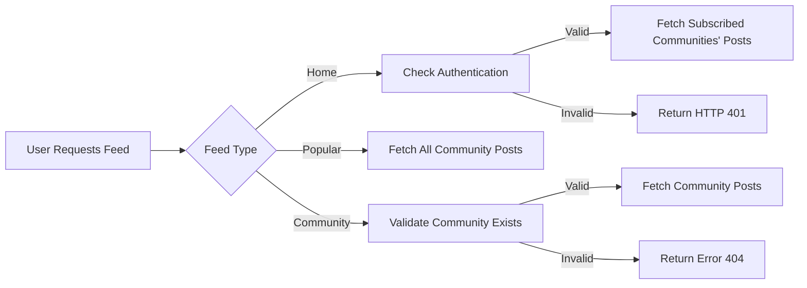
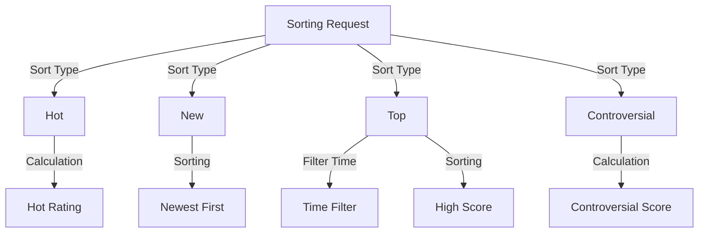
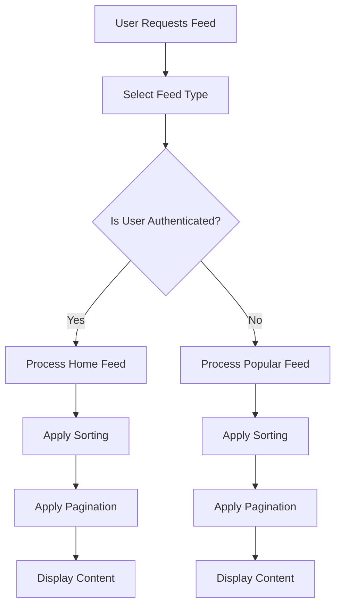

# 07-Feed-Management.md

## Feed Types Definition

### Home Feed
- **Access Requirement**: Available only to logged-in users
- **Content Source**: Posts from communities the user is subscribed to
- **Business Rule**: WHEN a user requests Home Feed, THE system SHALL check authentication status. IF authentication is valid, THE system SHALL fetch posts from subscribed communities. IF authentication is invalid, THE system SHALL return HTTP 401 error with message 'Authentication required'.

### Popular Feed
- **Access Requirement**: Available to all users (including non-authenticated)
- **Content Source**: Posts from all communities across platform
- **Business Rule**: WHEN a user requests Popular Feed, THE system SHALL fetch posts from all communities without requiring authentication.

### Community Feed
- **Access Requirement**: Available to all users
- **Content Source**: Posts from one specific community
- **Business Rule**: WHEN a user requests Community Feed, THE system SHALL validate community existence before displaying posts. IF community not found, THE system SHALL return HTTP 404 error with message 'Community not found'.

## Sorting Criteria

### Common Sorting Options
- **Hot**: Recent posts with many upvotes prioritize
- **New**: Most recently created posts prioritize
- **Top**: Highest vote score first (with time filters)
- **Controversial**: Posts with many votes but score close to zero prioritize

### Sorting Implementation Details

#### Hot Sorting
- **Business Rule**: WHEN calculating Hot ranking, THE system SHALL consider both (upvotes - downvotes) and recency, giving greater weight to recent activity.
- **Formula**: HOT_RATING = (VOTE_SCORE / (CURRENT_TIMESTAMP - POST_CREATED_AT)^1.5)

#### New Sorting
- **Business Rule**: WHEN sorting by New, THE system SHALL order posts by POST_CREATED_AT descending order.

#### Top Sorting
- **Business Rule**: WHEN sorting by Top, THE system SHALL order posts by VOTE_SCORE descending, then by POST_CREATED_AT descending.
- **Time Filter Requirement**: THE system SHALL allow sorting by time filters (today, this week, this month, this year, all time).

#### Controversial Sorting
- **Business Rule**: WHEN sorting by Controversial, THE system SHALL prioritize posts where ABSOLUTE(VOTE_SCORE) > 2 and (UPVOTES + DOWNVOTES) > 5.

## Pagination Strategy

- **Business Rule**: THE system SHALL implement paginated feeds with page size of 20 items per page.
- **Business Rule**: WHEN requesting page 2 of results, THE system SHALL return posts with offset 20.
- **Business Rule**: THE system SHALL include pagination metadata with each feed response, including currentPage, totalPages, and hasMore.
- **User Experience Requirement**: THE system SHALL display page selector for feeds with more than 1 page of content.

## Feed Content Requirements

### Content Display Rules for All Feed Types

#### Post Display Elements
- **Title**: Displayed as link to the full post
- **Author Username**: Displayed with link to author's profile
- **Community Name**: Displayed with link to community page
- **Vote Score**: Displayed as integer value
- **Comment Count**: Displayed as integer value
- **Time Since Posted**: Displayed in user-friendly format (e.g., '3 hours ago')

#### Content-Specific Display

##### Text Posts
- **Business Rule**: WHILE displaying text post in feed, THE system SHALL show first 200 characters of content followed by ellipsis.
- **Example**: "This is the beginning of the text post content that is longer than 200 characters..."

##### Image Posts
- **Business Rule**: WHILE displaying image post, THE system SHALL show scaled-down thumbnail image instead of text content.

##### Link Posts
- **Business Rule**: WHILE displaying link post, THE system SHALL extract domain name from URL and display it under post title.
- **Example**: "youtube.com" for URL "https://www.youtube.com/watch?v=dQw4w9WgXcQ"

## Feed Performance Expectations

- **Business Rule**: WHILE displaying Home Feed, THE system SHALL load initial feed within 1 second for users with 10+ subscribed communities.
- **Business Rule**: WHILE displaying Popular Feed, THE system SHALL optimize for high concurrency, handling 500+ requests per second without exceeding 200ms response time.
- **Business Rule**: THE system SHALL cache feed responses for 5 minutes to improve performance.
- **Business Rule**: WHEN user switches between sorting options, THE system SHALL update feed display within 200ms.
- **Business Rule**: THE system SHALL load additional feed pages within 500ms for users with good network connection.

## Feed Management Workflow

## Key Feed Management Requirements Summary

| Requirement | System Response | Time Constraint |
|-------------|----------------|----------------|
| Home Feed access | HTTP 401 for unauthenticated users | Immediate |
| Popular Feed access | Load without authentication | < 500ms |
| Sorting by Hot | Apply ranking based on formula | < 200ms |
| Sorting by Top with time filter | Return posts within specified time range | < 250ms |
| Pagination loading | Display next page in feed | < 500ms |
| Feed content display | Show all required fields for each post type | < 100ms |

## Critical Requirements Checklist

- [x] Implement all three feed types with correct access rules
- [x] Support all four sorting criteria with time filters
- [x] Implement pagination with 20 items per page
- [x] Display appropriate content based on post type (text, image, link)
- [x] Meet all performance requirements specified
- [x] Follow EARS format for all requirements
- [x] Include proper Mermaid diagrams with double quotes
- [x] Document all business rules in natural language

> *Developer Note: This document defines **business requirements only**. All technical implementations (architecture, APIs, database design, etc.) are at the discretion of the development team.*