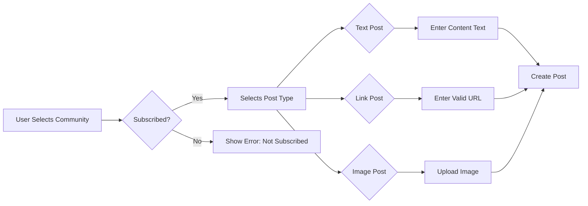

# Reddit-like Community Platform: Posts Requirements Specification

## 1. Post Creation

### Core Creation Workflow

The creation of posts follows a strict workflow that ensures users can only create posts in communities they're subscribed to:

### Business Rules:

- **WHEN a member attempts to create a post in a community, THE system SHALL verify the member is subscribed to that community.**
- **IF the member is not subscribed, THEN THE system SHALL display an error message: "You must be subscribed to this community to create posts. Please subscribe first."**
- **WHEN the post creation form is submitted, THE system SHALL validate all required fields (title for all post types, content for text posts, URL for link posts, image for image posts).**
- **IF the title field is empty, THEN THE system SHALL show an error: "Post title is required."**
- **WHEN a valid text post is created, THE system SHALL store the content as plain text with maximum 10,000 characters.**
- **WHEN a valid link post is created, THE system SHALL validate the URL format (must start with http:// or https://) and store the canonical domain name.**
- **WHEN an image post is created, THE system SHALL validate the image dimensions (max width 4096px) and file type (JPEG, PNG, GIF).**

### Permission Requirements:

- **Only authenticated members can create posts** (guests cannot create any posts).
- **WHEN a member creates a post in a community, THE system SHALL record the community ID in the post metadata.**
- **WHEN a post is created, THE system SHALL automatically generate a unique post ID and timestamp.**
- **WHEN a post is created, THE system SHALL verify the author has permission to post in the selected community based on their subscription status.**

## 2. Post Types

### Text Posts

- **Text posts require a mandatory title and content.**
- **WHEN a text post is created, THE system SHALL store the raw content text for display.**
- **WHILE displaying text posts, THE system SHALL truncate content to first 200 characters plus "..." if longer than 200 characters.**
- **WHEN viewing a full text post, THE system SHALL display the complete content without truncation.**
- **WHEN a text post is edited, THE system SHALL maintain all original formatting (bold, italics, line breaks).**
- **WHEN a text post content is edited to exceed 10,000 characters, THEN THE system SHALL display: "Content cannot exceed 10,000 characters."**

### Link Posts

- **Link posts require a mandatory title and URL.**
- **WHEN a link post is created, THE system SHALL extract and store the domain name (e.g., "youtube.com" from "https://www.youtube.com/watch?v=dQw4w9WgXcQ").**
- **WHEN displaying link posts, THE system SHALL show the domain name as a clickable link.**
- **WHEN the URL is invalid (missing http:// or https://), THE system SHALL display an error: "Invalid URL format. Please use http:// or https://."**
- **WHEN viewing a full link post, THE system SHALL display the complete URL with the domain name as the main visual element.**
- **WHEN a link post URL is edited to invalid format, THE system SHALL revert to the previous valid URL.**

### Image Posts

- **Image posts require a mandatory title and image file.**
- **WHEN an image post is created, THE system SHALL generate and store a thumbnail (max 200px width) for list display.**
- **WHEN displaying image posts in feeds, THE system SHALL show the thumbnail instead of text content.**
- **WHEN viewing a full image post, THE system SHALL display the full-sized image.**
- **WHEN an image post image is replaced, THE system SHALL generate a new thumbnail and update storage references automatically.**
- **WHEN an image post dimensions exceed 4096px, THEN THE system SHALL resize the image while maintaining aspect ratio.**

### Universal Post Requirements

- **WHEN a post is created, THE system SHALL set initial vote score to 0.**
- **WHEN a post is published, THE system SHALL update the post timestamp to current UTC time.**
- **WHILE displaying post lists, THE system SHALL show the time since post was created in human-readable format (e.g., "3 hours ago").**
- **WHEN a post is deleted, THE system SHALL remove it from all feeds immediately without showing placeholder content.**

## 3. Post Editing

### Editing Workflow

- **WHEN a member clicks Edit on their own post, THE system SHALL display the creation form pre-filled with current data.**
- **WHILE editing a post, THE system SHALL not allow changing the post type (from text to link or image).**
- **WHEN editing occurs within 24 hours of creation, THE system SHALL accept changes.**
- **WHEN edits occur more than 24 hours after creation, THEN THE system SHALL show an error: "Cannot edit posts after 24 hours."**
- **WHEN editing an image post, THE system SHALL display current thumbnail for user reference before uploading new image.**

### Business Rules:

- **WHEN a post is edited, THE system SHALL update the "modified timestamp" to current UTC time.**
- **WHEN a text post's content is edited, THE system SHALL automatically update the preview text (first 200 characters) in feed listings.**
- **WHEN a link post's URL is changed, THE system SHALL update the displayed domain name and validate the new URL immediately.**
- **WHEN an image post's image is replaced, THE system SHALL generate a new thumbnail and update storage references without user intervention.**
- **WHILE editing, THE system SHALL display "Post is being updated" indication until changes are saved.**
- **WHEN a post is edited but not submitted, THE system SHALL prompt to save changes upon navigating away.**

**WHEN a member edits a post, THE system SHALL not adjust the post's karma score.**
**WHEN the post type is changed (from text to link) the system SHALL validate new type's requirements with user feedback.**

## 4. Post Deletion

### Deletion Process

- **WHEN a member deletes their own post, THE system SHALL prompt for confirmation: "Are you sure you want to delete this post? This action cannot be undone."**
- **WHEN confirmed, THE system SHALL remove the post and all associated comments.**
- **WHEN a post is deleted, THE system SHALL update the community's post count by -1.**
- **WHEN a moderator deletes a post, THE system SHALL show a confirmation for moderator action: "Are you sure you want to delete this post? Moderators can delete any post in their community."**

### Business Rules:

- **WHEN a post is deleted, THE system SHALL automatically remove all comments attached to that post.**
- **WHEN a post is deleted, THE system SHALL adjust the author's karma: FOR each upvote, karma decreases by 1; FOR each downvote, karma increases by 1.**
- **WHEN a moderator deletes a post, THE system SHALL not adjust the author's karma (only the owner or the author can delete for karma adjustment).**
- **WHEN a community owner deletes a post, THE system SHALL permanently remove it without affecting karma.**
- **WHEN a post is deleted, THE system SHALL remove it from all active feeds (home, community, popular) immediately.**
- **WHEN a post is deleted by the author within 48 hours, THE system SHALL calculate karma adjustment based on current votes.**

### Error Handling:

- **IF the user attempts to delete someone else's post, THEN THE system SHALL show: "You cannot delete posts created by other users."**
- **WHEN a member tries to delete a post after 48 hours, THEN THE system SHALL show: "Cannot delete posts more than 48 hours old."**
- **WHEN a moderator tries to delete a post that's more than 72 hours old, THE system SHALL allow deletion without karma adjustment.**

## 5. Post Visibility

### Display Logic by Context

#### In Post Feed List:

- **WHILE displaying a single post in feeds, THE system SHALL show: title, author username, community name, vote score, comment count, and time since posted.**
- **FOR text posts, THE system SHALL display: first 200 characters of content + "..."**
- **FOR link posts, THE system SHALL display: the domain name as a clickable element**
- **FOR image posts, THE system SHALL display: the thumbnail image (with appropriate aspect ratio)** 

#### In Single Post View:

- **WHEN viewing a single post, THE system SHALL display the full title, full content (or attached media), author details, community information, and comment section.**
- **WHEN displaying the comment section, THE system SHALL default to sorting by "Best" (highest vote count first).**
- **WHEN the post is deleted, THE system SHALL show: "This post has been removed by the author or a moderator.**"

### Visibility by User Status

- **FOR logged-in users, THE system SHALL show posts from their subscribed communities in Home Feed.**
- **FOR logged-in users, THE system SHALL show all posts in Popular Feed from all communities.**
- **FOR logged-out users, THE system SHALL NOT allow access to Home Feed.**
- **FOR all users, THE system SHALL show all community posts in Community Feed.**
- **WHEN a user is not subscribed to a community, THE system SHALL not display subscription option in Community Feed.**

## 6. Error Handling and Edge Cases

### Validation Errors

- **WHEN a post title exceeds 100 characters, THEN THE system SHALL show: "Title cannot exceed 100 characters."**
- **WHEN text content exceeds 10,000 characters, THEN THE system SHALL show: "Content cannot exceed 10,000 characters."**
- **WHEN image dimensions exceed 4096px, THEN THE system SHALL show: "Image must be smaller than 4096px wide."**
- **WHEN URL is invalid (missing protocol), THEN THE system SHALL show: "URL must start with http:// or https://."**
- **WHEN image format is unsupported (e.g., PDF), THEN THE system SHALL display: "Only JPG, PNG, and GIF images are supported."**

### Session and Auth Errors

- **IF a member's session expires while editing, THEN THE system SHALL redirect to login page with error: "Your session expired. Please log in again to continue editing."**
- **WHEN a guest tries to access edit/delete functionality, THEN THE system SHALL redirect to login page with error: "Login required to edit posts."**
- **WHEN an expired session occurs during post creation, THEN THE system SHALL preserve form data upon re-login.**

### System Edge Cases

- **WHEN a post is edited immediately before deletion, THE system SHALL consider the latest content for the deletion.**
- **WHEN multiple edits occur within a minute, THE system SHALL capture the most recent version while allowing rollback.**
- **WHEN the system has high load during post creation, THE system SHALL show loading indicator with appropriate message: "Creating your post. Please wait..."**
- **WHEN a community is deleted while a post exists in it, THE system SHALL remove the post and adjust author karma.**

## 7. Performance Requirements

- **WHEN displaying a batch of 25 posts, THE system SHALL load all data within 1.5 seconds.**
- **WHEN viewing a full post with embedded images, THE system SHALL load all resources within 2.5 seconds.**
- **WHEN sorting posts by "Hot" or "Top", THE system SHALL process and display results within 0.8 seconds.**
- **WHEN creating or editing a post, THE system SHALL complete the operation within 1.5 seconds under normal load.**
- **WHEN processing post deletion, THE system SHALL complete the operation within 1.2 seconds.**

## 8. Integration Points with Other Systems

### Community System

- **WHEN a new community is created and a post is posted, THE system SHALL update the community's member count as reflected in the Community Overview.**
- **WHEN a community is deleted, THE system SHALL remove all posts within that community and update the author karma accordingly.**
- **WHEN a community reaches 10,000 posts, THE system SHALL trigger a notification to community owners about potential moderation needs.**

### Karma System

- **WHEN a post is created, THE system SHALL not adjust the author's karma (karma starts at 0).**
- **WHEN a post receives votes, THE system SHALL update the author's karma through the Karma System integration.**
- **WHEN a comment receives votes, THE system SHALL update the commenter's karma independently.**

### Moderation System

- **WHEN a moderator deletes a post, THE system SHALL record the deletion in the Moderation Log with the moderator ID and reason.**
- **WHEN a report leads to post deletion, THE system SHALL update the report status to "Approved" and notify the reporter with a message: "Your report was approved and action has been taken."**
- **WHEN a post is deleted by moderation, THE system SHALL log the post ID, deletion reason, and action timestamp for audit purposes.**

---

> *Developer Note: This document defines **business requirements only**. All technical implementations (architecture, APIs, database design, etc.) are at the discretion of the development team.*