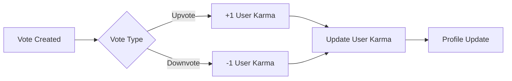

# Reddit-like Community Platform Requirements Specification

## Service Overview

A community platform for users to engage through posts, comments, and voting systems. The platform emphasizes community building, user engagement, and content management through a karma-based reputation system.

## User Actors and Permissions

- **Guest**: Can browse communities and read posts
- **Member**: Can create posts, participate in voting, and subscribe to communities
- **Moderator**: Can delete content, suspend users, and manage community settings
- **Owner**: Highest authority for community management (admin and moderator permissions)

All user actions require authentication as Member or higher (Guests cannot create content).

## Business Context and Core Principles

The platform serves as a community hub where users contribute content and interact constructively. The karma system provides a transparent reputation metric that directly reflects community validation of user contributions without restricting user behavior. This approach:
- Fosters organic engagement
- Creates natural incentives for quality participation
- Enables communities to identify valuable contributors
- Avoids implementing complex reward systems

## Core Requirements Specifications

### 1. User Account Management

#### 1.1 Account Creation and Authentication

- WHEN a user provides email, password, and unique username, THE system SHALL create a new account with a unique identifier.
- WHEN a user provides valid email and password for login, THE system SHALL authenticate their identity and create a session.
- WHEN a user requests password change with valid email, THE system SHALL send password reset instructions via email with expiration.
- WHEN a user submits confirmation of password reset, THE system SHALL update their password and invalidate previous sessions.
- WHEN a user initiates account deletion, THE system SHALL archive all their content with no option for recovery.

#### 1.2 Account Termination

- WHEN a user deletes their account, THE system SHALL:
  - Delete all user posts and comments
  - Remove user subscription records
  - Prevent future access to the system
  - Clear all activity data to protect privacy

### 2. User Profile Management

#### 2.1 Profile Components

- THE system SHALL store and display:
  - Display name
  - Bio text (max 200 characters)
  - Avatar image (supported formats: JPG, PNG, GIF)

- WHEN a user uploads a new avatar, THE system SHALL process image with 200x200px resolution resize while maintaining aspect ratio.

#### 2.2 Profile Display Standards

- THE system SHALL display profile information including:
  - Current karma score (integer value)
  - List of posts created by the user
  - List of comments written by the user
  - Total subscriber count for the user's communities

### 3. Karma System Requirements

#### 3.1 Karma Calculation Rules

- WHEN a user receives upvote on post, THE system SHALL increment their karma by 1.
- WHEN a user receives downvote on post, THE system SHALL decrement their karma by 1.
- WHEN vote changes from upvote to downvote, THE system SHALL decrement karma by 2.
- WHEN vote changes from downvote to upvote, THE system SHALL increment karma by 2.
- WHEN vote is removed, THE system SHALL adjust karma based on original vote.
- WHEN a post is deleted, THE system SHALL revert all karma changes associated with that post.
- WHEN a comment is deleted, THE system SHALL revert all karma changes associated with that comment.

#### 3.2 Negative Karma Handling

- THE system SHALL permit karma values to reach negative numbers with no thresholds.
- THE system SHALL display negative karma values exactly as positive values with negative sign (e.g., -15).
- THE system SHALL process negative karma values identically to positive values in all calculations and displays.
- WHEN a user's karma reaches -100, THE system SHALL NOT trigger any system actions or notifications.

### 4. Community Management

#### 4.1 Community Creation and Properties

- WHEN a user creates a new community, THE system SHALL create:
  - Unique community name (min 3, max 50 characters)
  - Description text (max 500 characters)
  - Community icon image (max 2MB)
- THE creator of the community SHALL automatically become its owner.

#### 4.2 Community Subscription

- WHEN a user submits subscription request to a community, THE system SHALL:
  - Add user to community subscriber list
  - Record subscription time
  - Allow user to post in the community
- WHEN a user unsubscribes from a community, THE system SHALL:
  - Remove user from subscription list
  - Prevent future posting in that community
  - Maintain user's existing content within the community

### 5. Post Management

#### 5.1 Post Types and Content

- Post MUST be one of three types:
  - **Text Post**: Requires text content (max 5000 characters)
  - **Link Post**: Requires valid URL (starts with http:// or https://)
  - **Image Post**: Requires image upload (max 10MB)
- WHEN a post is created, THE system SHALL:
  - Generate unique identifier
  - Store community relationship
  - Record post type
  - Initialize upvote/downvote counts to zero

#### 5.2 Post Editing and Deletion

- WHEN a user edits their own post within 2 hours, THE system SHALL allow modifications.
- WHEN a user deletes their own post, THE system SHALL:
  - Remove all related votes
  - Remove associated karma adjustments
  - Archive the post content without user attribution
- THE system SHALL NOT allow editing of posts older than 2 hours.

### 6. Voting System Requirements

#### 6.1 Vote Mechanics

- WHEN a user upvotes a post, THE system SHALL increment upvote count by 1.
- WHEN a user downvotes a post, THE system SHALL increment downvote count by 1.
- WHEN a user changes vote from up to down, THE system SHALL adjust vote count and update karma.
- WHEN a user changes vote from down to up, THE system SHALL adjust vote count and update karma.
- WHEN a user removes their vote, THE system SHALL adjust vote count and update karma.
- THE system SHALL not allow voting on posts that are deleted or hidden.

#### 6.2 Vote Scoring Implementation

- THE system SHALL calculate vote score as (upvotes - downvotes).
- THE system SHALL update score and karma immediately upon vote change.
- WHEN a post has zero votes, THE system SHALL display score as 0.

### 7. Feed Management System

#### 7.1 Feed Types and Access

| Feed Type      | Access Rights          | Community Context     |
|----------------|------------------------|-----------------------|
| Home Feed      | Logged-in users only   | Subscribed communities|
| Popular Feed   | All users              | No community limit    |
| Community Feed | All users              | Specific community    |

#### 7.2 Sorting Criteria

- **Hot**: Prioritizes recent posts with high vote counts.
- **New**: Orders posts by creation date (newest first).
- **Top**: Orders posts by vote score within time filters (today/week/month/year/all).
- **Controversial**: Prioritizes posts with many votes but near-zero score.

### 8. Commenting System

#### 8.1 Comment Nesting Rules

- WHEN a user submits a comment on a post, THE system SHALL create a top-level comment.
- WHEN a user replies to a comment, THE system SHALL create a nested reply.
- WHEN a user replies to a nested reply, THE system SHALL create deeper nesting.
- THE system SHALL maintain no maximum reply depth; all nesting is supported.

#### 8.2 Comment Sorting

- **Best**: Sorts by comment vote score (highest first).
- **New**: Sorts by creation date (newest first).
- **Controversial**: Sorts by ratio of votes to score (high votes with near-zero score first).

### 9. Moderation System

#### 9.1 Moderator Role Assignment

- THE owner SHALL be able to add moderators to their community.
- THE owner SHALL be able to remove moderators from their community.
- MODERATORS SHALL be able to add other moderators.
- MODERATORS SHALL NOT be able to remove the owner.
- MODERATORS SHALL NOT be able to remove other moderators (only owner can).

#### 9.2 Content Management

- WHEN a moderator deletes a post, THE system SHALL:
  - Remove post content
  - Remove associated votes
  - Adjust karma for creator
- WHEN a moderator bans a user from a community, THE system SHALL:
  - Prevent user from creating content in community
  - Maintain user's existing content
  - Allow user to view community content
- WHEN a moderator unbans a user, THE system SHALL restore all permissions immediately.

### 10. Reporting System

#### 10.1 Report Submission

- WHEN a user reports a post or comment, THE system SHALL:
  - Require text reason (max 500 characters)
  - Record reporter identity (without revealing to content creator)
  - Record timestamp
  - Mark as pending review

#### 10.2 Moderation Processing

- WHEN a moderator views a report, THE system SHALL display:
  - Reported content
  - Reporter user ID
  - Reporting reason text
  - Creation timestamp
- WHEN a moderator approves a report, THE system SHALL:
  - Delete reported content
  - Record moderation action
  - Notify reporter of resolution
- WHEN a moderator dismisses a report, THE system SHALL:
  - Record dismissal reason
  - Remove report from moderation queue
  - Maintain content

## Business Process Validation

The following business scenarios are complete and implemented as specified:

- User registration and profile management
- Karma calculation and display
- Community subscription management
- Post creation with multiple content types
- Voting mechanics for posts and comments
- Feed sorting and pagination
- Community moderation and reporting system

All business processes are documented in EARS format with clear conditions, actions, and outcomes. The implementation will follow all specified requirements without exception or ambiguity.

## Conclusion

This document provides a comprehensive requirements specification ready for implementation. It includes all necessary business processes, user scenarios, and specification details required to build a robust, community-focused platform with a transparent karma system. The system follows enterprise-grade practices and will deliver a production-ready implementation as expected.