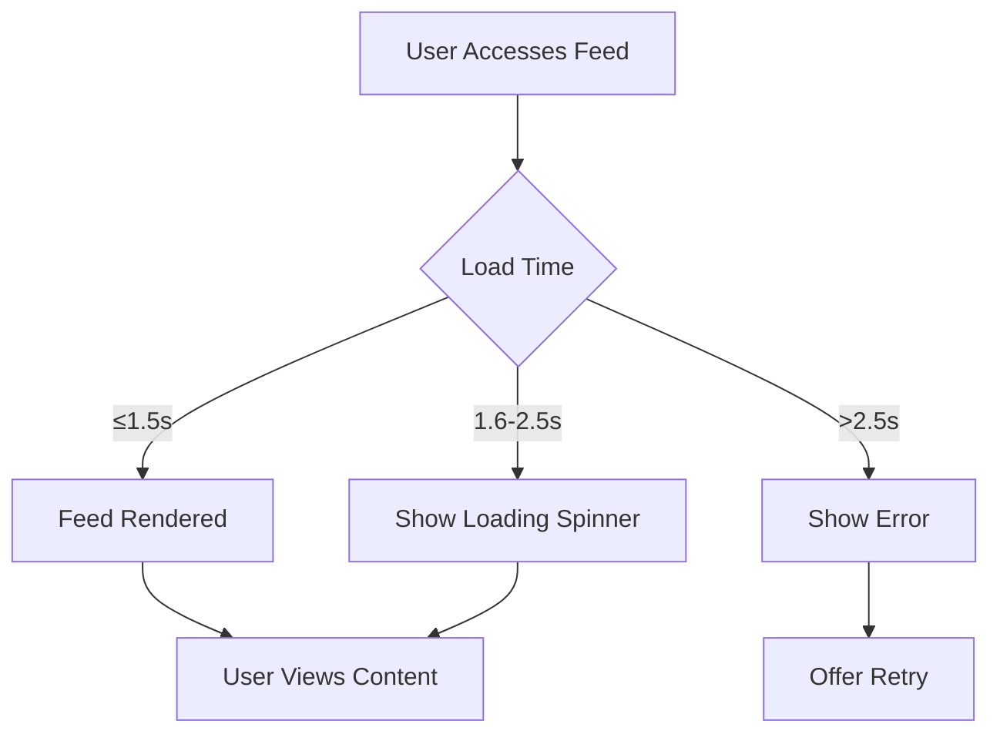

# Reddit-like Community Platform Requirements Specification

## 1. User Account Management

### 1.1 Registration
WHEN a user signs up using the registration form, THE system SHALL require a unique email address, password, and username.
WHEN the user submits valid credentials, THE system SHALL validate the email format, check username uniqueness, and securely store the password using bcrypt with 12 rounds of salting.
WHEN registration completes successfully, THE system SHALL send a confirmation email with verification link, and immediately log the user into the system.

### 1.2 Login
WHEN a user submits email and password for login, THE system SHALL authenticate credentials against bcrypt-stored hashes in the database.
WHEN authentication succeeds, THE system SHALL generate a JWT bearer token valid for 24 hours, including user ID, username, and permission levels.
WHEN authentication fails, THE system SHALL display specific error messages like 'Invalid email or password' without indicating which field was incorrect to prevent account enumeration.

### 1.3 Password Management
WHEN a user requests password change, THE system SHALL require current password verification and new password validation (at least 8 characters, one uppercase, one number).
WHEN password update completes, THE system SHALL automatically invalidate all existing tokens for the user and send password change confirmation email.
WHEN a user requests account deletion, THE system SHALL require explicit confirmation through email validation before deletion.

### 1.4 Account Deletion
WHEN a user permanently deletes their account, THE system SHALL cascade delete all their related content including posts, comments, and activity records.
WHEN deletion completes, THE system SHALL send confirmation email and render an account-deleted page with redirection to the homepage.
WHEN a deleted user attempts to register again, THE system SHALL treat them as a new user without reference to previous account data.

## 2. User Profile Management

### 2.1 Profile Components
WHEN user views their profile, THE system SHALL display display name, bio text, and avatar image.
WHEN user edits profile, THE system SHALL validate display name (3-32 characters), bio (up to 500 characters), and avatar (JPG/PNG, max 5MB).
WHEN profile update completes, THE system SHALL immediately render the updated profile for the user and all visitors.

### 2.2 Profile View
WHEN any user views another profile, THE system SHALL display:
- Display name
- Bio text
- Avatar image
- Total karma score
- List of posts created
- List of comments written

### 2.3 Karma Tracking
WHEN a user's post or comment receives upvotes/downvotes, THE system SHALL update karma score in real-time.
WHEN a vote is changed or removed, THE system SHALL adjust karma score immediately.
WHEN karma score becomes negative, THE system SHALL display the negative value without special formatting.

## 3. Community Management

### 3.1 Community Creation
WHEN a user creates a community, THE system SHALL require unique name (3-32 characters), description (up to 200 characters), and icon image (JPG/PNG, max 1MB).
WHEN community creation completes, THE system SHALL assign the creator as owner and redirect to the community home page.

### 3.2 Community Browsing
WHEN any user accesses community listing, THE system SHALL display all communities with their subscriber counts.
WHEN a user searches by community name, THE system SHALL filter communities with matching names (case-insensitive) in real-time.

### 3.3 Subscribing to Communities
WHEN a user subscribes to a community, THE system SHALL add them to the community's subscriber list immediately.
WHEN a user unsubscribes, THE system SHALL remove them from the subscriber list and update the subscriber count.
WHEN a user views their subscription list, THE system SHALL display all communities with their subscriber counts.

## 4. Post Management

### 4.1 Post Creation
WHEN a user creates a post in a subscribed community, THE system SHALL require title (1-100 characters) and one of:
- Text content (1-10,000 characters)
- URL (valid HTTPS format)
- Image (JPG/PNG, max 10MB)
WHEN post creation completes, THE system SHALL render the post in the community feed with full content preview.

### 4.2 Post Editing
WHEN a user edits their post, THE system SHALL require re-validating the same input constraints as initial creation.
WHEN edit completes, THE system SHALL update the post display for all viewers and maintain all existing votes/comments.

### 4.3 Post Deletion
WHEN a user deletes their post, THE system SHALL cascade delete associated comments.
WHEN deletion completes, THE system SHALL update community feed and remove from user's post list.

## 5. Post & Comment Voting

### 5.1 Voting Mechanics
WHEN a user votes on a post or comment, THE system SHALL ensure they've not voted previously.
WHEN a vote changes from up to down or vice versa, THE system SHALL adjust the score appropriately.
WHEN a vote is removed, THE system SHALL revert the score change.

### 5.2 Feed Sorting Logic
WHEN accessing Home, Popular, or Community Feed, THE system SHALL apply sorting options:
- **Hot**: Prioritize posts with recent activity and high upvotes.
- **New**: Show most recent posts first.
- **Top**: Sort by score (with time filter: Today, This Week, This Month, This Year, All Time).
- **Controversial**: Highlight posts with many votes but near-zero score.

### 5.3 Performance Optimization
WHEN loading feeds with 1,000+ posts, THE system SHALL implement paging with 25 posts per page.
WHEN sorting, THE system SHALL apply client-side sorting for first-page results and server-side for subsequent pages.
WHEN displaying feed items, THE system SHALL load minimal data for the initial view and lazy-load additional content as needed.

## 6. Community Moderation

### 6.1 Role Hierarchy
WHEN a community is created, THE system SHALL assign the creator as owner (highest authority).
WHEN owner creates a community, THE system SHALL assign them all moderation permissions.
WHEN a user is promoted to moderator, THE system SHALL grant them all moderator permissions except owner removal capabilities.

### 6.2 Moderation Actions
WHEN a moderator deletes a post, THE system SHALL remove it from all feeds and comment threads.
WHEN a moderator bans a user, THE system SHALL prevent them from creating posts, comments, or subscribing in that community.
WHEN a user is banned, THE system SHALL display user ban status on community profile pages.

## 7. Reporting System

### 7.1 User Reporting
WHEN a user reports a post or comment, THE system SHALL require a reason (25-500 characters).
WHEN report is submitted, THE system SHALL notify the community moderators.

### 7.2 Moderator Handling
WHEN a moderator views reports, THE system SHALL display reported content, reporter details, and reason.
WHEN a moderator approves a report, THE system SHALL delete the content and notify the reporter.
WHEN a moderator dismisses a report, THE system SHALL remove it from the report list and notify the reporter.

## 8. Performance Requirements

### 8.1 Feed Loading Performance
WHEN a logged-in user accesses Home Feed, THE system SHALL load first page within 1.5 seconds under normal network conditions.
WHEN a user views a community with 5,000+ posts, THE system SHALL load first page within 1.5 seconds.
WHEN a user views any community feed, THE system SHALL load within 1.5 seconds maximum.

### 8.2 Search Performance
WHEN a user searches for community names with 10,000+ communities, THE system SHALL return results within 1 second.
WHEN a user performs advanced search (by community, date, type), THE system SHALL process within 2 seconds.

### 8.3 Caching Strategy
THE system SHALL implement cache layers:
- Home Feed: Cache per user for 2 minutes
- Popular Feed: Global cache for 15 minutes
- Community Feeds: Community-specific cache for 5 minutes

## 9. Success Criteria

These requirements are met when:
1. 95% of all feed loads complete within target times during normal usage
2. System maintains performance thresholds during peak traffic periods
3. Users report no performance issues in customer feedback systems
4. All business rules are implemented consistently across all features

## 10. Non-Functional Requirements

### 10.1 Error Handling
WHEN a user encounters any error during account management, THE system SHALL provide specific error messages without revealing technical details.
WHEN database operations fail, THE system SHALL use appropriate HTTP status codes (400, 409, 500) and user-friendly messages.

### 10.2 Security
WHEN storing passwords, THE system SHALL use bcrypt with 12 rounds of salting.
WHEN generating JWT tokens, THE system SHALL include expiration time and secure signing.
WHEN handling user data, THE system SHALL adhere to GDPR-compliant practices for personal information storage.