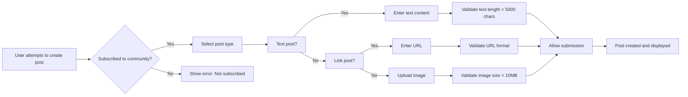

# Post Requirements Specification

## Business Context

This document defines the complete business requirements for post management within the community platform. The requirements are derived from user scenarios and focus on the business logic of post creation, types, editing, deletion, and display across all feeds and views, with comprehensive business processes for all scenarios.

## Document Structure and Relationships

This document builds upon:
- `07-communities.md` (Community subscription requirements)
- `01-service-overview.md` (Platform goals and features)
- `04-authentication.md` (User authentication context)

## Post Creation Requirements

### Core Workflow

### Business Requirements in EARS Format

- WHEN a user creates a post in a subscribed community, THEN the system SHALL validate the community subscription status
- IF a user is not subscribed to a community, THEN the system SHALL display the error message "You must be subscribed to this community to create posts"
- WHEN a user selects text post type, THEN the system SHALL provide a text editor with a maximum of 5000-character limit for text content
- WHEN a user submits text content exceeding 5000 characters, THEN the system SHALL display the error "Post content must be 5000 characters or less"
- WHEN a user submits a link post with invalid URL format (not starting with http:// or https://), THEN the system SHALL display "Invalid URL format; use https://example.com"
- WHEN a user selects image post type, THEN the system SHALL allow uploading images up to a maximum size of 10MB
- IF an image exceeds 10MB, THEN the system SHALL display "Image size cannot exceed 10MB"

## Post Types Requirements

### Text Post

- Every text post SHALL include a title (required, maximum 200 characters) and text content (required, maximum 5000 characters)
- WHEN viewing a text post in list view, THE system SHALL display the first 200 characters of the content followed by "..."
- IF text content is less than 200 characters, THEN THE system SHALL display the complete text without "..."

### Link Post

- Every link post SHALL include a title (required), URL (required), and domain-based display
- THE system SHALL validate that URLs start with http:// or https://
- WHEN viewing a link post in a list, THE system SHALL display only the domain name of the URL (e.g., "example.com" from "https://example.com/video")
- IF the URL contains "www" (e.g., "https://www.example.com"), THEN THE system SHALL remove the "www" prefix from the displayed domain

### Image Post

- Every image post SHALL include a title (required) and image (required)
- WHEN viewing an image post list, THE system SHALL display a responsive thumbnail (minimum 200x200 pixels) derived from the original image
- IF the original image is smaller than 200x200 pixels, THEN THE system SHALL display the image at its original size

### EARS Requirements

- WHEN a user creates a text post, THEN the system SHALL enforce a title maximum of 200 characters
- IF a title exceeds 200 characters, THEN the system SHALL display "Title must be 200 characters or shorter"
- WHEN a user creates a link post, THEN the system SHALL extract and display only the domain name without the URL scheme
- WHEN a user creates an image post, THEN the system SHALL generate a responsive thumbnail with dimensions no larger than 200x200 pixels

## Post Editing Requirements

### Business Rules

- Users SHALL be able to edit their own posts within 60 minutes of creation
- Edits SHALL replace the original content entirely (all revisions are NOT stored)
- Any edits to post title SHALL update the title in all displays including feed listings, community view, and user profile
- Post editing is NOT permitted more than 60 minutes after creation

### EARS Requirements

- WHEN a user attempts to edit a post they created, THEN the system SHALL verify the time elapsed since creation
- IF the post was created more than 60 minutes ago, THEN the system SHALL display "Post can only be edited within 60 minutes of creation"
- WHEN a user successfully edits a post, THEN the system SHALL update all views showing the post instantly
- WHEN a user edits the title of a post, THEN the system SHALL refresh the title in all affected display locations

## Post Deletion Requirements

### Business Rules

- Users SHALL be able to delete their own posts
- Deleted posts are PERMANENTLY removed from all feeds and views
- Post deletion IS NOT permitted after 30 days of creation
- Deleted posts ARE NOT visible to any user (including the author)
- Post deletion SHALL update the community's post count and karma for all affected users

### EARS Requirements

- WHEN a user attempts to delete a post they created, THEN the system SHALL verify the time elapsed since creation
- IF the post was created more than 30 days ago, THEN the system SHALL display "Posts cannot be deleted after 30 days"
- WHEN a user successfully deletes a post, THEN the system SHALL remove the post from all feeds, community views, and user profiles
- THE system SHALL immediately update the community's post count and the user's total post count in the profile view

## Post Display Requirements

### Feed Consistency Requirements

All feeds (Home, Popular, Community) SHALL display posts consistently according to the following rules:

| Section | Displayed Info | Rules |
|---------|----------------|-------|
| Title | Post title | Truncate to 100 characters if too long |
| Author | Username | Always show username (never display email) |
| Community | Community name | Link to community view |
| Vote score | Upvotes - Downvotes | Display as whole number (e.g., "12") |
| Comment count | Total comments | Display as whole number (e.g., "5 comments") |
| Time since posted | Relative time | e.g., "3 hours ago" or "yesterday" |
| Content preview | Based on post type | See Post Types requirements |

### View Behavior Across Feeds

- WHEN viewing a Home Feed, THE system SHALL display ONLY posts from communities the user is subscribed to
- WHEN viewing a Popular Feed, THE system SHALL display ALL posts across the platform without community subscription restrictions
- WHEN viewing a Community Feed, THE system SHALL display ONLY posts from that specific community without requiring community subscription
- THE system SHALL allow sorting by Hot, New, Top, and Controversial in all feed views

### Time Display Rules

- WHEN displaying a post created within 24 hours, THE system SHALL show "[minutes] minutes ago" or "[hours] hours ago"
- WHEN displaying a post created within 48 hours, THE system SHALL show "Yesterday"
- WHEN displaying a post created more than 48 hours ago, THE system SHALL show the date (e.g., "May 15")

## Performance Requirements

- WHEN loading a feed with 20 posts, THEN the system SHALL display the content within 1.5 seconds
- WHEN displaying post thumbnails in a list, THEN the system SHALL load within 500 milliseconds
- WHEN paginating posts, THE system SHALL show "Load More" to trigger next page
- WHEN a user is viewing a feed, THEN the system SHALL prevent duplicate loading of the same post data

## Error Handling Requirements

- IF post creation fails due to technical issues, THEN THE system SHALL display "Failed to create post. Please try again."
- IF post editing fails due to timeout (60 minutes elapsed), THEN THE system SHALL display "Editing time expired. Last save was 5 minutes ago."
- IF a user attempts to view a deleted post, THEN THE system SHALL display "This post has been deleted"
- IF a post has zero votes, THEN THE system SHALL display "0 votes" (not "No votes")
- IF a user attempts to create a post without being subscribed, THEN THE system SHALL display "You must be subscribed to this community to create posts"

## Summary

This document defines the complete business requirements for the post management system with comprehensive workflow coverage for all user scenarios. The requirements are expressed in EARS format with precise business rules, consistent display behavior across all feeds, and comprehensive error handling. Each requirement supports clear implementation guidance for backend developers, ensuring consistent behavior across all views and user interactions.