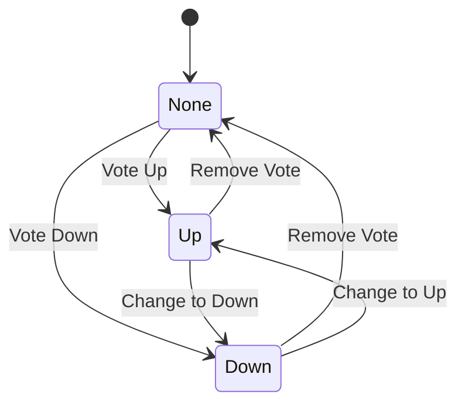

# Reddit-like Community Platform Requirements Specification

## 1. User Account

### 1.1 Registration

WHEN a user provides valid email and password during registration, THE system SHALL generate a unique username by appending a random 6-digit number to their email domain name (without the '@' symbol), and store the account information securely in the database.

WHEN a user attempts to register with an email already in use, THE system SHALL display a clear error message "Email already registered" without revealing whether the email exists.

WHEN a user completes registration, THE system SHALL send a verification email containing a one-time link to activate the account within 24 hours.

### 1.2 Authentication

WHEN a user submits valid email and password for login, THE system SHALL authenticate them using bcrypt and issue a JWT token valid for 7 days with refresh token capability.

WHEN a user is inactive for more than 30 minutes, THE system SHALL automatically log them out and require re-authentication.

### 1.3 Account Management

WHEN a user requests to change their password, THE system SHALL:
- Verify current password
- Ensure new password meets complexity requirements (min 12 characters, include uppercase, lowercase, number, special character)
- Update password securely using bcrypt
- Invalidate all previously issued session tokens

WHEN a user requests account deletion, THE system SHALL:
- Permanently delete their account
- Delete all associated posts, comments, subscriptions, and karma records
- Notify the user of immediate account deletion
- Automatically unsubscribe from all communities

## 2. User Profile

### 2.1 Profile Structure

EVERY user SHALL have a profile containing:
- Display name (max 30 characters, must be unique across platform)
- Bio text (max 300 characters, no HTML)
- Avatar image (PNG/JPEG, max 5MB)

THE system SHALL enforce profile uniqueness: if a display name is already taken, THE system SHALL require the user to choose another before saving.

### 2.2 Profile Access

WHEN a user visits another user's profile, THE system SHALL display:
- Display name
- Bio text
- Avatar image
- Total karma score
- List of all posts created
- List of all comments written

EVERY user SHALL be able to view any other user's public profile, regardless of subscription status.

## 3. Karma System

### 3.1 Calculation Rules

THE system SHALL calculate karma as the net sum of all upvotes and downvotes received across all posts and comments.

WHEN a user upvotes a post or comment, THEIR karma SHALL increase by 1.

WHEN a user downvotes a post or comment, THEIR karma SHALL decrease by 1.

WHEN a user removes their vote, THEIR karma SHALL revert to the previous value (no net change).

### 3.2 Display Requirements

THE system SHALL display karma scores in all contexts:
- In profile pages as "[Karma Points] karma"
- In post lists as "[Karma Points] karma"
- In comment threads as "[Karma Points] karma"

THE system SHALL handle negative karma scores by displaying the negative sign (e.g., "-5 karma").

## 4. Communities

### 4.1 Creation and Structure

WHEN a user creates a community, THE system SHALL:
- Generate a unique URL-slug from the community name (lowercase, hyphens for spaces)
- Create a new community record with:
  - Unique name (max 25 characters)
  - Description (max 200 characters)
  - Icon image (PNG/JPEG, max 5MB)
- Assign the creator as community owner

WHEN a community name is already taken, THE system SHALL suggest similar available names.

### 4.2 Browse and Search

THE system SHALL provide a searchable list of all communities with:
- Community name
- Description snippet
- Subscriber count
- Community icon

USERS SHALL be able to search for communities by name with instant results as they type.

## 5. Subscriptions

### 5.1 Subscription Management

WHEN a user subscribes to a community, THE system SHALL record the association and add the community to their subscriptions list.

WHEN a user unsubscribes from a community, THE system SHALL remove the association and hide the community from their subscriptions list.

### 5.2 Subscription Requirements

THE system SHALL enforce subscription requirements for posting:
- ONLY users who are subscribed to a community may create posts in that community.
- UNSUBSCRIBED users SHALL NOT see a "Create Post" button for that community.

## 6. Post System

### 6.1 Post Types and Content

EVERY post SHALL be one of three types:
- **Text**: Requires title (min 5 characters) and text content (min 10 characters)
- **Link**: Requires title (min 5 characters) and valid URL (http/https, properly formatted)
- **Image**: Requires title (min 5 characters) and valid image file (PNG/JPEG, max 10MB)

### 6.2 Post Management

WHEN a user edits their post, THE system SHALL allow changes to title, content, and type (with validation for new type requirements).

WHEN a user deletes their post, THE system SHALL:
- Permanently remove the post
- Remove all comments associated with the post
- Adjust community subscriber counts as needed

## 7. Post Voting

[See detailed requirements in 08-post-voting.md]

### 7.1 Vote Rules

THE system SHALL enforce one vote per user per post.

THE system SHALL prevent users from voting on their own posts.

THE system SHALL calculate vote score as UPVOTES - DOWNVOTES.

## 8. Feed Systems

### 8.1 Feed Types

- **Home Feed**: Shows posts from subscribed communities (logged-in users only)
- **Popular Feed**: Shows posts from all communities (available to everyone)
- **Community Feed**: Shows posts from a single community (available to everyone)

### 8.2 Sorting Options

ALL feeds SHALL support these sorting options:
- **Hot**: Recent posts with high vote scores appear first
- **New**: Most recent posts appear first
- **Top**: Highest vote scores first (with time filters: Today, This Week, This Month, This Year, All Time)
- **Controversial**: Posts with many votes but near-zero net scores first

ALL feeds SHALL paginate results with 20 items per page and include load-more functionality.

## 9. Comment System

### 9.1 Nested Comment Structure

COMMENTS SHALL support unlimited nesting levels using a parent-child relationship.

EVERY comment SHALL:
- Be associated with a specific post
- Have an author
- Include content
- Support voting
- Show timestamp
- Support replies

### 9.2 Comment Management

WHEN a user edits their comment, THE system SHALL allow changes to content only (no type changes).

WHEN a user deletes their comment, THE system SHALL:
- Permanently remove the comment
- Remove all nested replies
- Update comment count for the associated post

## 10. Moderation System

### 10.1 Role Hierarchy

- **Owner**: Highest authority, can add/remove moderators, cannot be removed
- **Moderator**: Can add/remove other moderators (but not the owner), cannot remove self

MODERATORS ARE NOT AUTOMATICALLY GRANTED ADDITIONAL RIGHTS BEYOND THEIR OWN COMMUNITY.

### 10.2 Moderator Actions

WHEN a moderator deletes a post, THE system SHALL:
- Permanently remove the post
- Record the moderator action
- Notify community owners of deletion

WHEN a moderator bans a user from a community, THE system SHALL:
- Prevent the user from creating posts/comments in that community
- Record the ban with reason
- Show ban status to the user when attempting to interact

## 11. Reporting System

### 11.1 Reporting Process

WHEN a user reports content, THE system SHALL:
- Require a reason description (min 10 characters)
- Record the report with the reporter's ID
- Notify the community's moderators

### 11.2 Report Resolution

WHEN a moderator approves a report, THE system SHALL:
- Permanently remove the reported post/comment
- Send notification to the reporter
- Remove the report from the moderation queue

WHEN a moderator dismisses a report, THE system SHALL:
- Record the dismissal reason
- Send notification to the reporter
- Remove the report from the moderation queue

## 12. Security and Validation

### 12.1 Input Validation

ALL user inputs SHALL undergo strict validation:
- Email format validation
- Password complexity requirements
- Text length limits
- File format and size validation

### 12.2 Session Security

ALL API requests SHALL require a valid JWT token.

USER SESSIONS SHALL require re-authentication after 30 minutes of inactivity.

## 13. Performance Requirements

ALL list views (posts, comments, users) SHALL load within 500ms.

VOTE UPDATES SHALL be processed within 200ms.

ALL FEEDS SHALL support pagination with 20 items per page.
