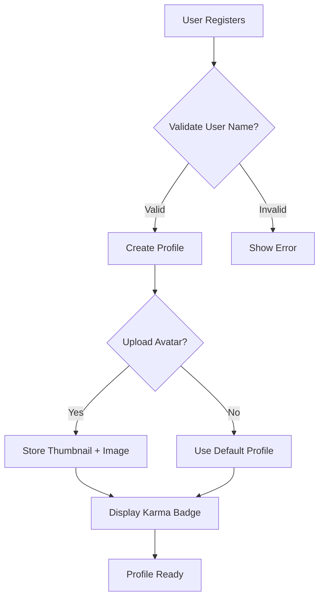
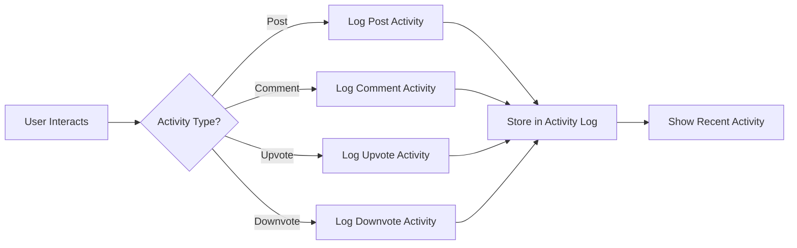
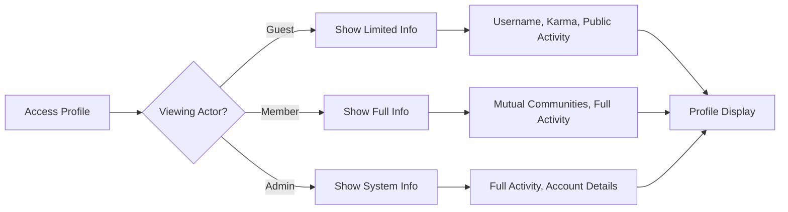
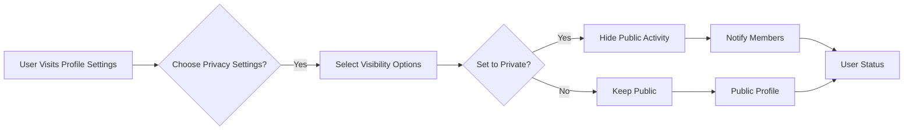

# User Profile Requirements Specification

## 1. Profile Composition

### Core Business Requirements

#### 1.1 User Identity Elements
- **WHEN** a user creates a profile, **THE** system **SHALL** display their username, profile picture, and registration date.
- **WHEN** a user uploads a profile picture, **THE** system **SHALL** store a 100x100px thumbnail and a 500x500px main image.
- **WHEN** a user changes their username, **THE** system **SHALL** validate it against existing usernames and require a unique value.
- **IF** a username is already taken, **THEN** the system **SHALL** display "Username unavailable - please try another."

#### 1.2 Reputation Display
- **WHEN** a user's profile displays, **THE** system **SHALL** show their current karma score below their username.
- **WHEN** a user's karma is below 50, **THE** system **SHALL** display a "Novice" badge.
- **WHEN** a user's karma is between 50-150, **THE** system **SHALL** display a "Contributor" badge.
- **WHEN** a user's karma is 150-500, **THE** system **SHALL** display a "Creator" badge.
- **WHEN** a user's karma is 500+, **THE** system **SHALL** display a "Respected" badge.

#### 1.3 Social Context
- **WHEN** a user views another profile, **THE** system **SHALL** display their relationship context (e.g., "You both belong to 3 communities").
- **WHEN** a user has interacted with another through comments or upvotes, **THE** system **SHALL** indicate this connection.
- **WHEN** a user's profile is viewed, **THE** system **SHALL** count the view towards their activity log.

### Mermaid Diagram: Profile Composition

## 2. Activity Tracking

### Core Business Requirements

#### 2.1 Activity Types
- **WHEN** a user creates a post, **THE** system **SHALL** add an activity log entry with type "post_created" and timestamp.
- **WHEN** a user comments on a post, **THE** system **SHALL** add an activity log entry with type "comment_created" and timestamp.
- **WHEN** a user upvotes a post or comment, **THE** system **SHALL** add an activity log entry with type "upvote" and timestamp.
- **WHEN** a user downvotes a post or comment, **THE** system **SHALL** add an activity log entry with type "downvote" and timestamp.

#### 2.2 Activity Display
- **WHEN** a user views their activity feed, **THE** system **SHALL** display recent activity ordered from newest to oldest.
- **WHEN** a user views a specific activity entry, **THE** system **SHALL** show the activity details and context.
- **WHEN** a user's activity feed contains more than 20 entries, **THE** system **SHALL** paginate the feed.

#### 2.3 Historical Retention
- **THE** system **SHALL** retain user activity data for 3 years.
- **IT** SHALL store activity data in a structured format with activity type, timestamp, and context information.
- **WHEN** a user deletes a post, **THE** system **SHALL** retain the activity log entry for that post but exclude it from future activity display.

### Mermaid Diagram: Activity Tracking

## 3. Public Display Rules

### Core Business Requirements

#### 3.1 Public Visibility
- **WHEN** a guest views a user profile, **THE** system **SHALL** display username, karma score, and public activity count.
- **WHEN** a guest views a user profile, **THE** system **SHALL** NOT display the user's email or private contact information.
- **WHEN** a guest views a user profile, **THE** system **SHALL** display user karma badge with correct tier.

#### 3.2 Member Viewing Perspective
- **WHEN** a member views another member's profile, **THE** system **SHALL** display their mutual communities.
- **WHEN** a member views another member's profile, **THE** system **SHALL** display the user's reputation metrics.
- **WHEN** a member views their own profile, **THE** system **SHALL** display the complete activity dashboard.

#### 3.3 Content Visibility
- **WHEN** a user views a profile, **THE** system **SHALL** show a list of posts they've made in relevant communities.
- **WHEN** a user views a profile, **THE** system **SHALL** limit displayed posts to the last 50, ordered by recency.
- **WHEN** a user views a profile, **THE** system **SHALL** display comment history with the most recent first.

### Mermaid Diagram: Public Visibility

## 4. Privacy Options

### Core Business Requirements

#### 4.1 Privacy Settings
- **WHEN** a user accesses their profile settings, **THE** system **SHALL** provide options to manage privacy settings.
- **WHEN** a user sets their profile to private, **THE** system **SHALL** hide their activity from public view.
- **WHEN** a user's profile is private, **THE** system **SHALL** notify members when they attempt to access the profile.

#### 4.2 Default Settings
- **THE** system **SHALL** set new user profiles to public by default.
- **THE** system **SHALL** provide clear guidance to users when they set profile to private.
- **WHEN** a user enables privacy features, **THE** system **SHALL** confirm the change and provide expected consequences.

#### 4.3 Privacy Hierarchy
- **WHEN** a user is part of a private community, **THE** system **SHALL** restrict community-related activity visibility to community members only.
- **WHEN** a user is reported for spam, **THE** system **SHALL** temporarily restrict their public profile visibility until moderation is complete.
- **WHEN** a user's account is suspended, **THE** system **SHALL** prevent public profile access and display a status message.

### Mermaid Diagram: Privacy Settings

## Business Justification for Profile System

The user profile system is critical to creating a meaningful community where users can establish identity, reputation, and social connections. Unlike platform-centric profiles, our user-centric approach focuses on: 1) Authentic identity expression through reputation, 2) Social proof via community recognition, 3) Transparency in user interactions, and 4) Privacy controls that respect user preferences while enabling meaningful engagement.

### Success Metrics

| Metric | Target | Measurement Period |
|--------|--------|-------------------|
| Profile Completion Rate | 85% | 3 months after launch |
| Public Profile Views | 200+ per active user | Monthly |
| Privacy Settings Usage | 60% | 6 months after launch |
| Profile-Driven Community Joining | 35% | 6 months after launch |
| Profile Content Relevance | 8.5/10 | User satisfaction surveys |

> *Developer Note: This document defines **business requirements only**. All technical implementations (architecture, APIs, database design, etc.) are at the discretion of the development team.*