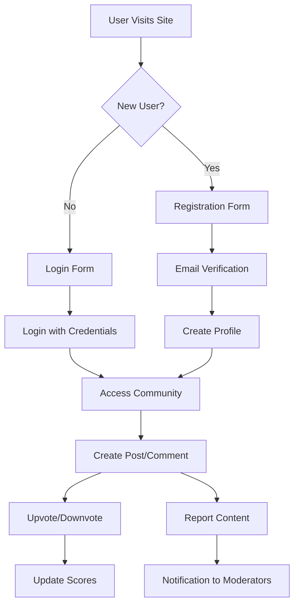

# Core Requirements Analysis for Reddit-like Community Platform

## 1. User Registration and Login

**User Registration**
WHEN a new user visits the site for the first time, THE system SHALL present a registration form with email, password, and username fields. THE system SHALL validate the email format, enforce password strength (minimum 12 characters with uppercase, lowercase, number, and special character), and check username availability in real time. IF the username is unavailable, THEN THE system SHALL suggest 3 alternative usernames. 

WHEN registration completes successfully, THE system SHALL send a confirmation email with a verification link. THE user SHALL wait for email confirmation before being able to log in. IF the user fails to verify within 24 hours, THEN THE system SHALL automatically invalidate the registration.

**User Login**
WHEN a registered user enters valid credentials, THE system SHALL issue a JWT token valid for 7 days with refresh token capability. THE system SHALL display a security warning for logins from unfamiliar locations. THE user SHALL have the option to save login status for 30 days on trusted devices.

## 2. Community Creation and Management

**Community Creation**
WHEN a user clicks the "Create Community" button, THE system SHALL require a minimum of 5 characters for community name and display validation feedback instantly. THE system SHALL reject community names containing prohibited words from the curated blacklist (e.g., 'nsfw', 'adult', 'spam'). FOR community types, THE system SHALL offer categories (General, Technology, Art, etc.) as mandatory selection.

WHEN a community is created, THE system SHALL assign a URL slug automatically (e.g., /community/tech-news) based on community title. THE system SHALL show a confirmation dialog with the community URL before finalizing creation.

**Community Subscription**
WHEN a user clicks "Join Community", THE system SHALL add the community to their subscription list instantly. THE system SHALL display a success confirmation and show the community as subscribed in the user's profile. IF the user is already subscribed, THEN THE system SHALL display an appropriate warning message "You're already subscribed to this community."

## 3. Content Creation and Interaction

**Post Creation**
WHEN a user clicks "Create Post" within a community, THE system SHALL show a modal with text input, image upload (up to 5MB), and link fields. THE system SHALL limit text posts to 5000 characters and automatically count characters as the user types. IF the user attempts to post a link, THEN THE system SHALL display a preview card of the page content with title and image (if available).

**Upvote/Downvote System**
WHEN a user clicks the upvote button, THE system SHALL increment the vote count for that post and display the updated count immediately. THE system SHALL prevent multiple votes from the same user on the same post. FOR posts with 3+ votes, THE system SHALL show a percentage value (e.g., 80% upvotes).

**Comment System**
WHEN a user types a comment, THE system SHALL show character count and allow up to 2000 characters. THE system SHALL enable nested replies up to 4 levels deep. WHEN a user clicks "Reply", THE system SHALL indent the comment and add a "Cancel Reply" option. FOR comments with 5+ replies, THE system SHALL show a "View All Replies" button.

## 4. User Profiles and Activity

**Profile Structure**
THE user profile SHALL include:
- Public username and profile photo (default initials)
- Karma score (real-time updated)
- Activity counts (Posts: X, Comments: Y, Karma: Z)
- Community affiliations with role indicators (Member/Admin)

WHEN a user edits their profile bio, THE system SHALL accept up to 500 characters with line breaks preserved. THE profile SHALL update immediately across all platform views.

**Activity Display**
THE activity history SHALL show 20 most recent items by default (posts and comments). THE system SHALL allow filtering by time period (Last 24h, Week, Month) and community. WHEN a user views a post in activity history, THE system SHALL navigate to the exact post with community context preserved.

## 5. Content Sorting and Reporting

**Sorting Logic**
WHEN a user selects "Hot" sort, THE system SHALL calculate the hotness score using: `(upvotes - downvotes) / (time_since_creation ^ 1.8)`. THE system SHALL display posts with the highest hotness at the top. FOR "Top Posts", THE system SHALL sort by net votes (upvotes - downvotes) first, then by date.

**Report Management**
WHEN a user clicks "Report" on any content, THE system SHALL show a list of report reasons (Inappropriate, Spam, Copyright, etc.) and require selecting 1 reason. THE system SHALL send the report to community moderators and notify the user with "Report submitted successfully" message. IF a community moderator deletes the content based on a report, THEN THE system SHALL notify the reporting user with "Your report contributed to content removal."

## 6. Business Process Flow

