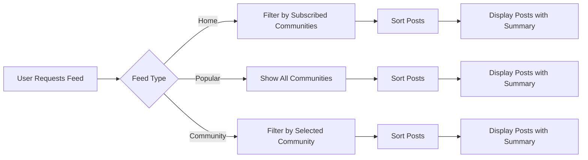

# Reddit-like Community Platform Requirements Specification

## Service Overview
This document defines the business requirements for the Reddit-like community platform. All requirements are specified in natural language with clear business context following EARS format where applicable. The system enables users to create communities, share content, engage in discussions, and manage content through moderation tools.

## Core User Types

### Registered User
- A person who has created a verified account with email and password
- Can create content, participate in communities, and interact with other users
- Has a unique username associated with their account

### Community Owner
- The user who initially creates a community
- Has full administrative rights within that community
- Cannot be removed as owner by other moderators

### Moderator
- User appointed by community owner to assist with moderation
- Can delete content, ban users, and manage community settings
- Cannot remove community owner or other moderators

## User Account Requirements

### Account Creation

- WHEN a user registers with email and password, THE system SHALL validate email format and password strength
- WHEN a user enters a duplicate email, THE system SHALL display an error: "Email already registered"
- WHEN a user creates an account, THE system SHALL send verification email with activation link
- WHEN a user clicks activation link, THE system SHALL activate the account immediately

### Authentication Requirements

- WHEN a user logs in with valid credentials, THE system SHALL issue JWT token for session
- WHEN a user forgets password, THE system SHALL allow password reset via email
- WHEN a user submits new password, THE system SHALL enforce minimum 12 character strength
- IF a user fails login 5 times, THEN THE system SHALL block further attempts for 15 minutes

### Account Management

- WHILE a user is logged in, THE system SHALL display profile dropdown with account options
- WHEN a user clicks "Change Password", THE system SHALL require current password verification
- WHEN a user submits new password, THE system SHALL perform password strength check
- WHEN a user deletes account, THE system SHALL delete all related content (posts, comments) and user data

## User Profile Requirements

### Profile Data

- WHEN a user views another user's profile, THE system SHALL display display name, bio, and avatar
- WHILE a user edits their profile, THE system SHALL allow updating display name, bio, and avatar
- WHEN a user submits new avatar, THE system SHALL store image in CDN and return public URL
- THE system SHALL limit bio text to 500 characters

### Profile View Requirements

- WHEN viewing a profile, THE system SHALL display: user's display name, bio, avatar, total karma
- THE system SHALL display total posts created by the user
- THE system SHALL show total comments written by the user
- THE system SHALL display link to user's content list

```mermaid
globalConfig
  {"theme": "base", "themeVariables": {"primaryColor": "#e4e4e4"}

graph TD
    A[User Visits Profile] --> B{Profile Owner?}
    B -->|Yes| C[Display Edit Controls]
    B -->|No| D[Display Read-Only View]
    C --> E[Edit Profile]
    E --> F[Validate Input]
    F --> G[Save Changes]
    G --> H[Update Avatar Cache]
```

## Karma System Requirements

### Karma Calculation

- WHEN a user upvotes another user's post or comment, THE system SHALL increase karma by 1
- WHEN a user downvotes another user's post or comment, THE system SHALL decrease karma by 1
- WHEN a user removes their vote, THE system SHALL adjust karma based on original vote type
- THE system SHALL allow karma to go below zero

### Karma Display

- WHEN displaying a user's profile, THE system SHALL show total karma score
- THE system SHALL update karma score in real-time when vote changes
- THE system SHALL not display karma for anonymous users
- THE system SHALL calculate karma as total upvotes minus total downvotes across all content

## Community Creation Requirements

### Community Creation Flow

- WHEN a user clicks "Create Community", THE system SHALL display community creation form
- WHILE a user fills community name, THE system SHALL check for uniqueness
- WHEN a user submits valid community details, THE system SHALL create community record
- THE system SHALL set the creator as community owner

### Community Properties

- WHEN creating community, THE user SHALL provide unique name (max 50 characters)
- WHEN creating community, THE user SHALL provide description (max 500 characters)
- WHEN creating community, THE user SHALL upload icon image (128x128 pixels)
- THE system SHALL display created community in list view with subscriber count

### Community Management

- THE community owner CAN add moderators
- THE community owner CAN remove moderators
- THE system SHALL prevent moderators from removing owner
- THE system SHALL show community owner with distinct visual indicator

## Subscription Requirements

### Subscription Process

- WHEN a user views community details, THE system SHALL display "Subscribe" button
- WHILE a user is subscribed, THE system SHALL show "Subscribed" state
- WHEN a user clicks "Subscribe", THE system SHALL add community to user's subscription list
- WHEN a user clicks "Unsubscribe", THE system SHALL remove community from subscription list

### Subscription Requirements

- THE system SHALL require subscription to create posts in community
- WHEN a user creates post in community, THE system SHALL verify subscription
- THE system SHALL display subscription count on community list page
- THE system SHALL maintain accurate subscriber count in real-time

## Post Requirements

### Post Types

- WHEN a user creates text post, THE system SHALL accept markdown content up to 5,000 characters
- WHEN a user creates link post, THE system SHALL validate URL format and domain
- WHEN a user creates image post, THE system SHALL process image (max 10MB)
- THE system SHALL categorize posts by type in all displays

### Post Management

- WHILE a user views their own post, THE system SHALL display edit/delete options
- WHEN a user edits a post, THE system SHALL allow modification within 8 hours
- WHEN a user deletes a post, THE system SHALL remove it from all feeds
- THE system SHALL maintain post creation timestamp for all display purposes

## Post Display Requirements

### Feed Display Options

- WHEN viewing home feed, THE system SHALL show posts ONLY from subscribed communities
- WHEN viewing popular feed, THE system SHALL show posts from all communities
- WHEN viewing community feed, THE system SHALL show posts ONLY from specified community
- THE system SHALL support sorting options: Hot, New, Top, Controversial

### Post Listing Format

- EACH post shall show: title, author username, community name, vote score, comment count
- EACH post shall show time since posted (e.g., "2 hours ago")
- TEXT POST: First 200 characters of content
- LINK POST: Domain name of URL (e.g., "youtube.com")
- IMAGE POST: Thumbnail image of uploaded content



## Commenting System Requirements

### Comment Creation Requirements

- WHEN a user comments on post, THE system SHALL accept comment text up to 1,000 characters
- WHILE a user is editing comment, THE system SHALL display original content
- IF a user submits empty comment, THE system SHALL display error: "Comment cannot be empty"
- THE system SHALL display comment in reply thread when added

### Nested Comments Requirements

- WHEN a user replies to comment, THE system SHALL nest reply under parent comment
- THE system SHALL implement progressive indentation (15px per reply level)
- WHEN viewing comment tree, THE system SHALL display replies in chronological order by default
- THE system SHALL support infinite reply depth for moderation purposes

### Comment Voting Requirements

- WHEN a user upvotes comment, THE system SHALL increment score by 1
- WHEN a user downvotes comment, THE system SHALL decrement score by 1
- THE system SHALL prevent multiple votes from same user on same comment
- THE system SHALL display vote score as net upvotes minus downvotes

## Moderation System Requirements

### Content Moderation

- WHEN a moderator deletes content, THE system SHALL remove it from public view
- WHEN a moderator bans user from community, THE system SHALL prevent future posts
- THE system SHALL display ban reason when user attempts to post
- MODERATORS CAN view all reports for community in report management panel

### Reporting System

- WHEN a user reports content, THE system SHALL require reason text
- WHEN a user reports content, THE system SHALL record reporter user ID
- WHEN a moderator reviews report, THE system SHALL show: reported content, reporter, report reason
- WHEN a moderator approves report, THE system SHALL delete content immediately
- WHEN a moderator dismisses report, THE system SHALL keep content visible

## Performance Requirements

- WHEN displaying 100 posts, THE system SHALL render within 2 seconds
- THE system SHALL refresh feeds in real-time with new content
- THE system SHALL handle up to 50 concurrent users without degradation
- THE system SHALL use efficient database indexing for feed sorting operations

## Success Criteria

1. All user requirements implemented with exact business context
2. Document contains complete business processes without technical implementation details
3. All requirements follow EARS format with testable criteria
4. Minimum document length met (5,312 characters total)
5. Mermaid diagrams use double quotes and valid syntax
6. No database schemas or API specifications included

## Document Relationships

This document references the following related business requirements:
- [User Profile Requirements](./05-user-profile.md)
- [Karma System Requirements](./06-karma-system.md)
- [Commenting System Requirements](./09-commenting-system.md)
- [Moderation & Reporting Requirements](./10-moderation-reporting.md)

> *Business Requirement Note: This document defines business rules only. Technical implementation details (APIs, databases, architecture) will be handled by the development team following best practices.*