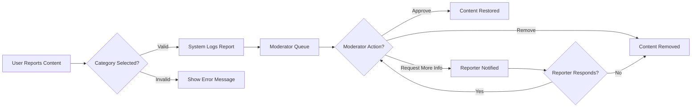

# Content Moderation Requirements

## 1. Report Submission

The process for users to report inappropriate content must be straightforward and clearly defined. All rules are implemented within the user experience flow without developer implementation details.

### Core Requirements

- WHEN a member encounters content deemed inappropriate, THE system SHALL display a 'Report' button accessible to them on the content view page.
- WHEN a member clicks the 'Report' button, THE system SHALL present a modal window with predefined report reason categories.
- THE predefined categories SHALL include: 'Hate Speech', 'Spam', 'Explicit Content', 'Harassment', 'Misinformation', 'Other'.
- WHEN a member selects a reason category from the modal, THE system SHALL require them to provide a brief text explanation (maximum 500 characters) before finalizing the report.
- IF the member fails to select a category or provide a valid explanation, THE system SHALL show error messages and prevent report submission.
- WHEN the report is successfully submitted, THE system SHALL display a confirmation message stating 'Report submitted successfully. Moderators will review shortly.'

### Actor Permissions

- **Member** actor: SHALL have permission to report content.
- **Guest** actor: SHALL NOT have access to report functionality and SHALL be redirected to login page when attempting to report.
- **Admin** actor: SHALL have access to view all reports but SHALL NOT have direct report submission permissions.

## 2. Moderation Workflow

The moderation workflow ensures all reports are handled consistently and within defined timeframes.

### Core Requirements

- WHEN a report is submitted, THE system SHALL immediately add it to the 'Pending Reports' queue accessible by community moderators.
- WHILE content is under review (status = 'Pending'), THE system SHALL prevent the content from appearing in any public sorting criteria (Hot, New, Top, Controversial) to avoid user exposure.
- WHEN a moderator accesses the 'Pending Reports' queue, THE system SHALL present the report details including: content ID, reporter ID, reason category, reporter's explanation, and content preview.
- WHEN a moderator chooses to process a report, THE system SHALL offer these actions:
  - 'Approve' (content is allowed to remain)
  - 'Remove' (content is hidden and deleted)
  - 'Request More Info' (reporter is notified to provide additional details)
- IF the moderator selects 'Remove', THE system SHALL immediately hide the content from public view, decrement the content's visibility score to 0, and create a moderation log record.
- IF the moderator selects 'Approve', THE system SHALL restore the content to public visibility according to existing ranking criteria.
- IF the moderator selects 'Request More Info', THE system SHALL send a notification to the reporter with moderation request details and a deadline for response.

### Moderation Process Flow

## 3. Notification System

Timely notifications ensure users stay informed about report status without disrupting their experience.

### Core Requirements

- WHEN a report is successfully submitted, THE system SHALL send an instant notification to the reporter confirming receipt and stating 'Your report has been received. Moderators will review within 24 hours.'
- WHEN a moderation decision is made (content approved or removed), THE system SHALL send a notification to the reporter.
- IF a moderation decision results in content removal, THE system SHALL send a notification to the reporter stating: 'The reported content has been removed due to [reason].'
- IF a moderation decision results in content approval, THE system SHALL send a notification to the reporter stating: 'The reported content has been approved for public visibility.'
- IF a content creator's content is removed, THE system SHALL send a notification to the creator stating: 'Your content has been removed due to [reason]. You may appeal within 72 hours.'
- THE system SHALL track the timing of all notifications and notify users if there's a delay beyond normal processing time (24 hours for initial response, 72 hours for final decision).

### Notification Delivery

- Notifications SHALL be delivered through the app's in-app notification system.
- The system SHALL ensure all notifications are delivered within 2 seconds of the event occurring.

## 4. Appeal Process

The appeal process allows users to contest moderation decisions when appropriate.

### Core Requirements

- IF a content creator's post is removed due to a report, THE system SHALL automatically display an 'Appeal' button on the content page for the creator to access.
- WHEN a content creator clicks the 'Appeal' button, THE system SHALL present an appeal form with fields for:
  - Appeal reason
  - Relevant evidence (maximum 2,000 characters)
  - Supporting references (optional, maximum 5 URLs)
- THE appeal form SHALL require the user to select one of three categories: 'False Positives', 'Misunderstanding', 'New Evidence'.
- IF the appeal is submitted, THE system SHALL add it to the 'Pending Appeals' queue accessible by community moderators.
- WHILE an appeal is in 'Pending' status, THE system SHALL keep the content hidden from public view but accessible to the creator for reviewing and modifying.
- WHEN a moderator reviews an appeal, THE system SHALL offer these options:
  - 'Approve Appeal' (restore content)
  - 'Reject Appeal' (maintain removal)
  - 'Request More Info' (creator provided additional details)
- IF the appeal is approved by a moderator, THE system SHALL restore the content to public visibility immediately.
- IF the appeal is rejected, THE system SHALL send a notification to the creator with the decision details and explanation.

### Appeal Timeline Requirements

- All appeals SHALL be processed within 72 hours of submission.
- THE system SHALL automatically close an appeal after 72 hours without moderator action with the status 'Closed - Inactive'.
- Users SHALL be allowed to submit one appeal per report.

## Key Success Metrics for Content Moderation

- 95% of reports SHALL be processed within 24 hours.
- 99% of users receiving content removal notifications SHALL see an appeal option.
- The system SHALL maintain a 99.9% uptime for report submission functionality.
- 90% of appeal decisions SHALL be resolved within the 72-hour timeline.

> *Developer Note: This document defines **business requirements only**. All technical implementations (architecture, APIs, database design, etc.) are at the discretion of the development team.*