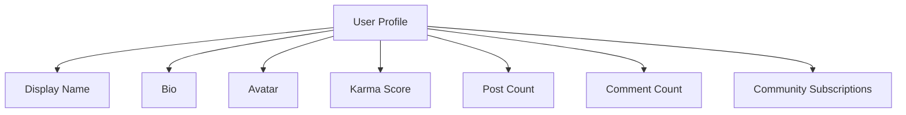
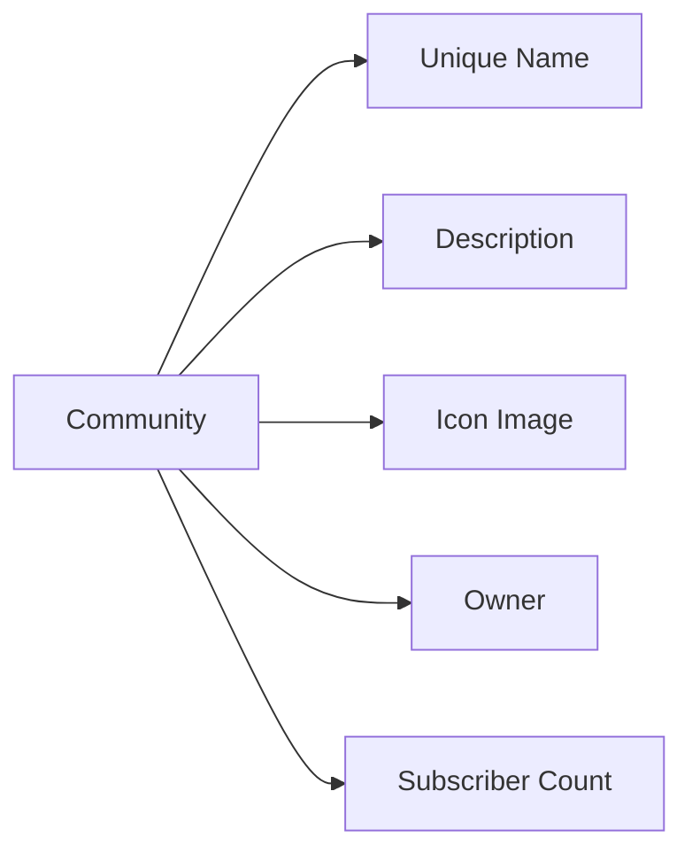

# Reddit-like Community Platform Requirements Specification

## 1. User Account Management

### Business Requirements

- WHEN a new user registers with a valid email and password, THE system SHALL create a unique account with a username derived from the email (stripping @ and .) followed by a numeric suffix if needed.
- IF the username chosen is already taken, THE system SHALL provide immediate feedback and suggest alternatives.
- WHEN a user submits a valid password reset request, THE system SHALL generate a time-limited token for password change.
- WHEN a user requests account deletion, THE system SHALL permanently remove all associated content including posts, comments, and karma points.
- THE system SHALL implement rate limiting with a maximum of 5 failed login attempts per hour per account.

### Error Handling

- IF a user attempts to sign up with an existing email, THE system SHALL return 'Email already registered' message with option to reset password.
- WHEN a password reset token expires, THE system SHALL automatically generate a new token upon retry.

## 2. User Profile

### Business Requirements

- WHEN a user accesses their own profile, THE system SHALL display bio, display name, avatar, and total karma score.
- IF a user edits their profile, THE system SHALL update display name, bio, and avatar within 500ms.
- WHEN a user views another user's profile, THE system SHALL display public profile information without authentication.
- IF a user requests profile data without authentication, THE system SHALL require login for private information.

### Profile Data Structure

## 3. Karma System

### Business Requirements

- WHEN a post is upvoted, THE system SHALL increment the author's karma by 1.
- WHEN a post is downvoted, THE system SHALL decrement the author's karma by 1.
- WHEN a user's vote is changed from upvote to downvote, THE system SHALL adjust karma by -2.
- WHEN a user's vote is removed, THE system SHALL adjust karma by the vote value (1 for upvote, -1 for downvote).
- THE system SHALL allow negative karma values with no lower bound.

### Karma Display Rule

- THE system SHALL display karma score as '5' for positive values and '-3' for negative values.

## 4. Communities

### Business Requirements

- WHEN a user creates a community, THE system SHALL verify community name uniqueness.
- IF a community name contains restricted words, THE system SHALL reject creation with specific feedback.
- WHEN a community is created, THE system SHALL set the creator as owner with all permissions.
- WHEN a user searches communities by name, THE system SHALL return results with partial matching.

### Community Attributes

## 5. Subscriptions

### Business Requirements

- WHEN a user subscribes to a community, THE system SHALL add them to the subscription list.
- IF a user is not subscribed, THE system SHALL block post creation in that community.
- WHEN a user views communities they're subscribed to, THE system SHALL show the list with recent activity.
- THE system SHALL allow unsubscribing from communities with immediate effect.

## 6. Posts

### Business Requirements

- WHEN a user creates a text post, THE system SHALL require title and content (min 10 words).
- IF a link post's URL is invalid, THE system SHALL reject with 'Invalid URL' message.
- WHEN a user edits a post, THE system SHALL save changes within 1000ms.
- IF a post is deleted, THE system SHALL remove from all feeds instantly.

### Post Types

- **Text Post**: Content must have min 10 words
- **Link Post**: URL must be valid and accessible
- **Image Post**: Must be image file under 10MB

### Post Display Rules

- WHEN viewing a post list, THE system SHALL display title, author, community, vote score, comment count, and time.
- FOR text posts: first 200 characters of content
- FOR image posts: thumbnail of the image
- FOR link posts: domain name (e.g., 'youtube.com')

## 7. Post Voting

### Business Requirements

- WHEN a user votes on a post, THE system SHALL record the vote and update score.
- IF a user changes from upvote to downvote, THE system SHALL adjust score by -2.
- WHEN a vote is removed, THE system SHALL adjust score by the previous vote value.
- THE system SHALL prevent more than one vote per user per post.

## 8. Feeds

### Business Requirements

- WHEN a user is logged in, THE system SHALL show Home Feed by default.
- WHEN a user is not logged in, THE system SHALL show Popular Feed.
- IF a community feed is requested, THE system SHALL show all posts in that community.
- THE system SHALL implement pagination with 20 posts per page.

### Sorting Options

- **Hot**: Prioritize (upvote - downvote) * (time factor)
- **New**: Sort most recent first
- **Top**: Sort by highest score (with time filter)
- **Controversial**: High votes near zero score

### Feed Requirements Integration

- Requires [Post Requirements](07-posts.md) and [Post Voting](08-post-voting.md) details

## 9. Comments

### Business Requirements

- WHEN a user replies to a comment, THE system SHALL create nested reply structure.
- IF a comment contains restricted words, THE system SHALL block with specific feedback.
- WHEN a user edits a comment, THE system SHALL update content instantly.
- THE system SHALL allow replies to any comment without depth limitation.

### Comment Display Rules

- SHOW author, content, vote score, time since posted
- REPLY nests with proper indentation

## 10. Comment Voting

### Business Requirements

- WHEN a user votes on a comment, THE system SHALL update score immediately.
- IF a vote is changed, THE system SHALL adjust score accordingly.
- THE system SHALL prevent multiple votes per user per comment.

## 11. Moderation

### Business Requirements

- WHEN a community owner adds a moderator, THE system SHALL assign moderator permissions.
- IF a user is banned from a community, THE system SHALL block their posts in that community.
- WHEN a moderator deletes content, THE system SHALL record audit log.
- THE system SHALL prevent moderators from removing the community owner.

## 12. Reporting

### Business Requirements

- WHEN a user reports content, THE system SHALL require reason text (min 10 characters).
- IF a report is approved by moderator, THE system SHALL delete content immediately.
- WHEN a report is dismissed, THE system SHALL record the reason.
- THE system SHALL show all reports for a community in a single list.

## 13. Performance Requirements

- ALL feed operations SHALL load within 2 seconds for 95% of users
- POST creation SHALL complete within 1 second
- USER profile view SHALL load in under 500ms
- KARMA updates SHALL reflect within 500ms

## 14. Error Handling Standards

- ALL network errors SHALL show 'Try again' button
- ILLEGAL operations SHALL return specific error messages
- LIMIT violations SHALL show 'Please try again later' messages

## 15. Security Requirements

- USERS SHALL NOT be able to access private information without authentication
- ALL API endpoints SHALL validate inputs
- KARMA changes SHALL be audited for suspicious activity

## 16. Integration Dependencies

- Requires [Karma System](04-karma-system.md) for scoring
- Requires [Moderation System](12-moderation.md) for content governance
- Requires [User Profile](03-user-profile.md) for user data
