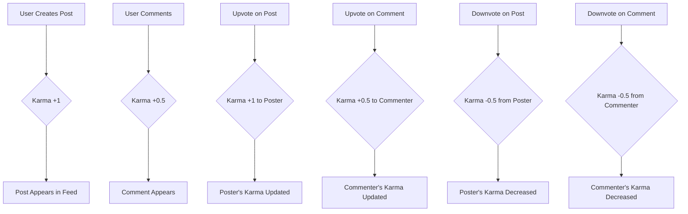

# CommunityHub Requirements Analysis Report

## Service Overview

CommunityHub is a modern Reddit-like platform designed to foster community-driven content creation and engagement. The platform enables users to create and join topic-based communities (subreddits), publish diverse content, and interact through voting and commenting systems. The service focuses on creating a respectful, engaging community space where valuable content rises naturally through user participation and approval.

## Core Functional Requirements

### User Registration and Login

WHEN a user provides a valid email address and password, THE system SHALL create a new account with verification email and initial karma of 0.

WHEN a user provides valid credentials, THE system SHALL authenticate using JWT tokens and maintain active sessions for 30 days.

WHEN a user requests account recovery, THE system SHALL send a verification code via email within 30 seconds.

### Community Creation and Management

WHEN a user creates a new community, THE system SHALL require a unique name (minimum 3 characters), description, and public/private visibility setting.

WHEN a user joins a community, THE system SHALL grant access and add it to their community subscriptions immediately.

WHEN a community reaches 500 active members, THE system SHALL automatically recommend it to potential new members based on similar interests.

### Content Creation and Interaction

WHEN a user creates a text post, THE system SHALL allow up to 5000 characters and include flagging for inappropriate content.

WHEN a user posts a link, THE system SHALL verify URL legitimacy through security checks before display.

WHEN a user creates a new post, THE system SHALL grant +1 karma to the user and authorize the post to appear in the community feed immediately.

### Upvote/Downvote Mechanics

WHEN a user upvotes a post, THE system SHALL increment the post's upvote count and add +1 karma to the post owner (minimum karma 0).

WHEN a user downvotes a post, THE system SHALL decrement the post's upvote count and deduct 0.5 karma from the post owner (capped at 0).

WHEN a post receives 50 or more upvotes, THE system SHALL automatically mark it as a 'Featured Entry' above the community feed.

### Comment System and Hierarchy

WHEN a user comments on a post, THE system SHALL allow comments up to 2000 characters and enable nested replies.

WHEN a comment receives an upvote, THE system SHALL grant +0.5 karma to the comment author (capped at 100 karma maximum per comment).

WHEN a user replies to a comment, THE system SHALL add 'Reply' to the comment thread prefix with the user's profile name.

### User Profile Display

WHEN a user views their profile, THE system SHALL display total karma prominently with daily contribution breakdown.

WHEN a user views another user's profile, THE system SHALL show their top 3 most upvoted posts and recent active communities.

WHEN a user scrolls through their activity, THE system SHALL show real-time karma changes for each interaction.

### Karma System

The karma system is fully integrated as defined in 09-karma-system.md. Key features include:

- 5-tier privilege structure based on karma thresholds
- Real-time calculation of karma changes
- Leaderboard display for community top contributors
- Daily challenge 2x karma bonuses
- Anti-gaming measures for account clustering

### Sorting Mechanisms

WHEN a user selects 'Hot', THE system SHALL sort posts by the formula: (upvotes / (hours since submission ^ 2)).

WHEN a user selects 'New', THE system SHALL sort posts chronologically from newest to oldest.

WHEN a user selects 'Top', THE system SHALL sort posts by revenue-generating potential (as calculated by engagement metrics).

WHEN a user selects 'Controversial', THE system SHALL sort by balance of upvotes and downvotes (lowest net score first).

### Reporting System

WHEN a user reports inappropriate content, THE system SHALL queue the report for moderation team after 2 separate reports.

WHEN a user receives multiple reports for an item, THE system SHALL automatically hide it from public view and notify the owner.

WHEN content is marked inappropriate, THE system SHALL document the report in the audit log with moderator action details.

## Business Rules and Constraints

- **Authentication**: Users must register with email; Google/Facebook logins are not currently supported.
- **Karma**: Karma increases from both upvotes on posts and comments.
- **Sorting**: 'Hot' sorting prioritizes recent posts with high upvote counts.
- **Comment Nesting**: Unlimited reply levels are supported.
- **User Profiles**: Profiles show both posts and comments made by the user.
- **Reporting Flow**: Users receive immediate confirmation when reporting content.

## Mermaid Diagram: Content Lifecycle

> *This document defines **business requirements only**. All technical implementations (APIs, database design, etc.) are at the discretion of the development team.*