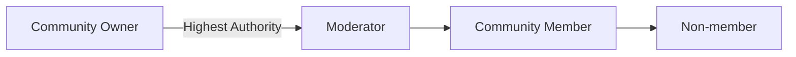
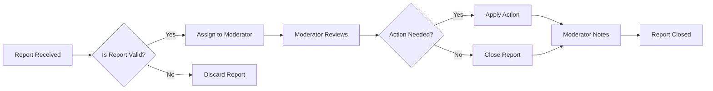

# Reddit-like Community Platform Requirements Specification

## 1. User Account

### Registration and Login Requirements

WHEN a user registers for the platform, THE system SHALL require a unique email address and password (minimum 8 characters with one uppercase, one lowercase, and one special character).

WHEN a user attempts to log in with valid credentials, THE system SHALL generate a secure JWT token stored in an HTTP-only cookie.

THE system SHALL prevent password reuse within the previous 5 password changes.

### Account Management Requirements

WHEN a user requests a password change, THE system SHALL send a time-limited password reset link via email.

WHEN a user deletes their account, THE system SHALL immediately:
- Remove all personal data
- Delete all associated posts and comments
- Revoke all session tokens
- Update all metadata to anonymize remaining references

## 2. User Profile

### Profile Management Requirements

WHEN a user updates their profile, THE system SHALL validate:
- Display name: 2-30 characters, alphanumeric with spaces
- Bio: 1-255 characters
- Avatar: 100x100px minimum, JPEG/PNG format

THE system SHALL update all references to the user's display name in comments, posts, and community feeds.

### Profile Display Requirements

WHEN visiting another user's profile page, THE system SHALL display:
- Current display name
- Bio text
- Avatar image
- Total karma score
- List of all posts created by the user
- List of all comments written by the user
- The number of posts/comments per list

## 3. Karma System

### Karma Calculation Requirements

WHEN a user receives an upvote on a post or comment, THE system SHALL increase their karma score by 1.

WHEN a user receives a downvote on a post or comment, THE system SHALL decrease their karma score by 1.

WHEN a user's vote is removed, THE system SHALL adjust the affected user's karma score accordingly.

### Karma Representation Requirements

THE system SHALL display karma as a single integer value with the following visual indicators:
- Positive values: Green text with upward arrow icon
- Negative values: Red text with downward arrow icon
- Zero value: Gray text

## 4. Communities

### Community Creation Requirements

WHEN a user creates a new community, THE system SHALL:
- Generate a unique community slug (alphanumeric, 3-15 characters)
- Assign the creator as community owner
- Store community icon as PNG (200x200px)
- Validate community name (2-30 characters, not reserved)

### Community Browser Requirements

WHEN browsing communities, THE system SHALL:
- Display communities in alphabetical order
- Include subscriber count for each community
- Allow search by community name
- Show community description
- Include a filter for 'Most Subscribed' communities

## 5. Subscribing

### Subscription Requirements

WHEN a user subscribes to a community, THE system SHALL:
- Add the user to the community's subscriber list
- Notify the community owner
- Update the user's profile with subscribed communities

WHEN a user unsubscribes from a community, THE system SHALL:
- Remove the user from the subscriber list
- Update the community's subscriber count
- Remove community from user's subscription list

### Subscription Impact Requirements

IF a user is not subscribed to a community, THEN THE system SHALL prevent them from creating posts in that community.

IF a community has limited subscriptions, THEN THE system SHALL require community owner approval for new subscriptions.

## 6. Posts

### Post Creation Requirements

WHEN a user creates a post, THE system SHALL require:
- Title (minimum 5, maximum 100 characters)
- Community (only for subscribed communities)
- Content:
  - Text post: Minimum 10 characters
  - Link post: Valid URL with http/https
  - Image post: PNG/JPG file under 10MB

### Post Display Requirements

WHEN viewing a single post, THE system SHALL display:
- Title
- Full content (text, URL, or image)
- Author (display name and avatar)
- Community name and icon
- Current vote score (calculated as upvotes - downvotes)
- Comment count
- Time since posted (format: 'X hours ago', 'Yesterday', 'X days ago')

## 7. Post Voting

### Voting Mechanics Requirements

WHEN a user votes on a post, THE system SHALL:
- Allow only one vote per post per user
- Update the post's vote score instantly
- Allow vote changes (up to down or vice versa)
- Allow vote removal

### Vote Score Calculation Requirements

THE system SHALL calculate vote score as:
- Upvotes minus downvotes
- Display as 'Score: {value}'
- Display 'No votes yet' when score is zero

## 8. Post Feeds

### Home Feed Requirements

THE home feed SHALL:
- Only show posts from subscribed communities
- Be available only to logged-in users
- Support sorting options: Hot, New, Top, Controversial
- Display in paginated lists with 25 posts per page

### Popular Feed Requirements

THE popular feed SHALL:
- Show posts from all communities
- Be available to all users (logged-in and logged-out)
- Support the same sorting options as Home Feed
- Include an 'All Communities' view button

### Community Feed Requirements

THE community feed SHALL:
- Show posts from a single specified community
- Be available to all users
- Include community-specific sorting options

### Sorting Requirements

| Sort Option | Description | Time Filter |
|-------------|-------------|-------------|
| Hot | Recent posts with high engagement | N/A |
| New | Most recent posts | N/A |
| Top | Highest vote score | Today, Week, Month, Year, All Time |
| Controversial | High vote count with score near zero | N/A |

### Feed Display Requirements

WHEN viewing a feed, each post shall display:
- Title
- Author username
- Community name
- Vote score
- Comment count
- Time since posted
- For text posts: First 200 characters of content
- For image posts: Image thumbnail
- For link posts: Domain of the URL (e.g., 'youtube.com')

## 9. Comments

### Comment Creation Requirements

WHEN a user creates a comment on a post, THE system SHALL:
- Allow minimum 1 character, maximum 500 characters
- Allow nested comments (unlimited depth)
- Prevent duplicate comments from same user on same post
- Validate comment content

### Comment Display Requirements

WHEN viewing post comments, EACH comment SHALL display:
- Author (display name and avatar)
- Comment content
- Vote score
- Time since posted
- Nested replies (if any)
- Options to reply, upvote, downvote

## 10. Comment Voting

### Comment Voting Mechanics

WHEN a user votes on a comment, THE system SHALL:
- Allow only one vote per comment per user
- Update comment vote score instantly
- Allow vote changes
- Allow vote removal

## 11. Comment Sorting

### Comment Sorting Requirements

POSTS SHALL SUPPORT THE FOLLOWING COMMENT SORTING OPTIONS:
- Best: Highest vote score first
- New: Most recent first
- Controversial: Many votes but score close to zero

## 12. Community Moderation

### Ownership and Hierarchy Requirements

WHEN a community is created, THE system SHALL automatically assign the creator as community owner.

THE system SHALL record the community owner's user ID as the primary owner.

THE community owner SHALL have all moderation permissions for the community.

WHEN the owner adds a moderator, THE system SHALL send a confirmation email to the new moderator.

### Moderation Actions Requirements

WHEN a moderator deletes a post, THE system SHALL:
- Remove all associated comments
- Update karma score of the post author
- Record the moderator's ID
- Notify the post author

WHEN a moderator deletes a comment, THE system SHALL:
- Update karma score of the comment author
- Record the moderator's ID
- Update comment count for parent post
- Preserve nested replies

## 13. Reporting

### Report Submission Requirements

WHEN a user reports content, THE system SHALL require:
- A valid reason (minimum 10 characters, maximum 500 characters)
- A reference to the reported content
- A timestamp of the report

### Report Moderation Requirements

WHEN a moderator reviews a report, THE system SHALL:
- Show all relevant details (reporter, content, reason)
- Allow approval (content deletion)
- Allow dismissal (keep content)
- Record moderator decision

WHEN a report is approved, THE system SHALL:
- Delete the reported content
- Update author's karma
- Notify the reporter
- Remove the report from active queue

WHEN a report is dismissed, THE system SHALL:
- Keep the content
- Record reason for dismissal
- Notify reporter of decision

## Appendices

### Mermaid Diagram: Community Ownership Hierarchy

### Mermaid Diagram: Content Moderation Workflow

