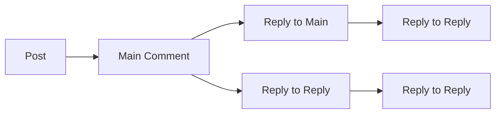

# Reddit-like Community Platform Requirements

## 1. User Account

### Registration and Authentication

WHEN a new user attempts to sign up with email and password, THE system SHALL:

1. Verify email is unique and properly formatted
2. Validate password meets complexity requirements (minimum 8 characters, one uppercase, one number)
3. Generate a unique, system-assigned username if none provided
4. Store encrypted password using bcrypt
5. Create account with status 'pending' until email verified

**Email Verification Flow:**

IF a user signs up, THEN THE system SHALL:

- Send verification email with unique token
- Allow account use after verification
- Invalidate tokens after 24 hours
- Delete unverified accounts after 7 days

### Password Management

WHEN a user requests to change their password, THE system SHALL:

1. Verify current password matches stored hash
2. Require new password meets complexity requirements
3. Log password change event for audit
4. Invalidate all active sessions immediately

**Error Handling:**

IF the current password is incorrect, THEN THE system SHALL:

- Block password change
- Display: "Current password is incorrect."

### Account Deletion

WHEN a user requests account deletion, THE system SHALL:

1. Confirm deletion with email verification
2. Delete all user content (posts, comments, karma)
3. Remove all user data from all systems
4. Prevent new sign-ups with the same email

**Business Rule:**

IF a user's account is deleted, THEN THE system SHALL:

- Purge all data within 72 hours per GDPR compliance
- Retain deletion logs for compliance reporting

## 2. User Profile

### Profile Structure

WHEN a user views a profile, THE system SHALL:

1. Display username as primary identifier
2. Show display name (customizeable)
3. Present bio text with character limit of 200
4. Show avatar image thumbnail (320x320)
5. Display total karma score with numeric value

**Karma Display Rule:**

IF a user has negative karma, THEN THE system SHALL:

- Show 'Negative Karma' badge
- Color code score in red text

### Profile Editing

WHEN a user edits their profile, THE system SHALL:

1. Allow modification of display name (max 30 chars)
2. Permit bio text changes (max 200 chars)
3. Support avatar image upload (PNG/JPEG, max 5MB)
4. Apply changes immediately with confirmation
5. Show editing history for moderation

**Error Handling:**

IF a user submits invalid avatar, THEN THE system SHALL:

- Reject upload
- Show message: "Only PNG/JPEG images under 5MB are allowed."

## 3. Karma System

### Karma Calculation

WHEN a vote is cast on a post or comment, THEN THE system SHALL:

1. Increase author's karma by 1 for upvote
2. Decrease author's karma by 1 for downvote
3. Adjust karma if vote is removed
4. Maintain historical karma records

**Karma Boundary Rule:**

WHERE karma is negative, THEN THE system SHALL:

- Allow negative values with no minimum limit
- Store all changes for audit trail

### Karma Display

WHEN viewing a profile, THE system SHALL:

1. Show total karma score as numeric value
2. Display 'Karma: [value]' label
3. Show historical trend (optional)
4. Format as integer (no decimals)

**Error Handling:**

IF karma exceeds 1000 for any user, THEN THE system SHALL:

- Store the value as is
- Display warning to admin in audit logs

## 4. Communities

### Community Creation

WHEN a user attempts to create a new community, THE system SHALL:

1. Verify community name is unique
2. Validate description meets minimum length (10 chars)
3. Accept community icon image (PNG/JPEG, max 1MB)
4. Assign the creator as community owner
5. Generate unique community ID

**Community Naming Rule:**

IF community name contains prohibited words, THEN THE system SHALL:

- Reject creation
- Display specific forbidden words

### Community Search

WHEN a user searches communities, THE system SHALL:

1. Allow searching by community name
2. Return exact matches first
3. Provide partial match results
4. Sort results by subscriber count (highest first)

**Business Rule:**

WHERE a community has no subscribers, THEN THE system SHALL:

- Display as 'New Community' in search results
- Show creation date in search listings

## 5. Subscriptions

### Community Subscription

WHEN a user subscribes to a community, THE system SHALL:

1. Add community to user's subscription list
2. Update community subscriber count
3. Grant permission to post in community
4. Send confirmation notification to user

**Subscription Rules:**

IF a user is already subscribed, THEN THE system SHALL:

- Prevent duplicate subscription
- Display: "You are already subscribed to this community."

### Unsubscription

WHEN a user unsubscribes from a community, THE system SHALL:

1. Remove community from subscription list
2. Decrease community subscriber count
3. Remove posting permissions
4. Send unsubscription confirmation

**Business Rule:**

WHERE a user unsubscribes from all communities, THEN THE system SHALL:

- Notify community owners (optional)
- Remove from subscription lists

## 6. Posts

### Post Creation

WHEN a user creates a post in a community, THE system SHALL:

1. Verify user is subscribed to the community
2. Validate title meets minimum length (5 chars)
3. Require one post type (text, link, image)
4. Store correct post type and content
5. Calculate creation timestamp

**Post Type Rules:**

IF a text post is submitted without content, THEN THE system SHALL:

- Reject post
- Display: "Text posts must contain content."

### Post Display

WHEN viewing a post, THE system SHALL:

1. Show title
2. Display appropriate content type
3. Show author username
4. Display community name
5. Show vote score (upvotes minus downvotes)
6. Show comment count
7. Show time since posted (e.g., '3 hours ago')

**Image Post Display:**

WHERE a post has an image, THEN THE system SHALL:

- Show thumbnail in feed
- Maintain aspect ratio
- Display with 'Image' label

## 7. Post Voting

### Vote Process

WHEN a user votes on a post, THE system SHALL:

1. Allow single upvote or downvote per post
2. Track user's vote for the specific post
3. Update vote score in real-time
4. Allow changing vote type if previous vote exists

**Vote Change Rule:**

IF a user changes vote from up to down, THEN THE system SHALL:

- Subtract 1 for downvote
- Add 1 for upvote
- Prevent immediate reversal without interaction

### Vote Display

WHEN viewing a post, THE system SHALL:

1. Show vote score with color-coding (green for positive, red for negative)
2. Display 'Upvoted' status for logged-in users
3. Allow voting controls only for authenticated users

**Business Rule:**

WHERE a vote is removed, THEN THE system SHALL:

- Adjust score instantly
- Notify author of voting change
- Keep adjustment history

## 8. Post Feeds

### Home Feed

WHEN a logged-in user views Home Feed, THE system SHALL:

1. Show only posts from subscribed communities
2. Default sort by 'Hot' (recent + high upvotes)
3. Paginate results in groups of 20
4. Display feed title: 'Your Communities'

**Sort Options:**

WHEN a user changes sort order on Home Feed, THE system SHALL:

- Update display immediately
- Save sort preference per user
- Apply to all new loadings

### Popular Feed

WHEN any user views Popular Feed, THE system SHALL:

1. Show posts from all communities
2. Default sort by 'Hot'
3. Allow all sort options (Hot, New, Top, Controversial)

**Business Rule:**

WHERE a user is not logged in, THEN THE system SHALL:

- Allow access to Popular Feed only
- Prevent access to Home Feed

## 9. Comments

### Comment Creation

WHEN a user creates a comment on a post, THE system SHALL:

1. Verify user can comment on the post
2. Validate comment content meets length requirements (10-500 chars)
3. Store comment content with timestamp
4. Calculate initial vote score (0)
5. Adjust post's comment count

### Comment Editing

WHEN a user edits their comment, THE system SHALL:

1. Allow edits within 24 hours of creation
2. Prevent edits after 24 hours
3. Record edit history
4. Show edited timestamp
5. Maintain original content for moderation

**Error Handling:**

IF a user tries to edit after 24 hours, THEN THE system SHALL:

- Show error message: "Comments cannot be edited after 24 hours."
- Disable edit button

## 10. Comment Voting

### Vote Process

WHEN a user votes on a comment, THE system SHALL:

1. Allow single vote (up/down) per comment
2. Track user's vote
3. Update score instantly
4. Allow vote changes

**Voting Rules:**

IF a comment earns 10+ votes, THEN THE system SHALL:

- Highlight 'Popular Comment' badge
- Increase visibility score

### Vote Display

WHEN viewing comments, THE system SHALL:

1. Show vote score next to comment
2. Indicate vote status for logged-in users
3. Allow voting controls only when eligible

**Business Rule:**

WHERE a comment has negative score, THEN THE system SHALL:

- Color code score in red
- Display as 'Controversial' when sorting

## 11. Community Moderation

### Moderator Roles

WHEN the community owner adds a moderator, THE system SHALL:

1. Create moderator role
2. Assign permissions
3. Notify new moderator
4. Store role assignment history

**Moderator Limit Rule:**

WHERE a community has more than 5 moderators, THEN THE system SHALL:

- Prevent additional moderators
- Display error: "Maximum of 5 moderators allowed."

### Moderator Actions

WHEN a moderator deletes a post, THE system SHALL:

1. Remove post from all views
2. Adjust author's karma
3. Show 'Post Removed by Moderator' message
4. Log moderation action

**Business Rule:**

IF a deleted post was edited, THEN THE system SHALL:

- Maintain edit history
- Preserve last edited timestamp
- Show 'Edited' next to original content

## 12. Reporting

### Reporting Process

WHEN a user reports content, THE system SHALL:

1. Require valid reason (minimum 10 chars)
2. Store reporter ID and reason
3. Notify community moderators
4. Show report status

**Reporting Constraint:**

IF reporter submits empty reason, THEN THE system SHALL:

- Reject report
- Show: "Reporting reason must be at least 10 characters."

### Report Resolution

WHEN a moderator resolves a report, THE system SHALL:

1. Update report status
2. Delete or keep content based on decision
3. Notify reporter
4. Log moderator decision

**Business Rule:**

WHERE a report is dismissed, THEN THE system SHALL:

- Remove it from moderator view
- Store dismissal reason
- Allow re-reporting after 24 hours

## System Constraints

- Max content length: 500 characters for comments, 1000 for posts
- All images: max 5MB, formats: PNG/JPEG
- Vote changes: maximum 5 per minute
- Profile bio: max 200 characters
- Community name: max 50 characters, no spaces
- All timestamps: UTC with ISO 8601 format
- Minimum password complexity: 8 characters, 1 uppercase, 1 number

## User Experience Requirements

- All pages must load within 1.5 seconds
- All actions must complete within 300ms
- Error messages must be descriptive and helpful
- Page loads must be progressively enhanced
- All interactions must follow accessibility standards

## Compliance Requirements

- EU GDPR for user data retention
- All content moderation logs must be auditable
- User data must be encrypted at rest
- Session tokens must expire after 24 hours
- All reports must be reviewed within 48 hours
