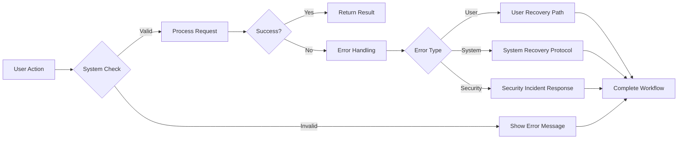

# Error Handling Requirements Specification

## 1. User Error Recovery

### Core Error Types and Recovery

**WHEN a user encounters an input validation error, THE system SHALL display specific error feedback next to the affected field instead of a generic error message.**

**WHEN a user submits a form with invalid email format, THE system SHALL:**
- Highlight the email field with red border
- Display error message 'Please enter a valid email in format username@domain.com'
- Prevent form submission until corrected

### Session and Authentication Errors

**WHEN a user session expires during an action, THE system SHALL:**
- Display notification 'Your session has expired. Please log in again.'
- Maintain current content state so user doesn't lose work
- Redirect to login page with automatic return upon successful login

**WHEN a user encounters a 402 Payment Required error, THE system SHALL:**
- Display clear message 'Access to this feature requires a paid subscription'
- Show link to current subscription plan options
- Preserve user's position in the application flow

## 2. System Failure Protocols

### Failure Classification System

The system SHALL categorize failures using these severity levels:

- **Critical**: System-wide outage affecting all users (e.g., database crash)
- **High**: Feature degradation affecting significant user segments (e.g., posting functionality fails)
- **Medium**: Limited functionality issues for individual users (e.g., image upload failure)
- **Low**: Cosmetic or minor issues (e.g., broken button icon)

### Automated Recovery Procedures

**WHEN a system failure is detected in the payment processing service, THE system SHALL:**
- Automatically switch to backup payment processor
- Log the failure and recovery sequence
- Send alert to operations team
- Display user notification 'Payment processing temporarily using backup service'

**WHEN a service restarts after a failure, THE system SHALL:**
- Reconnect all persistent sessions
- Requeue failed transactions
- Display notification 'Service restored successfully'
- Log recovery time metrics for post-mortem analysis

### Failure Impact Assessment

**WHEN a critical failure occurs, THE system SHALL:**
- Calculate affected user count in real-time
- Generate impact analysis report within 5 minutes
- Determine if user compensation is required
- Store impact metrics for future service-level agreement compliance

## 3. Security Incident Response

### Security Incident Definition and Classification

A security incident SHALL be defined as any event that violates security protocols.

**WHEN a security incident is detected, THE system SHALL categorize it using these levels:**
- **Critical**: Data breach or loss of personal information
- **High**: Unauthorized access attempt or potential breach
- **Medium**: Weak password detection or suspicious login attempt
- **Low**: Failed login attempts below threshold

### Response Workflow

**WHEN a critical security incident is detected, THE system SHALL:**
- Immediately isolate affected systems
- Lock affected user accounts
- Notify security team via SMS and email
- Generate incident ID and timeline

**WHEN a security incident is resolved, THE system SHALL:**
- Generate post-incident report including root cause analysis
- Notify affected users with specific details about the incident
- Offer identity protection services to affected users
- Implement additional security measures to prevent recurrence

## 4. Logging Standards

### Required Log Content

All system events SHALL be logged with these elements:
- Timestamp in UTC ISO 8601 format
- User ID for authenticated actions
- Event type and severity
- Affected resources or services
- Error code (if applicable)
- Session ID

### Log Retention Policies

**WHEN system logs are generated, THE system SHALL:**
- Store logs for 180 days by default
- Retain security-related logs for 3 years
- Encrypt all log content at rest
- Maintain logs separately from application data

### Log Analysis Protocols

**WHEN a pattern of errors is detected in logs, THE system SHALL:**
- Automatically generate error trend report
- Flag emerging issues for engineering review
- Correlate related errors
- Recommend potential fixes based on historical data

**WHEN security logs indicate suspicious activity, THE system SHALL:**
- Trigger real-time alert to security team
- Generate a security incident report
- Isolate affected user accounts
- Recommend account security audit

### Mermaid Diagram: Error Handling Workflow
