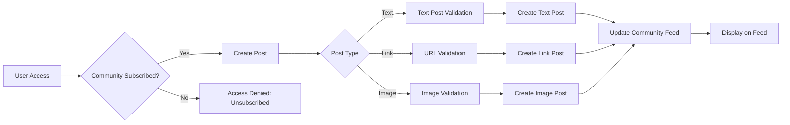

# Reddit-like Community Platform Requirements Specification

## User Account Management

### Core Account Requirements

THE system SHALL support complete account lifecycle management for all user actors including registration, authentication, password management, and account deletion with data integrity.

**Registration Process**:

- WHEN a guest attempts to register WITH valid email and password, THEN THE system SHALL validate email format (e.g., user@example.com) AND password strength (minimum 8 characters: uppercase, lowercase, number, special character), THEN create new account with status pending
- WHEN registration is successful, THEN THE system SHALL send welcome email WITH verification link
- WHEN verification link is clicked WITH valid token, THEN THE system SHALL activate account AND set status active
- IF email already registered, THEN THE system SHALL return HTTP 409 error WITH 'EMAIL_EXISTS' message

**Authentication Flow**:

- WHEN a member submits email and password, THEN THE system SHALL authenticate AND return JWT (access token: 15-min validity, refresh token: 7-day validity)
- WHEN authentication fails (invalid credentials), THEN THE system SHALL return HTTP 401 error WITH 'INVALID_CREDENTIALS' code
- WHEN password reset requested, THEN THE system SHALL generate reset token AND send email WITH 24-hour validity
- WHEN password reset token used WITH valid token, THEN THE system SHALL update password AND invalidate token

**Account Management**:

- WHEN a member requests password change WITH valid current password AND new password, THEN THE system SHALL update password AND revoke all active sessions
- WHEN a member requests account deletion, THEN THE system SHALL remove ALL user data (posts, comments, communities) AND send confirmation email WITH deletion timestamp
- IF password invalid for deletion request, THEN THE system SHALL return HTTP 403 error WITH 'PASSWORD_INCORRECT' message

## User Profile Features

### Profile Structure and Management

THE system SHALL provide comprehensive profile management WITH real-time updates AND version control.

**Profile Structure**:

- EVERY user SHALL have profile fields: display name (3-50 characters), bio (0-500 characters), avatar (image file)
- WHEN a member updates display name, THEN THE system SHALL validate character limits AND prevent name conflicts
- WHEN profile updated, THEN THE system SHALL save history AND update all user references within 1 second

**Profile Viewing**:

- WHEN any user views another user's profile, THEN THE system SHALL display: display name, bio, avatar, karma score, and profile statistics
- WHEN viewing profile WITH karma score ≤ 0, THEN THE system SHALL display '-karma' label
- WHEN profile is private (not owner), THEN THE system SHALL hide bio AND karma score

**Profile Editing**:

- WHEN a member edits profile, THEN THE system SHALL allow: display name change, bio update, avatar upload
- IF avatar format invalid (not .jpg/.png/.gif), THEN THE system SHALL return HTTP 415 error WITH 'INVALID_IMAGE_FORMAT' message
- WHEN bio exceeds 500 characters, THEN THE system SHALL truncate text AND notify user

## Karma System

### Karma Calculation and Display

THE system SHALL calculate and display total user karma THROUGH all public interactions WITH clear visibility.

**Karma Adjustment Rules**:

- WHEN a user upvotes post OR comment, THEN THE system SHALL increase author's karma by 1
- WHEN a user downvotes post OR comment, THEN THE system SHALL decrease author's karma by 1
- WHEN a user changes vote from upvote TO downvote, THEN THE system SHALL decrease author's karma by 2
- WHEN a user changes vote from downvote TO upvote, THEN THE system SHALL increase author's karma by 2
- WHEN a user removes vote, THEN THE system SHALL reverse karma change based on previous vote
- WHEN karma score negative, THEN system SHALL display negative value (e.g., '-2')
- EVERY public profile SHALL display total karma WITH 'Karma:' label

**Karma Validation**

- IF karma action invalid (no such post/comment), THEN system SHALL return HTTP 404 error WITH 'RESOURCE_NOT_FOUND' message
- IF voting attempted on deleted content, THEN system SHALL return HTTP 403 error WITH 'CONTENT_DELETED' message

## Community Management

### Community Creation and Browsing

THE system SHALL allow community management WITH clear ownership and subscription controls.

**Community Creation**:

- WHEN a member creates community, THEN system SHALL require: name (3-30 characters), description (0-500 characters), icon image
- WHEN community created, THEN system SHALL assign creator as owner AND set status active
- IF community name conflicts, THEN system SHALL return HTTP 409 error WITH 'NAME_TAKEN' message

**Community Browsing**:

- WHEN user browses communities, THEN system SHALL display: name, description, icon, subscriber count
- WHEN searching communities BY name, THEN system SHALL filter WITH matching substrings AND return within 200ms
- WHEN viewing community details, THEN system SHALL display: name, description, icon, subscriber count, creator

**Community Subscription**:

- WHEN member subscribes, THEN system SHALL add to subscribed communities list AND notify creator
- WHEN member unsubscribes, THEN system SHALL remove from list WITHOUT notification
- IF unsubscribed attempt WITHOUT authentication, THEN system SHALL return HTTP 401 error WITH 'NOT_AUTHENTICATED' message

## Post Creation & Management

### Post Creation Requirements

THE system SHALL support multi-type post creation WITH robust validation AND consistent presentation.

**Post Types**:

- WHEN creating text post, THEN system SHALL require title (1-150 characters) AND text content (1-2000 characters)
- WHEN creating link post, THEN system SHALL require title AND URL (https://example.com)
- WHEN creating image post, THEN system SHALL require title AND valid image file (max 10MB)
- IF invalid post type, THEN system SHALL return HTTP 400 error WITH 'INVALID_POST_TYPE' message

**Post Validation**:

- WHEN creating post, THEN system SHALL verify community subscription status
- IF subscription valid, THEN post SHALL be created AND associated WITH community
- IF subscription invalid, THEN system SHALL return HTTP 403 error WITH 'UNSUBSCRIBED' message

**Post Editing & Deletion**:

- WHEN member edits post, THEN system SHALL allow content modifications WITH history tracking
- IF edited WITHIN 15 minutes, THEN system SHALL display 'Edited' timestamp
- WHEN deleting post, THEN system SHALL remove ALL associated comments AND notifications

## Community Interaction Flow Diagram

