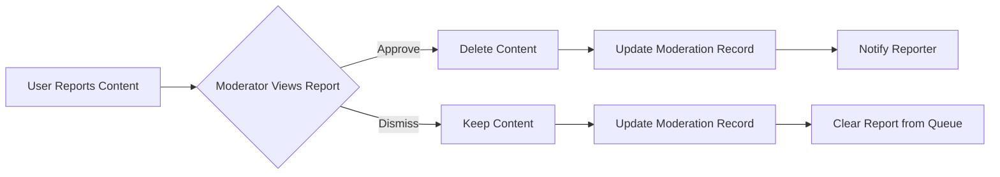

# Reddit-like Community Platform Requirements Specification

## User Account

WHEN a user signs up with email and password, THE system SHALL validate the email format and ensure password strength (minimum 12 characters with uppercase, lowercase, number, and special character).

THE SYSTEM SHALL enforce unique usernames and email addresses across all users.

WHEN a user logs in with valid credentials, THE system SHALL issue a JWT token valid for 24 hours with refresh token rotation.

THE system SHALL allow password change only when current password is verified.

WHEN a user deletes their account, THE system SHALL permanently delete all associated data including posts, comments, karma, and profile data while maintaining audit logs for 7 days for compliance purposes.

## User Profile

WHEN a user sets display name, THE system SHALL allow 2-30 character length with alphanumeric and space characters only, excluding special characters.

THE system SHALL allow bio text up to 500 characters of descriptive content with no HTML formatting.

WHEN a user uploads an avatar, THE system SHALL automatically resize to 200x200px and store as webp format.

A user's profile page SHALL display:
- Display name (in bold)
- Bio text (truncated after 200 characters with '...' if longer)
- Avatar (circular, 200px diameter)
- Total karma score (number with +/- sign)
- List of all posts (each with title, time ago)
- List of all comments (each with content snippet and time ago)

## Karma System

WHEN someone upvotes a post or comment, THE system SHALL increment the author's karma by 1.

WHEN someone downvotes a post or comment, THE system SHALL decrement the author's karma by 1.

WHEN a user removes their vote, THE system SHALL adjust the author's karma by the opposite amount of the previous vote.

Karma is calculated as: total_upvotes - total_downvotes.

THE system SHALL display negative karma as red text and positive karma as green text.

## Communities

WHEN a user creates a community, THE system SHALL:
- Validate unique name (alphanumeric with underscores, 3-24 characters)
- Require description text (min 10 characters)
- Accept community icon image (max 5MB, png/jpeg/webp)
- Grant community ownership to creator

COMMUNITY BROWSING:
- Display all communities in alphabetical order
- Show subscriber count for each community
- Filter by name search (case-insensitive, partial match)
- Limit search results to 50 communities

## Subscribing

WHEN a user subscribes to a community, THE system SHALL add to their subscriptions list and require subscription for posting.

THE system SHALL allow unsubscribing from any community at any time.

A user SHALL view their subscriptions list with community names, icons, and subscription date.

## Posts

WHEN creating a post, THE system SHALL:
- Require title (min 3 characters)
- Enforce one of three post types:
  - Text post: content (max 5,000 characters)
  - Link post: valid URL with domain extraction
  - Image post: uploaded image (max 5MB, png/jpeg/webp)
- Validate community subscription status

POST EDITING:
- Allow only post creator to edit
- Maintain previous content history (5 versions)

POST DELETION:
- Remove from all feeds
- Decrease post author's karma by 1 if upvoted
- Delete all associated comments

## Post Voting

WHEN a user votes on a post, THE system SHALL:
- Allow only one vote per user per post
- Prevent votes while the user is unsubscribed
- Update vote count immediately

USER VOTE ACTIONS:
- Upvote: increment score by 1
- Downvote: decrement score by 1
- Change vote: adjust score by net difference
- Remove vote: revert score to before vote

## Post Feeds

ALL FEEDS SHARE THESE PROPERTIES:
- Pagination (default 20 items per page)
- Sorting options: Hot, New, Top, Controversial
- Time display format: 'X hours ago', 'X days ago', 'Today'

HOT SORT:
- Weights recent votes: score * (1 + ln(time since creation))
- Shows posts with high engagement in recent 4 hours

TOP SORT:
- Allows time filters: Today, This Week, This Month, This Year, All Time
- Sorts by net score within selected time window

CONTROVERSIAL SORT:
- Sorts by absolute vote difference (upvotes - downvotes) where score is close to zero
- Shows posts with high engagement but low net score

## Post List Display

FOR TEXT POSTS:
- Title (bold)
- Author username
- Community name
- Vote score
- Comment count
- Time since posted
- First 200 characters of content

FOR IMAGE POSTS:
- Title (bold)
- Author username
- Community name
- Vote score
- Comment count
- Time since posted
- Thumbnail image (300px wide)

FOR LINK POSTS:
- Title (bold)
- Author username
- Community name
- Vote score
- Comment count
- Time since posted
- Domain name (e.g., 'youtube.com')

## Comments

WHEN a user writes a comment, THE system SHALL:
- Allow comments up to 1,000 characters
- Enable nested replies (unlimited depth)
- Validate target post exists and is in a subscribed community

COMMENTS ARE DISPLAYED AS:
- Author username
- Comment content
- Vote score
- Time since posted
- Nested replies (indentated, with thread identifier)

## Comment Voting and Sorting

COMMENT VOTING:
- Same rules as post voting (one vote per user per comment)
- Vote score = upvotes - downvotes

COMMENT SORTING OPTIONS:
- Best: highest vote score first
- New: most recent first
- Controversial: highest engagement with score near zero

## Community Moderation

COMMUNITY OWNERSHIP:
- Creator automatically becomes owner
- Owner cannot transfer ownership with active moderators
- Owner CAN delete community (with confirmation and warning about content deletion)

MODERATOR ROLES:
- Owner CAN add moderators
- Moderators CAN NOT remove owner
- Moderators CAN NOT remove other moderators
- Owner CAN remove moderators

MODERATOR ACTIONS:
- DELETE POST: Remove from all feeds, notify author, adjust karma
- DELETE COMMENT: Remove from all threads, notify comment author
- BAN USER: Prevent post/comment/voting within community
- UNBAN USER: Restore all permissions immediately

MODERATION WORKFLOW:
