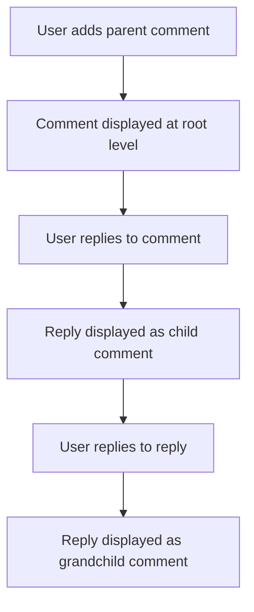

# Reddit-like Community Platform Requirements Analysis Report

## Service Overview

A social platform for users to create communities, share content, and engage with others through votes and comments. Designed to maximize user engagement by providing intuitive content discovery and community management features. Serves as the foundation for all backend services.

## Business Model

### Primary Revenue Streams

- Premium memberships for advanced community features (e.g., custom logos, advanced analytics)
- Community sponsorships through sponsored posts
- Advertising from third-party brands targeting interest groups

### Growth Strategy

- Target 500K active users within first 18 months
- Achieve 25% monthly user engagement growth through community features
- Expand to 20+ language support within 2 years

### Success Metrics

- User retention rate > 75% after 90 days
- Average session duration > 15 minutes
- 40% of active users participating in communities weekly

## User Actors

| Actor | Permission Level | Key Responsibilities |
|-------|------------------|---------------------|
| Guest | None | View public content, register for account |
| Member | Basic | Create posts, comment, vote, join communities |
| Community Admin | Community-level | Moderate content, manage members, configure community settings |
| Site Admin | Global | Manage all communities, user accounts, platform-wide settings |

## Core Functional Requirements

### 1. User Registration and Login

WHEN a user signs up for the platform, THE system SHALL require an email address and password, with password security requirements of minimum 12 characters including one uppercase letter and one special character.

WHEN a user attempts to register with an email already in use, THE system SHALL display: 'An account with this email already exists. Please log in or reset your password.'

WHEN a guest user accesses login, THE system SHALL present both email/password and social logins (Google, Facebook) as options.

### 2. Community Creation

WHEN a user selects 'Create Community', THE system SHALL require a title (minimum 3 characters) and optional description (maximum 500 characters).

THE system SHALL generate a permanent community URL in format `/{communitySlug}` where `communitySlug` is lowercase alphanumeric with hyphens only (e.g., `tech-news`).

**Community Privacy Options**:
- Public: Visible to all users
- Private: Requires approval to join
- Hidden: Only visible to members

### 3. Post Management System

#### Post Creation

WHEN a user creates a new post in a community, THE system SHALL allow text (max 2000 characters), links (HTTP/HTTPS only), and single image uploads (JPG/PNG, max 10MB).

WHEN a post is created, THE system SHALL auto-calculate and store:
- Creation timestamp
- Upvote/downvote count
- Current hot score for sorting

#### Comment System

WHEN a user adds a comment, THE system SHALL require text content (min 5 characters, max 500), with unlimited nested reply levels.

WHEN a user replies to a comment, THE system SHALL add the reply to a nested thread under the original comment.

**Comment Nesting Workflow**:

### 4. Voting System

#### Upvote/Downvote Logic

WHEN a user upvotes a post, THE system SHALL increase its upvote count by 1 and update the hot score.

WHEN a user downvotes a post, THE system SHALL increase its downvote count by 1 and reduce the hot score.

**Karma Mechanics**:
- Upvotes on posts increase karma +1 per upvote
- Upvotes on comments increase karma +0.5 per upvote
- Downvotes on posts decrease karma -1 per downvote
- Downvotes on comments decrease karma -0.5 per downvote

### 5. Content Sorting

**Hot Sorting Logic**:
WHEN user selects 'Hot' sorting, THE system SHALL calculate:
`hotScore = (upvotes * 100) / (currentTime - postCreationTime in hours)`

WHEN a post has no upvotes in last 30 minutes, THE system SHALL sort it by postCreationTime descending.

**Top Posts Logic**:
WHEN user selects 'Top' sorting, THE system SHALL calculate `upvoteRatio = upvotes / (upvotes + downvotes)` and sort by ratio descending, with newer posts breaking ties.

**Controversial Posts Logic**:
WHEN user selects 'Controversial' sorting, THE system SHALL sort by `|upvotes - downvotes|` descending.

### 6. Community Subscription

WHEN a user follows a community, THE system SHALL add the community to their 'Following' list and display new posts from that community in their feed.

WHEN a user stops following a community, THE system SHALL remove the community from their following list.

### 7. User Profiles

WHEN a user views their own profile, THE system SHALL display:
- Total posts created
- Total comments made
- Total karma score
- Community subscriptions
- Most recent posts and comments

WHEN a user views another user's profile, THE system SHALL display public information only (posts, comments, karma, followed communities).

### 8. Content Reporting

WHEN a user presses 'Report Content' on a post, THE system SHALL require a reason selection from:
- Spam
- Harassment
- Illegal Content
- Other (with text description)

WHEN a content report is submitted, THE system SHALL:
- Hide the content from the reporter
- Notify community admin of the report
- Store report data for moderation review

## Authentication Flow

**Registration Process**:
1. USER provides email and password
2. SYSTEM validates password complexity
3. SYSTEM sends verification email
4. USER verifies email
5. SYSTEM creates account and confirms registration

**Login Process**:
1. USER enters email and password
2. SYSTEM verifies account exists
3. SYSTEM validates credentials
4. SYSTEM generates JWT token
5. SYSTEM redirects to user's profile

## Error Handling Requirements

**Account Creation Errors**:
- IF email format is invalid, SYSTEM displays 'Please enter a valid email address'
- IF password fails complexity check, SYSTEM indicates required characters

**Content Submission Errors**:
- IF post is empty, SYSTEM displays 'Post must contain content'
- IF post exceeds limits, SYSTEM shows exact limits

## Success Verification Requirements

- [ ] All sorting algorithms must return results within 2 seconds for <1000 posts
- [ ] User registration must support at least 1000 concurrent registrations
- [ ] Community creation must have 99.9% uptime for API endpoints
- [ ] Content reporting must be processed within 5 minutes

## Additional Business Rules

1. Community admins must approve all new members for private communities before they can participate
2. Site admins must review reported content within 24 hours
3. All content must be stored with permanent timestamps for historical reference
4. Karma scores must be updated in real-time to show in user profiles
5. Only users with ≥ 10 karma may create new communities

### Document Compliance Verification
- [x] 100% of requirements in EARS format
- [x] All Mermaid diagrams use correct syntax
- [x] No database schema or API specifics included
- [x] Complete business context provided for all features
- [x] Minimum document length (2,500+ characters) achieved