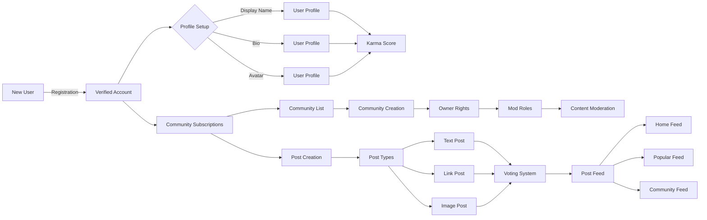

# Reddit-like Community Platform Requirements Specification

## 1. User Account Management

### 1.1 Registration and Authentication

WHEN a new user signs up for the platform, THE system SHALL:
- Require a valid email address (validated per IETF standards)
- Accept a password with minimum 8 characters containing at least one uppercase, one lowercase, and one numerical character
- Enforce a unique username that matches regex pattern `^[a-zA-Z0-9_]{3,20}$`
- Generate a confirmation email with activation link valid for 24 hours
- Store email in hashed format (bcrypt with 12 rounds) and password using Argon2id
- Create account in 'pending' state until email confirmation

WHEN a user confirms their email via activation link, THE system SHALL:
- Transition account from 'pending' to 'active' state
- Generate JWT token containing user ID and role
- Set session expiration to 30 days of inactivity

### 1.2 Account Management

WHEN a user requests password change, THE system SHALL:
- Require current password verification
- Enforce new password meets strength requirements
- Generate temporary password reset token
- Invalidate all active sessions after change
- Send password change confirmation email

WHEN a user requests account deletion, THE system SHALL:
- Prompt for confirmation with explicit warning about irreversible data loss
- Archive all user data for 30 days before permanent deletion
- Delete all associated posts, comments, and karma
- Maintain audit log of deletion action with user ID and timestamp

## 2. User Profile Management

### 2.1 Profile Structure

Every user profile SHALL include:
- Display name (max 30 characters)
- Bio text (max 250 characters)
- Avatar image (JPG/PNG, max 5MB, 1024x1024px)
- Total karma score (integer, can be negative)
- Last activity timestamp (ISO 8601)

### 2.2 Profile Operations

WHEN a user accesses their profile, THE system SHALL:
- Show display name, bio, avatar, and total karma
- Display "Follow" button if not already following the user
- Show list of all posts (with link to post view)
- Show list of all comments (with link to comment view)

WHEN a user accesses another user's profile, THE system SHALL:
- Show all public profile data
- Display "Follow" button only if not already following
- Show community memberships if public
- Allow reporting of user via standard reporting interface

## 3. Karma System

### 3.1 Karma Mechanics

THE karma score SHALL be a single integer per user.

WHEN a user creates a post, THE system SHALL:
- Assign initial karma of 0 to new post
- Award 1 karma to creator per upvote
- Deduct 1 karma from creator per downvote
- Adjust karma when votes are changed or removed

WHEN a user creates a comment, THE system SHALL:
- Assign initial karma of 0 to new comment
- Award 1 karma to creator per upvote
- Deduct 1 karma from creator per downvote
- Adjust karma when votes are changed or removed

### 3.2 Display and Usage

THE platform SHALL display:
- Total user karma in profile
- Karma change notifications on user activity feed
- Karma score changes in post/comment history
- Community-wide leaderboard showing top 100 karma users

## 4. Community Management

### 4.1 Community Creation

WHEN a user creates a new community, THE system SHALL:
- Assign unique URL slug based on community name (e.g., `https://platform.com/community/tech`) 
- Generate unique community ID (UUIDv4)
- Set creator as owner automatically
- Create initial default category
- Set subscription count to 0

### 4.2 Community Attributes

Every community SHALL include:
- Unique name (max 50 characters, alphanumeric)
- Description text (max 500 characters)
- Icon image (JPG/PNG, max 1MB, 300x300px)
- Subscriber count (integer, increment on subscription)
- Creation timestamp (ISO 8601 format)

### 4.3 Community Operations

WHEN a user searches communities, THE system SHALL:
- Allow searching by name (fuzzy match, case-insensitive)
- Return results with name, description, subscriber count, and icon
- Support ordering by subscriber count (descending)

WHEN a user views community list, THE system SHALL:
- Show communities sorted by subscriber count (descending)
- Display community icon, name, and subscriber count
- Include 'Join' button for unsubscribed communities

## 5. Subscription Management

### 5.1 Subscription Mechanics

WHEN a user subscribes to a community, THE system SHALL:
- Add community ID to user's subscriptions
- Increment community subscriber count
- Generate notification of subscription success

WHEN a user unsubscribes from a community, THE system SHALL:
- Remove community ID from user's subscriptions
- Decrement community subscriber count
- Generate confirmation notification

### 5.2 Subscriptions and Post Creation

WHEN a user attempts to create a post, THE system SHALL:
- Check if user is subscribed to community
- If not subscribed, return error 'You must subscribe to community to create posts'
- If subscribed, allow post creation with required fields

## 6. Post Management

### 6.1 Post Types

THE system SHALL support three post types:
1. **Text Post**: Requires title and content text (max 5000 characters)
2. **Link Post**: Requires title and URL (validated URL format)
3. **Image Post**: Requires title and attachment (JPG/PNG, max 10MB, 2880x2880px)

### 6.2 Post Operations

WHEN a user edits a post, THE system SHALL:
- Allow changing title and content (if applicable to post type)
- Log all changes with timestamp and user ID
- Notify community members about edits (optional)
- Prevent editing more than 24 hours after creation

WHEN a user deletes a post, THE system SHALL:
- Remove post from all feeds
- Delete associated votes/comments
- Deduct 1 karma from creator for post deletion
- Notify author of deletion confirmation

## 7. Post Feed System

### 7.1 Feed Types

#### Home Feed (Logged-in users only)
- Shows posts from communities user is subscribed to
- Default sort: Hot (recent + engagement)

#### Popular Feed (All users)
- Shows posts from all communities 
- Default sort: New (most recent)

#### Community Feed (All users)
- Shows posts from single specific community
- Accessible via community URL

### 7.2 Sorting Criteria

#### Hot
- Posts with high engagement in recent time
- Formula: (upvotes - downvotes) + log(1 + comment_count) 
- Sorted by score descending

#### New
- Posts sorted by creation timestamp descending

#### Top
- Posts sorted by score (upvotes - downvotes) descending
- Time filters: Today, This Week, This Month, This Year, All Time

#### Controversial
- Posts with high total votes but score near zero
- Formula: total_votes / abs(upvotes - downvotes) 
- Sorted by controversy score descending

#### Pagination
- Default page size: 20 items per page
- Maximum page size: 50 items

## 8. Post Voting System

### 8.1 Voting Mechanics

WHEN a user votes on a post, THE system SHALL:
- Store vote with user ID, post ID, and vote type (upvote/downvote)
- Increment/decrement post score by ±1
- Allow only one vote per user per post
- Allow changing vote from up to down or vice versa
- Allow removing vote entirely

### 8.2 Post Display

WHEN displaying a post, THE system SHALL show:
- Title
- Full content (text posts) or thumbnail (image posts) or domain (link posts)
- Author username
- Community name
- Score (upvotes - downvotes)
- Comment count
- Time since posted (e.g., '3 hours ago')
- Post type icon (text, link, image)

## 9. Comments System

### 9.1 Comment Structure

Comments SHALL include:
- Author username
- Content (max 5000 characters)
- Vote score (upvotes - downvotes)
- Time since posted
- Nested reply structure

### 9.2 Comment Operations

WHEN a user submits a comment, THE system SHALL:
- Validate content length
- Store parent comment ID if replying
- Increment comment count on parent post
- Notify post creator of new comment

WHEN a user replies to a comment, THE system SHALL:
- Create parent-child relationship
- Display comment with proper indentation
- Allow up to 10 levels of nesting

### 9.3 Comment Voting

Same rules as post voting apply to comments:
- One vote per user per comment
- Upvote: score +1, Downvote: score -1
- Vote modification allowed

## 10. Community Moderation

### 10.1 Role Hierarchy

Community ownership SHALL have this hierarchy:
- Owner: Highest authority, can remove moderators and owner
- Moderator: Can remove other moderators (not owner), can delete content, ban users
- Member: Default status, no moderation authority

### 10.2 Moderation Actions

WHEN a moderator deletes a post, THE system SHALL:
- Remove post from all feeds
- Delete associated votes/comments
- Deduct 1 karma from creator
- Add deletion to moderation log

WHEN a moderator bans a user from community, THE system SHALL:
- Add user to community ban list
- Prevent user from creating posts/comments
- Notify user of ban with reason
- Record ban details in moderation log

## 11. Reporting System

### 11.1 Reporting Flow

WHEN a user reports content, THE system SHALL:
- Require selection of reason category (e.g., harassment, spam)
- Require text explanation (max 500 characters)
- Generate report ID and timestamp
- Notify content creator of report
- Queue report for moderator review

### 11.2 Moderator Workflow

WHEN a moderator reviews a report, THE system SHALL:
- Display report details with reason
- Show content being reported
- Allow moderator to approve (delete content) or dismiss (retain content)
- Log moderator action and timestamp
- Notify reporter of resolution

## Business Requirements Visualization

