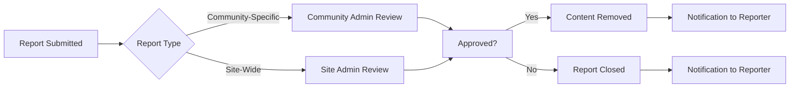

# Reddit-like Community Platform Requirements

## 1. Service Vision and Purpose
The platform enables users to create communities (subreddits) where they can share content through posts and comments, interact through upvoting/downvoting, and engage with others using a community-driven discovery experience. The service focuses on preserving natural user interactions while maintaining content integrity through automated moderation.

## 2. Core Functional Requirements

### 2.1 User Account Management

#### User Registration

WHEN a new user visits the platform for the first time, THE system SHALL present the registration interface with fields for:
- Email address
- Password (with validation: 8+ characters, 1 digit, 1 special character)
- Username (alphanumeric, 3-20 characters)

WHEN the user submits a valid registration form, THE system SHALL create the user account with default privacy settings and send a verification email.

#### User Login

WHEN a user provides valid credentials, THE system SHALL authenticate them and establish a session with the following requirements:
- Session cookie stored with HttpOnly, Secure, and SameSite=Lax attributes
- Session expires after 30 days of inactivity
- Option to enable "Remember Me" for desktop devices

#### Password Recovery

WHEN a user requests password recovery, THE system SHALL:
- Send password reset email with token valid for 24 hours
- Require token validation before allowing password change
- Update tokens immediately after password change

### 2.2 Community Management

#### Community Creation

WHEN a user clicks "Create Community", THE system SHALL allow them to choose:
- Community name (alphanumeric, 3-25 characters)
- Community description (max 300 characters)
- Initial community visibility (public or private)

WHEN a community is created, THE system SHALL:
- Generate unique URL path (community-name)
- Automatically subscribe creator as admin
- Create default moderation team with creator as admin

#### Community Subscription

WHEN a user clicks "Follow Community", THE system SHALL add community to their subscriptions with immediate visual confirmation.

WHEN a user unsubscribes from a community, THE system SHALL remove the community from their feed without affecting their historical content visibility.

### 2.3 Content Creation and Management

#### Post Creation

WHEN a user selects a community and clicks "Create Post", THE system SHALL provide form with:
- Title (max 100 characters)
- Text body (max 5,000 characters)
- Optional media upload (image/video link, max 10MB)

WHEN a post is submitted, THE system SHALL display immediate confirmation with link to post.

#### Comment System

WHEN a user comments on a post, THE system SHALL allow nested replies up to 5 levels deep.

WHEN a user replies to a comment, THE system SHALL:
- Circularly display nested comment structure
- Show parent comment in context
- Provide option to reply to specific comment thread

### 2.4 Interaction Mechanics

#### Upvote/Downvote

WHEN a user clicks the upvote button on a post, THE system SHALL:
- Increment post's upvotes by 1
- Record the user's vote action
- Update the post's score according to algorithm

WHEN a user clicks the downvote button, THE system SHALL:
- Increment post's downvotes by 1
- Record the user's vote
- Prevent double voting (max one vote per content item per user)

#### Karma System

WHEN a user receives an upvote on a post or comment, THE system SHALL:
- Increase user's karma by 5 points for posts
- Increase user's karma by 2 points for comments
- Apply cooldown period of 24 hours after vote

WHEN a user receives a downvote, THE system SHALL reduce their karma by 1 point.

### 2.5 Sorting and Filtering

#### Hot Sorting

WHEN a user selects "Hot", THE system SHALL display posts in order of:
- Current score = (upvotes - downvotes) × √timeSinceCreationInHours
- Posts posted within last 24 hours receive 10% boost

#### New Post Sorting

WHEN a user selects "New", THE system SHALL display posts by time of submission, newest first.

#### Top Posts

WHEN a user selects "Top", THE system SHALL display posts ordered by score, from highest to lowest.

#### Controversial Posts

WHEN a user selects "Controversial", THE system SHALL display posts with:
- Score between 1 and 5
- Balanced upvote/downvote ratio (ratio between 1.5 and 2.5)
- Minimal comments indicating debate

### 2.6 Reporting System

WHEN a user reports content, THE system SHALL require:
- Selecting from report categories
- Optional comment up to 500 characters
- Confirmation before submission

WHEN content is reported, THE system SHALL:
- Prevent user from reporting same content within 24 hours
- Notify content creator of the report
- Log report details with timestamp and user IDs

## 3. Business Process Specifications

### 3.1 User Onboarding Flow

When a new user signs up:
1. The system validates email and password strength
2. The user receives confirmation email
3. User is guided through community subscription
4. User receives welcome message with platform features

### 3.2 Community Creation Flow

When a user creates a new community:
1. User selects community name and description
2. Platform validates name against existing communities
3. Community is created with default privacy settings
4. User gains community admin privileges

### 3.3 Content Reporting Flow

When a user reports inappropriate content:
1. User selects appropriate report category
2. User adds optional comments for context
3. System records report with timestamp
4. System notifies content author
5. Report enters moderation queue for review

## 4. Key Business Rules

- RESOLVED: Upvotes increase karma (5 points), downvotes reduce karma (1 point)
- RESOLVED: All content is visible to applicable audience based on community privacy settings
- RESOLVED: Comments support unlimited nested reply levels (up to 5, with visual distinction)
- RESOLVED: Popular content is determined algorithmically based on engagement patterns
- RESOLVED: All user actions are logged for activity tracking and security monitoring

## 5. Related Requirements

For detailed authentication implementation: [07-authentication-flow.md]

For deeper community management specifications: [06-community-management.md]

For complete user profile specifications: [08-user-profiles.md]