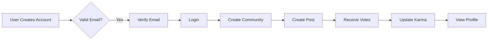

# Reddit Community Platform Requirements Specification

## 1. Service Overview

### Business Purpose
Our platform provides a dedicated space for users to connect around specific interests through organized community discussions, focusing on meaningful engagement over vanity metrics. The platform empowers both users and community owners with transparent reputation systems and flexible moderation tools.

WHEN a user searches for communities by interest, THE system SHALL deliver personalized community recommendations based on active engagement patterns.

### Market Differentiation
Unlike broad social platforms, our system prioritizes:
- **Focused Communities**: Each community centers around a specific interest thread
- **Transparent Karma**: Users receive direct feedback through reputation points
- **Community Empowerment**: Owners control moderation and content policies
- **User-Centric Feeds**: Three distinct feeds (Home, Popular, Community) support varied engagement modes

### Success Metrics
| Metric | Target (Year 1) | Target (Year 2) |
|--------|-----------------|-----------------|
| MAU | 50,000 | 250,000 |
| Community Creation Rate | 500/month | 2,500/month |
| Avg. Community Activity | 10 posts/week | 20 posts/week |

## 2. User Actors Specification

### Authentication Framework
- **Guest**: Unauthenticated users may view content but cannot create accounts or interact
- **Member**: Authenticated users with full platform access (all features)

WHEN a user attempts to access member features as a guest, THE system SHALL redirect to login page.

### Permission Matrix
| Action | Guest | Member |
|--------|-------|--------|
| Create Post | ❌ | ✅ (Requires subscription) |
| Edit Own Content | ❌ | ✅ |
| Delete Content | ❌ | ✅ (Author only) |
| Report Content | ❌ | ✅ |

### Session Security
- Session expiration: 20 minutes
- Refresh token: 30 days
- Inactivity timeout: 15 minutes

## 3. User Profile System

### Core Components
- **Display Name**: 2-30 characters, alphanumeric + spaces
- **Bio**: 1-500 characters, plain text
- **Avatar**: JPG/PNG ≤5MB
- **Karma**: Integer, updates with vote events

WHEN a user changes their display name, THE system SHALL verify uniqueness across all users.

### Profile Display
WHEN viewing any user profile, THE system SHALL show:
- Display name
- Bio text
- Karma score
- 20 most recent posts
- 20 most recent comments

### Data Handling
WHEN a user deletes their account, THE system SHALL delete:
- All posts, comments, and associated content
- Profile data (display name, bio, avatar)
- Karma history

## 4. Karma System

### Calculation Logic
```
Karma = Total Upvotes - Total Downvotes
```

### EARS Requirements
- WHEN a user receives an upvote, THEN karma += 1
- WHEN a user receives a downvote, THEN karma -= 1
- WHEN a vote is removed, THEN karma adjusts to previous state
- WHILE karma < -10, THEN show warning "This user's content may not be visible to all Community members."

### Display Standards
ALL karma scores SHALL be displayed as plain integers without formatting (e.g., "15" not "Karma: 15").

## 5. Community System

### Creation Process
WHEN a member creates a new community, THE system SHALL:
1. Validate unique name (3-25 chars, [a-z0-9_-])
2. Assign creator as owner
3. Generate unique ID (comm-[uuid])
4. Set default icon

### Subscription System
WHEN a user subscribes to a community, THE system SHALL:
- Add to subscription list
- Increment community subscriber count
- Allow post creation in that community

## 6. Post Management

### Post Types
| Type | Required Fields | Validation |
|------|-----------------|------------|
| Text | Title, Content (10k chars) | Plain text |
| Link | Title, URL (http/https) | Valid URL format |
| Image | Title, Image (≤4096px) | JPG/PNG, ≤5MB |

WHEN a user creates a new post, THE system SHALL verify subscription status for the target community.

### Post Display Rules
- **Text Posts**: Show first 200 characters + "..." in feeds
- **Link Posts**: Show domain name (e.g., "youtube.com")
- **Image Posts**: Show thumbnail

## 7. Voting System

### Post & Comment Voting
- ONE vote per user per item
- Upvote (+1 karma), Downvote (-1 karma)
- Vote replacement: Net karma adjustment reflects

### Sorting Mechanisms
| Sort | Criteria | EARS Implementation |
|------|----------|---------------------|
| Hot | (Votes * TimeFactor) | TimeFactor = 1/(HoursSincePost + 1) |
| New | Most recent first | Order by creation timestamp |
| Top | Highest vote score | Filter by time period (today, week, etc.) |
| Controversial | Votes near zero | Prioritize high vote counts close to 0 |

## 8. Moderation Framework

### Roles Hierarchy
- **Owner**: Highest authority, can manage all moderator permissions
- **Moderator**: Can add/remove other moderators (except owner)

WHEN an owner adds a moderator, THE system SHALL send notification to user.

### Moderation Actions
WHEN a moderator approves a report, THE system SHALL:
1. Delete reported content
2. Notify reporter
3. Log action details

### Ban Management
WHEN a user is banned from a community, THE system SHALL:
- Prevent new posts/comments
- Keep content visible to others
- Show "banned" status when attempting to post

## 9. Reporting System

### User Reporting
WHEN a user reports content, THE system SHALL:
1. Require 20-500 character reason
2. Limit to 3 reports within 5 minutes
3. Associate with specific content/communities

### Moderator Processing
WHEN a moderator reviews a report, THE system SHALL:
- Show reporter, content, reason
- Offer approval/dismiss options
- Update status and notify reporter

## 10. Business Rules Summary

| Rule Category | Rule | EARS Implementation |
|---------------|------|---------------------|
| Authentication | User must validate email | WHEN registration, THEN verify email |
| Community | Subscriptions required for posts | WHEN creating post, THEN verify subscription |
| Karma | Negative karma handled specially | WHILE karma < -10, THEN show warning |
| Moderation | Owner controls all moderator roles | WHEN adding moderator, THEN owner approval required |
| Reports | All reports require reasons | WHEN submitting report, THEN require 20+ chars |

## 11. Error Handling Requirements

- **Unauthorized Access**: WHEN guest attempts member feature, THEN redirect to login
- **Validation Errors**: WHEN invalid content, THEN show specific error message
- **Rate Limits**: WHEN exceeded, THEN show "Too many requests" message
- **Data Integrity**: WHEN corrupted profile, THEN show "Profile data unavailable"

## 12. Visual Workflow References



> *This document defines business requirements only. All technical implementations (architecture, APIs, database design, etc.) are the responsibility of the development team.*