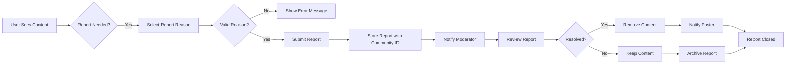

# Reporting Requirements Specification

## Reporting Process

### Core Reporting Workflow

WHEN a user identifies inappropriate content, THE system SHALL allow the user to initiate a report by selecting the 'Report' option on any post or comment.

WHEN a user submits a report, THE system SHALL require the user to provide a reason in text format with a minimum of 20 characters and maximum of 500 characters.

WHERE a report is submitted for a post, THE system SHALL associate the report with the specific post ID and community ID.

WHERE a report is submitted for a comment, THE system SHALL associate the report with the specific comment ID, post ID, and community ID.

WHEN a user attempts to report content they own, THE system SHALL deny the report attempt and show a user-friendly error message.

### Report Constraints

IF a user submits a report with an empty reason field, THEN THE system SHALL display an error requiring a non-empty reason.

IF a user submits more than 3 reports within 5 minutes, THEN THE system SHALL temporarily block additional reports for 10 minutes and display a warning message.

WHERE a user has been reported 5 times within 24 hours, THE system SHALL allow additional reports but require re-verification via email.

## Report Review Process

### Moderator Reporting Dashboard

WHEN a community moderator views the reporting dashboard, THE system SHALL display all open reports for their community in a paginated list.

THE system SHALL show for each report:
- The reported post or comment content
- The reporter's username
- The reason provided
- The timestamp of the report
- The status (Pending, Reviewed, Resolved)

WHEN a moderator clicks on a report, THE system SHALL display the full context of the reported content with the ability to view the entire post or comment thread.

### Report Sorting and Filtering

WHEN a moderator filters reports, THE system SHALL allow sorting by:
- Status (All, Pending, Reviewed, Resolved)
- Report timestamp (Newest first, Oldest first)
- Content type (Posts, Comments)

WHEN a moderator applies filters, THE system SHALL update the report list immediately with the filtered results.

### Moderation Permissions

WHERE a moderator is assigned to a community, THE system SHALL limit report visibility to only reports for that community.

IF a moderator attempts to view reports outside their assigned community, THEN THE system SHALL deny access and show a permission error.

## Report Resolution

### Resolution Workflow

WHEN a moderator views a report, THE system SHALL provide two resolution actions:
- **Approve** (delete the reported content)
- **Dismiss** (keep the content)

WHEN a moderator selects "Approve", THE system SHALL delete the reported post or comment.

WHEN a moderator selects "Dismiss", THE system SHALL update the report status to "Dismissed" without modifying the content.

### Resolution Consequences

IF a moderator approves a report, THEN THE system SHALL automatically remove the reported content and notify the reporter.

WHEN a report is approved, THE system SHALL log the moderator's action including timestamp and reason for removal.

IF a moderator dismisses a report, THEN THE system SHALL remove the report from the active view and move it to the "Dismissed Reports" archive.

### Resolution Feedback

WHEN a moderator submits a resolution, THE system SHALL display a confirmation message indicating the action taken.

WHEN a report is dismissed, THE system SHALL prompt the moderator to provide a reason for dismissing the report, requiring at least 10 characters.

## Report Constraints

### Content Review Requirements

THE system SHALL not process reports for content that has already been removed.

IF a reported post has been deleted prior to moderation, THEN THE system SHALL automatically close the report with status "Content Removed".

### User Notification Requirements

WHEN a report is approved, THE system SHALL send a notification to the reporter stating: "Your report has been reviewed. The content has been removed."

WHEN a report is dismissed, THE system SHALL send a notification to the reporter stating: "Your report has been reviewed. The content was not removed."

### Reporting Retention Policy

REPORTS SHALL be retained for 90 days before being automatically archived to a read-only historical database.

REPORTS FOR CONTENT THAT HAS BEEN REMOVED SHALL be retained for 365 days before being archived.

## Business Process Diagram

# Key Business Rules Summary

- All reports require a user-submitted reason text with minimum 20 characters
- Reports are stored with community context and metadata
- Moderators can only process reports for their assigned communities
- Approval results in content removal with user notification
- Dismissal results in report archiving with user notification
- System prevents duplicate reporting of the same content
- Strict rate limiting prevents report spamming
- Reports are retained for 90-365 days based on resolution