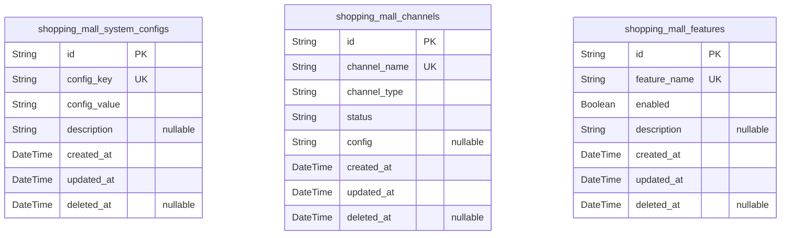
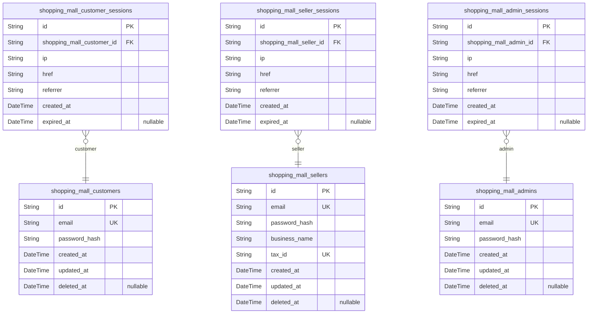
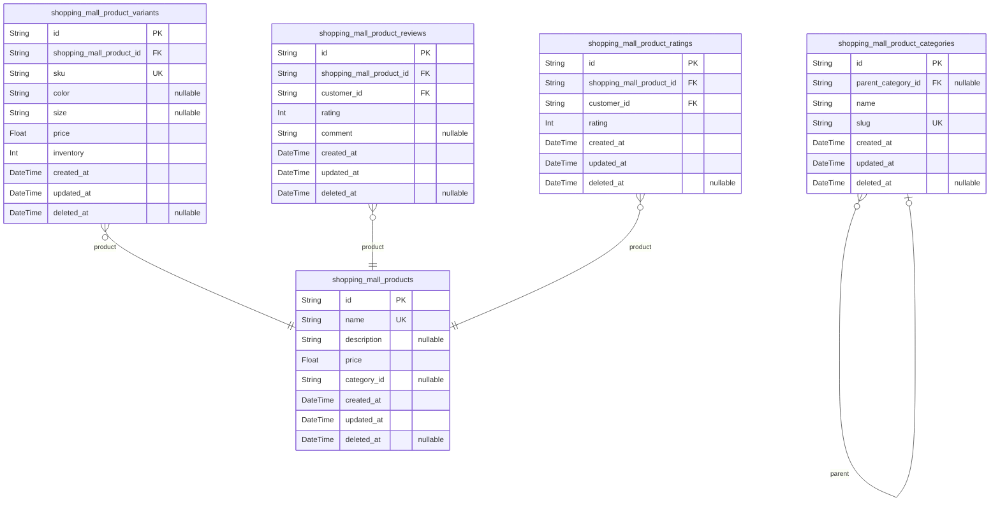
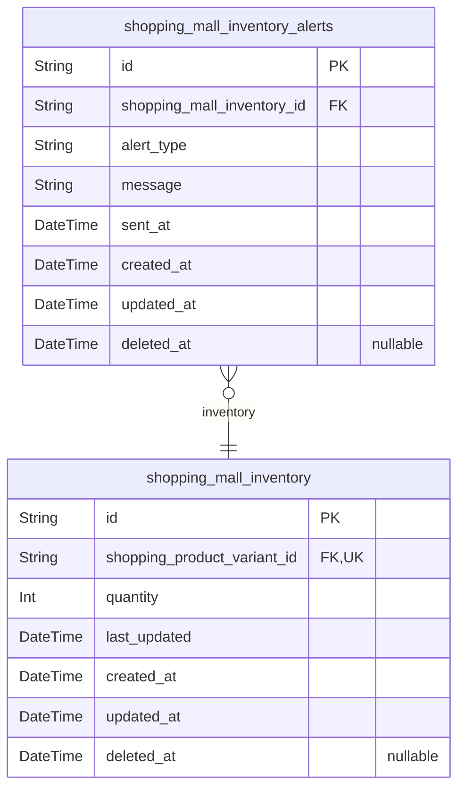
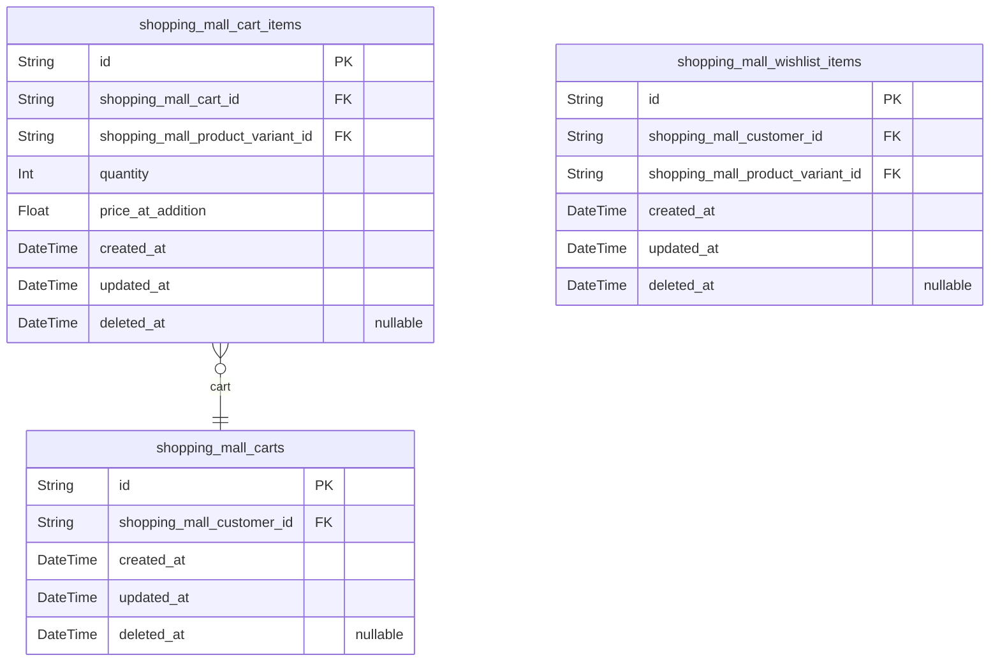
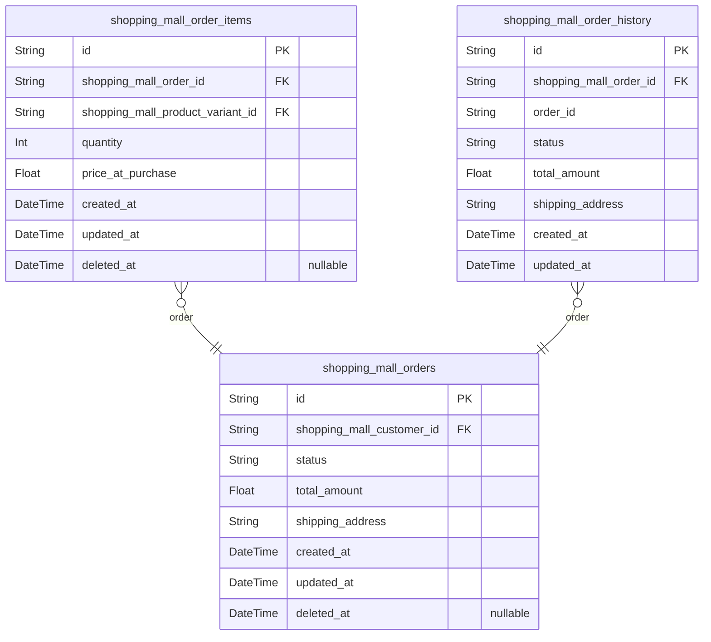
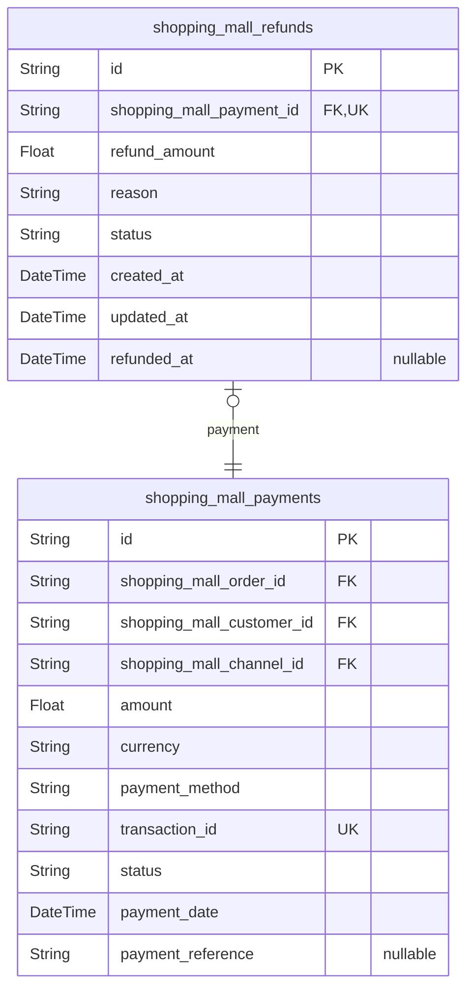

# Prisma Markdown

> Generated by [`prisma-markdown`](https://github.com/samchon/prisma-markdown)

- [Systematic](#systematic)
- [Actors](#actors)
- [Products](#products)
- [Inventory](#inventory)
- [Carts](#carts)
- [Orders](#orders)
- [Payments](#payments)

## Systematic

### `shopping_mall_system_configs`

System configuration parameters for the e-commerce platform. Stores
application-wide settings such as max cart items, payment thresholds, and
system behavior rules.

Configuration keys follow a consistent naming pattern (e.g.,
max_cart_items, min_order_value) to ensure logical grouping. Each
configuration has a human-readable description for management clarity.

The configuration system supports both string values (for simple
settings) and JSON strings (for complex structured data). This allows
flexibility while maintaining database integrity through unique
configuration keys.

Properties as follows:

- `id`: Primary Key.
- `config_key`
  > Unique configuration identifier (e.g., max_cart_items,
  > payment_min_amount).
- `config_value`: Configuration value as string (can contain JSON for complex structures).
- `description`
  > Human-readable explanation of the configuration purpose and acceptable
  > values.
- `created_at`: Timestamp when the configuration was created.
- `updated_at`: Timestamp when the configuration was last updated.
- `deleted_at`: Timestamp when the configuration was soft deleted (if applicable).

### `shopping_mall_channels`

System channels for payment, shipping, and other integration services.
Defines available channels and their operational status for the
e-commerce platform.

Channel types include payment gateways, shipping carriers, email
services, and notification channels. Each channel entry contains a name,
type, status, and optional configuration parameters.

The channel management system powers the entire payment and shipping
flow, ensuring users see only supported options and administrators can
easily enable/disable integrations.

Properties as follows:

- `id`: Primary Key.
- `channel_name`: Unique identifier for the channel (e.g., stripe, fedex, gmail).
- `channel_type`: Type of channel (e.g., payment, shipping, email, notification).
- `status`: Current operational status (active, inactive, maintenance).
- `config`: JSON string containing channel-specific configuration parameters.
- `created_at`: Timestamp when the channel configuration was created.
- `updated_at`: Timestamp when the channel configuration was last updated.
- `deleted_at`: Timestamp when the channel was soft deleted (if applicable).

### `shopping_mall_features`

Features enabled or disabled for the platform, such as wishlist
functionality, product reviews, and inventory tracking. Defines which
platform functionality is available to users.

Each feature has a name that follows a consistent pattern to enable easy
identification. Features are controlled via the enabled flag and can be
toggled on/off through the admin interface without code changes.

The feature system allows for gradual rollouts and A/B testing of new
platform capabilities while maintaining a clean separation between core
platform functionality and optional features.

Properties as follows:

- `id`: Primary Key.
- `feature_name`: Name of the feature (e.g., wishlist, product_reviews, inventory_tracking).
- `enabled`
  > Indicates whether the feature is currently enabled for the platform (true
  > or false).
- `description`: Detailed explanation of the feature's purpose and business value.
- `created_at`: Timestamp when the feature configuration was created.
- `updated_at`: Timestamp when the feature configuration was last updated.
- `deleted_at`: Timestamp when the feature was soft deleted (if applicable).

## Actors

### `shopping_mall_customers`

Customer account records for user authentication and profile management.

Stores registration details for authenticated platform users with
business email verification requirements. Each customer account requires
a unique email and secure password hash for login functionality, with
timestamps tracking account activity.

The system enforces email confirmation before account activation,
ensuring valid contact information for communication and security
purposes. Customer accounts are independent entities requiring full CRUD
operations through user interfaces, including password management and
profile updates.

Properties as follows:

- `id`: Primary Key.
- `email`
  > Customer's verified business email address used for login and
  > communication. Must be unique and match business domain format, not
  > personal email services.
- `password_hash`
  > Securely hashed user password using bcrypt with 12 rounds, stored for
  > authentication. Never stored as plain text.
- `created_at`
  > Account creation timestamp indicating when the customer account was
  > registered.
- `updated_at`: Last modification timestamp tracking changes to customer profile details.
- `deleted_at`
  > Deletion timestamp for soft deletes, enabling audit trails while
  > maintaining content history.

### `shopping_mall_sellers`

Seller business account records for platform management and marketplace
access.

Stores verified business information for merchants using the e-commerce
platform. Seller accounts require business license verification and
include authentication credentials for secure access to seller dashboard
features.

The system maintains separate business verification workflows to ensure
seller compliance with platform policies. Seller accounts function as
primary entities requiring independent registration, profile management,
and authentication operations.

Properties as follows:

- `id`: Primary Key.
- `email`
  > Seller's business email address for platform communication and
  > verification. Must match business domain format.
- `password_hash`
  > Securely hashed seller password using bcrypt with 12 rounds, stored for
  > authentication security.
- `business_name`: Official business name registered with platform verification system.
- `tax_id`: Business tax ID or registration number required for verification.
- `created_at`: Seller account creation timestamp showing when business was registered.
- `updated_at`
  > Last modification timestamp tracking updates to seller business
  > information.
- `deleted_at`
  > Deletion timestamp for soft deletion of seller accounts during
  > verification process.

### `shopping_mall_admins`

Platform administrator account management enabling system oversight and
configuration.

Administrative accounts provide privileged access to platform controls,
analytics, and user management. Each administrator must authenticate with
secure credentials to access sensitive administrative functions.

The system enforces strict access control policies and audit trails for
all administrative actions. Admin accounts serve as primary entities
requiring independent management through dedicated administrative
interfaces.

Properties as follows:

- `id`: Primary Key.
- `email`
  > Administrator's business email address for authentication and system
  > notifications.
- `password_hash`: Securely hashed administrator password for system access control.
- `created_at`: Account creation timestamp for administrative account.
- `updated_at`: Last modification timestamp for administrative account settings.
- `deleted_at`: Deletion timestamp for administrative account soft deletion.

### `shopping_mall_customer_sessions`

Session records for authenticated customer accounts with connection
context tracking.

Maintains session details for customer login sessions including IP
address, connection URL, and referrer information for security and
auditing. Each session has a creation timestamp with optional expiration
for access management.

Sessions are managed exclusively through the parent customer account with
no independent API endpoints required. The subsidiary stance
classification ensures session management follows related entity
operations.

Properties as follows:

- `id`: Primary Key.
- `shopping_mall_customer_id`: Customer who created this session. [shopping_mall_customers.id](#shopping_mall_customers).
- `ip`
  > Client IP address recorded during session initiation for security
  > monitoring.
- `href`: Connection URL that initiated the session for tracking user journey.
- `referrer`: Previous page URL that led to session initiation for analytics context.
- `created_at`: Session creation timestamp indicating when the login occurred.
- `expired_at`: Session expiration timestamp for automatic access termination.

### `shopping_mall_seller_sessions`

Session records for authenticated seller accounts with business context
tracking.

Tracks administrative sessions for seller business management including
IP address, connection URL, and referrer information. Seller sessions
maintain access duration with creation and optional expiration
timestamps.

Session details are exclusively managed through the seller account,
following subsidiary stance for operational consistency. The system
ensures seller sessions adhere to platform security protocols without
independent management requirements.

Properties as follows:

- `id`: Primary Key.
- `shopping_mall_seller_id`: Seller who created this session. [shopping_mall_sellers.id](#shopping_mall_sellers).
- `ip`
  > Seller's IP address for session security monitoring and authentication
  > audit.
- `href`: Business dashboard URL that initiated the session for access context.
- `referrer`: Previous business page that led to seller session initiation.
- `created_at`: Seller session creation timestamp.
- `expired_at`: Session expiration timestamp if manually set by seller.

### `shopping_mall_admin_sessions`

Administrative session records for platform oversight and system management.

Maintains access details for admin logins including security context (IP,
URL, referrer) for audit trail purposes. Administrative sessions have
creation timestamp with optional expiration for security protocols.

Session management strictly follows subsidiary stance, requiring
operation through admin account context. The system ensures all admin
activities are linked to specific authenticated sessions for
accountability.

Properties as follows:

- `id`: Primary Key.
- `shopping_mall_admin_id`: Administrator who created this session. [shopping_mall_admins.id](#shopping_mall_admins).
- `ip`: Administrator IP address recorded for security audits and access tracking.
- `href`: System management URL that triggered session initiation.
- `referrer`: Previous administrative page that led to this session.
- `created_at`: Administrator session creation timestamp showing login time.
- `expired_at`: Administrative session expiration timestamp if set.

## Products

### `shopping_mall_products`

Core product listings managed by sellers. Each product represents a
primary entity with unique characteristics, variants, and pricing.

Contains product title, description, base price, category associations,
and lifecycle management attributes. These products are visible in the
main catalog for customer browsing and purchasing.

Each product can have multiple variants (SKUs) for different colors,
sizes, or options, all tracked separately for inventory purposes. The
system automatically displays available variants based on stock levels.

Properties as follows:

- `id`: Primary Key.
- `name`
  > Product name displayed to customers. Must be descriptive and unique per
  > catalog.
- `description`
  > Detailed description of the product, including key features, materials,
  > and usage instructions.
- `price`
  > Base price of the product in USD, excluding tax, for the main product
  > listing.
- `category_id`
  > Reference to the main product category. {@link
  > shopping_mall_product_categories.id}.
- `created_at`: Date and time when the product was first created in the system.
- `updated_at`
  > Date and time when the product was last updated, including variant
  > changes.
- `deleted_at`
  > Date and time when the product was deleted (soft delete). Null indicates
  > active product.

### `shopping_mall_product_variants`

Product variants (SKUs) representing different color, size, or option
combinations. Each variant is a distinct entity with independent
inventory and pricing.

Manages inventory for specific product configurations, with each variant
having its own unique SKU, price, and availability status. The product
variants directly determine what options are available for customers to
purchase.

Each variant is connected to the main product through a foreign key
relationship, allowing for accurate inventory tracking at the SKU level
and efficient order fulfillment.

Properties as follows:

- `id`: Primary Key.
- `shopping_mall_product_id`: Reference to the main product. [shopping_mall_products.id](#shopping_mall_products).
- `sku`
  > Unique stock keeping unit (SKU) identifier for the variant. Generated per
  > product with color/size combination.
- `color`: Color option for the product variant. Null indicates no color distinction.
- `size`: Size option for the product variant. Null indicates no size distinction.
- `price`
  > Price of the specific variant, which may differ from the base product
  > price.
- `inventory`
  > Current inventory count for this specific variant (SKU). Tracks real-time
  > availability.
- `created_at`: Date and time when this product variant was created.
- `updated_at`
  > Date and time when this product variant's inventory or details were last
  > updated.
- `deleted_at`
  > Date and time when this variant was soft-deleted. Null indicates active
  > inventory status.

### `shopping_mall_product_categories`

Product category structure used for organizing products in the catalog.
Each category represents an organizational unit for products.

Contains hierarchical category mappings where categories can have
parent-child relationships for nested categorization. This structure
enables comprehensive product organization without needing to recreate
category information for each product.

Each category appears in the catalog navigation and is used as filters
for product searches by customers. The system ensures that categories
remain consistent across the entire product library.

Properties as follows:

- `id`: Primary Key.
- `parent_category_id`
  > Reference to the parent category for hierarchical organization. {@link
  > shopping_mall_product_categories.id}.
- `name`
  > Category name displayed in product catalog navigation. Must be
  > descriptive and distinct.
- `slug`
  > URL-friendly identifier for the category used in navigation paths. Must
  > be unique across all categories.
- `created_at`: Date and time when the category was first created in the system.
- `updated_at`
  > Date and time when the category was last updated, including name or
  > structure changes.
- `deleted_at`
  > Date and time when the category was soft-deleted. Null indicates active
  > category.

### `shopping_mall_product_reviews`

Customer feedback on product listings, including numerical ratings and
written comments. Each review represents a verified customer experience
with a purchased item.

Contains both a star rating (1-5) and optional text comments from
customers who have purchased the product. Reviews are moderated for
compliance before being displayed on product pages.

The review system enables customers to make informed purchasing decisions
based on real user experiences, and provides sellers with valuable
feedback on their product quality and descriptions.

Properties as follows:

- `id`: Primary Key.
- `shopping_mall_product_id`
  > Reference to the product being reviewed. {@link
  > shopping_mall_products.id}.
- `customer_id`
  > Reference to the customer who submitted the review. {@link
  > shopping_mall_customers.id}.
- `rating`: Numeric rating given by the customer, between 1 and 5 stars.
- `comment`
  > Optional written feedback from the customer about their experience with
  > the product.
- `created_at`: Date and time when the review was submitted by the customer.
- `updated_at`: Date and time when the review was last modified (e.g., updated comment).
- `deleted_at`
  > Date and time when the review was soft-deleted (usually for violation).
  > Null indicates active review.

### `shopping_mall_product_ratings`

Store individual ratings for products as separate records. This table
contains numerical ratings (1-5) provided by customers for specific
products.

Each rating is associated with a product and a customer who submitted it.
While reviews include comments, ratings focus solely on the numerical
score without additional textual feedback.

This table supports analytics and aggregation of rating data, allowing
the system to calculate average ratings across all customer submissions.

Properties as follows:

- `id`: Primary Key.
- `shopping_mall_product_id`: Reference to the product being rated. [shopping_mall_products.id](#shopping_mall_products).
- `customer_id`
  > Reference to the customer who provided the rating. {@link
  > shopping_mall_customers.id}.
- `rating`: Numeric rating given to the product, between 1 and 5 stars.
- `created_at`: Date and time when the rating was submitted by the customer.
- `updated_at`: Date and time when the rating was last modified (if applicable).
- `deleted_at`
  > Date and time when the rating was soft-deleted. Null indicates active
  > rating.

## Inventory

### `shopping_mall_inventory`

SKU-level inventory tracking for products with real-time stock management.

Manages current inventory quantities for each product variant, enabling
real-time stock updates to prevent overselling and maintain accurate
product availability. Each record represents a specific product variant's
current stock level, tracking changes as orders are placed or inventory
is adjusted.

The inventory system is the authoritative source for available stock
levels, with all order processing operations directly querying this table
to confirm availability. When stock decreases due to orders or
adjustments, this table is immediately updated to reflect the new
real-time quantity.

The table follows a strict relationship pattern with product variants,
where each product variant has exactly one inventory record, ensuring
proper normalization while maintaining efficient querying patterns for
inventory-level operations.

Properties as follows:

- `id`: Primary Key.
- `shopping_product_variant_id`
  > Reference to the product variant in the catalog. {@link
  > shopping_mall_product_variants.id}
- `quantity`
  > Current stock quantity for this product variant. Must be non-negative
  > integer.
- `last_updated`
  > Timestamp of the last inventory update. Used for tracking freshness of
  > stock data.
- `created_at`: Timestamp when the inventory record was created.
- `updated_at`: Timestamp when the inventory record was last modified.
- `deleted_at`: Timestamp when the inventory record was marked for deletion (soft delete).

### `shopping_mall_inventory_alerts`

Inventory notification system tracking low-stock and stock adjustment
alerts.

Records all inventory-related alerts generated for sellers, including
low-stock notifications and out-of-stock triggers. Each alert represents
a specific inventory event (e.g., stock drop below threshold, stock
replenishment) that requires seller attention through the inventory
management system.

The system maintains a historical record of all alerts, allowing sellers
to review past stock concerns and adjust their inventory management
strategies accordingly. Alerts are triggered automatically when inventory
levels reach configured thresholds, providing the seller with actionable
insights about their product availability.

All alerts reference the inventory record that triggered them, ensuring
traceability between alert events and specific inventory states, while
maintaining clear separation between alert data and core inventory
tracking.

Properties as follows:

- `id`: Primary Key.
- `shopping_mall_inventory_id`
  > Reference to the inventory record that generated this alert. {@link
  > shopping_mall_inventory.id}
- `alert_type`: Type of inventory alert (e.g., 'LOW_STOCK', 'OUT_OF_STOCK', 'REPLENISH').
- `message`: Human-readable alert message explaining the specific inventory situation.
- `sent_at`: Timestamp when the alert was generated and sent to the seller.
- `created_at`: Timestamp when the alert record was created in the system.
- `updated_at`: Timestamp when the alert record was last modified.
- `deleted_at`: Timestamp when the alert record was marked for deletion (soft delete).

## Carts

### `shopping_mall_carts`

User shopping cart for active items to purchase.

Manages temporary collections of product items for the current shopping
session. Carts store references to product variants with quantities and
are associated with specific customer accounts. Carts allow for saving
progress between sessions and can be merged when users log in. Each cart
is owned by exactly one customer and remains active until explicitly
emptied or converted to an order.

Carts can be in various states (active, abandoned), though state tracking
is handled through separate order management system. This table
represents the persistent cart entity with standard audit fields and
customer ownership.

Properties as follows:

- `id`: Primary Key.
- `shopping_mall_customer_id`: Customer's [shopping_mall_customers.id](#shopping_mall_customers).
- `created_at`: Cart creation timestamp.
- `updated_at`: Cart last modification timestamp.
- `deleted_at`: Soft delete timestamp. Nullable for soft delete capability.

### `shopping_mall_cart_items`

Line items within a shopping cart.

Represents each product variant added to a cart, with quantity and
specific options. Each cart item associates a product variant to a cart
and tracks the selected options. Cart items are managed independently
(e.g., users can remove specific items without removing the cart). This
table includes references to product variants (SKU), cart, and current
pricing information.

Cart items are deleted when the user removes items from the cart, not
when the cart is deleted to maintain historical data. Each item has its
own lifecycle but is tightly coupled with the owning cart.

Properties as follows:

- `id`: Primary Key.
- `shopping_mall_cart_id`: Cart's [shopping_mall_carts.id](#shopping_mall_carts).
- `shopping_mall_product_variant_id`: Product variant's [shopping_mall_product_variants.id](#shopping_mall_product_variants).
- `quantity`: Number of items added to cart.
- `price_at_addition`: Product price at the time of adding to cart, for historical accuracy.
- `created_at`: Line item creation timestamp.
- `updated_at`: Line item last modification timestamp.
- `deleted_at`: Soft delete timestamp. Nullable for soft delete capability.

### `shopping_mall_wishlist_items`

Items saved in user's wishlist for future purchase.

Represents products users have marked to view and potentially purchase at
a later time. Wishlist items store references to product variants without
quantities, as they are not yet ready for purchase. Each wishlist item is
associated with a specific customer and product variant.

Wishlist items are managed separately from carts to support the 'save for
later' workflow. They don't have the same lifecycle as cart items - users
can save items without creating a cart, and items can be kept
indefinitely. Wishlist items are deleted when the user removes them.

Properties as follows:

- `id`: Primary Key.
- `shopping_mall_customer_id`: Customer's [shopping_mall_customers.id](#shopping_mall_customers).
- `shopping_mall_product_variant_id`: Product variant's [shopping_mall_product_variants.id](#shopping_mall_product_variants).
- `created_at`: Wishlist item creation timestamp.
- `updated_at`: Wishlist item last modification timestamp.
- `deleted_at`: Soft delete timestamp. Nullable for soft delete capability.

## Orders

### `shopping_mall_orders`

Main order entity capturing the current state of a customer's purchase
request.

Represents the entire order lifecycle including payment status, shipping
information, and customer relationship. Each order corresponds to a
single customer and payment method. The system tracks both the current
order status and historical changes through separate order history
entries.

Orders can be modified until processed, after which status transitions to
'processing' and modifications are restricted. This table serves as the
central point for order management workflows and customer support
inquiries related to order status.

Properties as follows:

- `id`: Primary Key.
- `shopping_mall_customer_id`: Customer who placed the order. [shopping_mall_customers.id](#shopping_mall_customers).
- `status`
  > Current order status (e.g., 'pending', 'processing', 'shipped',
  > 'delivered', 'cancelled'). Status transitions follow business workflow
  > rules.
- `total_amount`
  > Total order value including items, shipping, and tax. Calculated as sum
  > of order items plus shipping cost and tax.
- `shipping_address`
  > Full shipping address for delivery. Includes street, city, postal code,
  > and country information.
- `created_at`
  > Order creation timestamp, set automatically during order placement.
  > Tracks when the order was initially created in the system.
- `updated_at`
  > Last update timestamp for order modifications. Tracks when order details
  > were last changed by user or system.
- `deleted_at`
  > Timestamp for soft delete. Set automatically when order is deleted,
  > allowing audit trails and recovery options.

### `shopping_mall_order_items`

Detailed line items for orders with item-specific quantities and pricing.

Each order contains multiple items representing specific product
variants. This table stores the exact quantities, prices, and variant
information for each order line. The data structure supports complex
product configurations like size and color variations without duplicating
product catalog data.

Order items require independent management as users need to view specific
items within an order, request item-level returns, and see item-specific
pricing details. Each item is tied to a single product variant with
inventory tracking.

Properties as follows:

- `id`: Primary Key.
- `shopping_mall_order_id`: Parent order this item belongs to. [shopping_mall_orders.id](#shopping_mall_orders).
- `shopping_mall_product_variant_id`
  > Specific product variant included in this order line. {@link
  > shopping_mall_product_variants.id}.
- `quantity`: Number of units purchased for this specific product variant in the order.
- `price_at_purchase`
  > Price of the product variant at the time of purchase. Tracks historical
  > pricing for audit purposes.
- `created_at`
  > Item creation timestamp, set automatically during order placement. Tracks
  > when this order item was added to the order.
- `updated_at`
  > Last update timestamp for item modifications. Tracks when the order item
  > details were last changed.
- `deleted_at`
  > Timestamp for soft delete. Set automatically when an item is removed from
  > the order, allowing audit trails and recovery options.

### `shopping_mall_order_history`

Historical snapshots of order state transitions for audit and analytics.

Captures point-in-time versions of orders for change tracking and
historical analysis. Each change to the main order (status, shipping
info, etc.) creates a new history entry with all current order fields.
This pattern enables tracking of order progress without impacting current
order data.

The table follows a strict append-only pattern - historical states are
never modified or deleted directly by users. All history entries are
read-only and can only be created through system-triggered state
transitions. This architecture supports comprehensive audit trails and
historical reporting on order progress patterns.

Properties as follows:

- `id`: Primary Key.
- `shopping_mall_order_id`: Order this history entry belongs to. [shopping_mall_orders.id](#shopping_mall_orders).
- `order_id`
  > Reference to the order this snapshot represents. {@link
  > shopping_mall_orders.id}.
- `status`
  > Status of the order at the time this history snapshot was created. Values
  > match current order statuses.
- `total_amount`
  > Total amount at the time of this snapshot. Tracks historical value
  > including tax and shipping.
- `shipping_address`
  > Shipping address version at time of snapshot. May differ from current
  > shipping address.
- `created_at`
  > Timestamp when this history snapshot was created. Matches the order state
  > change time.
- `updated_at`
  > Timestamp for this history record itself, not the order state. Always
  > equals created_at for snapshot entries.

## Payments

### `shopping_mall_payments`

Core payment processing records for all successful transactions.

Stores comprehensive payment details for every order, including
transaction identifiers, monetary values, and payment method. This table
serves as the central point for financial verification and reconciliation
across the platform. Payment state transitions are tracked through
dedicated status fields and timestamps, enabling detailed audit trails
for all completed transactions.

All payment records maintain explicit relationships to the corresponding
orders and customers, ensuring traceability from the point of sale
through to final payment confirmation. The table supports multiple
payment channels through the channel_id reference, allowing consistent
payment processing across different payment systems.

Properties as follows:

- `id`: Primary Key.
- `shopping_mall_order_id`: Associated order within the system. [shopping_mall_orders.id](#shopping_mall_orders)
- `shopping_mall_customer_id`: Customer who completed the payment. [shopping_mall_customers.id](#shopping_mall_customers)
- `shopping_mall_channel_id`
  > Payment provider channel used for the transaction. {@link
  > shopping_mall_channels.id}
- `amount`
  > Monetary value of the payment in specified currency. Reflects the total
  > transaction amount before any discounts or adjustments.
- `currency`
  > Currency code for the payment (e.g., USD, EUR). Must follow ISO 4217
  > standard format to ensure international payment processing compatibility.
- `payment_method`
  > Identification of the payment method used (e.g., 'credit_card', 'paypal',
  > 'bank_transfer'). This field identifies the payment channel's payment
  > processing method.
- `transaction_id`
  > Unique transaction reference from the payment processor. Used for
  > reconciliation with external payment providers.
- `status`
  > Current payment status. Valid values: pending, processing, completed,
  > failed, refund_requested. Status transitions follow the platform's
  > payment workflow rules.
- `payment_date`
  > Date and time when payment was initiated. This timestamp is critical for
  > financial reporting and dispute resolution.
- `payment_reference`
  > System-provided payment reference for internal tracking. Format:
  > PAY-YYYYMMDD-NNNN

### `shopping_mall_refunds`

Financial refund processing records for completed transactions.

Tracks all refund requests and their associated status transitions,
providing a complete audit trail of refund activities across the
platform. Each refund record maintains a direct relationship to the
original payment and the corresponding order, enabling comprehensive
financial reconciliation. The table is designed to support multiple
refund statuses and detailed reasons for refunds, aligning with both
business needs and financial compliance.

Refund processing includes detailed tracking of status changes, refund
amounts, and associated reasons, allowing for efficient customer support
and financial reporting. The table supports full traceability from
original payment to final refund, maintaining the integrity of the
financial audit trail.

Properties as follows:

- `id`: Primary Key.
- `shopping_mall_payment_id`: Original payment being refunded. [shopping_mall_payments.id](#shopping_mall_payments)
- `refund_amount`
  > Amount being refunded. Must not exceed the original payment amount to
  > ensure financial accuracy.
- `reason`
  > Reason provided for the refund request (e.g., 'product_not_received',
  > 'item_damaged', 'customer_change_mind'). Used for analytics and customer
  > service improvements.
- `status`
  > Current refund status. Valid values: requested, processing, completed,
  > declined. Status transitions follow the platform's refund workflow rules.
- `created_at`: Timestamp when the refund request was initiated.
- `updated_at`: Timestamp when the refund status was last updated.
- `refunded_at`
  > Timestamp when the refund was processed and money returned to the
  > customer. This field remains null until the refund is completed.
