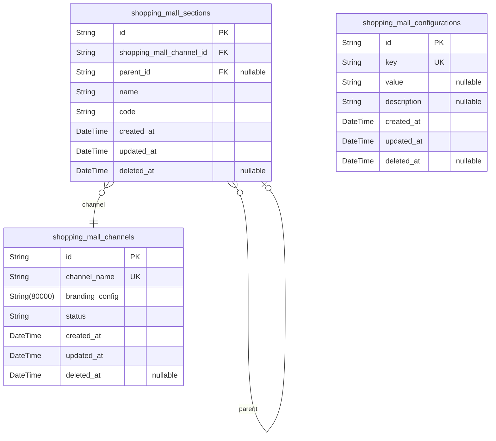
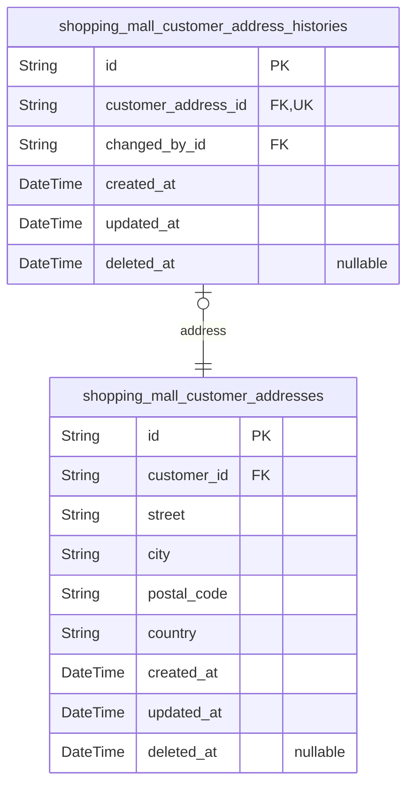
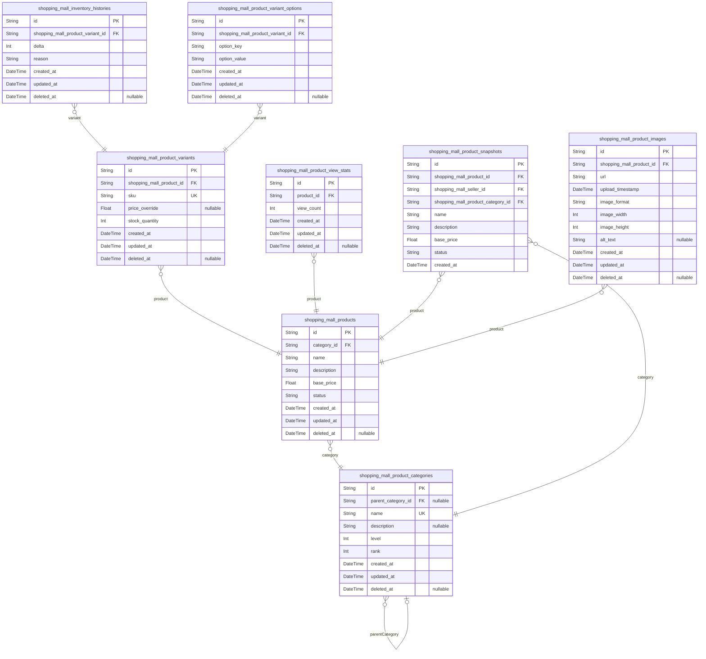
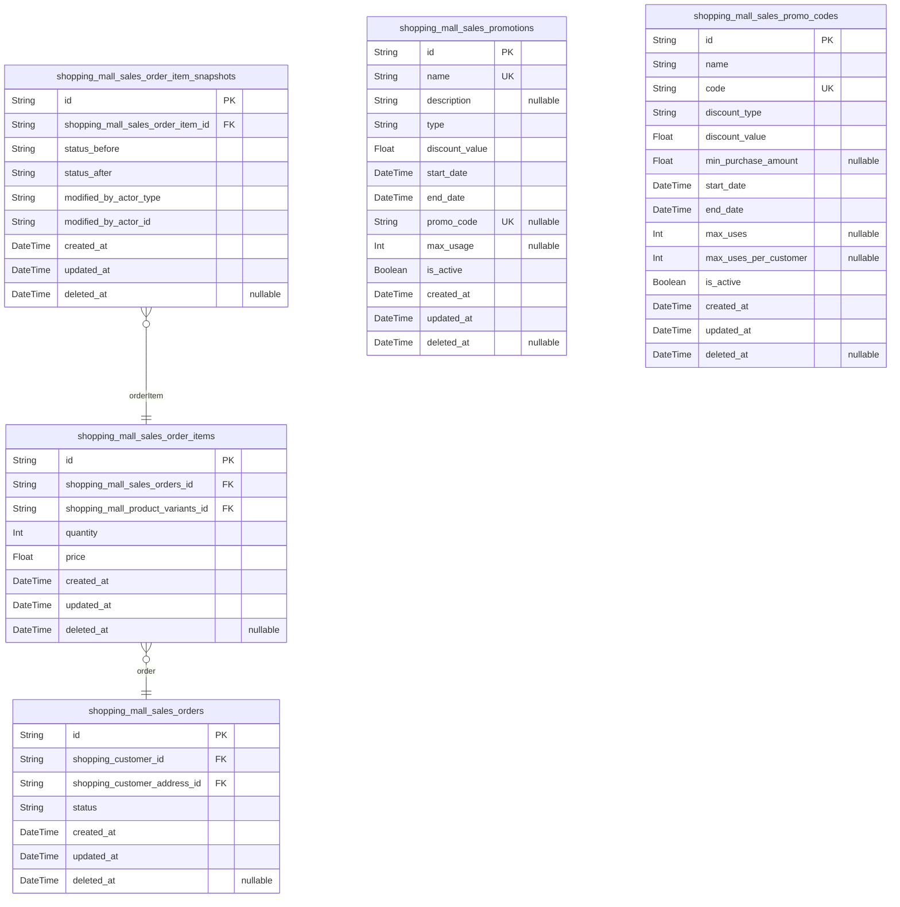
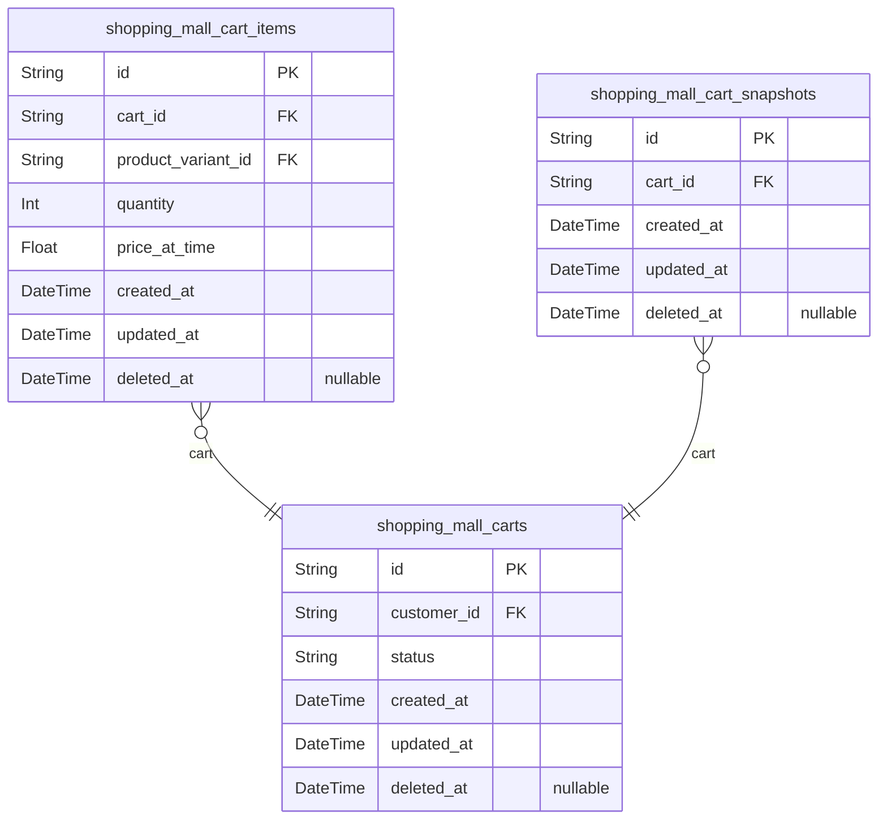
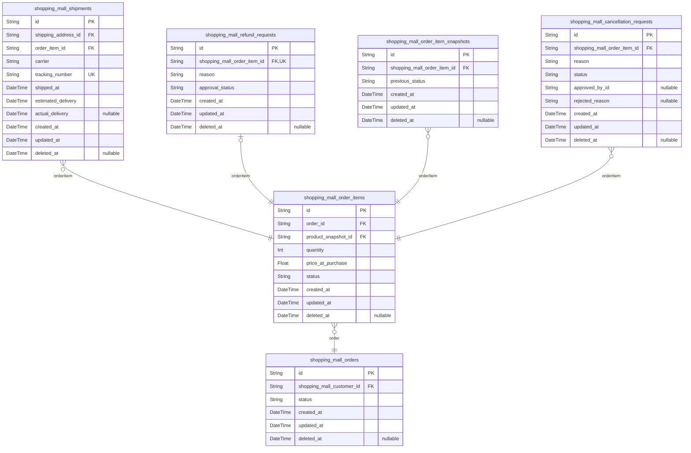
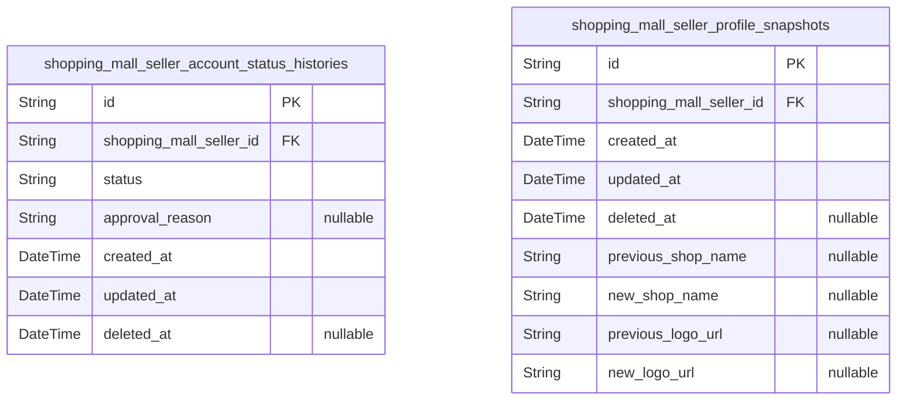
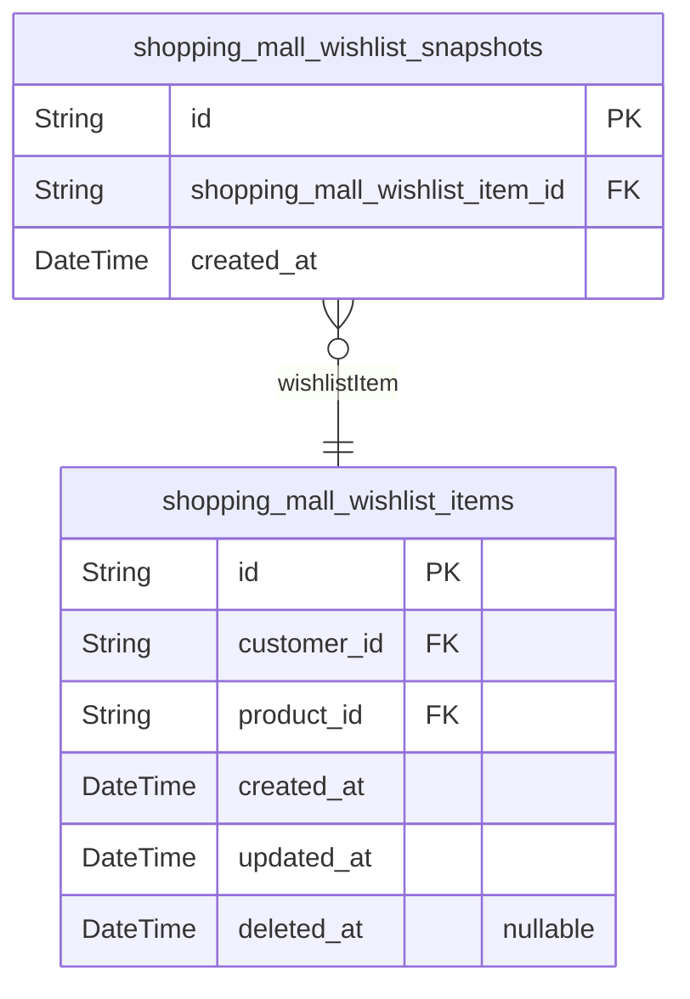

# Prisma Markdown

> Generated by [`prisma-markdown`](https://github.com/samchon/prisma-markdown)

- [Actors](#actors)
- [Systematic](#systematic)
- [Address](#address)
- [Products](#products)
- [Sales](#sales)
- [Carts](#carts)
- [Orders](#orders)
- [Seller](#seller)
- [Wishlist](#wishlist)

## Actors

```mermaid
erDiagram
"shopping_mall_customers" {
  String id PK
  String email UK
  String password_hash
  String display_name "nullable"
  String phone "nullable"
  DateTime created_at
  DateTime updated_at
  DateTime deleted_at "nullable"
}
"shopping_mall_customer_sessions" {
  String id PK
  String customer_id FK
  String ip
  String href
  String referrer
  DateTime created_at
  DateTime expired_at
}
"shopping_mall_customer_email_verifications" {
  String id PK
  String customer_id FK
  String token UK
  DateTime expiration
  DateTime created_at
  DateTime updated_at
  DateTime verified_at "nullable"
  DateTime deleted_at "nullable"
}
"shopping_mall_customer_password_resets" {
  String id PK
  String customers_id FK
  String token UK
  DateTime expires_at
  DateTime created_at
  DateTime updated_at
  DateTime deleted_at "nullable"
}
"shopping_mall_sellers" {
  String id PK
  String email UK
  String password_hash
  String status
  DateTime created_at
  DateTime updated_at
  DateTime deleted_at "nullable"
}
"shopping_mall_seller_email_verifications" {
  String id PK
  String email
  String token UK
  DateTime expires_at
  Boolean is_used
  DateTime created_at
  DateTime updated_at
  DateTime deleted_at "nullable"
}
"shopping_mall_seller_password_resets" {
  String id PK
  String shopping_mall_seller_id FK
  String reset_token
  DateTime expiration
  Boolean used
  DateTime created_at
}
"shopping_mall_admins" {
  String id PK
  String email UK
  String password_hash
  DateTime created_at
  DateTime updated_at
  DateTime deleted_at "nullable"
}
"shopping_mall_admin_password_resets" {
  String id PK
  String admin_id FK
  String token UK
  DateTime expires_at
  DateTime created_at
}
"shopping_mall_seller_sessions" {
  String id PK
  String shopping_mall_seller_id FK
  String ip
  String href
  String referrer
  DateTime created_at
  DateTime expired_at
}
"shopping_mall_admin_email_verifications" {
  String id PK
  String admin_id FK
  String token UK
  DateTime expires_at
  DateTime used_at "nullable"
  DateTime created_at
  DateTime updated_at
  DateTime deleted_at "nullable"
}
"shopping_mall_admin_sessions" {
  String id PK
  String admin_id FK
  String ip
  String href
  String referrer
  DateTime created_at
  DateTime expired_at
}
"shopping_mall_customer_sessions" }o--|| "shopping_mall_customers" : customer
"shopping_mall_customer_email_verifications" }o--|| "shopping_mall_customers" : customer
"shopping_mall_customer_password_resets" }o--|| "shopping_mall_customers" : customer
"shopping_mall_seller_password_resets" }o--|| "shopping_mall_sellers" : seller
"shopping_mall_admin_password_resets" }o--|| "shopping_mall_admins" : admin
"shopping_mall_seller_sessions" }o--|| "shopping_mall_sellers" : seller
"shopping_mall_admin_email_verifications" }o--|| "shopping_mall_admins" : admin
"shopping_mall_admin_sessions" }o--|| "shopping_mall_admins" : admin
```

### `shopping_mall_customers`

Primary actor table for registered shopping platform customers with
email/password authentication. Stores core account credentials, profile
information, and audit fields for account lifecycle management.

Handles customer registration, authentication, and profile management
through email verification and password complexity requirements. Each
customer record serves as the root identity for all platform interactions
including order history, wishlist items, and address management.

Includes mandatory email validation and password complexity rules for
security compliance. Supports email verification workflows and preserves
order history even after account deletion (marked as 'deleted user').
Account deletion triggers session termination and profile preservation
for historical reference.

Properties as follows:

- `id`: Primary Key.
- `email`
  > Customer's verified email address used for login, verification, and
  > communication. Must be unique across all customers and comply with
  > standard email format requirements.
- `password_hash`
  > Secure hash of customer's password stored during registration. Used for
  > authentication validation. Never stores plain passwords.
- `display_name`
  > Customer's preferred name for public profile display. Allows alphanumeric
  > characters with max 50 characters under real-time validation.
- `phone`
  > Customer's contact phone number stored in international E.164 format.
  > Supports country code detection and validation standards for all regions.
- `created_at`
  > Timestamp of customer account creation. Automatically set to current time
  > during registration.
- `updated_at`
  > Timestamp of the most recent account modification. Automatically updated
  > during profile changes.
- `deleted_at`
  > Timestamp when account was deleted (soft delete). Preserves account
  > history while preventing new activity.

### `shopping_mall_customer_sessions`

JWT session tokens for customer authentication with access and refresh
token support, validated for 15-minute expiration period.

Stores connection context for customer login sessions including IP
address, connection URL, and referrer information. All sessions are
time-bound with mandatory expiration to enhance security.

Each session is linked to a customer's active account and represents a
unique login event. The table follows session logging best practices with
timestamped activity records for audit and security monitoring. Session
records are appended-only with no deletions allowed.

All sessions include necessary metadata for connection context, enabling
effective session tracking, user activity analysis, and security threat
detection.

Properties as follows:

- `id`: Primary Key.
- `customer_id`: Customer session owner's {@link shopping_mall_customers.id.
- `ip`: User's IP address at the time of session creation.
- `href`: Full URL of the connection request.
- `referrer`: Referrer URL from which the user arrived at the system.
- `created_at`: Timestamp when the session was created.
- `expired_at`: Timestamp when the session expires for security purposes.

### `shopping_mall_customer_email_verifications`

Email verification tokens for customer account confirmation during
registration.

Stores tokens sent via email to verify customer account ownership during
the initial registration process. Each token has a specific expiration
period to ensure security against brute force attacks.

Tokens are created when a customer requests account verification, then
validated against the customer's identity when the user clicks the
verification link. The token is discarded after successful verification
or expiration.

Provides a security layer preventing malicious registrations while
maintaining user privacy.

Properties as follows:

- `id`: Primary Key.
- `customer_id`
  > Customer record this verification belongs to. {@link
  > shopping_mall_customers.id}.
- `token`
  > Unique verification token string for email link. Follows security best
  > practices (256-bit AES encrypted).
- `expiration`
  > Token expiration time. Must be within 24 hours of token creation for
  > security compliance.
- `created_at`: Token creation timestamp.
- `updated_at`: Token last update timestamp (used for tracking attempts).
- `verified_at`: Timestamp when token was successfully verified.
- `deleted_at`: Soft delete timestamp for security auditing and token management.

### `shopping_mall_customer_password_resets`

Password reset tokens for customer account recovery with expiration
timestamps.

Stores generated tokens securely linked to customer accounts, ensuring
they are invalid after specified expiration periods. Each token is
uniquely associated with a customer for safe, time-limited access to the
password reset workflow. Maintains data integrity through expiration
management without user intervention.

Properties as follows:

- `id`: Primary Key.
- `customers_id`: Customer responsible for password reset request.
- `token`
  > Unique token for password reset validation. Generated using
  > cryptographically secure random string
- `expires_at`: Timestamp when password reset token expires, preventing stale attempts
- `created_at`: Record creation timestamp
- `updated_at`: Record last update timestamp
- `deleted_at`: Soft delete timestamp

### `shopping_mall_sellers`

Seller accounts requiring administrative approval before platform
participation.

Houses authentication credentials including email for login, with
password hashing for security. Each account has a status field
(pending/approved/rejected) tracking the approval workflow from
submission through to platform access.

Sellers cannot access platform features until approved. Seller profile
data is managed through separate seller_profile_snapshots table for audit
trail, while this table focuses on authentication and status tracking.

Standard temporal fields support historical tracking, and soft delete
capability allows for account deactivation without data deletion.

Properties as follows:

- `id`: Primary Key.
- `email`
  > Seller email address used for authentication and communication. Must be
  > unique across all sellers.
- `password_hash`
  > Securely hashed password for login authentication. Never stores plain
  > passwords.
- `status`
  > Current seller account status. Valid values: pending, approved, rejected.
  > Status transitions follow approval workflow rules.
- `created_at`
  > Seller account creation timestamp. Used for audit trails and new user
  > metrics.
- `updated_at`
  > Last modification timestamp for seller account information. Used for
  > audit and synchronization.
- `deleted_at`
  > Soft delete timestamp. Null indicates active account, timestamp indicates
  > deletion history.

### `shopping_mall_seller_email_verifications`

Email verification tokens for seller account confirmation during
registration, providing secure email validation to prevent fake
registrations.

This table stores unique tokens that expire after a set period to confirm
seller email addresses before account activation. Each record tracks the
verification token's creation, expiration, and usage status. The system
automatically deletes expired tokens to maintain security and reduce
database bloat.

Tokens are valid for 15 minutes, matching the system-wide authentication
token expiration policy. When a token is used to verify an email, the
system creates a new seller account with the verified email. Verification
attempts are tracked for security monitoring and account recovery
analysis.

Properties as follows:

- `id`: Primary Key.
- `email`: Seller's email address for verification. Must be unique and valid format.
- `token`
  > Unique verification token sent to email for confirmation. Randomly
  > generated with high entropy.
- `expires_at`
  > Timestamp when verification token expires. Must be 15 minutes after
  > creation.
- `is_used`
  > Indicates whether the verification token has been successfully used to
  > confirm email. Never null.
- `created_at`: Timestamp when verification record was created.
- `updated_at`
  > Timestamp when verification record was last modified (e.g., when token is
  > marked as used).
- `deleted_at`
  > Timestamp when verification record was deleted (soft delete). Nullable
  > for tracking historical activity.

### `shopping_mall_seller_password_resets`

Seller password reset tokens with expiration for secure password recovery
workflow.

Stores tokens generated for seller password reset requests, with
expiration timestamps to ensure security.
Each token is associated with a specific seller's account and includes a
flag to indicate if it's been used (to prevent reuse).

Tokens with expiration are automatically invalidated after a set period
to protect against session hijacking.
Each password reset token is valid for a standard 30 minutes from the
time of creation, after which it expires and becomes unusable.

The token value itself is stored securely as a hashed string, not as
plaintext, to prevent security breaches if the database is compromised.

This table is a subsidiary entity, as it's managed through the seller's
authentication API and doesn't require direct user creation or
independent API operations.

Properties as follows:

- `id`: Primary Key.
- `shopping_mall_seller_id`: Seller who requested password reset. [shopping_mall_sellers.id](#shopping_mall_sellers)
- `reset_token`: Securely hashed password reset token string.
- `expiration`: Password reset token expiration timestamp. Token expires after 30 minutes.
- `used`
  > Indicates if the token has been used for password reset. True = token
  > used, False = token available.
- `created_at`: Token generation timestamp.

### `shopping_mall_admins`

Administrator accounts with elevated privileges for platform management,
using email/password authentication. These accounts require email-based
login with secure password hashing to provide system-wide administrative
capabilities for managing users, content, and platform operations. Each
account serves as the primary identity record used across all
administrative workflows and permissions systems. The password hash
enables secure authentication without storing credentials in plaintext,
following industry security best practices for user management systems.

Administrators are distinct from other actor types (customers, sellers)
in both capabilities and authentication requirements, forming the
foundation for centralized platform governance and control mechanisms.

Properties as follows:

- `id`: Primary Key.
- `email`
  > Administrator email address used for login authentication. Must be unique
  > across all administrator accounts.
- `password_hash`
  > Securely hashed password used for authentication. Stored in hashed form
  > only, never in plaintext.
- `created_at`: Timestamp when the administrator account was created.
- `updated_at`: Timestamp when the administrator account details were last modified.
- `deleted_at`
  > Timestamp when the account was logically deleted. Used for soft delete
  > capability while preserving audit trails.

### `shopping_mall_admin_password_resets`

Password reset tokens for administrator accounts with expiration timestamps.

Stores temporary tokens used in the administrator password reset
workflow. Each token is associated with a specific administrator and has
a time-limited validity period for security.

The token is generated with cryptographic randomness for security
purposes. Each token is used once and expires after a fixed period
(typically 1 hour) to prevent security risks.

This table does not store password hashes or other sensitive data - only
temporary tokens with expiration information. Soft deletion is not
typically used for password reset tokens as they expire naturally.

Properties as follows:

- `id`: Primary Key.
- `admin_id`: Corresponding administrator's [shopping_mall_admins.id](#shopping_mall_admins).
- `token`
  > Temporary cryptographic token generated for password reset. Must be
  > unique for security reasons.
- `expires_at`
  > Timestamp when the password reset token expires. Must be greater than
  > created_at.
- `created_at`: Timestamp when the password reset token was created.

### `shopping_mall_seller_sessions`

Seller authentication session management for secure login tracking.
Stores connection context and lifecycle metrics for seller accounts with
JWT token validation. Session data includes connection metadata,
expiration policies, and temporal auditing for security monitoring.

Session records track seller login details for security auditing and
lifecycle tracking. Each session includes IP address, connection URL,
referrer, and creation timestamps. Session expiration is enforced by NOT
NULL expired_at field following security standards. These records support
session management workflows while maintaining audit trails for security
compliance.

Properties as follows:

- `id`: Primary Key.
- `shopping_mall_seller_id`: Seller account's [shopping_mall_sellers.id](#shopping_mall_sellers).
- `ip`: Client IP address from which session was created.
- `href`: Connection URL used for session establishment.
- `referrer`: Source referring URL for session creation.
- `created_at`: Timestamp when session was created.
- `expired_at`: Timestamp when session expires (security requirement: never null).

### `shopping_mall_admin_email_verifications`

Email verification tokens that support secure administrator account
registration and confirmation. Provides temporary token-based
verification for new administrator accounts to prevent unauthorized
registration attempts and ensure valid email ownership during onboarding.
Each verification token is associated with a specific administrator
account being registered and is valid for a limited time period. The
token is automatically marked as used upon successful email verification
and expires as per defined time limit.

Verification tokens cannot be reused once verified, and expiration
prevents unauthorized use of expired tokens. This ensures the security of
the administrator registration process while maintaining an audit trail
of verification attempts.

Properties as follows:

- `id`: Primary Key.
- `admin_id`: Associated administrator account's [shopping_mall_admins.id](#shopping_mall_admins).
- `token`: Unique verification token string used in email confirmation link.
- `expires_at`
  > Timestamp when verification token expires, after which it can no longer
  > be used.
- `used_at`
  > Timestamp when verification token was successfully used for account
  > activation.
- `created_at`: Timestamp when the verification record was created.
- `updated_at`: Timestamp of the last update to this verification record.
- `deleted_at`: Timestamp when the verification record was soft deleted (inactive).

### `shopping_mall_admin_sessions`

Session tokens for administrator authentication with access and refresh
token support. Stores connection metadata and session lifecycle
timestamps for audit trail and security management.

Append-only pattern for login events with expiration tracking. Managed
through authentication workflows, not direct user CRUD operations.
Follows the session table pattern with all required fields and index
pattern.

Properties as follows:

- `id`: Primary Key.
- `admin_id`: Administrators's [shopping_mall_admins.id](#shopping_mall_admins).
- `ip`: IP address
- `href`: Connection URL
- `referrer`: Referrer URL
- `created_at`: Session creation time
- `expired_at`: Session expiration time

## Systematic

### `shopping_mall_channels`

Sales channels representing different points of product accessibility
including online stores, mobile applications, and physical retail
locations. Each channel has branding configurations, operational
settings, and status tracking for business management. Supports
channel-level branding and configuration without requiring relationships
to other entities.

Channels can be enabled or disabled through status transitions, with
'archived' status indicating historical tracking for auditing purposes.
All configuration changes are managed through the channel entity itself
without dependency on other components.

Branding configurations follow a standard URI format for centralized
style management, allowing consistent visual presentation across all
channel interfaces.

Properties as follows:

- `id`: Primary Key.
- `channel_name`
  > Name of the sales channel (e.g., 'Online Store', 'Mobile App'). Must be
  > unique across all channels.
- `branding_config`
  > URI for channel branding configuration (logo, colors, etc.). Points to
  > centralized configuration storage.
- `status`
  > Current operational status: 'active' (operational), 'inactive'
  > (temporarily disabled), or 'archived' (historical record).
- `created_at`: Timestamp when channel was created.
- `updated_at`: Timestamp when channel was last modified.
- `deleted_at`: Timestamp when channel was marked for deletion (soft delete).

### `shopping_mall_sections`

Hierarchical sections within sales channels for organizing content and
products at multiple levels. Sections can be nested to form a tree
structure, allowing for flexible categorization of content and product
listings across different sales channels. All sections are associated
with a specific channel and support a hierarchical ordering where
sections can have parent sections for nested organizational structures.

Properties as follows:

- `id`: Primary Key.
- `shopping_mall_channel_id`: The sales channel to which this section belongs.
- `parent_id`
  > The parent section for hierarchical nesting, if this section is a child
  > of another section.
- `name`: The title of the section used for display purposes in the user interface.
- `code`
  > A unique code identifier for the section, used to reference the section
  > in code and other internal systems.
- `created_at`: Timestamp when the section was created.
- `updated_at`: Timestamp when the section was last updated.
- `deleted_at`: Timestamp when the section was soft-deleted (not null denotes deletion).

### `shopping_mall_configurations`

System-wide configuration settings and feature flags for the entire
platform.

Stores key-value pairs of system settings that control platform behavior,
features, and operational parameters. Each configuration key is unique
and represents a specific aspect of the platform's runtime behavior.
Values can be simple strings, JSON objects, or complex structures
depending on the configuration's purpose.

Configurations enable dynamic system behavior adjustments without code
deployment, such as toggling features on/off, setting thresholds, or
defining runtime parameters. All configuration changes create audit
records for tracking system modifications.

The table follows a simple key-value structure with an intuitive key
naming pattern to facilitate configuration management by administrators.
Configuration changes are captured with precise timestamps and
modification histories to support audit trails.

Properties as follows:

- `id`: Primary Key.
- `key`: Unique configuration key name used to identify and retrieve the setting.
- `value`
  > Current value for the configuration setting. Accepts string, JSON, or
  > complex data structures as strings.
- `description`
  > Detailed explanation of what this configuration key controls and its
  > potential values.
- `created_at`: Timestamp when this configuration setting was created.
- `updated_at`: Timestamp when this configuration setting was last modified.
- `deleted_at`
  > Timestamp when this configuration setting was marked for deletion (soft
  > delete).

## Address

### `shopping_mall_customer_addresses`

Maintains current shipping addresses for customers, including street,
city, postal code, and country fields with required validation for
shipping.

Stores customer's active shipping addresses that are used for order
fulfillment. Each address must be associated with a customer account and
is part of the customer's profile data. Allows creation, update, and soft
deletion of address entries.

Addresses are validated for format and completeness before storage. The
current status allows active use for shipping, while soft deletion
preserves historical records for order history and user reference.

Properties as follows:

- `id`: Primary Key.
- `customer_id`: Customer's identifier. [shopping_mall_customers.id](#shopping_mall_customers)
- `street`: Full street address including building number and street name.
- `city`: Name of the city for the shipping address.
- `postal_code`: Postal code (ZIP code) for the shipping address, validated by country.
- `country`
  > Country name for the shipping address, typically using two-letter ISO
  > codes.
- `created_at`: Timestamp when the address was first created.
- `updated_at`: Timestamp when the address was last modified.
- `deleted_at`: Timestamp when the address was soft-deleted (nullable).

### `shopping_mall_customer_address_histories`

Address modification history tracking.

Captures every modification to customer addresses including timestamp,
user who made the change, and historical details.
This table records the moment a customer updates their shipping address,
preserving the state at that point in time.
The address reference ensures we can retrieve the historical data even
when the current address changes.
Each entry in this table is immutable - it records a timestamped event of
a specific change.

Properties as follows:

- `id`: Primary Key.
- `customer_address_id`: The main address record associated with this change event.
- `changed_by_id`: Identifies the customer who performed the address modification.
- `created_at`: Timestamp of when this address change occurred.
- `updated_at`: Timestamp of when this snapshot was created (immutable).
- `deleted_at`: Timestamp of when this snapshot was marked as deleted (soft delete).

## Products

### `shopping_mall_products`

Core product catalog with name, description, category, and pricing
information.

Manages product listings for the shopping mall platform, allowing sellers
to publish and manage products for customer visibility.

Product data includes name, description, category, base price, and status
tracking (active, inactive). Each product has its own unique identifier
and timestamps for creation and updates.

Products are categorized via the product_categories table, enabling
efficient product grouping and navigation. Soft deletion is supported for
content moderation without removing access to historical data.

This table follows 3NF normalization principles with all non-key
attributes depending directly on the primary key.

Properties as follows:

- `id`: Primary Key.
- `category_id`: Product category identifier. [shopping_mall_product_categories.id](#shopping_mall_product_categories)
- `name`
  > Product name for display to customers. Required field, minimum 3
  > characters, maximum 255 characters.
- `description`
  > Product description providing details about the product features and
  > specifications. Must be at least 10 characters long.
- `base_price`
  > Base price of the product in USD before any discounts. Must be greater
  > than $0.01.
- `status`
  > Current status of the product. Valid statuses: active, inactive,
  > out_of_stock.
- `created_at`: Timestamp when the product was created.
- `updated_at`: Timestamp when the product was last updated.
- `deleted_at`
  > Timestamp when the product was marked for deletion (soft delete). Null if
  > not deleted.

### `shopping_mall_product_variants`

Product variant data for specific merchandise options with unique SKU and
stock quantity tracking.

Stores individual product variants including SKU (formatted as
SKU-XXXXX), price override, and current stock quantity. Each variant
belongs to a single product in the catalog and reflects the product's
options (e.g., color, size) at the time of the variant's creation.

Variants can have price overrides from the base product price, which
allows flexibility without modifying the main product's price. Stock
quantity represents available units for sales, must be positive.

The table supports snapshot preservation for historical tracking of
variant changes, maintaining audit trails for product management.

Properties as follows:

- `id`: Primary Key.
- `shopping_mall_product_id`: Referenced product's [shopping_mall_products.id](#shopping_mall_products).
- `sku`
  > Unique product variant identifier formatted as SKU-XXXXX. Must follow SKU
  > format consistency across all variants.
- `price_override`
  > Optional override price for this variant. If null, uses base price from
  > parent product.
- `stock_quantity`
  > Number of available units for this variant. Must be greater than zero to
  > indicate available inventory.
- `created_at`: Time when this variant record was created.
- `updated_at`: Last update timestamp for this variant record.
- `deleted_at`: Timestamp when record was marked for deletion (soft delete).

### `shopping_mall_product_view_stats`

Tracks product view counts and analytics metrics for recommendation
engines and performance analysis.

Records historical product view data to improve recommendation algorithms
and measure marketing effectiveness. Each entry represents a product view
count at specific points in time with context about the product.

This table is populated through tracking logic in the frontend
application that records view events. Data persists for analytics and
reporting without modification or deletion. The relationship to products
is maintained through foreign keys, preserving historical context.

Product view data is immutable once recorded - new entries are created as
views occur, rather than updating existing records. The view count is
stored as raw data, never calculated dynamically at query time.

Properties as follows:

- `id`: Primary Key.
- `product_id`: Product being viewed. {@link shopping_mall_products.id.
- `view_count`
  > Total count of views for the product at this point in time. Represents
  > cumulative views since last record.
- `created_at`
  > Timestamp when the view data was recorded. Indicates the point in time
  > the view count was captured.
- `updated_at`
  > Timestamp when the view data record was last updated. For analytics, this
  > typically matches created_at as records are immutable.
- `deleted_at`
  > Timestamp when the record was soft-deleted (for retention policies). Not
  > used for active analytics.

### `shopping_mall_product_snapshots`

Immutable historical record capturing the exact state of product data at
the time of modification. Preserves product name, description, price,
category, status, and the seller who made the change for audit
verification and historical reference. All snapshots are immutable and
cannot be modified or deleted to maintain data integrity.

Snapshots provide the complete context of product state at any point in
time. Each snapshot is tied to the product, seller, and category as they
existed during the modification event. The name reflects the product's
state at that moment, description provides context for the changes, price
and status show the active product configuration during the modification
period. The created_at timestamp enables precise historical tracking of
when changes occurred.

Properties as follows:

- `id`: Primary Key.
- `shopping_mall_product_id`: Product that was modified. [shopping_mall_products.id](#shopping_mall_products).
- `shopping_mall_seller_id`: Seller who modified the product. [shopping_mall_sellers.id](#shopping_mall_sellers).
- `shopping_mall_product_category_id`
  > Product category at the time of modification. {@link
  > shopping_mall_product_categories.id}.
- `name`
  > Product name at the exact time of modification, required for historical
  > accuracy and user-friendly context.
- `description`
  > Product description at the exact time of modification, capturing the
  > state as recorded during the change event.
- `base_price`
  > Product price in USD at the time of modification, used for sales auditing
  > and historical pricing analysis.
- `status`
  > Current product status at time of modification (e.g., 'active',
  > 'inactive', 'deleted'). Reflects state as it should have been visible to
  > users during the modification period.
- `created_at`
  > Precise timestamp when the modification occurred, including timezone for
  > global consistency.

### `shopping_mall_inventory_histories`

Tracks changes to product variant stock quantities with timestamps, delta
values, and reason descriptions.

Records every addition or subtraction to product variant stock, including
restock events and order fulfillments. Each history entry is tied to a
specific product variant and maintains a full audit trail of inventory
changes.

The system automatically creates a new history record whenever stock
quantities are modified (by restock actions or sales processing),
capturing the exact delta amount, reason for the change, and timestamps.

This table supports inventory tracking and reporting without requiring
direct user interaction, making it appropriate for subsidiary status.

Properties as follows:

- `id`: Primary Key.
- `shopping_mall_product_variant_id`
  > Product variant this inventory change applies to. {@link
  > shopping_mall_product_variants.id}.
- `delta`
  > Quantity change amount. Positive for stock increases (restocks), negative
  > for decreases (sales).
- `reason`
  > Description of why the inventory change occurred (e.g., 'Restock', 'Order
  > Fulfillment', 'Stock Correction').
- `created_at`
  > Timestamp when inventory change record was created, automatically
  > populated.
- `updated_at`
  > Timestamp when inventory change record was last updated, automatically
  > populated.
- `deleted_at`: Timestamp when record was soft-deleted. Null if not deleted.

### `shopping_mall_product_images`

Product images associated with individual items in the catalog for
display on product detail pages. Stores image URLs with upload timestamps
and metadata for each product variant. Each image is linked to a specific
product through a foreign key.

Images are managed through product management workflows, not
independently. Metadata is now atomic with format, dimensions, and
accessibility text stored as separate fields for proper normalization.

Properties as follows:

- `id`: Primary Key.
- `shopping_mall_product_id`: Associated product's [shopping_mall_products.id](#shopping_mall_products).
- `url`: URL to the product image file. Must be a valid public URL.
- `upload_timestamp`: Timestamp when the image was uploaded to the system.
- `image_format`: Image file format (e.g., jpg, png, gif).
- `image_width`: Image width in pixels.
- `image_height`: Image height in pixels.
- `alt_text`: Alternative text for accessibility and image description.
- `created_at`: Timestamp when the image record was created.
- `updated_at`: Timestamp when the image record was last updated.
- `deleted_at`: Timestamp when the image record was marked as deleted (soft delete).

### `shopping_mall_product_categories`

Product categories for organizing catalog items with hierarchical
structure and multi-category support.

Defines the taxonomic structure for product categorization, enabling
merchants to organize items within a multi-level taxonomy. Categories can
be nested within parent categories to create a hierarchical catalog
structure.

Product categories serve as the foundation for product discovery and
browsing, allowing customers to navigate the catalog through category
trees. Each category contains a unique name and descriptive information
that may be used in UI elements and search functionality.

The hierarchical nature allows for both broad and specific category
groupings (e.g., electronics > smartphones > flagship models).
Multi-category support enables products to appear in multiple relevant
categories for improved discoverability without duplicating product data.

Properties as follows:

- `id`: Primary Key.
- `parent_category_id`: Parent category's identifier. {@link shopping_mall_product_categories.id.
- `name`
  > Category name displayed to customers, must be unique across all
  > categories.
- `description`: Detailed description of the category used in UI and SEO purposes.
- `level`: Hierarchy level within category tree (root = 1, children = level + 1).
- `rank`: Relative ordering within same-level categories for display priority.
- `created_at`: Timestamp when category was created.
- `updated_at`: Timestamp when category was last updated.
- `deleted_at`: Timestamp when category was soft deleted (null if active).

### `shopping_mall_product_variant_options`

Key-value pairs for product variant options (e.g., color, size).

Stores variant option definitions with key (e.g., 'color') and value
(e.g., 'red') for product variants. Always associated with a specific
product variant and managed through the variant API operations.

This table maintains 1NF compliance by separating key-value pairs into
individual rows instead of using JSON arrays. Option values must be valid
strings and are always tied to their parent product variant for context.

Option key-value data is never directly managed outside of the variant
management process, ensuring data integrity and proper relationships.

Properties as follows:

- `id`: Primary Key.
- `shopping_mall_product_variant_id`
  > The product variant this option belongs to. {@link
  > shopping_mall_product_variants.id}
- `option_key`: The name of the variant option (e.g., 'color', 'size').
- `option_value`: The specific value for the option (e.g., 'red', 'large').
- `created_at`: Timestamp when the product variant option was created.
- `updated_at`: Timestamp when the product variant option was last updated.
- `deleted_at`
  > Timestamp when the product variant option was soft deleted (null if not
  > deleted).

## Sales

### `shopping_mall_sales_orders`

Main order records capturing transactions with pricing details at time of
purchase.

Tracks customer order transactions including status, delivery details,
and reference to order items. Each order is associated with a customer's
active session and shipping address. Orders are created when items are
added to cart and validated for availability, triggering inventory
checks. All order records maintain timestamping for creation, updates,
and logical deletion for audit purposes.

Properties as follows:

- `id`: Primary Key.
- `shopping_customer_id`: Customer who placed the order. [shopping_mall_customers.id](#shopping_mall_customers).
- `shopping_customer_address_id`
  > Shipping address used for this order. {@link
  > shopping_mall_customer_addresses.id}.
- `status`
  > Current order status. Valid values: pending, processing, shipped,
  > delivered, cancelled. Status transitions follow business workflow rules.
- `created_at`: Timestamp when order was created.
- `updated_at`: Timestamp when order details were last updated.
- `deleted_at`: Timestamp when order was logically deleted.

### `shopping_mall_sales_order_items`

Individual items within orders with variant pricing and quantity details,
capturing product information at the time of purchase for historical
auditability.

Each order item represents a single product variant purchased by a
customer, maintaining the exact product name, description, variant
options, and price at the time of transaction. This ensures that order
histories remain accurate even if product details change later. Order
items are directly managed by customers through their order history and
support individual item operations such as cancellation and refund
requests.

The order item associates with the parent order through the order_id
foreign key, and references the specific product variant at purchase time
via product_variant_id. This design supports snapshot preservation for
order item changes, with historical state tracking handled by the
dedicated snapshot table in this component.

Properties as follows:

- `id`: Primary Key.
- `shopping_mall_sales_orders_id`: The order this item belongs to. [shopping_mall_sales_orders.id](#shopping_mall_sales_orders)
- `shopping_mall_product_variants_id`
  > The product variant at the time of purchase. {@link
  > shopping_mall_product_variants.id}
- `quantity`
  > Number of units purchased for this variant. Must be positive and cannot
  > be zero.
- `price`
  > Price per unit of the variant at the time of purchase. This remains
  > immutable even if the product's list price changes later.
- `created_at`: Timestamp when the order item was created (order placement time).
- `updated_at`
  > Last timestamp when this order item was updated (e.g., during
  > cancellation processing).
- `deleted_at`
  > Timestamp when the order item was soft-deleted (e.g., during
  > cancellation). NULL indicates active item.

### `shopping_mall_sales_order_item_snapshots`

Historical snapshots capturing order item status transitions for audit
and traceability.

This table maintains immutable records of each order item status change,
including previous and new status values, who made the change, and the
timestamp of the transaction.

Stores complete historical context for every status transition, enabling
accurate dispute resolution, sales analytics, and audit trails without
impacting current order item data.

All changes to order item status trigger automatic snapshot creation with
preserved previous values, ensuring complete chain of custody for all
order fulfillment stages.

Properties as follows:

- `id`: Primary Key.
- `shopping_mall_sales_order_item_id`
  > The related order item this snapshot refers to. {@link
  > shopping_mall_sales_order_items.id}.
- `status_before`: Previous status value of the order item before change.
- `status_after`: New status value of the order item after change.
- `modified_by_actor_type`: Type of actor that made the change (customer, seller, or admin).
- `modified_by_actor_id`: ID of the actor that made the change (references specific actor table).
- `created_at`: Timestamp when this snapshot was created (status change occurred).
- `updated_at`
  > Timestamp when the snapshot was last modified (should match created_at
  > for snapshots).
- `deleted_at`
  > Timestamp when the snapshot was logically deleted; null indicates active
  > record.

### `shopping_mall_sales_promotions`

Promotional structures defining pricing strategies and sales campaigns.

This table stores all defined promotional configurations including
percentage discounts, fixed amount reductions, and free shipping offers.
Each promotion has a unique name, type, discount value, and active date
range.

Promotions can be activated or deactivated through the interface,
maintaining audit trail for all modifications.
Soft deletion is supported for promotion management while preserving
historical campaign data.

Multiple active promotions can coexist with the system enforcing rules to
prevent overlapping discount conflicts.

Properties as follows:

- `id`: Primary Key.
- `name`
  > Promotion name displayed in admin interface and customer-facing
  > campaigns. Must be unique across all promotions.
- `description`: Detailed description of promotion purpose and terms for admin reference.
- `type`
  > Promotion type: 'percentage' for percentage discounts, 'fixed' for fixed
  > amount reductions, 'free_shipping' for shipping cost waivers.
- `discount_value`
  > Discount amount as percentage (0.01-99.99) or fixed amount (>$0.01)
  > depending on promotion type.
- `start_date`: Date and time when promotion becomes active.
- `end_date`: Date and time when promotion expires and becomes inactive.
- `promo_code`
  > Optional promotional code customers can enter to apply the discount. Must
  > be unique if provided.
- `max_usage`
  > Maximum number of times this promotion can be used. Null means unlimited
  > usage.
- `is_active`: Indicates whether the promotion is currently active for customers.
- `created_at`: Timestamp when the promotion record was created.
- `updated_at`: Timestamp when the promotion record was last modified.
- `deleted_at`
  > Timestamp when the promotion was soft deleted. Null indicates promotion
  > is active.

### `shopping_mall_sales_promo_codes`

Discount codes and coupon redemption records for promotional execution.

Stores all parameters for defining and managing discount campaigns,
including valid duration, usage limits, and discount types. Each code can
be used for percentage-based discounts, fixed dollar amounts, or free
shipping options. Supports multi-use campaigns and customer-specific
usage limits.

Promotional codes maintain full audit history through the snapshot system
as part of the sales component, with all business parameters preserved at
time of redemption.

Properties as follows:

- `id`: Primary Key.
- `name`
  > The human-readable name of the promotional campaign or code. Used for
  > internal management and customer-facing display.
- `code`
  > The actual discount code used by customers. Must be unique, uppercase
  > alphanumeric with no spaces.
- `discount_type`
  > The type of discount offered. Valid values: 'percentage', 'fixed_amount',
  > 'free_shipping'.
- `discount_value`
  > The value of the discount. For 'percentage', it's 0-100; for
  > 'fixed_amount', it's positive dollar amount; for 'free_shipping', this
  > field is not used and should be null.
- `min_purchase_amount`
  > The minimum purchase amount for code redemption. Null indicates no
  > minimum required.
- `start_date`: The date/time when the discount becomes active and can be redeemed.
- `end_date`: The date/time when the discount expires and can no longer be redeemed.
- `max_uses`
  > Total number of times the code can be used across all customers. Null
  > indicates unlimited uses.
- `max_uses_per_customer`
  > Maximum number of times a single customer can use the code. Null
  > indicates no limit.
- `is_active`: Whether the discount is currently active. Default: true.
- `created_at`: Timestamp when the code was created.
- `updated_at`: Timestamp when the code was last updated.
- `deleted_at`: Timestamp when the code was soft-deleted. Null if active.

## Carts

### `shopping_mall_carts`

User cart records for shopping selection before order commitment.

Stores active shopping selections with cart status and customer
reference. Carts represent temporary state where users can add/remove
items, adjust quantities, and apply discounts before converting to an
order. Each cart is associated with a specific customer and has a status
indicating its current lifecycle stage (e.g., active, expired).

Carts are automatically expired after a period of inactivity to free up
resources. When a customer proceeds to checkout, the cart is transformed
into an order record, preserving the cart's contents as order items with
snapshots of product details at purchase time.

Properties as follows:

- `id`: Primary Key.
- `customer_id`: Associated customer's [shopping_mall_customers.id](#shopping_mall_customers).
- `status`
  > Current cart status. Valid values: 'active', 'expired',
  > 'converted_to_order'. Status transitions are managed during the shopping
  > workflow.
- `created_at`: Timestamp when the cart was created.
- `updated_at`: Timestamp when the cart was last modified.
- `deleted_at`: Timestamp when the cart was soft-deleted. Null indicates cart is active.

### `shopping_mall_cart_items`

Tracks items added to user shopping carts, including product variants,
quantities, and prices at time of addition. Each cart item records
variant details and current pricing to ensure shopping experience matches
transaction context even if product details later change.

Cart items exist as a direct user-managed entity where customers
add/remove products and adjust quantities. This requires independent
management capabilities including:
- Updating quantities for existing items
- Removal of specific items without affecting entire cart
- Historical tracking of items added at different times
- Price preservation from add time to cart commitment

The model references active carts (shopping_mall_carts) to associate
items with shopping sessions and product variants
(shopping_mall_product_variants) for full catalog context.

Snapshots are handled by the cart_snapshots table, so this model focuses
on current cart state without historical preservation fields.

Properties as follows:

- `id`: Primary Key.
- `cart_id`: Cart that the item belongs to. [shopping_mall_carts.id](#shopping_mall_carts).
- `product_variant_id`
  > Product variant included in the cart. {@link
  > shopping_mall_product_variants.id}.
- `quantity`
  > Number of this product variant in the cart. Must be at least 1 and
  > reflect real inventory levels.
- `price_at_time`
  > Price of the product variant at the time it was added to the cart,
  > preserving historical accuracy even if prices change later.
- `created_at`: Timestamp when the cart item was added to the cart.
- `updated_at`: Timestamp when the cart item was last modified (e.g., quantity update).
- `deleted_at`
  > Timestamp when the cart item was soft-deleted (e.g., when removed from
  > cart).

### `shopping_mall_cart_snapshots`

Immutable historical records of cart state changes capturing modification
details for audit and traceability purposes.

Stores the complete cart state at the time of modification including all
items, their quantities, and prices. Enables detailed tracking of cart
changes without interfering with current cart operations. All historical
data remains accessible for customer support, order recovery, and system
diagnostics.

Provides a full audit trail of cart state transitions (additions,
removals, modifications) with timestamps and references to corresponding
cart entities. Supports soft deletion for historical record maintenance.

Properties as follows:

- `id`: Primary Key.
- `cart_id`: Cart entity this snapshot refers to. [shopping_mall_carts.id](#shopping_mall_carts).
- `created_at`: Snapshot creation timestamp.
- `updated_at`: Snapshot update timestamp.
- `deleted_at`: Deletion timestamp for soft delete.

## Orders

### `shopping_mall_orders`

Main order records with timestamp, status, and customer reference.

Captures the primary business entity for customer transactions across the
platform, recording order state, timestamps, and customer ownership. Each
order represents a complete transaction from initial creation to final
delivery, maintaining historical context for the order lifecycle.

Orders are created through the checkout process with valid inventory,
requiring a shipping address. Order status follows the business workflow:
pending → processing → shipped → delivered, with possible cancellation.
Each order maintains a unique identifier for tracking across the system.

Properties as follows:

- `id`: Primary Key.
- `shopping_mall_customer_id`: Customer reference. [shopping_mall_customers.id](#shopping_mall_customers).
- `status`
  > Current order status. Values: "pending", "processing", "shipped",
  > "delivered", "cancelled".
- `created_at`: Order creation timestamp.
- `updated_at`: Last update timestamp for order state.
- `deleted_at`: Soft delete timestamp to preserve historical records.

### `shopping_mall_order_items`

Line items within orders tracking quantities, prices, and product details
at time of purchase.

Each order item is associated with a specific order and product variant
snapshot, capturing the exact product state when the order was placed.
The status field tracks the current progression through the fulfillment
workflow (paid → shipped → delivered → cancelled).

Order items support independent management for customers to view order
history, request cancellations, and track fulfillment status across
different items in their orders. The product snapshot reference ensures
historical accuracy even when product details change post-purchase.

Properties as follows:

- `id`: Primary Key.
- `order_id`: Reference to the parent order. [shopping_mall_orders.id](#shopping_mall_orders).
- `product_snapshot_id`
  > Reference to the product snapshot capturing product state at purchase
  > time. [shopping_mall_product_snapshots.id](#shopping_mall_product_snapshots).
- `quantity`: Number of variant units purchased. Must be greater than zero.
- `price_at_purchase`
  > Price of variant at time of purchase, for historical accuracy and refund
  > calculations.
- `status`
  > Current order item status. Valid values: 'paid', 'shipped', 'delivered',
  > 'cancelled'. Status transitions follow business workflow rules.
- `created_at`: Timestamp when the order item was created.
- `updated_at`: Timestamp when the order item was last updated.
- `deleted_at`
  > Timestamp when the order item was soft-deleted. Null indicates active
  > status.

### `shopping_mall_shipments`

Shipping record for order items with carrier details and tracking
information.

Tracks the fulfillment status of each order item's shipment. Includes
carrier name, tracking number, shipment timestamps, and associated
shipping address.

Shipment status is updated to 'shipped' upon creation. Tracking number
must be unique per shipment and provided by carrier.

Associated with order items for order status tracking and with customer
shipping addresses for delivery logistics.

Properties as follows:

- `id`: Primary Key.
- `shipping_address_id`: Customer's shipping address. [shopping_mall_customer_addresses.id](#shopping_mall_customer_addresses).
- `order_item_id`: The order item being shipped. [shopping_mall_order_items.id](#shopping_mall_order_items).
- `carrier`
  > Shipping carrier name (e.g., 'USPS', 'DHL', 'FedEx'). Must be a valid
  > carrier service provider.
- `tracking_number`
  > Unique carrier tracking number for the shipment. Must be provided by
  > carrier and follow their standard formats.
- `shipped_at`
  > Timestamp when shipment was processed and handed to carrier. Must be set
  > when shipment is created.
- `estimated_delivery`: Projected delivery date based on carrier's shipping schedule.
- `actual_delivery`: Actual delivery timestamp when item is confirmed as received by customer.
- `created_at`: Timestamp when the shipment was first created in the system.
- `updated_at`: Timestamp of the last modification to shipment details.
- `deleted_at`: Timestamp when soft deletion was requested (for audit trail).

### `shopping_mall_refund_requests`

Refund requests made by customers for specific order line items. Each
refund request includes a reason for the refund, current approval status,
and timestamps for tracking the refund process.

Customers can request refunds for items that are in the 'shipped' or
'delivered' status, but not for items that are still processing or on
hold. All refund requests require a valid reason and must be reviewed by
a seller before approval or rejection.

The refund process follows the system's order status workflow, with
automatic updates to order item status upon final approval or rejection
of the refund request.

Properties as follows:

- `id`: Primary Key.
- `shopping_mall_order_item_id`
  > Reference to the order item requesting a refund. Always present in a
  > valid refund request.
- `reason`
  > Description of the reason for the refund request. Must be at least 5
  > characters and provide a clear justification for the refund.
- `approval_status`
  > Current status of the refund request. Valid values: 'pending',
  > 'approved', 'rejected'.
- `created_at`: Timestamp when the refund request was created.
- `updated_at`: Timestamp when the refund request was last updated.
- `deleted_at`
  > Timestamp when the refund request was soft-deleted. Null indicates the
  > request is still active.

### `shopping_mall_order_item_snapshots`

Immutable historical records capturing previous status values for order
items, created on every status change. Preserves detailed context for
audit trails and historical tracking without modification.

This table stores every state transition of order items, including the
exact previous status value and timestamp when the change occurred.
Snapshots are created automatically during status change operations
without user intervention, ensuring an accurate and unalterable history
for all order item status modifications.

Properties as follows:

- `id`: Primary Key.
- `shopping_mall_order_item_id`: Order item that was modified. Reference to shopping_mall_order_items.id
- `previous_status`
  > Previous status value before the change occurred. Tracks the exact state
  > prior to the modification.
- `created_at`: Timestamp when the snapshot was created (when status change occurred).
- `updated_at`
  > Timestamp when the snapshot was last updated. (Never changes for
  > snapshots, but required by standard pattern.)
- `deleted_at`
  > Timestamp indicating when the snapshot was marked as deleted. (Snapshots
  > are immutable, so this is not used in practice but maintained for
  > consistency.)

### `shopping_mall_cancellation_requests`

Customer cancellation requests for specific order items with reason and
approval workflow.

Stores cancellation requests initiated by customers for specific order
items within the shopping mall platform.
Each request includes a reason for cancellation and follows a formal
approval workflow managed by sellers or administrators.

The cancellation workflow supports multiple statuses including 'pending',
'approved', and 'rejected'.
When rejected, the request includes a reason for the rejection.

All requests are timestamped to track request creation and approval
timelines.
Soft deletion is supported to maintain audit trails for completed
cancellations.

Properties as follows:

- `id`: Primary Key.
- `shopping_mall_order_item_id`
  > Order item for which cancellation is requested. {@link
  > shopping_mall_order_items.id}.
- `reason`
  > Reason specified for order item cancellation. May include details about
  > the order item or customer's concern.
- `status`
  > Current status of cancellation request. Valid values: pending, approved,
  > rejected. Status transitions follow business workflow rules.
- `approved_by_id`
  > User who approved the cancellation request. {@link
  > shopping_mall_admins.id} or [shopping_mall_sellers.id](#shopping_mall_sellers).
- `rejected_reason`: Reason specified for rejecting the cancellation request.
- `created_at`: Timestamp of cancellation request creation.
- `updated_at`: Timestamp of last cancellation request modification.
- `deleted_at`: Timestamp of cancellation request deletion (soft delete).

## Seller

### `shopping_mall_seller_account_status_histories`

Tracks historical status changes for seller accounts (pending, approved,
rejected) with associated timestamps and approval reasons.

This table captures the history of seller account status transitions from
the initial registration status through approval or rejection process.
Each change is recorded with the exact timestamp and approval reason
provided by the administrator.

The table is designed as a snapshot to preserve historical data without
altering current account status, enabling full audit trail of seller
account validation process. This implementation strictly follows snapshot
pattern requirements by capturing complete state changes rather than
incremental updates.

Properties as follows:

- `id`: Primary Key
- `shopping_mall_seller_id`
  > Seller account this history record belongs to. {@link
  > shopping_mall_sellers.id}.
- `status`
  > Account status transition (one of: pending, approved, rejected). Valid
  > values must match the enum from seller status.
- `approval_reason`
  > Reason for approval or rejection provided by the administrator during
  > status change.
- `created_at`: Timestamp of when the status change was recorded.
- `updated_at`: Timestamp of the last update to this history record.
- `deleted_at`: Timestamp when this record was soft deleted.

### `shopping_mall_seller_profile_snapshots`

Immutable historical records capturing changes to seller profile data
including shop name and logo modifications.

Each snapshot preserves the prior values before the change and the
current values after the change, allowing full traceability of profile
evolution.

Snapshots are created automatically whenever seller profile data is
modified and are intended for audit purposes only. These records cannot
be edited or deleted after creation but can be viewed by seller owners
and system administrators.

The table maintains full historical context through references to the
main seller account (shopping_mall_sellers.id) and includes comprehensive
fields for tracking both before and after profile values for shop name
and logo.

Properties as follows:

- `id`: Primary Key.
- `shopping_mall_seller_id`
  > Reference to the seller profile being snapshotted. {@link
  > shopping_mall_sellers.id}.
- `created_at`: Timestamp when this snapshot was created.
- `updated_at`
  > Timestamp when this snapshot was last updated (should match created_at
  > for immutable records).
- `deleted_at`
  > Timestamp when this snapshot was deleted (soft delete for historical
  > record management).
- `previous_shop_name`: Previous shop name before change.
- `new_shop_name`: New shop name after change.
- `previous_logo_url`: Previous logo URL before change.
- `new_logo_url`: New logo URL after change.

## Wishlist

### `shopping_mall_wishlist_items`

Active wishlist entries linking customers to products without variant
specificity.

Stores individual product references that customers have added to their
wishlist for easy access and future purchase considerations. Each entry
represents a direct link between a customer and a product, without any
variant specificity. The product reference preserves historical
information even if the product later changes or is deleted, as the
snapshot system handles that detail.

Entries remain active until explicitly removed by the customer or
automatically removed when a product is deleted from the catalog. Active
entries are visible to the customer in their wishlist interface, while
deleted entries are preserved in snapshots but not shown in the active
listings.

Properties as follows:

- `id`: Primary Key.
- `customer_id`: Customer's identity. [shopping_mall_customers.id](#shopping_mall_customers)
- `product_id`: Product being wishlisted. [shopping_mall_products.id](#shopping_mall_products)
- `created_at`: Timestamp when the wishlist item was created.
- `updated_at`: Timestamp when the wishlist item was last updated.
- `deleted_at`: If deleted, timestamp of deletion for soft delete functionality.

### `shopping_mall_wishlist_snapshots`

Immutable snapshots preserving deleted products from customer wishlists
for historical reference.

Captures the exact wishlist item state and associated product information
at the moment a product is removed from a seller's catalog, ensuring
customer wishlist history remains intact. Each snapshot records the
product data that existed when the product was deleted, preserving it for
audit trails and historical analysis.

Snapshots are automatically created when a product is deleted from the
catalog, referencing the specific wishlist item that contained the
deleted product. They serve as permanent records for customer review
history and order fulfillment verification, supporting the system's
snapshot policy requirements.

Properties as follows:

- `id`: Primary Key.
- `shopping_mall_wishlist_item_id`: Wishlist item's [shopping_mall_wishlist_items.id](#shopping_mall_wishlist_items).
- `created_at`
  > Snapshot creation timestamp. Records when the wishlist item was captured
  > in its historical state.
