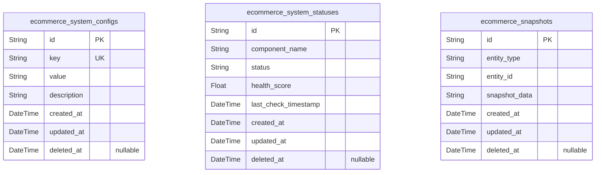
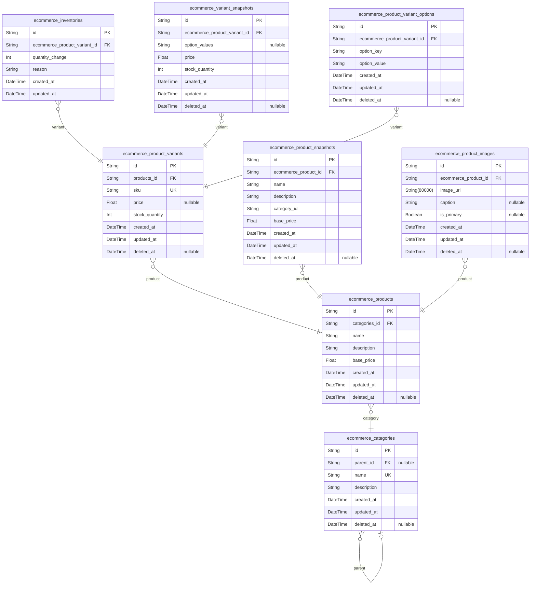
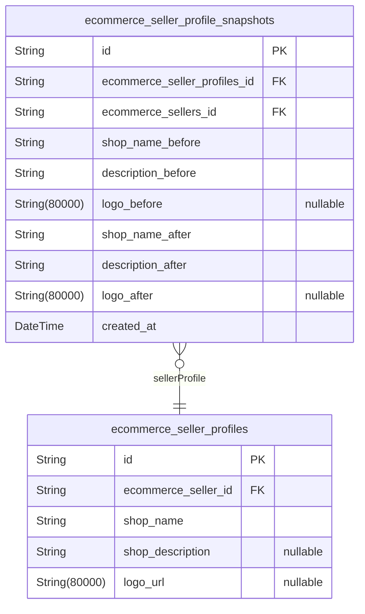
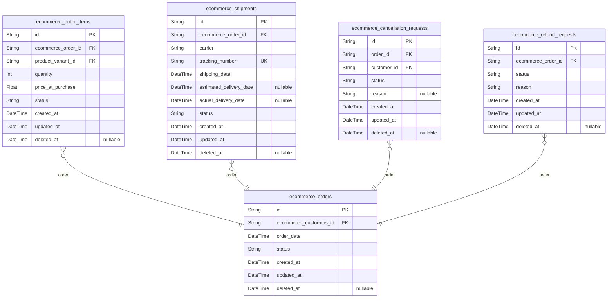
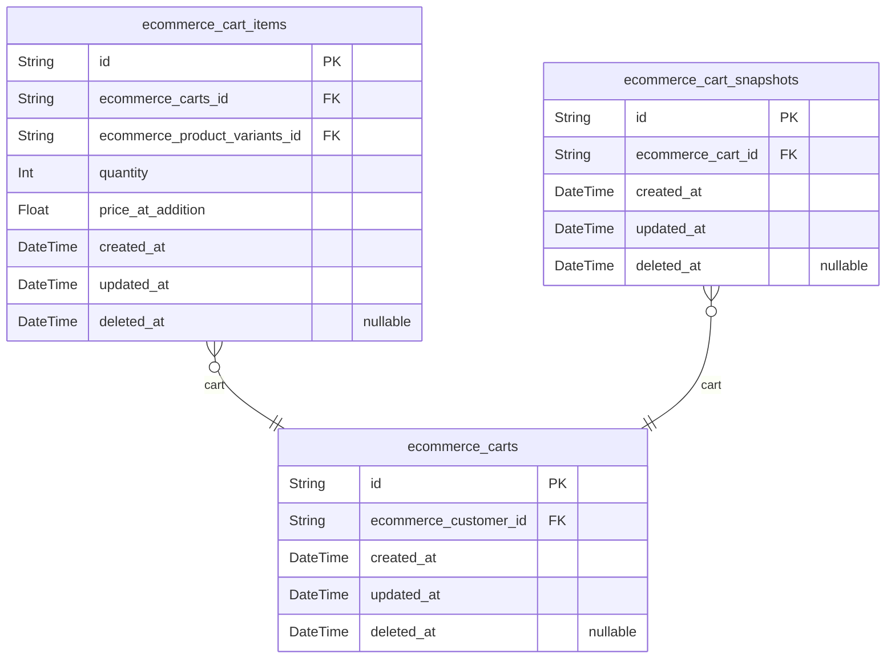
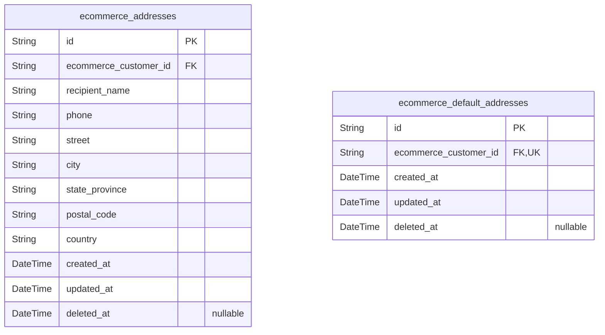
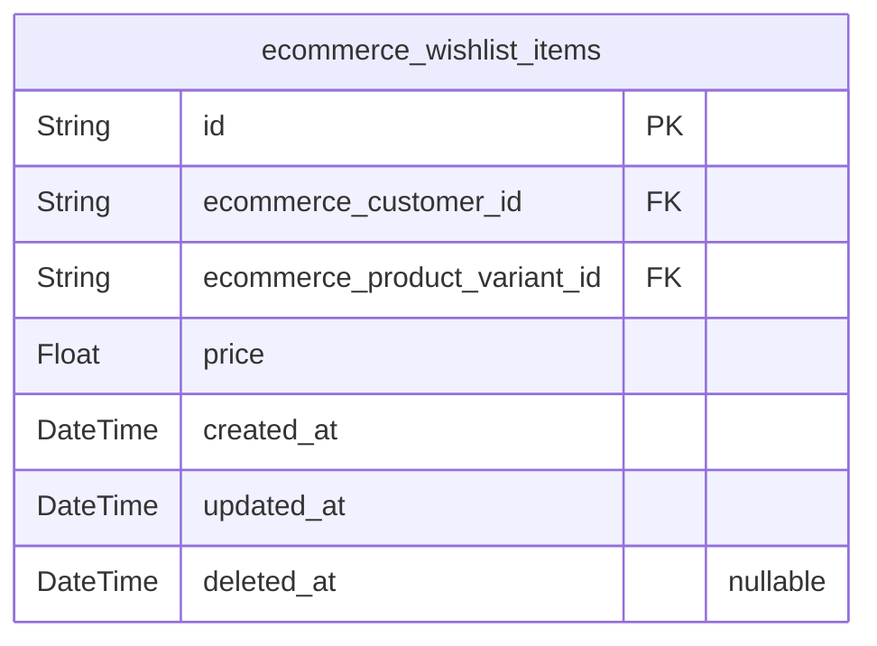
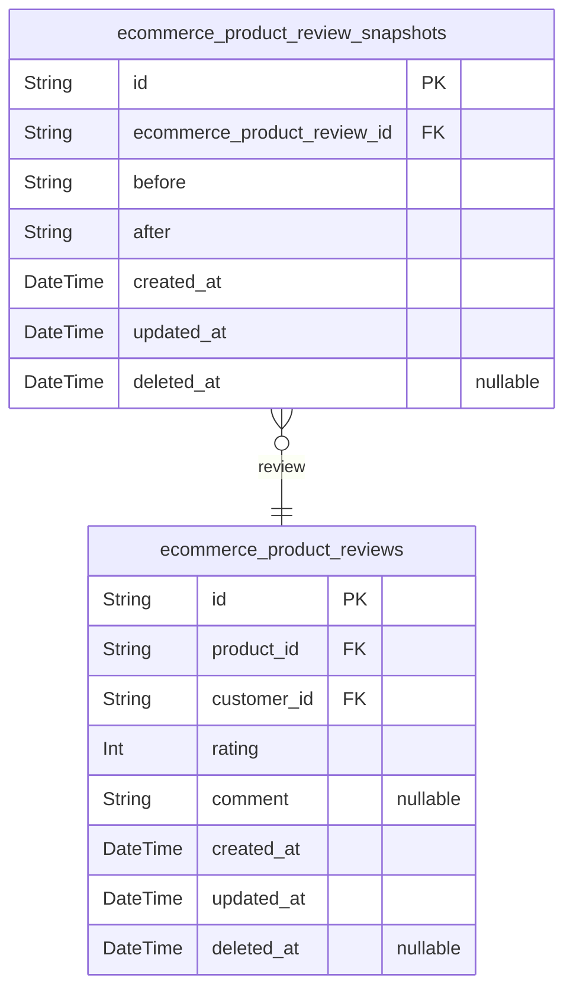

# Prisma Markdown

> Generated by [`prisma-markdown`](https://github.com/samchon/prisma-markdown)

- [Actors](#actors)
- [Systematic](#systematic)
- [Products](#products)
- [SellerProfiles](#sellerprofiles)
- [Orders](#orders)
- [Carts](#carts)
- [Addresses](#addresses)
- [Wishlist](#wishlist)
- [Reviews](#reviews)

## Actors

```mermaid
erDiagram
"ecommerce_customers" {
  String id PK
  String email UK
  String password_hash
  String display_name "nullable"
  String phone "nullable"
  DateTime created_at
  DateTime updated_at
  DateTime deleted_at "nullable"
}
"ecommerce_customer_sessions" {
  String id PK
  String customer_id FK
  String ip
  String href
  String referrer
  DateTime created_at
  DateTime expired_at
}
"ecommerce_customer_password_resets" {
  String id PK
  String customer_id FK
  String token UK
  DateTime expires_at
  DateTime created_at
  DateTime updated_at
  DateTime deleted_at "nullable"
}
"ecommerce_customer_email_verifications" {
  String id PK
  String customer_id FK
  String token
  DateTime expires_at
  DateTime confirmed_at "nullable"
  DateTime created_at
  DateTime updated_at
  DateTime deleted_at "nullable"
}
"ecommerce_sellers" {
  String id PK
  String email UK
  String password_hash
  String approval_status
  DateTime created_at
  DateTime updated_at
  DateTime deleted_at "nullable"
}
"ecommerce_seller_sessions" {
  String id PK
  String ecommerce_seller_id FK
  String ip
  String href
  String referrer
  DateTime created_at
  DateTime expired_at
}
"ecommerce_seller_password_resets" {
  String id PK
  String seller_id FK
  String token UK
  DateTime expires_at
  DateTime created_at
  DateTime updated_at
  DateTime deleted_at "nullable"
}
"ecommerce_seller_email_verifications" {
  String id PK
  String ecommerce_seller_id FK
  String token UK
  DateTime expires_at
  Boolean is_verified
  DateTime created_at
  DateTime updated_at
  DateTime deleted_at "nullable"
}
"ecommerce_admins" {
  String id PK
  String email UK
  String password_hash
  DateTime created_at
  DateTime updated_at
  DateTime deleted_at "nullable"
}
"ecommerce_admin_sessions" {
  String id PK
  String ecommerce_admin_id FK
  String ip
  String href
  String referrer
  DateTime created_at
  DateTime updated_at
  DateTime deleted_at "nullable"
}
"ecommerce_admin_password_resets" {
  String id PK
  String ecommerce_admin_id FK
  String token UK
  DateTime expires_at
  DateTime created_at
  DateTime updated_at
  DateTime deleted_at "nullable"
}
"ecommerce_customer_sessions" }o--|| "ecommerce_customers" : customer
"ecommerce_customer_password_resets" }o--|| "ecommerce_customers" : customer
"ecommerce_customer_email_verifications" }o--|| "ecommerce_customers" : customer
"ecommerce_seller_sessions" }o--|| "ecommerce_sellers" : seller
"ecommerce_seller_password_resets" }o--|| "ecommerce_sellers" : seller
"ecommerce_seller_email_verifications" }o--|| "ecommerce_sellers" : seller
"ecommerce_admin_sessions" }o--|| "ecommerce_admins" : admin
"ecommerce_admin_password_resets" }o--|| "ecommerce_admins" : admin
```

### `ecommerce_customers`

Registered customer accounts with email/password authentication
credentials, including profile details like display name and phone
number. Follows Snapshot Principle for immutable audit trail of changes
across all fields. Key relationships: Child tables include
ecommerce_customer_sessions, ecommerce_customer_password_resets,
ecommerce_customer_email_verifications (all referenced in
otherComponents).

Properties as follows:

- `id`: Primary Key.
- `email`
  > Customer's unique email address for authentication. {@link
  > ecommerce_customers.email is validated against format requirements and
  > must be unique across all customer accounts.
- `password_hash`
  > Securely hashed password for authentication with bcrypt implementation.
  > Stored using modern password hashing standards without plaintext storage.
- `display_name`
  > Display name visible to other users (up to 50 characters, optional).
  > Validated against prohibited terms and reflected immediately upon update.
- `phone`
  > Phone number with international E.164 format for contact (optional).
  > Normalized and validated using standard E.164 format across all address
  > references.
- `created_at`
  > Timestamp when the customer account was first created with precise UTC
  > time recording.
- `updated_at`
  > Timestamp when the customer account was last updated with precise UTC
  > time recording.
- `deleted_at`
  > Timestamp when the customer account was marked for deletion for soft
  > delete implementation.

### `ecommerce_customer_sessions`

JWT session tokens for customer authentication with 15-minute inactivity
timeout and refresh support. Stores connection context for security
auditing including IP address, browser headers, and referrer information.
Each session is bound to a single customer for audit tracking and
security enforcement. The expired_at field ensures token security by
automatically marking tokens as invalid after 15 minutes of inactivity.

Session tokens use JWT format with 30-minute expiration (15-minute
inactivity + 15-minute buffer), providing security against replay attacks
while allowing reasonable user sessions.

Properties as follows:

- `id`: Primary Key.
- `customer_id`: Belonged customer's [ecommerce_customers.id](#ecommerce_customers).
- `ip`: Client IP address for connection tracking.
- `href`: Current URL path when session was created.
- `referrer`: Previous URL path before session creation.
- `created_at`: Timestamp when session token was generated.
- `expired_at`: Timestamp when session token expires (15 minutes after creation).

### `ecommerce_customer_password_resets`

Password reset tokens with expiration for 24-hour window. Stores secure
tokens used for customer password resets with associated expiration and
tracking data.

- Unique tokens prevent replay attacks
- Expiration ensures one-time use within 24-hour window
- References customer directly through foreign key
- Standard temporal fields enable audit tracking

Properties as follows:

- `id`: Primary Key.
- `customer_id`
  > Customer associated with this password reset token. {@link
  > ecommerce_customers.id}.
- `token`: Secure random token used in password reset URL. Unique per request.
- `expires_at`: Expiration timestamp for token validity (24 hours after creation).
- `created_at`: Timestamp when token was created.
- `updated_at`
  > Timestamp when token was last updated (typically same as creation for
  > this immutable entity).
- `deleted_at`: Timestamp when token was deleted (if reset completed or expired).

### `ecommerce_customer_email_verifications`

Email verification tokens for customer authentication. Each token enables
user to confirm their email address via confirmation link with expiration
period. Automatically records when confirmation was successful. Maintains
soft delete for security audit trail.

This is a session-type table as it supports authentication flow for
customer accounts, following email verification principles specified in
business requirements.

Properties as follows:

- `id`: Primary Key.
- `customer_id`: Customer whose email is being verified. [ecommerce_customers.id](#ecommerce_customers).
- `token`: Unique token hash sent to customer's email for verification process.
- `expires_at`
  > Timestamp when verification token expires (30 minutes after token
  > generation).
- `confirmed_at`: Timestamp when email was successfully confirmed (null until verified).
- `created_at`: Timestamp when email verification token was created.
- `updated_at`: Timestamp when email verification token data was last updated.
- `deleted_at`: Timestamp when verification token was marked for soft deletion.

### `ecommerce_sellers`

Seller accounts with email/password authentication credentials and
approval status tracking, representing distinct user types on the
platform for business entities authorized to sell products.

Properties as follows:

- `id`: Primary Key.
- `email`
  > Email address for seller account login. Must be unique and format valid
  > for business email.
- `password_hash`
  > Password hash securely stored for authentication. Used with bcrypt for
  > salted hashing.
- `approval_status`
  > Current approval status of the seller account: pending for new
  > registration, approved for access to sell, rejected for registration with
  > reason.
- `created_at`: Timestamp when the seller account was created.
- `updated_at`: Timestamp when the seller account was last updated.
- `deleted_at`: Timestamp when the seller account was marked for deletion (soft delete).

### `ecommerce_seller_sessions`

JWT session tokens for seller authentication with device tracking,
including IP address, device information, and session expiration details

Properties as follows:

- `id`: Primary Key.
- `ecommerce_seller_id`
  > Seller who owns this session. {actor}_id reference to
  > ecommerce_sellers.id.
- `ip`: IP address from which session was created.
- `href`: Current URL for which the session was created.
- `referrer`: Referring URL that led to this session.
- `created_at`: Session creation timestamp.
- `expired_at`: Session expiration timestamp (security requirement).

### `ecommerce_seller_password_resets`

Password reset tokens for sellers with email verification workflow. Each
token is unique and expires after 24 hours. Created when a seller
requests password reset and used to reset password within time limit.
Includes creation timestamp, expiration, and references to the seller
account.

Properties as follows:

- `id`: Primary Key.
- `seller_id`: Seller who requested the password reset. [ecommerce_sellers.id](#ecommerce_sellers)
- `token`
  > Unique token used to authenticate password reset. Generated as UUID and
  > stored securely.
- `expires_at`: Timestamp when the token expires (24 hours from creation).
- `created_at`: Timestamp of when the password reset request was created.
- `updated_at`: Timestamp of when the password reset record was last updated.
- `deleted_at`: Timestamp when the password reset record was soft deleted.

### `ecommerce_seller_email_verifications`

Email verification tokens for seller registration, tracking verification
requests, expiration, and confirmation status. All tokens are linked to
seller accounts through the ecommerce_sellers table, enabling
verification flow for new seller account creation.

Properties as follows:

- `id`: Primary Key.
- `ecommerce_seller_id`: Seller account being verified. [ecommerce_sellers.id](#ecommerce_sellers).
- `token`
  > Email verification token for security verification. Must be unique and
  > expire after specified timeframe.
- `expires_at`
  > Timestamp when the verification token expires (24-hour window from
  > creation).
- `is_verified`: Indicates whether the email address has been successfully verified.
- `created_at`: Record creation timestamp.
- `updated_at`: Record last update timestamp.
- `deleted_at`: Soft delete timestamp for audit trail. Nullable.

### `ecommerce_admins`

Admin accounts with elevated privileges and authentication security for
system administration purposes.

This table stores authentication credentials and security-sensitive
attributes for administrative users. The email field is uniquely
constrained to prevent duplicate accounts, and password_hash stores
securely hashed credentials. Temporal fields track creation/modification
history with soft delete support for auditability.

Properties as follows:

- `id`: Primary Key.
- `email`
  > Unique email address for admin account authentication. Must use valid
  > email format.
- `password_hash`: Securely hashed password using bcrypt with minimum 8-character complexity.
- `created_at`: Timestamp when the admin account was created.
- `updated_at`: Timestamp when the admin account was last updated.
- `deleted_at`
  > Timestamp when the admin account was soft deleted (nullable for soft
  > delete support).

### `ecommerce_admin_sessions`

Session tokens for admin authentication with multi-factor authentication
support. Each record represents a valid JWT session token for admin
accounts. The expired_at field is never nullable as a security measure to
prevent session expiration issues.

This table is designed as a child table to ecommerce_admins with foreign
key reference to admin profiles. Includes all required security details
for authentication tracking including IP address, current URL, and
referrer information.

**Critical Security Note**: expired_at must always be populated with a
timestamp ensuring session expiration (never NULL) to prevent session
hijacking vulnerabilities.

Properties as follows:

- `id`: Primary Key.
- `ecommerce_admin_id`: Reference to admin account's {
- `ip`: IP address of the user session.
- `href`: Current URL for this session.
- `referrer`: Referring URL for this session.
- `created_at`: Timestamp when the session was created.
- `updated_at`: Timestamp when the session was last updated.
- `deleted_at`: Timestamp when the session was marked as deleted.

### `ecommerce_admin_password_resets`

Password reset tokens for admin accounts with security audit
requirements. Each token is valid for 24 hours and used to reset an
admin's password. Contains token value, admin reference with expiration
timestamp and creation timestamp. Tokens are invalidated on use or
expiration.

Properties as follows:

- `id`: Primary Key.
- `ecommerce_admin_id`: Admin requestor's [ecommerce_admins.id](#ecommerce_admins).
- `token`: Password reset token value stored in encrypted form.
- `expires_at`
  > Expiration timestamp for the password reset token (24 hours after
  > creation).
- `created_at`: Timestamp when the password reset token was created.
- `updated_at`
  > Timestamp when the password reset token record was last updated (e.g.,
  > when the token was used).
- `deleted_at`: Timestamp when the password reset token was invalidated (soft delete).

## Systematic

### `ecommerce_system_configs`

System-wide configuration parameters and default values for all components.

This table stores all system-level configuration parameters as key-value
pairs, with descriptions and timestamps.

Configurations affect multiple business domains including:
- Order processing and management
- User experience and interface defaults
- Product catalog operations
- Shipping and delivery policies

Each configuration is managed through a dedicated administrative
interface and requires approval before being deployed to production.

Properties as follows:

- `id`: Primary Key.
- `key`: Unique key identifier for this configuration parameter.
- `value`: Value for this configuration parameter.
- `description`: Human-readable description of what this configuration parameter does.
- `created_at`: Timestamp when the configuration was first created.
- `updated_at`: Timestamp when the configuration was last updated.
- `deleted_at`: Timestamp when the configuration was soft deleted, if applicable.

### `ecommerce_system_statuses`

Current operational status of system components including health checks
and service availability. Contains real-time indicators of component
health state, tracking each component's operational status and the last
time it was checked.

This table implements the Snapshot Principle by recording all data
modifications in immutable form (via the general ecommerce_snapshots
table), while this table itself serves as the operational view of system
health across all domains. The health_score field provides a quantitative
measure of system health for monitoring and alerting systems.

The status field (healthy, warning, unhealthy) follows standard
monitoring terminology and is constrained to these values to ensure
consistent interpretation and processing.

Properties as follows:

- `id`: Primary Key.
- `component_name`
  > Name of the system component being monitored (e.g., 'product_catalog',
  > 'order_processing', 'payment_gateway').
- `status`
  > Current operational status of the component. Values are restricted to
  > 'healthy', 'warning', or 'unhealthy' based on monitoring thresholds.
- `health_score`
  > Numerical health score between 0-100 representing system health state.
  > 100 = ideal, 0 = completely non-functional.
- `last_check_timestamp`: Timestamp of the most recent health check for this component.
- `created_at`: Timestamp of record creation.
- `updated_at`: Timestamp of the last record update.
- `deleted_at`: Timestamp of record soft deletion (null if not deleted).

### `ecommerce_snapshots`

System-wide immutable storage for recording all data modifications
according to the Snapshot Principle. Captures entity modification
context, previous state, and temporal metadata for comprehensive audit
trails and historical data analysis.

Properties as follows:

- `id`: Primary key for the snapshot entity.
- `entity_type`
  > The name of the table where the entity modification occurred (e.g.,
  > 'ecommerce_products' or 'ecommerce_orders').
- `entity_id`
  > The primary key value of the modified entity instance, referenced as a
  > UUID.
- `snapshot_data`
  > JSON-formatted string containing the previous state of the modified
  > entity, including all relevant fields for comparison.
- `created_at`: Timestamp of when this snapshot was created.
- `updated_at`
  > Timestamp of the last update to this snapshot (should be same as
  > created_at, but maintained for consistency).
- `deleted_at`
  > Timestamp of when this snapshot was logically deleted (if applicable).
  > For audit purposes, this value is typically null.

## Products

### `ecommerce_categories`

Main category definitions with parent-child hierarchy. Parent categories
serve as top-level categories, and child categories are subcategories for
product organization. Each category has a unique name and description.

Properties as follows:

- `id`: Primary Key.
- `parent_id`
  > Parent category's [ecommerce_categories.id](#ecommerce_categories) for one-level
  > subcategory hierarchy.
- `name`
  > Unique name of the category. Examples: 'Electronics', 'Wearables',
  > 'Smartphones'
- `description`
  > Detailed description of the category's purpose and content. Examples:
  > 'Category for all electronic products including phones, tablets, and
  > accessories.'
- `created_at`: Timestamp of when this category was first created.
- `updated_at`: Timestamp of when this category was last updated.
- `deleted_at`
  > Timestamp of when this category was marked as deleted. Used for soft
  > deletion.

### `ecommerce_products`

Main product details including name, description, category reference, and
base price. Products represent core business entities that users can
independently create, search, filter, and manage across all shopping
experiences. This table supports full search capabilities for product
listings and integrates with product variants to display inventory and
pricing.

Properties as follows:

- `id`: Primary Key.
- `categories_id`: The product's category. [ecommerce_categories.id](#ecommerce_categories).
- `name`: Product name displayed to customers in search results and listings.
- `description`: Detailed description of the product for customers' reference.
- `base_price`
  > Base price for the product in USD, used for calculations in the shopping
  > system.
- `created_at`: Timestamp when the product was created in the system.
- `updated_at`: Timestamp when the product was last updated in the system.
- `deleted_at`: Timestamp when the product was marked for deletion (soft delete).

### `ecommerce_product_variants`

Product variants with unique SKU identifiers, price overrides, and stock
quantities. Each variant belongs to a specific product and enables
detailed product representation. Supports inventory tracking per variant.

Properties as follows:

- `id`: Primary Key.
- `products_id`: Product this variant belongs to. [ecommerce_products.id](#ecommerce_products).
- `sku`
  > Unique SKU for this variant, used to identify the variant uniquely across
  > the system.
- `price`: Override price for this variant (if null, the base product price is used).
- `stock_quantity`: Current stock quantity available for this variant.
- `created_at`: Timestamp when this variant was created.
- `updated_at`: Timestamp when this variant was last updated.
- `deleted_at`
  > Timestamp when this variant was soft-deleted (nullable for soft-delete
  > tracking).

### `ecommerce_inventories`

Immutable records of inventory quantity changes with reason and timestamp
for stock tracking. Each record indicates a change in the quantity of a
specific product variant, along with the reason for the change and the
timestamp of the entry. This table follows the Snapshot Principle for
tracking changes to inventory data.

Properties as follows:

- `id`: Primary Key.
- `ecommerce_product_variant_id`
  > The product variant this inventory change applies to. {@link
  > ecommerce_product_variants.id}
- `quantity_change`
  > Net change in inventory quantity (positive for restocking, negative for
  > order fulfillment)
- `reason`
  > Description of the inventory change reason (e.g. 'customer_order',
  > 'restock')
- `created_at`: Timestamp when inventory change was recorded
- `updated_at`
  > Timestamp when inventory change record was last modified (should equal
  > created_at for immutability)

### `ecommerce_product_snapshots`

Immutable historical record capturing full state of product when changes
occur, including all product attributes and modification timestamps.

This table implements the Snapshot Principle by recording every state
change of products (name, description, category, base price) in a
point-in-time format. Each snapshot entry contains a complete copy of the
product state to preserve historical accuracy, making it suitable for
audit trails, version comparisons, and change tracking without modifying
the source product data.

Uses ecommerce_product_id to reference the source product for proper
historical tracking of changes.

Properties as follows:

- `id`: Primary Key.
- `ecommerce_product_id`: Product that this snapshot represents. [ecommerce_products.id](#ecommerce_products)
- `name`: Product name as it existed at the time of snapshot.
- `description`: Product description as it existed at the time of snapshot.
- `category_id`
  > Category associated with product at time of snapshot. {@link
  > ecommerce_categories.id}
- `base_price`: Base price of product at the time of snapshot.
- `created_at`: Timestamp when the snapshot was captured.
- `updated_at`
  > Timestamp when the snapshot was last updated (typically same as
  > created_at for snapshots).
- `deleted_at`: Timestamp when the snapshot was logically deleted (for soft delete).

### `ecommerce_variant_snapshots`

Historical state of product variants captured at time of modification,
including option values, price, and stock data. Used for change tracking
and audit purposes. Reference: [ecommerce_product_variants.id](#ecommerce_product_variants).

Properties as follows:

- `id`: Primary Key.
- `ecommerce_product_variant_id`: Related product variant's {@link ecommerce_product_variants.id.
- `option_values`: Current option values (e.g., color: 'Red', size: 'Large').
- `price`: Price per item during snapshot creation (may differ from base price).
- `stock_quantity`: Stock quantity recorded at this point in time.
- `created_at`: Timestamp when snapshot was created.
- `updated_at`: Timestamp of last modification (same as created_at for snapshots).
- `deleted_at`: Timestamp when record was logically deleted (not used for snapshots).

### `ecommerce_product_images`

Product images, including main images and additional images for display
in search results and wishlist. Images are tied to products for display
purposes in listing views, search interfaces, and customer-facing views.
Each image is associated with a single product version and remains
immutable through product snapshot history.

Properties as follows:

- `id`: Primary Key.
- `ecommerce_product_id`: The product this image belongs to. [ecommerce_products.id](#ecommerce_products).
- `image_url`: URL of the displayed image.
- `caption`: Optional caption for the image, displayed on product views.
- `is_primary`: Whether this is the primary image for the product display.
- `created_at`: Timestamp of this image record creation.
- `updated_at`: Timestamp of the last modification to this image record.
- `deleted_at`: Timestamp of deletion (soft delete). Null if not deleted.

### `ecommerce_product_variant_options`

Stores individual option-value pairs for product variants (e.g.,
color=Red, size=Large). Each option is a separate row to comply with 1NF
and enable flexible attribute management. This is a subsidiary table
managed through its parent variant.

Properties as follows:

- `id`: Primary Key.
- `ecommerce_product_variant_id`: The variant this option belongs to. [ecommerce_product_variants.id](#ecommerce_product_variants).
- `option_key`: Key for this option (e.g., color, size).
- `option_value`: Value for this option in the variant (e.g., Red, Large).
- `created_at`: When this option was created.
- `updated_at`: When this option was last updated.
- `deleted_at`: When this option was logically deleted.

## SellerProfiles

### `ecommerce_seller_profiles`

Stores seller profile information including shop name, description, and
logo URL for customer-facing displays. This table represents the primary
seller identity data visible to customers, but is managed through seller
accounts as a subsidiary entity.

Properties as follows:

- `id`: Primary Key.
- `ecommerce_seller_id`: Owner seller's account, with [ecommerce_sellers.id](#ecommerce_sellers).
- `shop_name`: Name of the seller's shop. Minimum 3 characters, maximum 50 characters.
- `shop_description`: Description of the seller's shop and business. Maximum 500 characters.
- `logo_url`
  > URL reference to the seller's logo image. This field stores the location
  > of the logo file without storing the actual image data.

### `ecommerce_seller_profile_snapshots`

Immutable history of seller profile changes with timestamp, actor ID, and
before/after field values.

Includes complete records of all modified profile fields (shop name,
description, logo) in both before and after states, along with the
timestamp of the change and the actor who initiated it.

Properties as follows:

- `id`: Primary Key.
- `ecommerce_seller_profiles_id`: The seller profile being changed. [ecommerce_seller_profiles.id](#ecommerce_seller_profiles).
- `ecommerce_sellers_id`
  > The seller actor who made the profile change. {@link
  > ecommerce_sellers.id}.
- `shop_name_before`: Shop name value before the profile change.
- `description_before`: Description value before the profile change.
- `logo_before`: Logo URI before the profile change (may be null if logo was deleted).
- `shop_name_after`: Shop name value after the profile change.
- `description_after`: Description value after the profile change.
- `logo_after`
  > Logo URI after the profile change (may be null if logo was deleted, or
  > new logo added).
- `created_at`: Timestamp when the profile change occurred.

## Orders

### `ecommerce_orders`

Main order header records including customer reference, order date, total
amount (computed on query), and overall status derived from item
statuses. Represents the core business entity for order management,
requiring independent CRUD operations.

- Linked to customers (ecommerce_customers) as owner
- Status transitions validated by business rules (pending → processing →
shipped → delivered)
- Order date and customer reference enable efficient querying for reports
and user history

Properties as follows:

- `id`: Primary Key.
- `ecommerce_customers_id`: Order owner's identity. [ecommerce_customers.id](#ecommerce_customers).
- `order_date`: Date and time when order was placed.
- `status`
  > Current order processing status. Valid values: pending, processing,
  > shipped, delivered, cancelled.
- `created_at`: Record creation timestamp.
- `updated_at`: Record last modification timestamp.
- `deleted_at`: Soft delete timestamp.

### `ecommerce_order_items`

Represents individual line items within orders, capturing historical
product variant details at the time of purchase. Each order line item
corresponds to a single variant of a product, including quantity,
purchase price, and current status. This table maintains the relationship
between orders and product variants, supporting order modification,
tracking, and status updates through the ordering lifecycle. Follows
Snapshot Principle to preserve historical state of each line item as it
transitions between statuses.

Properties as follows:

- `id`: Primary Key.
- `ecommerce_order_id`: The order this line item belongs to.
- `product_variant_id`: The product variant this line item references.
- `quantity`: Number of this variant purchased in the order.
- `price_at_purchase`: Price of the variant at the time of purchase, preserving historical value.
- `status`
  > Current status of the line item in the order lifecycle (placed,
  > processing, shipped, delivered, cancelled, refunded).
- `created_at`: Timestamp when this line item was created.
- `updated_at`: Timestamp when this line item was last updated.
- `deleted_at`: Timestamp of logical deletion (if applicable).

### `ecommerce_shipments`

Tracks shipping carrier and tracking information for grouped items from
same seller per order. This table allows customers to view shipping
status and tracking details for their orders.

Key business context:
- Represents the actual shipping event for items from the same seller
within an order
- Supports shipment tracking through carrier and tracking number
- Captures shipping date and delivery estimates for customer experience
- Maintains shipment status for order status tracking

Properties as follows:

- `id`: Primary Key.
- `ecommerce_order_id`: The order to which this shipment belongs. [ecommerce_orders.id](#ecommerce_orders).
- `carrier`: Shipping carrier name (e.g., 'FedEx', 'DHL', 'USPS').
- `tracking_number`: The tracking number provided by the shipping carrier.
- `shipping_date`: The date and time when the shipment was sent out.
- `estimated_delivery_date`: The estimated date when the shipment will be delivered.
- `actual_delivery_date`: The actual date when the shipment was delivered (if known).
- `status`
  > Current status of the shipping (e.g., 'shipped', 'in transit',
  > 'delivered', 'out for delivery').
- `created_at`: Timestamp when the shipment record was created.
- `updated_at`: Timestamp when the shipment record was last updated.
- `deleted_at`: Timestamp when the shipment was marked for deletion (soft delete).

### `ecommerce_cancellation_requests`

Customer cancellation requests with status, reason, and timestamp. Allows
customers to request cancellation of orders with specific reasons and
track the status through approval workflow.

Properties as follows:

- `id`: The primary key identifier for the cancellation request.
- `order_id`
  > The order for which the cancellation was requested. {@link
  > ecommerce_orders.id}.
- `customer_id`
  > The customer who requested the cancellation. {@link
  > ecommerce_customers.id}.
- `status`
  > The current status of the cancellation request (one of: pending,
  > approved, rejected, completed).
- `reason`: The reason given by the customer for requesting the cancellation.
- `created_at`: Timestamp when the cancellation request was created.
- `updated_at`: Timestamp when the cancellation request was last updated.
- `deleted_at`
  > Timestamp when the cancellation request was marked for deletion (soft
  > delete).

### `ecommerce_refund_requests`

Customer refund requests with status, reason, and timestamp. Managed as a
subsidiary entity through order processing workflows. Each request is
linked to an order via foreign key and reflects refund status (pending,
approved, rejected).

Key relationships:
- Connected to parent order through ecommerce_orders
- Status field tracks refund processing state
- Timestamped operations for audit trail

Properties as follows:

- `id`: Primary Key.
- `ecommerce_order_id`: Order this refund request is associated with. [ecommerce_orders.id](#ecommerce_orders).
- `status`: Current refund status (pending, approved, rejected).
- `reason`: Reason for requesting refund with justification.
- `created_at`: Timestamp when refund request was created.
- `updated_at`: Timestamp when refund request was last updated.
- `deleted_at`: Timestamp when refund request was deleted (for soft deletion).

## Carts

### `ecommerce_carts`

Main cart container for customer shopping sessions, storing active cart
instances with creation timestamps and user association.

This table represents the central shopping cart instance that customers
actively manage during their shopping journey. The cart tracks all items
added to it, current cart status, and user context. Multiple carts are
possible per customer, with each representing a separate shopping
session.

Relationship with ecommerce_customers: Each cart belongs to exactly one
customer account, enabling user-specific cart management and session
tracking.

Properties as follows:

- `id`: Primary Key.
- `ecommerce_customer_id`: The customer who owns this cart. [ecommerce_customers.id](#ecommerce_customers).
- `created_at`: Timestamp when the cart was first created.
- `updated_at`: Timestamp when the cart was last modified.
- `deleted_at`: Timestamp when the cart was soft-deleted. Null indicates active cart.

### `ecommerce_cart_items`

Cart line items containing product variants, quantities, and prices at
time of addition for each shopping session.

- Each cart item represents a product variant added to a customer's cart
at a specific price point.
- price_at_addition stores the price at time of addition (historical
accuracy for pricing changes).
- Foreign key to ecommerce_carts for cart context.
- Foreign key to ecommerce_product_variants for product relationship.

Properties as follows:

- `id`: Primary Key.
- `ecommerce_carts_id`: Cart containing this item. [ecommerce_carts.id](#ecommerce_carts).
- `ecommerce_product_variants_id`
  > Product variant associated with this cart item. {@link
  > ecommerce_product_variants.id}.
- `quantity`: Quantity of the product variant in the cart.
- `price_at_addition`
  > Price of the product variant at time of addition (for historical
  > accuracy).
- `created_at`: Timestamp when cart item was created.
- `updated_at`: Timestamp when cart item was last updated.
- `deleted_at`: Timestamp when cart item was marked as deleted (soft delete).

### `ecommerce_cart_snapshots`

Point-in-time snapshots of cart state changes to maintain audit history
of item additions, removals, and quantity modifications.

Captures the complete state of a shopping cart at the moment when it was
modified, including customer information, cart status, and all item
quantities. Enables historical analysis, rollback of cart modifications,
and audit trails for system debugging.

Properties as follows:

- `id`: Primary Key.
- `ecommerce_cart_id`: Cart record this snapshot belongs to. [ecommerce_carts.id](#ecommerce_carts).
- `created_at`: Timestamp when this cart snapshot was created (recorded by system).
- `updated_at`
  > Timestamp when this cart snapshot was last updated (same as created_at
  > for snapshots).
- `deleted_at`
  > Timestamp when this cart snapshot was deleted (if deleted, used for soft
  > deletion).

## Addresses

### `ecommerce_addresses`

Stores customers' shipping addresses with recipient name, phone, street,
city, state, postal code, and country. Each address belongs to a specific
customer and supports full address management for shipping purposes.

Properties as follows:

- `id`: Primary Key.
- `ecommerce_customer_id`: Customer who owns this address, references [ecommerce_customers.id](#ecommerce_customers)
- `recipient_name`: Recipient's full name for shipping
- `phone`: Shipping contact phone number (E.164 format)
- `street`: Street address line
- `city`: City name for delivery location
- `state_province`: State or province code or name
- `postal_code`: Postal or zip code for shipping
- `country`: Country code or full name
- `created_at`: Timestamp when address was first created
- `updated_at`: Timestamp of last modification
- `deleted_at`: Timestamp when address was deleted (soft deletion)

### `ecommerce_default_addresses`

Tracks the current default address for each customer using foreign key
references. This table is managed exclusively through customer entity
operations and does not require standalone UI or API interface.

**Business Context**: Each customer can have exactly one default address,
which determines the shipping address for their orders. The relationship
is 1:1 between customer and default address. When a customer changes
their default address, the previously associated default address is
automatically updated but not deleted, maintaining historical address
reference.

Properties as follows:

- `id`: Primary Key.
- `ecommerce_customer_id`: Belonged customer's [ecommerce_customers.id](#ecommerce_customers).
- `created_at`: Timestamp of when the address was set as default.
- `updated_at`: Timestamp of when the default address was last modified.
- `deleted_at`: Timestamp of when the address was marked as deleted (soft delete).

## Wishlist

### `ecommerce_wishlist_items`

Tracks items added to customer wishlists with product references,
timestamps, and current price values. Each wishlist item belongs to a
specific customer and product variant with current price at time of
addition. Allows users to manage their wishlists independently with all
necessary business context.

- Customer relationship: @link ecommerce_customers.id
- Product variant relationship: @link ecommerce_product_variants.id

Properties as follows:

- `id`: Primary Key.
- `ecommerce_customer_id`
  > Customer who added this item to their wishlist. {@link
  > ecommerce_customers.id}.
- `ecommerce_product_variant_id`
  > Product variant associated with this wishlist item. {@link
  > ecommerce_product_variants.id}.
- `price`: Current price of product variant at time of wishlist addition.
- `created_at`: Timestamp when item was added to wishlist.
- `updated_at`: Timestamp when wishlist item was last modified.
- `deleted_at`: Timestamp when item was soft-deleted (null if active).

## Reviews

### `ecommerce_product_reviews`

Customer reviews and ratings for products. Each review includes a
numerical rating (1-5), text comments, and references to both the
associated product and the customer who provided the review. Reviews are
created when customers submit feedback after purchase and serve as a key
input for product recommendations and quality evaluation.

The table establishes relationships with both ecommerce_products (1:N)
and ecommerce_customers (1:N), as a single product can have multiple
reviews and a single customer can leave multiple reviews.

Properties as follows:

- `id`: Primary Key.
- `product_id`: Belongs to the product being reviewed. [ecommerce_products.id](#ecommerce_products)
- `customer_id`: Review was written by this customer. [ecommerce_customers.id](#ecommerce_customers)
- `rating`
  > Numerical customer rating for the product (1-5). Must be between 1 and 5
  > per business rules.
- `comment`
  > Optional text comment from customer describing their experience with the
  > product.
- `created_at`: Timestamp when the review was created.
- `updated_at`: Timestamp when the review was last updated.
- `deleted_at`: Timestamp when the review was soft-deleted (null means active).

### `ecommerce_product_review_snapshots`

Immutable historical snapshots of product review modifications with
before/after values and timestamps. Captures all changes made to product
reviews for audit trail and history tracking. This table is append-only
and should not be modified directly by users.

Properties as follows:

- `id`: Primary Key.
- `ecommerce_product_review_id`
  > The product review this snapshot belongs to. {@link
  > ecommerce_product_reviews.id}.
- `before`
  > JSON representation of the review before modification. Contains all
  > review fields including rating, comment, and author ID.
- `after`
  > JSON representation of the review after modification. Contains all review
  > fields including rating, comment, and author ID.
- `created_at`: Timestamp when this snapshot was created.
- `updated_at`
  > Timestamp when this snapshot was last updated (typically same as
  > created_at for append-only tables).
- `deleted_at`: Timestamp when this snapshot was marked as deleted (for soft delete).
