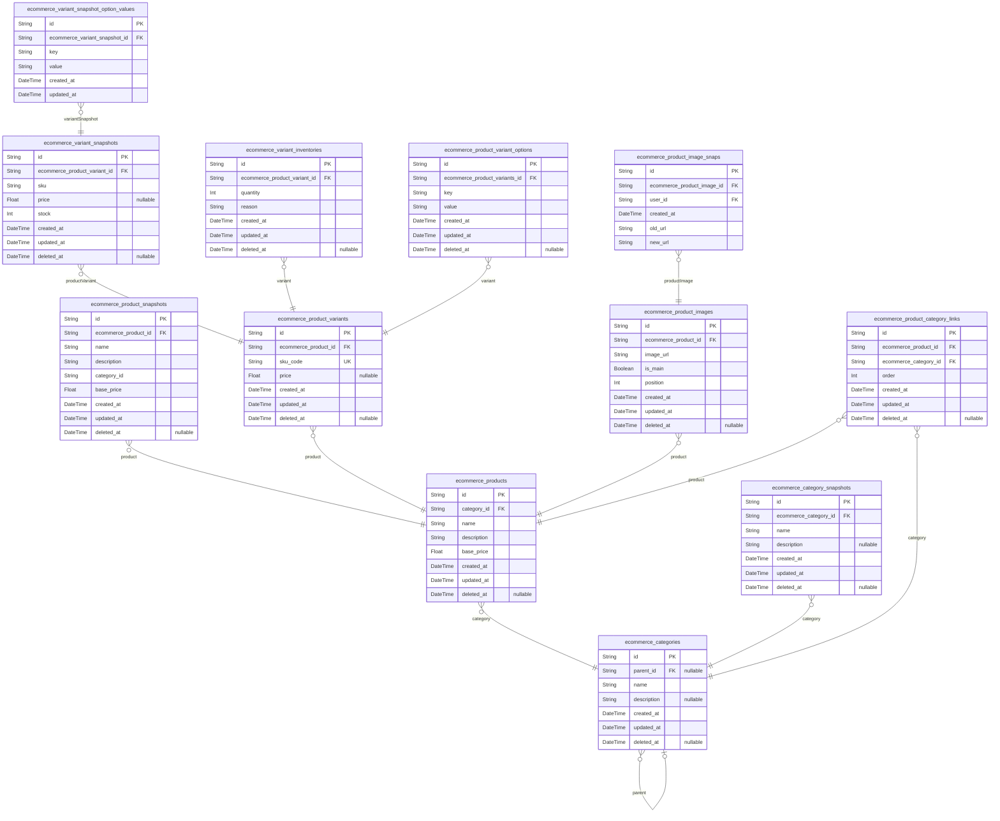
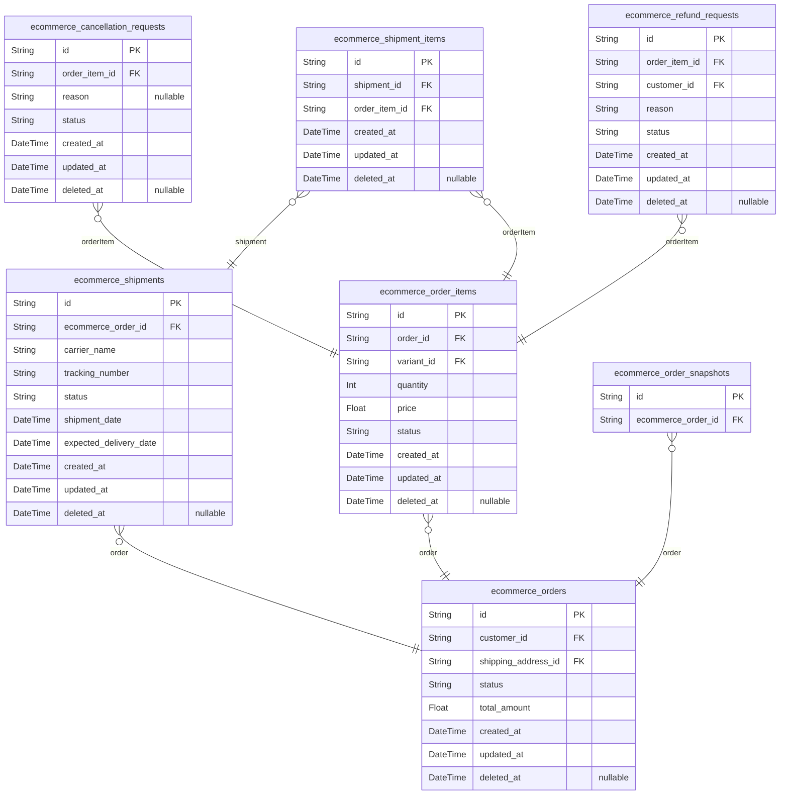
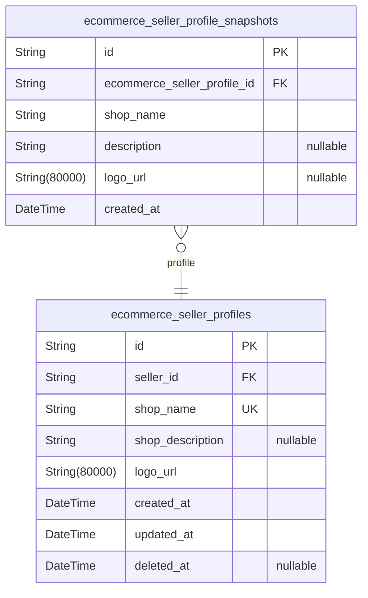
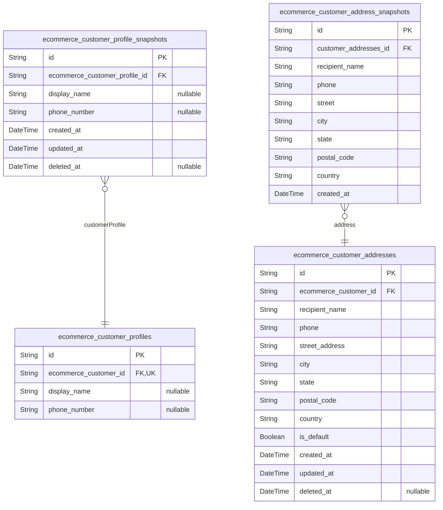
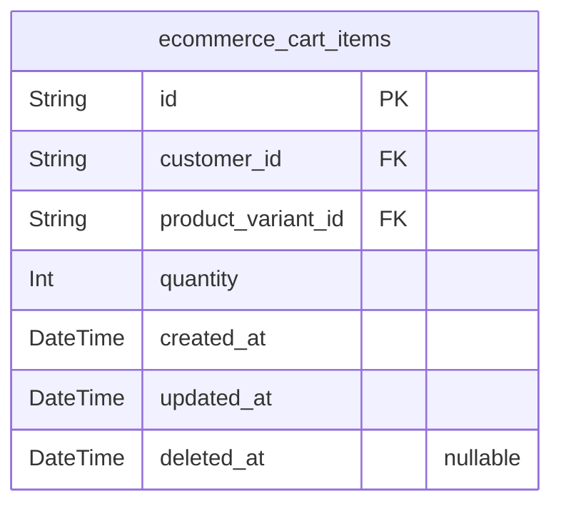

# Prisma Markdown

> Generated by [`prisma-markdown`](https://github.com/samchon/prisma-markdown)

- [Actors](#actors)
- [Products](#products)
- [Orders](#orders)
- [SellerProfile](#sellerprofile)
- [CustomerProfile](#customerprofile)
- [Cart](#cart)

## Actors

```mermaid
erDiagram
"ecommerce_customers" {
  String id PK
  String email UK
  String password_hash
  Boolean email_verified
  Boolean is_suspended
  DateTime created_at
  DateTime updated_at
  DateTime deleted_at "nullable"
}
"ecommerce_customer_sessions" {
  String id PK
  String customer_id FK
  String ip
  String href
  String referrer
  DateTime created_at
  DateTime updated_at
  DateTime expired_at
  DateTime deleted_at "nullable"
}
"ecommerce_customer_email_verifications" {
  String id PK
  String ecommerce_customer_id FK
  String token UK
  DateTime expires_at
  DateTime created_at
  DateTime updated_at
  DateTime deleted_at "nullable"
}
"ecommerce_customer_password_resets" {
  String id PK
  String customer_id FK
  String token UK
  DateTime expires_at
  DateTime used_at "nullable"
  DateTime created_at
  DateTime updated_at
  DateTime deleted_at "nullable"
}
"ecommerce_sellers" {
  String id PK
  String email UK
  String password_hash
  String name "nullable"
  String description "nullable"
  String status
  DateTime created_at
  DateTime updated_at
  DateTime deleted_at "nullable"
}
"ecommerce_seller_sessions" {
  String id PK
  String ecommerce_seller_id FK
  String ip
  String href
  String referrer
  DateTime created_at
  DateTime expired_at
}
"ecommerce_seller_email_verifications" {
  String id PK
  String ecommerce_seller_id FK
  String token UK
  DateTime expires_at
  DateTime created_at
  DateTime updated_at
  DateTime deleted_at "nullable"
}
"ecommerce_seller_password_resets" {
  String id PK
  String seller_id FK
  String token UK
  DateTime expires_at
  DateTime created_at
  DateTime updated_at
}
"ecommerce_admins" {
  String id PK
  String email UK
  String password_hash
  DateTime created_at
  DateTime updated_at
  DateTime deleted_at "nullable"
}
"ecommerce_admin_sessions" {
  String id PK
  String ecommerce_admin_id FK
  String ip
  String href
  String referrer
  DateTime created_at
  DateTime expired_at
}
"ecommerce_admin_password_resets" {
  String id PK
  String ecommerce_admin_id FK
  String token
  DateTime expires_at
  DateTime used_at "nullable"
  DateTime created_at
  DateTime updated_at
  DateTime deleted_at "nullable"
}
"ecommerce_admin_audit_logs" {
  String id PK
  String admin_id FK
  String action
  String action_details "nullable"
  String target_entity
  String old_state
  String new_state
  DateTime created_at
  DateTime updated_at
  DateTime deleted_at "nullable"
}
"ecommerce_customer_sessions" }o--|| "ecommerce_customers" : customer
"ecommerce_customer_email_verifications" }o--|| "ecommerce_customers" : customer
"ecommerce_customer_password_resets" }o--|| "ecommerce_customers" : customer
"ecommerce_seller_sessions" }o--|| "ecommerce_sellers" : seller
"ecommerce_seller_email_verifications" }o--|| "ecommerce_sellers" : seller
"ecommerce_seller_password_resets" }o--|| "ecommerce_sellers" : seller
"ecommerce_admin_sessions" }o--|| "ecommerce_admins" : admin
"ecommerce_admin_password_resets" }o--|| "ecommerce_admins" : admin
"ecommerce_admin_audit_logs" }o--|| "ecommerce_admins" : admin
```

### `ecommerce_customers`

Customer accounts with email and password credentials for authentication,
including email verification tracking. Tracks suspension status for
account management. Email is the primary authentication identity, with
secure password hashing. Customer accounts require email verification
before full access to platform features.

Properties as follows:

- `id`: Primary Key.
- `email`
  > Customer's email address, used for authentication and notifications. Must
  > be unique across all customers.
- `password_hash`: Securely hashed password using bcrypt. Never stored in plaintext.
- `email_verified`
  > Indicates whether customer's email has been verified. Required before
  > full platform access.
- `is_suspended`
  > Indicates whether the customer account is suspended. Suspended accounts
  > cannot log in.
- `created_at`: Timestamp when the customer account was created.
- `updated_at`: Timestamp when the customer account was last updated.
- `deleted_at`
  > Timestamp when the customer account was marked for deletion (soft
  > delete). Never physically deleted from database.

### `ecommerce_customer_sessions`

Session tokens for customer authentication with JWT access/refresh tokens
and 30-minute inactivity timeout. Includes connection metadata for
security auditing and session tracking. Each session belongs to a
customer and expires after 30 minutes of inactivity.

The expired_at field enforces 30-minute timeout security constraint,
preventing session hijacking. Session data is automatically cleaned up
with a background job when expired_at is reached.

Properties as follows:

- `id`: Primary Key.
- `customer_id`: Belonged customer's [ecommerce_customers.id](#ecommerce_customers).
- `ip`: Client IP address.
- `href`: Page URL from which the session was initiated.
- `referrer`: Previous page URL that led to session creation.
- `created_at`: Timestamp when session was created.
- `updated_at`: Timestamp when session was last updated.
- `expired_at`
  > Timestamp when session expires (30 minutes after creation, security
  > enforcement).
- `deleted_at`: Timestamp when session was logically deleted (soft delete).

### `ecommerce_customer_email_verifications`

Email verification tokens with expiration for customer account
registration, used during new account creation to confirm email
ownership. Includes tokens, expiration times, and customer reference for
authentication flow.

Properties as follows:

- `id`: Primary Key.
- `ecommerce_customer_id`: Customer's {@link ecommerce_customers.id whose email is being verified.
- `token`: Randomly generated verification token.
- `expires_at`: Expiration timestamp for the verification token.
- `created_at`: Token creation timestamp.
- `updated_at`: Token last updated timestamp.
- `deleted_at`: Soft delete timestamp for expired tokens.

### `ecommerce_customer_password_resets`

Password reset tokens with expiration and binding to customer accounts.

Properties as follows:

- `id`: Primary Key.
- `customer_id`: Customer account's [ecommerce_customers.id](#ecommerce_customers).
- `token`: Unique token used to verify password reset request.
- `expires_at`: When the password reset token expires.
- `used_at`: When a password reset token was successfully used for password change.
- `created_at`: When the password reset request was initiated.
- `updated_at`: When the password reset request was last updated.
- `deleted_at`: When the password reset token was marked as deleted (soft delete).

### `ecommerce_sellers`

Registered seller accounts with email/password credentials and pending
approval status. Seller accounts require administrator approval before
they can list products for sale. This table serves as the canonical
identity record for sellers with its own authentication flow and business
logic.

Properties as follows:

- `id`: Primary Key.
- `email`
  > Email address used for identification, authentication, and communication.
  > Should be a valid email format and unique across all seller accounts.
- `password_hash`
  > Secure hash of the seller's password stored using bcrypt with minimum 8
  > characters complexity constraint. Cannot be null and must be generated
  > during registration or password reset.
- `name`
  > Business name of the seller (e.g., 'ABC Wholesale'), shown publicly on
  > product listings. Optional field but recommended.
- `description`
  > Brief description of the seller business (e.g., 'We offer quality
  > electronics since 2010'), shown on seller profile. Optional field with
  > maximum 500 characters.
- `status`
  > Current approval status of the seller. Allowed values: 'pending',
  > 'approved', 'rejected'. Must be initialized to 'pending' upon
  > registration.
- `created_at`: Timestamp when the seller account was created.
- `updated_at`: Timestamp when the seller's account details were last updated.
- `deleted_at`
  > Timestamp when the seller account was marked for deletion (soft delete
  > implementation). Nullable as it indicates whether the account is active
  > or not.

### `ecommerce_seller_sessions`

JWT session tokens with access/refresh tokens for seller authentication,
including connection metadata and expiry times for security. Serves as
session management for seller identity verification.

Properties as follows:

- `id`: Primary Key.
- `ecommerce_seller_id`: Seller account's [ecommerce_sellers.id](#ecommerce_sellers).
- `ip`: IP address used for this session.
- `href`: URL reference (current page) when login occurred.
- `referrer`: HTTP referrer (previous page) when login occurred.
- `created_at`: When this session was created.
- `expired_at`: When this session expires (not earlier than when it was created).

### `ecommerce_seller_email_verifications`

Email verification tokens with expiration for seller registration, used
to validate seller accounts during onboarding. Contains unique tokens
linked to seller accounts with expiration timestamps and verification
status.

Properties as follows:

- `id`: Primary Key.
- `ecommerce_seller_id`
  > Seller account associated with this verification token. {@link
  > ecommerce_sellers.id}
- `token`: Unique verification token sent to seller's email for registration.
- `expires_at`: Timestamp when the verification token expires.
- `created_at`: Timestamp when the verification record was created.
- `updated_at`: Timestamp when the verification record was last updated.
- `deleted_at`: Timestamp when the verification record was deleted (soft delete).

### `ecommerce_seller_password_resets`

Password reset tokens for seller accounts with expiration timestamps and
binding to specific seller account.

- Securely generated tokens (32-64 characters) for authentication flow.
- Expiration set to 15 minutes after creation for security.
- Relationship established with seller accounts (1:N).

Properties as follows:

- `id`: Primary Key.
- `seller_id`: Seller's account ID. {@link ecommerce_sellers.id.
- `token`: Securely generated token for resetting password, unique per request.
- `expires_at`: Timestamp when password reset token expires (15 minutes after creation).
- `created_at`: Timestamp when password reset token was created.
- `updated_at`: Timestamp of the last update to the password reset token.

### `ecommerce_admins`

Admin accounts with email/password credentials and admin role permissions

Properties as follows:

- `id`: Primary Key.
- `email`: Unique email address for authentication.
- `password_hash`: Securely hashed password using bcrypt.
- `created_at`: Timestamp when the account was created.
- `updated_at`: Timestamp when the account details were last updated.
- `deleted_at`: Timestamp when the account was marked for deletion (soft delete).

### `ecommerce_admin_sessions`

Session tokens for administrative authentication with JWT tokens, IP
tracking, navigation context, and 30-minute timeout. Captures login
context for audit and security monitoring.

Session tokens in this table belong to administrative accounts (managed
by 'ecommerce_admins' table) and are used for API authentication. Each
session records login IP, navigation referrer, and token expiration for
security purposes.

Multiple sessions per admin are allowed for concurrent logins (e.g.,
multiple devices), but sessions expire after 30 minutes of inactivity.

Properties as follows:

- `id`: Primary Key.
- `ecommerce_admin_id`: Associated administrator's account. [ecommerce_admins.id](#ecommerce_admins).
- `ip`: IP address used during login for security monitoring.
- `href`: Navigation URL provided after login for session tracking.
- `referrer`: Referral source for session initiation (e.g., Google Chrome web client).
- `created_at`: Timestamp when session was created.
- `expired_at`: Timestamp when session expires for security.

### `ecommerce_admin_password_resets`

Password reset tokens for admin accounts (no email verification needed).
Each token has an expiration timestamp and is tied to a specific admin
account. Tokens expire after 30 minutes for security.

Properties as follows:

- `id`: Primary Key.
- `ecommerce_admin_id`: Admin account associated with this password reset token.
- `token`: The actual password reset token used for verification.
- `expires_at`: Timestamp when this password reset token expires.
- `used_at`: Timestamp when this password reset token was used to reset password.
- `created_at`: Timestamp when this password reset entry was created.
- `updated_at`: Timestamp when this password reset entry was last updated.
- `deleted_at`: Timestamp when this password reset entry was soft-deleted (if applicable).

### `ecommerce_admin_audit_logs`

Audit trail of all administrative actions, capturing before/after state
for accountability and dispute resolution. Stores actions performed by
admin users on other entities.

This table is strictly a subsidiary table for admin accounts, managing
audit history through a 1:many relationship with `ecommerce_admins`. It
captures complete state information before and after changes for
transparent dispute resolution.

All audit entries are immutable and never deleted - only marked for soft
deletion when necessary for data retention policy.

Properties as follows:

- `id`: Primary Key.
- `admin_id`: Admin who performed the action. [ecommerce_admins.id](#ecommerce_admins).
- `action`
  > Type of admin action performed (create, update, delete, suspend,
  > unsuspend, promote, demote).
- `action_details`: Additional details about the action performed, if any.
- `target_entity`
  > Entity name this action was applied to (e.g., 'ecommerce_products',
  > 'ecommerce_sellers').
- `old_state`
  > JSON string representation of entity state before the action (for audit
  > purposes).
- `new_state`
  > JSON string representation of entity state after the action (for audit
  > purposes).
- `created_at`: When the audit entry was created (timestamp) for tracking.
- `updated_at`: When the audit entry was last updated (timestamp).
- `deleted_at`
  > When the audit entry was deleted (timestamp for soft delete) if
  > applicable.

## Products

### `ecommerce_products`

Core product listings with name, description, category ID, and base
price. Products are declared by sellers and visible to customers. Each
product belongs to a single category (with subcategories supported
through the categories hierarchy).

Properties as follows:

- `id`: Primary Key.
- `category_id`: Category this product belongs to. [ecommerce_categories.id](#ecommerce_categories)
- `name`: Product name (minimum 5 characters).
- `description`: Product description (minimum 10 characters).
- `base_price`: Base price of the product (minimum $0.01).
- `created_at`: Timestamp of product creation.
- `updated_at`: Timestamp of last product update.
- `deleted_at`: Timestamp of product deletion (soft delete).

### `ecommerce_product_snapshots`

Product snapshots for change history tracking.

Contains immutable historical state of product records including all fields.
Captures full state at the time of product editing for audit and dispute
resolution.
Snapshots are retained permanently regardless of product deletion.

Properties as follows:

- `id`: Primary Key.
- `ecommerce_product_id`: Product being snapped. [ecommerce_products.id](#ecommerce_products).
- `name`: Name of the product at snapshot time.
- `description`: Description of the product at snapshot time.
- `category_id`
  > Category ID of the product at snapshot time. {@link
  > ecommerce_categories.id}.
- `base_price`: Base price of the product at snapshot time.
- `created_at`: When this snapshot was created.
- `updated_at`
  > When this snapshot was last updated (should be same as created_at for
  > immutable snapshot).
- `deleted_at`: When this snapshot was logically deleted for audit purposes (never used).

### `ecommerce_product_variants`

SKU-specific product variants with their option values and
variant-specific pricing. Each variant belongs to one product and allows
price overrides for specific options. Requires independent management by
sellers for inventory and pricing control.

Properties as follows:

- `id`: Primary Key.
- `ecommerce_product_id`: Parent product this variant belongs to. [ecommerce_products.id](#ecommerce_products).
- `sku_code`: Unique SKU code for the variant (e.g., 'RED-LARGE').
- `price`
  > Variant-specific price (overrides product base price; null means use
  > product's base price).
- `created_at`: When the variant was first created.
- `updated_at`: When the variant was last updated.
- `deleted_at`: When the variant was soft-deleted (null if currently active).

### `ecommerce_variant_snapshots`

Snapshot of product variant modifications. Captures SKU, option values,
price, stock, and timestamps for historical tracking. Preserves complete
state for audit trails and dispute resolution as per platform
requirements.

Properties as follows:

- `id`: Primary Key.
- `ecommerce_product_variant_id`: Variant being snapshotted. [ecommerce_product_variants.id](#ecommerce_product_variants).
- `sku`: SKU identifier (unique within product variants).
- `price`: Variant-specific price at time of snapshot.
- `stock`: Stock quantity of variant at time of snapshot.
- `created_at`: Timestamp when this snapshot was created (for audit purposes).
- `updated_at`: Timestamp of last update to this snapshot.
- `deleted_at`: Timestamp when this snapshot was soft-deleted (null if not deleted).

### `ecommerce_product_images`

Stores multiple image files for each product with ordering metadata.

Images can be uploaded by sellers for product listings. Each product can
have multiple images.
Images can be reordered (position), and the first image is marked as the
main/thumbnail image.

All images are stored via URL references, not file data.
Images are included in the product snapshots for historical reference.

Properties as follows:

- `id`: Primary Key.
- `ecommerce_product_id`: Product this image belongs to. [ecommerce_products.id](#ecommerce_products).
- `image_url`: URL to the image file (stored in cloud storage).
- `is_main`: Whether this image is the main thumbnail for the product.
- `position`: Position of the image in the product gallery (0=first, 1=second, etc.).
- `created_at`: Timestamp when the image was added.
- `updated_at`: Timestamp when the image was last updated.
- `deleted_at`: Timestamp when the image was soft-deleted (null if not deleted).

### `ecommerce_product_image_snaps`

Immutable historical record of image changes for product listings,
capturing all modifications with before/after values. Preserves image
metadata for audit and dispute resolution. Each snapshot corresponds to a
specific product image modification.

Properties as follows:

- `id`: Primary Key.
- `ecommerce_product_image_id`
  > Reference to the product image being snapped. {@link
  > ecommerce_product_images.id}
- `user_id`: User who triggered the image change. [actors.id](#actors)
- `created_at`: Timestamp of the image snapshot creation.
- `old_url`: Previous image URL before modification.
- `new_url`: New image URL after modification.

### `ecommerce_categories`

Category hierarchy with one-level subcategories. Root categories have no
parent. Managed exclusively by administrators. Used for product
categorization and browsing by customers.

Categories are organized as a parent-child hierarchy with only one level
of subcategories. Root categories are displayed at top level and may have
child categories. Each category has a name and optional description.
Category hierarchy supports product browsing by customer, where they can
filter products by category or subcategory.

Admins manage categories through the administrator interface, with a
dedicated category management feature. The category structure persists
across the platform for product listing and search.

Properties as follows:

- `id`: Primary Key.
- `parent_id`: Reference to parent category. May be null for root categories.
- `name`: Category name (e.g., 'Electronics', 'Clothing'). Maximum 50 characters.
- `description`
  > Category description (e.g., 'All electronic devices and accessories').
  > Maximum 255 characters.
- `created_at`: Timestamp when category was created.
- `updated_at`: Timestamp when category was last updated.
- `deleted_at`: Timestamp when category was soft-deleted. Nullable to support soft delete.

### `ecommerce_category_snapshots`

Immutable history of category name and description changes, capturing
point-in-time states for audit trails. Records all category fields at the
time of modification with timestamp and versioning.

**Key Business Context:**
- Preserves full category state history for administrators
- Required to satisfy 'Snapshot Principle Implementation' in Functional
Requirements
- All category field modifications (name, description) trigger a new
snapshot
- Used for dispute resolution in category management
- Preserves historical context even after category deletion

Properties as follows:

- `id`: Primary Key.
- `ecommerce_category_id`: The category this snapshot belongs to. [ecommerce_categories.id](#ecommerce_categories).
- `name`: Category name at the time of snapshot creation
- `description`: Category description at the time of snapshot creation
- `created_at`: Timestamp when snapshot was created
- `updated_at`: Timestamp when the underlying category was last modified
- `deleted_at`: Timestamp of logical deletion (soft delete)

### `ecommerce_product_category_links`

Junction table linking products to categories with explicit ordering.
Each product can belong to multiple categories and each category can
contain multiple products. The 'order' field indicates the position of
the category in the product's category listing (e.g., main category,
secondary category).

Properties as follows:

- `id`: Primary Key.
- `ecommerce_product_id`
  > Product to which this category link belongs. {@link
  > ecommerce_products.id}.
- `ecommerce_category_id`
  > Category to which this product link belongs. {@link
  > ecommerce_categories.id}.
- `order`
  > The position of this category in the product's category list. Lower
  > numbers indicate higher priority (first category = primary).
- `created_at`: Record creation timestamp.
- `updated_at`: Record last modification timestamp.
- `deleted_at`: Soft delete timestamp for records no longer active.

### `ecommerce_variant_inventories`

Tracks inventory quantity changes including restocking, order deductions,
and adjustments with detailed reasons and timestamps. Each record
represents a specific inventory transaction with quantities and reasons.

This table serves as the historical ledger for variant inventory changes
and is managed exclusively through variant management operations. It does
not require standalone CRUD endpoints but is accessed via variant detail
APIs.

- References: ecommerce_product_variants, created_at, updated_at, deleted_at

Properties as follows:

- `id`: Primary Key.
- `ecommerce_product_variant_id`
  > Product variant for which inventory was adjusted. {@link
  > ecommerce_product_variants.id}.
- `quantity`
  > Net change in inventory quantity (positive for restocking, negative for
  > orders/adjustments).
- `reason`
  > Reason for the inventory adjustment (e.g., 'order', 'restock', 'manual
  > adjustment').
- `created_at`: When the inventory adjustment was created.
- `updated_at`: When the inventory adjustment was last updated.
- `deleted_at`: When the inventory adjustment record was deleted (soft delete).

### `ecommerce_product_variant_options`

Normalized key-value storage for variant options (e.g., color, size) to
replace JSON string field in product variants. Each option is a key-value
pair representing variant attributes like color or size. Ensures 1NF
compliance by converting transitive dependencies into separate table
records.

Properties as follows:

- `id`: Primary Key.
- `ecommerce_product_variants_id`
  > Reference to the product variant this option belongs to. {@link
  > ecommerce_product_variants.id}.
- `key`
  > Option key (e.g., 'color', 'size'). Must match a valid variant option
  > type.
- `value`: Option value (e.g., 'red', 'large'). Corresponds to the key.
- `created_at`: Record creation timestamp.
- `updated_at`: Record last update timestamp.
- `deleted_at`: Soft delete timestamp (null if not deleted).

### `ecommerce_variant_snapshot_option_values`

Stores normalized key-value pairs for product variant options in
snapshots. Each entry represents a single option (key, value) associated
with a variant snapshot. Ensures 1NF compliance and supports full history
tracking per snapshot.

This table enables efficient historical tracking of variant
modifications, including color, size, and other option attributes at the
time of each snapshot. Each entry is uniquely identified by its snapshot
and option key.

Reference: [ecommerce_variant_snapshots.id](#ecommerce_variant_snapshots)

Properties as follows:

- `id`: Primary Key.
- `ecommerce_variant_snapshot_id`
  > Link to the parent variant snapshot's {@link
  > ecommerce_variant_snapshots.id}.
- `key`
  > Name of the option (e.g., 'color', 'size'). Must be a normalized key from
  > product variant options.
- `value`: Value of the option (e.g., 'red', 'L'). Matches the option key's context.
- `created_at`: Timestamp when the option value was created.
- `updated_at`: Timestamp when the option value was last updated.

## Orders

### `ecommerce_orders`

Main order records with order details, status, and customer reference.
Each order represents a collection of purchased items from one or more
sellers, created after successful payment to reflect accurate purchase
history. Status is computed from individual order items' statuses (paid,
shipped, delivered, cancelled, refunded, partially completed) and stored
for quick business reporting.

- Works with ecommerce_order_items for item-level details
- References ecommerce_customers for customer identity
- References ecommerce_customer_addresses for shipping locations

Properties as follows:

- `id`: Primary Key.
- `customer_id`: Customer who placed the order. [ecommerce_customers.id](#ecommerce_customers).
- `shipping_address_id`: Shipping address for this order. [ecommerce_customer_addresses.id](#ecommerce_customer_addresses).
- `status`
  > Current order status based on item statuses (paid, shipped, delivered,
  > cancelled, refunded, partially completed).
- `total_amount`
  > Total amount for the entire order, including item costs but excluding tax
  > or shipping fees.
- `created_at`: Timestamp when the order was created (after payment succeeded).
- `updated_at`: Timestamp when the order status or details were last updated.
- `deleted_at`: Timestamp when the order was marked for deletion (soft delete).

### `ecommerce_order_items`

Represents individual product variants purchased within orders, including
the exact purchase price, quantity, and current status of the item.
Tracks the relationship to the parent order, the specific product variant
sold, and the lifecycle status from payment through delivery or
cancellation. Follows the Snapshot Principle for all status transitions
and price records.

Properties as follows:

- `id`: Primary Key.
- `order_id`: The parent order that contains this item. [ecommerce_orders.id](#ecommerce_orders)
- `variant_id`
  > The product variant sold in this order item. {@link
  > ecommerce_product_variants.id}
- `quantity`: Number of units purchased of this variant.
- `price`
  > Price per unit at the time of purchase, including any variant-specific
  > price overrides.
- `status`
  > Current status of the item in the order lifecycle: paid, shipped,
  > delivered, cancelled, or refunded.
- `created_at`: Timestamp when the order item was created (time of order placement).
- `updated_at`
  > Timestamp of the last change to the order item (status update, quantity
  > change).
- `deleted_at`: Timestamp when the order item was soft-deleted (null for active items).

### `ecommerce_shipments`

Shipping packages representing physical deliveries with tracking
information. Each shipment is associated with specific order items from
the same seller and contains tracking data for customers to monitor
delivery status.

Properties as follows:

- `id`: Primary Key.
- `ecommerce_order_id`
  > Reference to the order this shipment belongs to. {@link
  > ecommerce_orders.id.
- `carrier_name`: Name of the shipping carrier (e.g., 'USPS', 'DHL', 'FedEx').
- `tracking_number`: Shipping tracking number provided by carrier. Unique per shipment.
- `status`
  > Current shipping status. Values: 'pending', 'in_progress', 'shipped',
  > 'delivered', 'cancelled'.
- `shipment_date`: Date and time when the shipment was sent by the seller.
- `expected_delivery_date`: Estimated date and time when the shipment will be delivered.
- `created_at`: Timestamp when the shipment record was created.
- `updated_at`: Timestamp when the shipment record was last updated.
- `deleted_at`: Timestamp when the shipment record was soft-deleted (if applicable).

### `ecommerce_shipment_items`

Association between order items and their shipment packages.

This junction table records the mapping between order items and
shipments. An order item can be part of only one shipment (1:N
relationship), and a shipment can contain multiple order items from the
same seller.

Junction table ensures proper shipment grouping and ordering during
shipping operations.

Properties as follows:

- `id`: Primary Key.
- `shipment_id`
  > The shipment the order item is associated with. {@link
  > ecommerce_shipments.id}.
- `order_item_id`
  > The order item associated with this shipment. {@link
  > ecommerce_order_items.id}.
- `created_at`: Timestamp when the association was created.
- `updated_at`: Timestamp when the association was last updated.
- `deleted_at`: Timestamp when the association was logically deleted.

### `ecommerce_order_snapshots`

Immutable historical records of order changes for audit and dispute
resolution.

This table captures a point-in-time state of each order during
modifications, preserving all relevant order fields including status,
total price, and customer reference. Snapshots are appended automatically
when order state changes occur, allowing complete audit trails of order
status transitions throughout the system lifecycle. All historical order
states are preserved indefinitely for legal compliance, dispute
resolution, and customer support.

Note: This table records the state of the order at the time of
modification, with each snapshot corresponding to a specific change
event. To get the current order state, use the ecommerce_orders table.

Properties as follows:

- `id`: Primary Key.
- `ecommerce_order_id`: Order entity that was modified. [ecommerce_orders.id](#ecommerce_orders).

### `ecommerce_cancellation_requests`

Customer requests to cancel specific order items before shipping. Each
request requires seller approval or rejection and includes a cancellation
reason. This table is managed through order item operations, not directly
by customers.

- Each request corresponds to a single order item (order_item_id)
- Status transitions: pending → approved/rejected
- Reason field stores customer-specified cancellation justification
(optional)
- Snapshots track state changes via order item lifecycle management

Properties as follows:

- `id`: Primary Key.
- `order_item_id`: Belonged order item's {@link ecommerce_order_items.id.
- `reason`
  > Customer-specified cancellation reason. Optional field for user-provided
  > justification.
- `status`
  > Current cancellation request status (pending/approved/rejected). Valid
  > values: pending, approved, rejected.
- `created_at`: Timestamp when cancellation request was submitted.
- `updated_at`: Timestamp when cancellation request status was last updated.
- `deleted_at`
  > Timestamp when cancellation request was soft-deleted. Nullable for soft
  > delete.

### `ecommerce_refund_requests`

Customer refund requests for delivered order items within the 7-day window.

This table captures all customer refund requests for items that have been
delivered. Each request includes a reason for the refund and its current
status (pending, approved, rejected). The refund request process requires
that the item has a status of 'delivered' (as per Order Status), and the
request must be submitted within 7 days of delivery.

The table has relationships to order items (via order_item_id) and
customers (via customer_id), allowing for efficient querying by both
customers and sellers. Snapshots are created for refund request status
changes, recorded in the ecommerce_refund_request_snapshots table which
is part of the Order component.

Properties as follows:

- `id`: Primary Key.
- `order_item_id`: Referenced order item. [ecommerce_order_items.id](#ecommerce_order_items)
- `customer_id`: Customer who requested the refund. [ecommerce_customers.id](#ecommerce_customers)
- `reason`: Reason for the refund request (text provided by customer).
- `status`: Current status of the refund request (pending, approved, rejected).
- `created_at`: Record creation timestamp.
- `updated_at`: Record last update timestamp.
- `deleted_at`: Soft delete timestamp. Null means not deleted.

## SellerProfile

### `ecommerce_seller_profiles`

Currently active seller profile state, including shop name, description,
and logo URL. Each seller has exactly one active profile. This is the
main entity for seller profile management, representing the public-facing
information visible in product listings and search results.

Properties as follows:

- `id`: Primary Key.
- `seller_id`: Refers to the parent seller account. [ecommerce_sellers.id](#ecommerce_sellers)
- `shop_name`
  > Unique shop name that appears publicly, used for identification. Must be
  > 3-50 characters.
- `shop_description`: Shop description visible on product listings. Maximum 500 characters.
- `logo_url`
  > URL to the seller's logo image file. Used for display on product detail
  > and search results.
- `created_at`: Timestamp when the profile was created.
- `updated_at`: Timestamp when the profile was last updated.
- `deleted_at`: Timestamp when the profile was logically deleted. Null means it's active.

### `ecommerce_seller_profile_snapshots`

Immutable snapshot history of seller profile changes with timestamps and
complete field states, preserving shop name, description, and logo at
each modification point for historical audit and dispute resolution.

Properties as follows:

- `id`: Primary Key.
- `ecommerce_seller_profile_id`: Seller profile being snapped, [ecommerce_seller_profiles.id](#ecommerce_seller_profiles).
- `shop_name`: Current shop name at snapshot time.
- `description`: Current shop description at snapshot time.
- `logo_url`: Current logo URL at snapshot time.
- `created_at`: Timestamp when the snapshot was created.

## CustomerProfile

### `ecommerce_customer_profiles`

Customer primary contact information and display name. Stores display
name up to 50 characters and validated phone number, with audit
timestamps for profile changes.

This table supports customer profile editing requirements where users
maintain their own profile data with optional display name and
international phone number. The 1:1 relationship with ecommerce_customers
ensures consistent session context while preserving profile independence
from authentication.

Properties as follows:

- `id`: Primary Key.
- `ecommerce_customer_id`: Customer's primary account ID. [ecommerce_customers.id](#ecommerce_customers).
- `display_name`: Customer's public display name (max 50 characters).
- `phone_number`: International phone number in E.164 format.

### `ecommerce_customer_profile_snapshots`

Immutable history of customer profile changes with timestamps. Captures
all customer profile attributes (display name, phone number) at the time
of modification for audit and dispute resolution. Each snapshot links to
the original customer profile entity while preserving historical data
regardless of subsequent updates.

This table is intentionally denormalized to include all profile fields
directly, as per the Snapshot Principle implementation in business
requirements. It serves as the audit trail for all profile modifications
and is required for dispute resolution between customers and
administrators.

Properties as follows:

- `id`: Primary Key.
- `ecommerce_customer_profile_id`: Reference to the customer profile that was modified.
- `display_name`: The display name of the customer at the time of snapshot.
- `phone_number`: The phone number of the customer at the time of snapshot.
- `created_at`: Timestamp when the profile snapshot was created.
- `updated_at`
  > Last modification timestamp for the snapshot (always matches created_at
  > in this context).
- `deleted_at`: Logical deletion timestamp for the snapshot (soft delete support).

### `ecommerce_customer_addresses`

Multiple shipping addresses associated with customer profiles, each with
validation rules for international formats. Includes fields for recipient
name, physical location details, and a default flag for checkout
optimization. Adheres to business requirements for address management.

Properties as follows:

- `id`: Primary Key.
- `ecommerce_customer_id`: Associated customer's [ecommerce_customers.id](#ecommerce_customers).
- `recipient_name`: Recipient's full name for address delivery.
- `phone`: International phone number using E.164 format.
- `street_address`: Full street address including building number and apartment.
- `city`: City name for delivery location.
- `state`: State/province code or full name for delivery location.
- `postal_code`: International postal code for delivery location.
- `country`: Country name or code for delivery location.
- `is_default`: Marks this address as the user's default shipping address.
- `created_at`: Timestamp when the address was created.
- `updated_at`: Timestamp when the address was last updated.
- `deleted_at`: Timestamp when the address was soft-deleted (null if active).

### `ecommerce_customer_address_snapshots`

Immutable historical record of customer shipping address modifications
for audit purposes. Captures all address fields and timestamp at change
event to maintain full context for dispute resolution. Contains
denormalized copies of all address fields (recipient_name, phone, street,
city, state, postal_code, country) to avoid complex joins for historical
queries. Each snapshot references the primary address record via
customer_addresses_id.

Properties as follows:

- `id`: Primary Key.
- `customer_addresses_id`
  > Reference to the address record that was modified. {@link
  > ecommerce_customer_addresses.id}.
- `recipient_name`: Recipient name specified at time of address change.
- `phone`: Phone number specified at time of address change.
- `street`: Street address line specified at time of change.
- `city`: City name specified at time of change.
- `state`: State/province specified at time of change.
- `postal_code`: Postal code specified at time of change.
- `country`: Country specified at time of change.
- `created_at`: Timestamp when the address snapshot was created (changes time).

## Cart

### `ecommerce_cart_items`

Active cart items for customers, tracking product variants and quantities
with real-time stock validation for purchase intent.

This table manages cart state during checkout process with:
- 1:1 relationship to customers (cart items belong to one customer)
- 1:N relationship to product variants (single variant per cart item)
- Composite unique constraint preventing duplicate item entries per cart
- Full temporal tracking for audit purposes (created_at, updated_at,
deleted_at)

Properties as follows:

- `id`: Primary Key.
- `customer_id`: The customer who owns this cart item. [ecommerce_customers.id](#ecommerce_customers).
- `product_variant_id`
  > The specific product variant associated with this cart item. {@link
  > ecommerce_product_variants.id}.
- `quantity`: Current quantity of the variant in the cart. Must be at least 1.
- `created_at`: Timestamp when the cart item was created.
- `updated_at`: Timestamp when the cart item was last updated.
- `deleted_at`: Timestamp when this cart item was deleted (soft delete).
