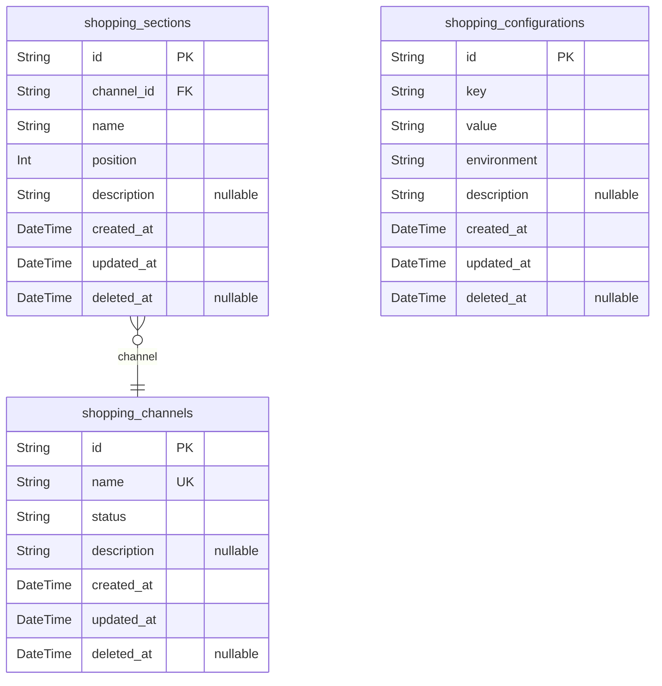
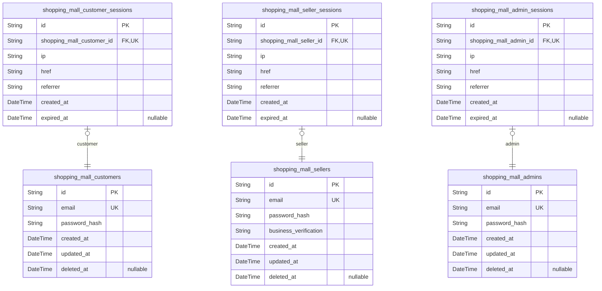
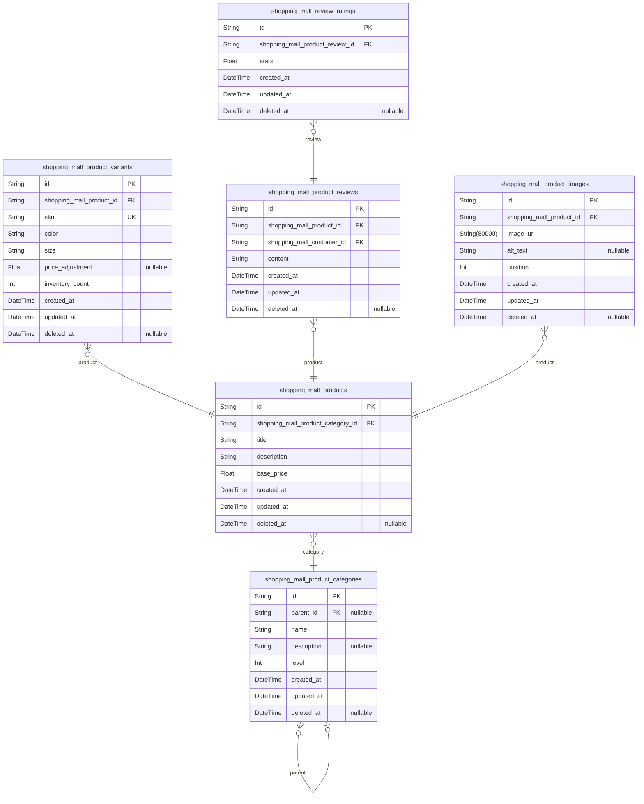
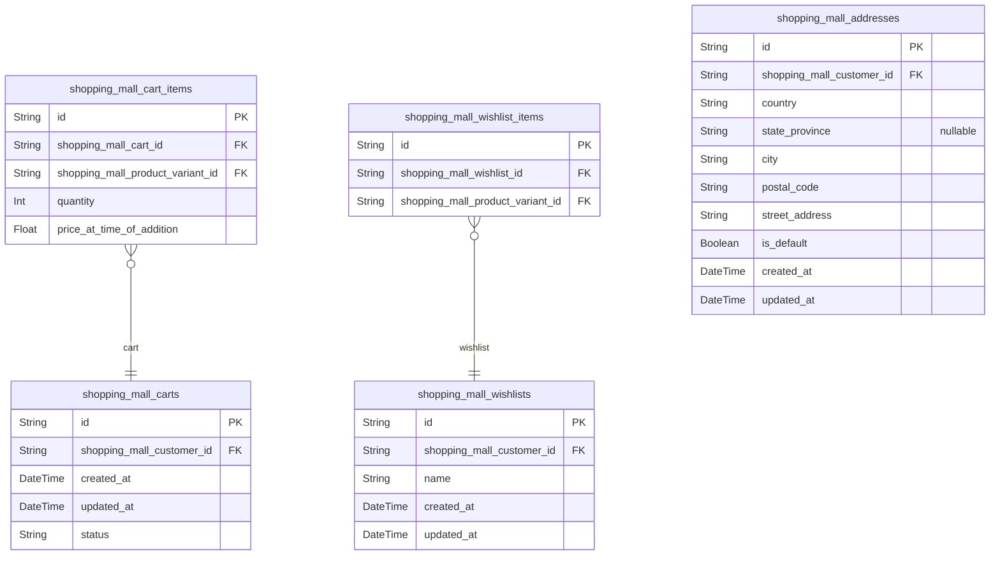
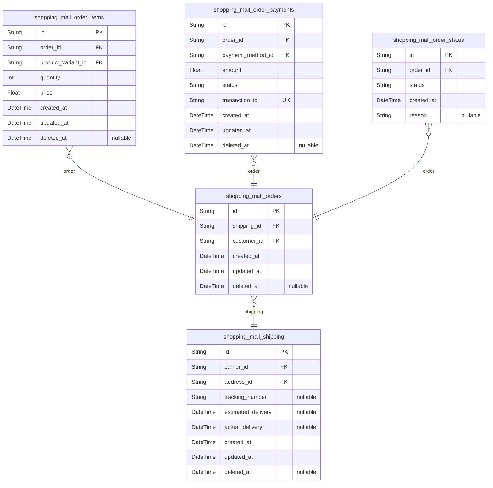
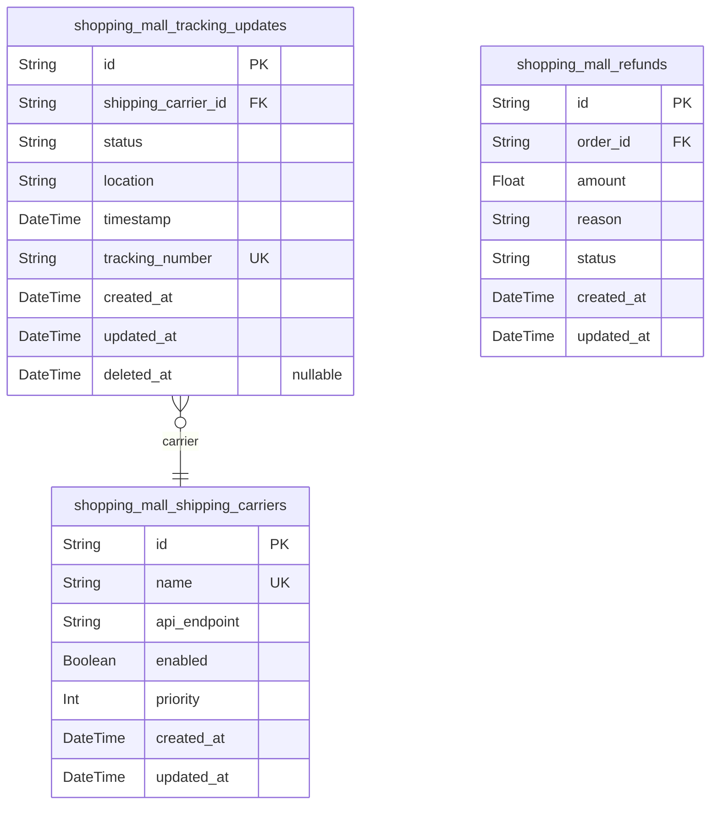
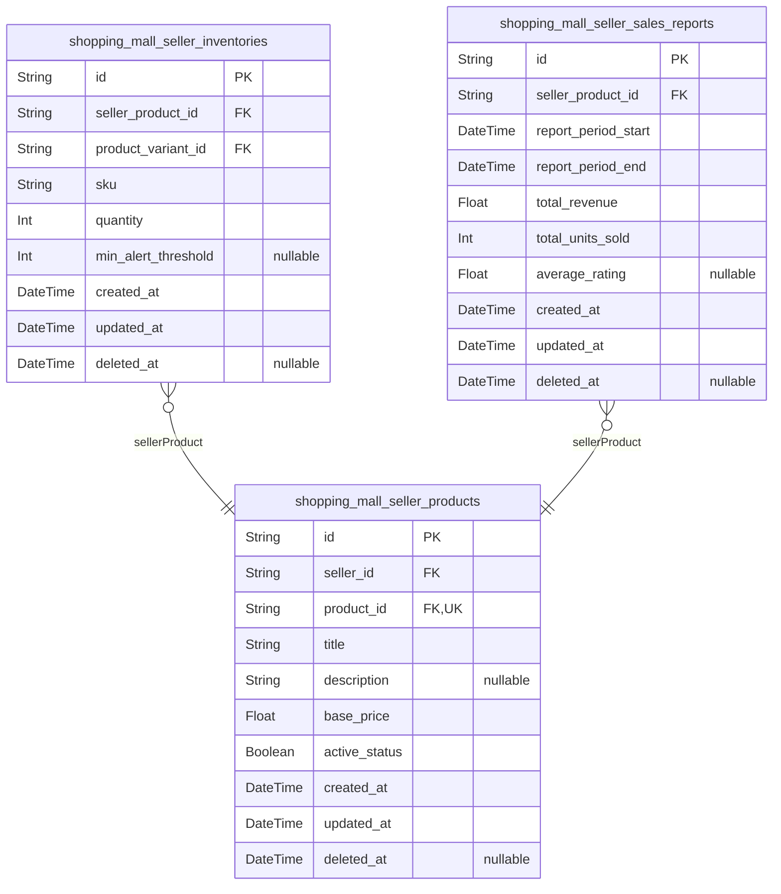
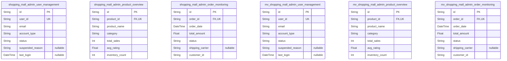

# Prisma Markdown

> Generated by [`prisma-markdown`](https://github.com/samchon/prisma-markdown)

- [Systematic](#systematic)
- [Actors](#actors)
- [Products](#products)
- [Shopping](#shopping)
- [Orders](#orders)
- [OrderManagement](#ordermanagement)
- [SellerPortal](#sellerportal)
- [default](#default)

## Systematic

### `shopping_channels`

Defines distinct sales channels (e.g., web, mobile, physical store) used
for transaction routing and analytics

Properties as follows:

- `id`: Primary Key.
- `name`: Unique channel name (e.g., 'web', 'mobile')
- `status`: Channel operating status (active/inactive)
- `description`: Marketing description of the channel
- `created_at`: Channel creation timestamp
- `updated_at`: Last channel modification timestamp
- `deleted_at`: Soft delete timestamp when channel is deactivated

### `shopping_sections`

Defines platform navigation sections (e.g., new arrivals, best sellers)
that can be associated with multiple channels

Properties as follows:

- `id`: Primary Key.
- `channel_id`: Channel to which this section belongs. [shopping_channels.id](#shopping_channels).
- `name`: Section name (e.g., 'New Arrivals')
- `position`: Display position in navigation menu (lower numbers appear first)
- `description`: Section description for user interface
- `created_at`: Section creation timestamp
- `updated_at`: Last section modification timestamp
- `deleted_at`: Soft delete timestamp when section is deactivated

### `shopping_configurations`

Stores system configuration key-value pairs with environment-specific values

Properties as follows:

- `id`: Primary Key.
- `key`: Configuration key (e.g., 'product_search_timeout')
- `value`: Configuration value
- `environment`: Environment context (production, staging, development)
- `description`: Purpose and usage context of this configuration
- `created_at`: Configuration creation timestamp
- `updated_at`: Last configuration modification timestamp
- `deleted_at`: Soft delete timestamp when configuration is deactivated

## Actors

### `shopping_mall_customers`

Customer information for the e-commerce platform, including
authentication details and account status.

Properties as follows:

- `id`: Primary Key.
- `email`: Unique account identifier for customer authentication.
- `password_hash`: Securely hashed password for customer login.
- `created_at`: Account creation timestamp.
- `updated_at`: Last account modification timestamp.
- `deleted_at`: Timestamp when account was soft deleted.

### `shopping_mall_sellers`

Seller business account information, including business verification and
authentication details.

Properties as follows:

- `id`: Primary Key.
- `email`: Unique business email for seller authentication.
- `password_hash`: Securely hashed password for seller login.
- `business_verification`: Status of business verification process (approved, pending, rejected).
- `created_at`: Business account creation timestamp.
- `updated_at`: Last business account modification timestamp.
- `deleted_at`: Timestamp when business account was soft deleted.

### `shopping_mall_admins`

Administrator account information with full platform permissions.

Properties as follows:

- `id`: Primary Key.
- `email`: Unique email for admin authentication.
- `password_hash`: Securely hashed password for admin login.
- `created_at`: Admin account creation timestamp.
- `updated_at`: Last admin account modification timestamp.
- `deleted_at`: Timestamp when admin account was soft deleted.

### `shopping_mall_customer_sessions`

User sessions for shopping_mall_customers, tracking login sessions with
IP and connection details.

Properties as follows:

- `id`: Primary Key.
- `shopping_mall_customer_id`: Customer's account identifier. [shopping_mall_customers.id](#shopping_mall_customers).
- `ip`: IP address from which session was initiated.
- `href`: Connection URL used for session initiation.
- `referrer`: Referrer URL that led to session initiation.
- `created_at`: Session creation timestamp.
- `expired_at`: Session expiration timestamp (nullable).

### `shopping_mall_seller_sessions`

User sessions for shopping_mall_sellers, tracking login sessions with IP
and connection details.

Properties as follows:

- `id`: Primary Key.
- `shopping_mall_seller_id`: Seller's account identifier. [shopping_mall_sellers.id](#shopping_mall_sellers).
- `ip`: IP address from which session was initiated.
- `href`: Connection URL used for session initiation.
- `referrer`: Referrer URL that led to session initiation.
- `created_at`: Session creation timestamp.
- `expired_at`: Session expiration timestamp (nullable).

### `shopping_mall_admin_sessions`

User sessions for shopping_mall_admins, tracking login sessions with IP
and connection details.

Properties as follows:

- `id`: Primary Key.
- `shopping_mall_admin_id`: Admin's account identifier. [shopping_mall_admins.id](#shopping_mall_admins).
- `ip`: IP address from which session was initiated.
- `href`: Connection URL used for session initiation.
- `referrer`: Referrer URL that led to session initiation.
- `created_at`: Session creation timestamp.
- `expired_at`: Session expiration timestamp (nullable).

## Products

### `shopping_mall_products`

Main product catalog entry with title, description, price, and category
reference. This is the primary business entity representing a product
offering to customers.

Properties as follows:

- `id`: Primary Key.
- `shopping_mall_product_category_id`: Product's primary category [shopping_mall_product_categories.id](#shopping_mall_product_categories).
- `title`: Product title for user display (max 100 characters).
- `description`: Product description (max 2000 characters).
- `base_price`: Base price in USD for product creation ($9.99-$999.99).
- `created_at`: Timestamp when product was created.
- `updated_at`: Timestamp when product was last updated.
- `deleted_at`: Timestamp when product was soft deleted (null if active).

### `shopping_mall_product_variants`

Product variants with color, size, SKU, and inventory tracking. Each
variant represents a specific combination (e.g., 'Blue S') with its own
inventory level.

Properties as follows:

- `id`: Primary Key.
- `shopping_mall_product_id`: Product this variant belongs to [shopping_mall_products.id](#shopping_mall_products).
- `sku`: Unique SKU for variant (format: COLOR-SIZE).
- `color`: Product color variant (e.g., 'Red', 'Blue').
- `size`: Product size variant (e.g., 'S', 'M', 'L').
- `price_adjustment`: Price difference for variant ($5.00 max).
- `inventory_count`: Current inventory count for this specific variant.
- `created_at`: Timestamp when variant was created.
- `updated_at`: Timestamp when variant was last updated.
- `deleted_at`: Timestamp when variant was soft deleted (null if active).

### `shopping_mall_product_categories`

Hierarchical category system for product organization. Includes root
categories and subcategories. Maximum 3-level hierarchy enforced.

Properties as follows:

- `id`: Primary Key.
- `parent_id`
  > Parent category if this is a subcategory {@link
  > shopping_mall_product_categories.id}.
- `name`: Category name (max 50 characters).
- `description`: Category description (max 200 characters).
- `level`: Hierarchy level (1 = root, 2 = subcategory, 3 = sub-subcategory).
- `created_at`: Timestamp when category was created.
- `updated_at`: Timestamp when category was last updated.
- `deleted_at`: Timestamp when category was soft deleted (null if active).

### `shopping_mall_product_reviews`

Customer reviews for products. Each review has a content string and
timestamp. Reviews can be submitted after order completion.

Properties as follows:

- `id`: Primary Key.
- `shopping_mall_product_id`: Product being reviewed [shopping_mall_products.id](#shopping_mall_products).
- `shopping_mall_customer_id`: Customer who wrote the review [shopping_mall_customers.id](#shopping_mall_customers).
- `content`: Review text (20-500 characters).
- `created_at`: Timestamp when review was created.
- `updated_at`: Timestamp when review was last updated.
- `deleted_at`: Timestamp when review was soft deleted (null if active).

### `shopping_mall_review_ratings`

Rating associated with product reviews. Each review may have a separate
rating entity with star value.

Properties as follows:

- `id`: Primary Key.
- `shopping_mall_product_review_id`: Review this rating belongs to [shopping_mall_product_reviews.id](#shopping_mall_product_reviews).
- `stars`: Star rating (1.0-5.0, 0.5 increments).
- `created_at`: Timestamp when rating was created.
- `updated_at`: Timestamp when rating was last updated.
- `deleted_at`: Timestamp when rating was soft deleted (null if active).

### `shopping_mall_product_images`

Images associated with products. Includes image URLs, alt text, and
ordering. Images are attached to products and managed through the product
entity.

Properties as follows:

- `id`: Primary Key.
- `shopping_mall_product_id`: Product this image belongs to [shopping_mall_products.id](#shopping_mall_products).
- `image_url`: URL to the image file.
- `alt_text`: Alternative text for image accessibility.
- `position`: Order position for display (1 = main image, 2 = additional, etc.).
- `created_at`: Timestamp when image was created.
- `updated_at`: Timestamp when image was last updated.
- `deleted_at`: Timestamp when image was soft deleted (null if active).

## Shopping

### `shopping_mall_carts`

Shopping cart management for users across the platform. Each cart
represents a user's current shopping items before checkout. Carts have
active status until converted to an order.

Properties as follows:

- `id`: Primary Key.
- `shopping_mall_customer_id`: User's shopping mall account. [shopping_mall_customers.id](#shopping_mall_customers).
- `created_at`: Cart creation timestamp.
- `updated_at`: Last cart modification timestamp.
- `status`: Cart status (active, completed, abandoned).

### `shopping_mall_cart_items`

Cart items relationship - tracks products/variants added to cart for a
specific user. Each cart item represents a single variant with quantity
and price at time of cart addition.

Properties as follows:

- `id`: Primary Key.
- `shopping_mall_cart_id`: Parent cart that contains this item. [shopping_mall_carts.id](#shopping_mall_carts).
- `shopping_mall_product_variant_id`
  > Product variant being added to cart. {@link
  > shopping_mall_product_variants.id}.
- `quantity`: Quantity of the product variant in the cart.
- `price_at_time_of_addition`
  > Price of the product variant at the time of cart addition (for historical
  > accuracy).

### `shopping_mall_wishlists`

Wishlist management for users to save products for later. Each wishlist
represents a collection of products a user wants to consider purchasing
later. Users can have multiple named wishlists.

Properties as follows:

- `id`: Primary Key.
- `shopping_mall_customer_id`: User's shopping mall account. [shopping_mall_customers.id](#shopping_mall_customers).
- `name`: Wishlist name (e.g., 'Gift Ideas', 'Summer Clothes').
- `created_at`: Wishlist creation timestamp.
- `updated_at`: Last wishlist modification timestamp.

### `shopping_mall_wishlist_items`

Wishlist items relationship - tracks products/variants added to a
wishlist. Each wishlist item represents a single product variant saved by
a user.

Properties as follows:

- `id`: Primary Key.
- `shopping_mall_wishlist_id`: Parent wishlist containing this item. [shopping_mall_wishlists.id](#shopping_mall_wishlists).
- `shopping_mall_product_variant_id`
  > Product variant being added to wishlist. {@link
  > shopping_mall_product_variants.id}.

### `shopping_mall_addresses`

Address management for users to store multiple shipping addresses. Each
address is associated with a specific user and can be marked as default
for checkout purposes.

Properties as follows:

- `id`: Primary Key.
- `shopping_mall_customer_id`: User's shopping mall account. [shopping_mall_customers.id](#shopping_mall_customers).
- `country`: Country of the address (e.g., 'United States').
- `state_province`: State or province of the address (e.g., 'California').
- `city`: City of the address (e.g., 'Los Angeles').
- `postal_code`: Postal or zip code of the address (e.g., '90001').
- `street_address`: Primary street address (e.g., '123 Main St').
- `is_default`: Whether this address is set as the user's default address for checkout.
- `created_at`: Address creation timestamp.
- `updated_at`: Last address modification timestamp.

## Orders

### `shopping_mall_orders`

Main order entity representing customer purchases including shipping
details and status references. Users manage orders directly with CRUD
operations.

Properties as follows:

- `id`: Primary Key.
- `shipping_id`: Shipping information for this order. [shopping_mall_shipping.id](#shopping_mall_shipping).
- `customer_id`: Customer who placed the order. [shopping_mall_customers.id](#shopping_mall_customers).
- `created_at`: Order creation timestamp.
- `updated_at`: Last order update timestamp.
- `deleted_at`: Soft delete timestamp. Null indicates active order.

### `shopping_mall_order_items`

Product items within orders, tracking variant-specific quantities and
pricing. Users manage items directly with CRUD operations.

Properties as follows:

- `id`: Primary Key.
- `order_id`: Order containing this item. [shopping_mall_orders.id](#shopping_mall_orders).
- `product_variant_id`
  > Product variant included in this item. {@link
  > shopping_mall_product_variants.id}.
- `quantity`: Number of items purchased.
- `price`: Price per item when order was placed (historical value).
- `created_at`: Item creation timestamp.
- `updated_at`: Item update timestamp.
- `deleted_at`: Soft delete timestamp. Null indicates active item.

### `shopping_mall_order_payments`

Payment records for orders, tracking payment method and status. Users
view payment history independently with CRUD operations.

Properties as follows:

- `id`: Primary Key.
- `order_id`: Order associated with this payment. [shopping_mall_orders.id](#shopping_mall_orders).
- `payment_method_id`
  > Payment method used (e.g., credit card). {@link
  > shopping_mall_shipping_carriers.id}.
- `amount`: Payment amount in USD.
- `status`: Payment processing status (e.g., 'pending', 'succeeded', 'failed').
- `transaction_id`: Payment gateway transaction ID.
- `created_at`: Payment creation timestamp.
- `updated_at`: Payment update timestamp.
- `deleted_at`: Soft delete timestamp. Null indicates active payment.

### `shopping_mall_order_status`

Historical record of order status changes for audit trails and
versioning. This is a snapshot table tracking state transitions.

Properties as follows:

- `id`: Primary Key.
- `order_id`: Order being tracked. [shopping_mall_orders.id](#shopping_mall_orders).
- `status`
  > Current status of the order (e.g., 'pending', 'processing', 'shipped',
  > 'delivered').
- `created_at`: Timestamp of status change.
- `reason`: Reason for status change (optional).

### `shopping_mall_shipping`

Shipping information for orders including carriers and tracking details.
Users manage shipping directly with CRUD operations.

Properties as follows:

- `id`: Primary Key.
- `carrier_id`
  > Shipping carrier used (e.g., FedEx, UPS). {@link
  > shopping_mall_shipping_carriers.id}.
- `address_id`: Shipping address for this order. [shopping_mall_addresses.id](#shopping_mall_addresses).
- `tracking_number`: Carrier tracking number.
- `estimated_delivery`: Estimated delivery date.
- `actual_delivery`: Actual delivery date if known.
- `created_at`: Shipping setup timestamp.
- `updated_at`: Shipping update timestamp.
- `deleted_at`: Soft delete timestamp. Null indicates active shipping record.

## OrderManagement

### `shopping_mall_shipping_carriers`

Shipping carriers used for order fulfillment with API integration details
for shipping carriers like UPS, FedEx, and DHL.

Properties as follows:

- `id`: Primary Key.
- `name`: Name of the shipping carrier (e.g., 'UPS', 'FedEx').
- `api_endpoint`: API endpoint URL for carrier integration.
- `enabled`: Whether this carrier is currently available for shipping.
- `priority`: Priority order for carrier selection (lower number = higher priority).
- `created_at`: Timestamp when carrier was added to system.
- `updated_at`: Timestamp when carrier information was last modified.

### `shopping_mall_tracking_updates`

Real-time tracking updates for shipped orders with status changes from
carriers.

Properties as follows:

- `id`: Primary Key.
- `shipping_carrier_id`: Shipping carrier's [shopping_mall_shipping_carriers.id](#shopping_mall_shipping_carriers).
- `status`: Current shipping status (e.g., 'In Transit', 'Delivered').
- `location`: Current location of package in transit.
- `timestamp`: Timestamp when tracking status was updated by carrier.
- `tracking_number`: Carrier-specific tracking number for identifying package.
- `created_at`: Timestamp when tracking update was recorded in system.
- `updated_at`: Timestamp when tracking update information was last modified.
- `deleted_at`: Timestamp when tracking update was logically deleted (soft delete).

### `shopping_mall_refunds`

Refund processing records for orders with amount, reason, and status
tracking.

Properties as follows:

- `id`: Primary Key.
- `order_id`: Order related to the refund [shopping_mall_orders.id](#shopping_mall_orders).
- `amount`: Refund amount in USD.
- `reason`: Reason for refund request (e.g., 'Customer request', 'Product defect').
- `status`: Current refund status (e.g., 'pending', 'approved', 'rejected').
- `created_at`: Timestamp when refund request was initiated.
- `updated_at`: Timestamp when refund status was last updated.

## SellerPortal

### `shopping_mall_seller_products`

Seller-specific product listings for managing and tracking product
catalog items. Each product is linked to a single seller and tracks the
product's metadata and status from the seller's perspective.

Properties as follows:

- `id`: Primary Key.
- `seller_id`: Seller's ID. [shopping_mall_sellers.id](#shopping_mall_sellers).
- `product_id`: Product ID from main product catalog. [shopping_mall_products.id](#shopping_mall_products).
- `title`: Seller-specific product title that appears on the marketplace.
- `description`: Seller-managed description of the product.
- `base_price`: Base price of the product in USD from the seller's perspective.
- `active_status`: Indicates whether the product listing is active for customers to view.
- `created_at`: Creation timestamp for the seller product listing.
- `updated_at`: Last update timestamp for the seller product listing.
- `deleted_at`: Soft delete timestamp, null when active (for soft delete capability).

### `shopping_mall_seller_inventories`

Seller-specific SKU-level inventory tracking for managing stock of
product variants. Each entry represents inventory count for a specific
variant of a product listed by the seller, linked to the main product
variants table.

Properties as follows:

- `id`: Primary Key.
- `seller_product_id`: Seller product ID. [shopping_mall_seller_products.id](#shopping_mall_seller_products).
- `product_variant_id`
  > Product variant ID from main product catalog. {@link
  > shopping_mall_product_variants.id}.
- `sku`
  > Seller-specific SKU code for the product variant, following SKU format
  > pattern: {product_code}-{variant_id}.
- `quantity`: Current available stock quantity for this SKU.
- `min_alert_threshold`: Inventory threshold below which low stock notifications are triggered.
- `created_at`: Creation timestamp for this inventory entry.
- `updated_at`: Last update timestamp for this inventory entry.
- `deleted_at`: Soft delete timestamp, null when active (for soft delete capability).

### `shopping_mall_seller_sales_reports`

Seller-specific sales analytics for tracking product performance. Each
report contains aggregated sales metrics for a seller's products over
specific time periods from the seller's perspective.

Properties as follows:

- `id`: Primary Key.
- `seller_product_id`: Seller product ID. [shopping_mall_seller_products.id](#shopping_mall_seller_products).
- `report_period_start`: Start date for the sales report period.
- `report_period_end`: End date for the sales report period.
- `total_revenue`: Total revenue generated from this product during the report period.
- `total_units_sold`: Total units of product sold during the report period.
- `average_rating`: Average customer rating for this product during the report period.
- `created_at`: Creation timestamp for this sales report entry.
- `updated_at`: Last update timestamp for this sales report entry.
- `deleted_at`: Soft delete timestamp, null when active (for soft delete capability).

## default

### `shopping_mall_admin_user_management`

Materialized view for admin user management, showing users and their
status from all user categories. This view is optimized for performance
and contains denormalized data for admin dashboards.

Properties as follows:

- `id`: Primary Key.
- `user_id`: Referenced user ID from main user tables
- `email`: User's email address used for login
- `account_type`: User role (customer, seller, admin)
- `status`: Account status (active, suspended, pending)
- `suspended_reason`: Reason for suspension, if applicable
- `last_login`: Last login timestamp for the user

### `shopping_mall_admin_product_overview`

Materialized view for admin product management, aggregating product data
for monitoring purposes. This view provides key metrics for product
performance analysis.

Properties as follows:

- `id`: Primary Key.
- `product_id`: Product reference for the associated product in main catalog
- `product_name`: Product title as displayed to customers
- `category`: Primary category of the product
- `total_sales`: Total number of units sold from this product
- `avg_rating`: Average star rating from all product reviews
- `inventory_count`: Current total inventory count across all variants

### `shopping_mall_admin_order_monitoring`

Materialized view for admin order monitoring, aggregating key order data
for analysis. This view provides optimized queries for order tracking and
reporting.

Properties as follows:

- `id`: Primary Key.
- `order_id`: Order reference for the associated order
- `order_date`: Date the order was placed
- `total_amount`: Total amount of the order including taxes and shipping
- `status`: Current order status (pending, processing, shipped, delivered, canceled)
- `shipping_carrier`: Carrier used for shipping, if applicable
- `customer_id`: ID of the customer who placed the order

### `mv_shopping_mall_admin_user_management`

Materialized view for admin user management, showing users and their
status from all user categories. This view is optimized for performance
and contains denormalized data for admin dashboards.

Properties as follows:

- `id`: Primary Key.
- `user_id`: Referenced user ID from main user tables
- `email`: User's email address used for login
- `account_type`: User role (customer, seller, admin)
- `status`: Account status (active, suspended, pending)
- `suspended_reason`: Reason for suspension, if applicable
- `last_login`: Last login timestamp for the user

### `mv_shopping_mall_admin_product_overview`

Materialized view for admin product management, aggregating product data
for monitoring purposes. This view provides key metrics for product
performance analysis.

Properties as follows:

- `id`: Primary Key.
- `product_id`: Product reference for the associated product in main catalog
- `product_name`: Product title as displayed to customers
- `category`: Primary category of the product
- `total_sales`: Total number of units sold from this product
- `avg_rating`: Average star rating from all product reviews
- `inventory_count`: Current total inventory count across all variants

### `mv_shopping_mall_admin_order_monitoring`

Materialized view for admin order monitoring, aggregating key order data
for analysis. This view provides optimized queries for order tracking and
reporting.

Properties as follows:

- `id`: Primary Key.
- `order_id`: Order reference for the associated order
- `order_date`: Date the order was placed
- `total_amount`: Total amount of the order including taxes and shipping
- `status`: Current order status (pending, processing, shipped, delivered, canceled)
- `shipping_carrier`: Carrier used for shipping, if applicable
- `customer_id`: ID of the customer who placed the order
