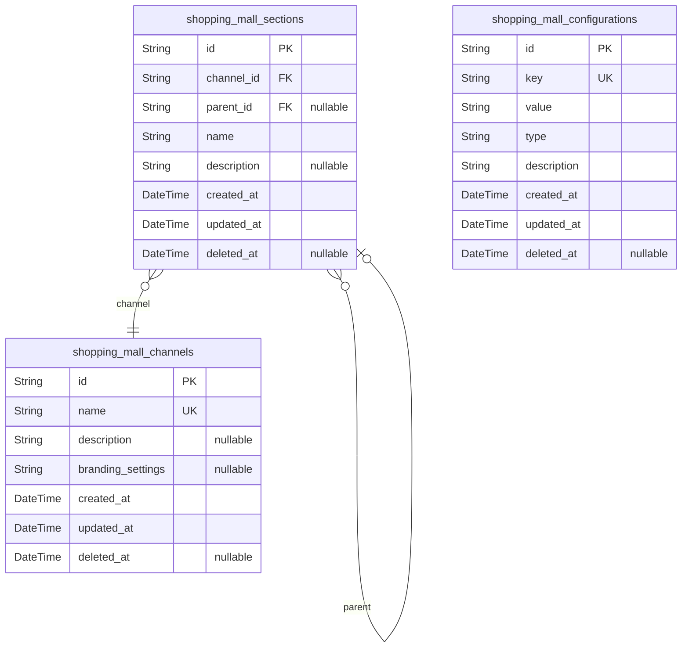
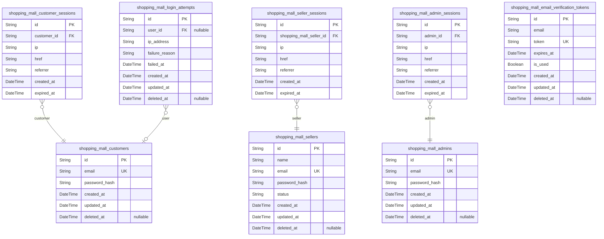
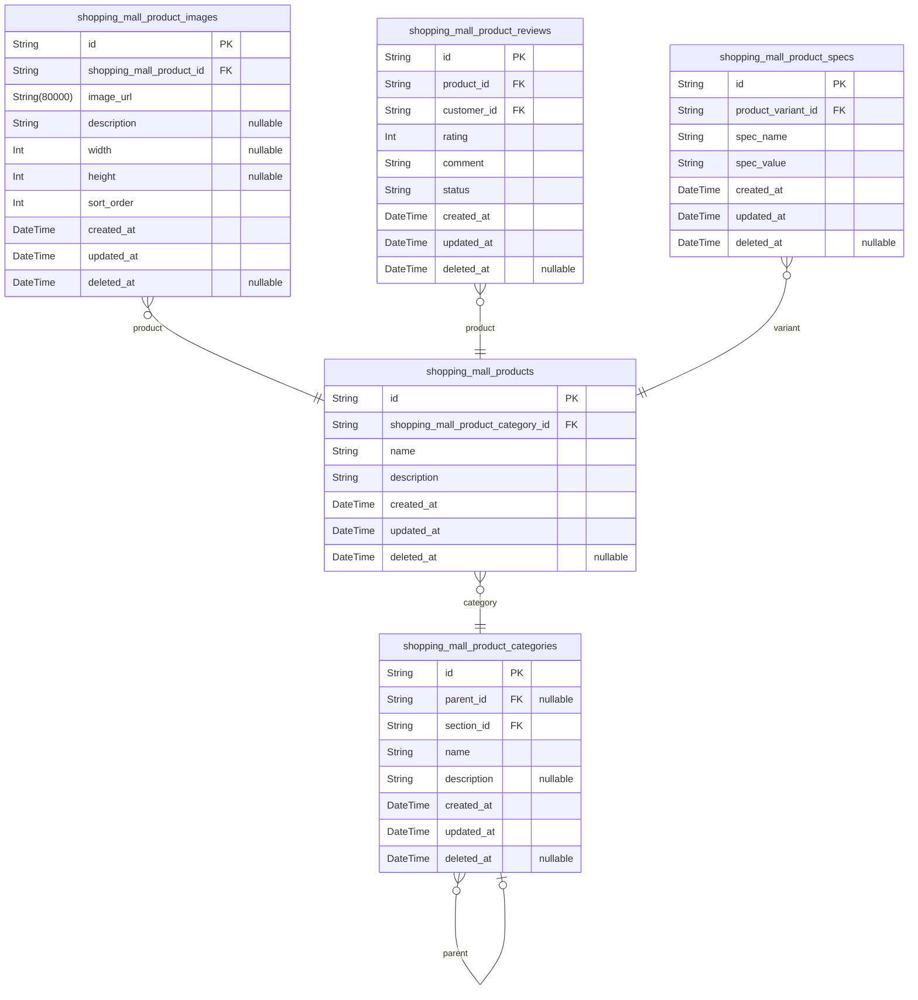
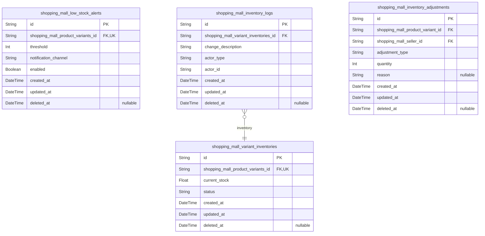
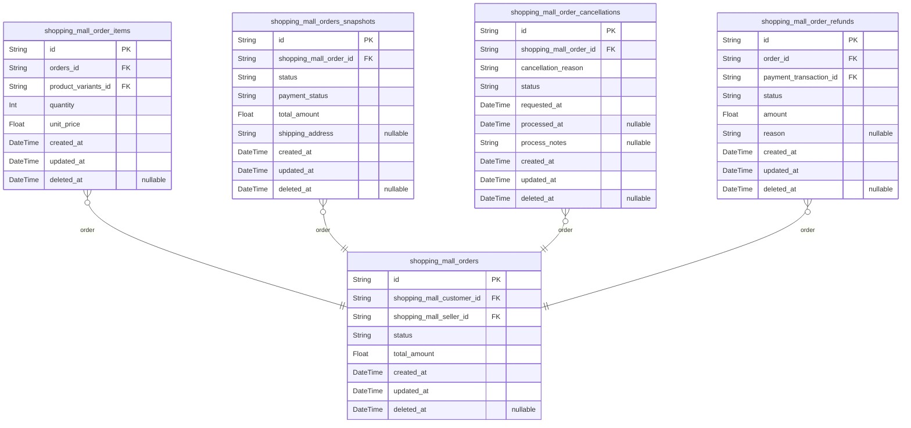
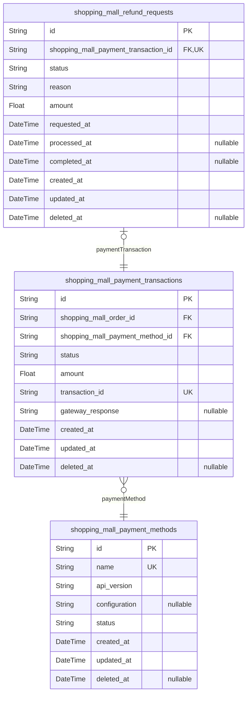
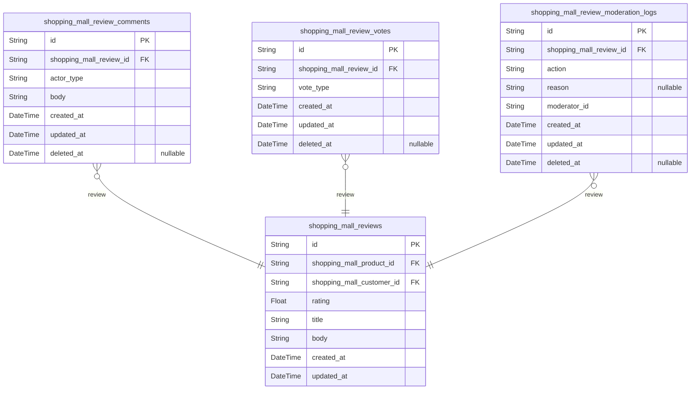

# Prisma Markdown

> Generated by [`prisma-markdown`](https://github.com/samchon/prisma-markdown)

- [Systematic](#systematic)
- [Actors](#actors)
- [Products](#products)
- [Inventory](#inventory)
- [Orders](#orders)
- [Payments](#payments)
- [Reviews](#reviews)

## Systematic

### `shopping_mall_channels`

Stores sales channel configurations for different distribution methods
including online store and mobile app platforms.

Manages the fundamental channels through which products are sold,
encompassing all branding options, seasonal configurations, and
platform-specific settings. Each channel serves as a root node in the
content hierarchy, with sections organized under each channel.

Channels are independently managed by administrators to enable
channel-specific branding, feature toggles, and marketing configurations.
This entity serves as the primary reference for all channel-specific
operations and system settings.

Properties as follows:

- `id`: Primary Key.
- `name`
  > Channel name identifier (e.g., 'web', 'mobile'). Must be unique across
  > all channels.
- `description`: Human-readable description or purpose of the channel.
- `branding_settings`
  > Configuration details for channel branding including colors, logos, and
  > layout preferences.
- `created_at`: Timestamp when the channel was first created.
- `updated_at`: Timestamp of the last modification to the channel configuration.
- `deleted_at`: Timestamp when the channel was soft-deleted (null if active).

### `shopping_mall_sections`

Sections within sales channels for organizing content hierarchically.
Each section belongs to a specific channel and can have nested
subsections to create multi-level content structures.

Sections serve as organizational containers for products and content
within sales channels. They support hierarchical relationships by
allowing sections to have parent-child relationships, enabling flexible
arrangement of content. Sections require unique names per channel to
prevent naming conflicts in the same channel context.

Properties as follows:

- `id`: Primary Key.
- `channel_id`
  > The sales channel this section belongs to. {@link
  > shopping_mall_channels.id}.
- `parent_id`
  > Optional parent section for hierarchical organization. {@link
  > shopping_mall_sections.id}.
- `name`: Name of the section for user-facing display and organization.
- `description`: Detailed explanation of the section's purpose and content structure.
- `created_at`: Timestamp when the section was created.
- `updated_at`: Timestamp when the section was last updated.
- `deleted_at`: Timestamp when the section was soft-deleted (null if active).

### `shopping_mall_configurations`

System-wide configuration settings and feature flags that control
platform behavior and functionality.

This table stores application-level settings that determine platform
features and operational parameters. Each configuration entry has a
unique key identifier, a value stored as string (supporting serialization
of complex data), a type classification for validation, and descriptive
documentation. The system tracks configuration changes and allows safe
soft deletion for recovery purposes.

Admins use this API endpoint to enable/disable features, adjust runtime
parameters, and configure system behavior without requiring code changes.
The value field accommodates various formats (booleans, integers, JSON)
through string-based storage and application-side de-serialization.

Properties as follows:

- `id`: Primary Key.
- `key`
  > Unique identifier for the configuration setting (e.g., enable_payments,
  > max_order_value). Required for configuration lookup and management.
- `value`
  > Current value of the configuration (as a string). Supports serialization
  > of complex types for flexible usage.
- `type`
  > Expected data type of the configuration (e.g., boolean, string, integer).
  > Used for client-side validation and error handling.
- `description`
  > Human-readable explanation of the configuration's purpose and usage for
  > admin reference.
- `created_at`: Timestamp when the configuration was first created.
- `updated_at`: Timestamp when the configuration was last modified.
- `deleted_at`
  > Timestamp when the configuration was soft-deleted (null if currently
  > active).

## Actors

### `shopping_mall_customers`

Core customer accounts with profile information and login credentials for
shopping platform users.

Manages user authentication details, profile data, and account status.
Each customer has a unique email address and securely hashed password for
login. Supports soft deletion for account management without permanent
data loss.

Email verification tokens are managed separately in a dedicated table to
maintain clean separation of identity and session administration.

Properties as follows:

- `id`: Primary Key.
- `email`
  > Customer's email address used for login and notifications. Must be unique
  > across all customers to ensure account uniqueness.
- `password_hash`
  > Securely hashed password using industry-standard algorithms. Never stores
  > plaintext passwords.
- `created_at`: Account creation timestamp. Always populated when account is created.
- `updated_at`
  > Last updated timestamp for account modifications. Automatically updated
  > on any change to profile or security settings.
- `deleted_at`
  > Soft deletion timestamp indicating when account was marked for deletion
  > (not immediately removed).

### `shopping_mall_customer_sessions`

Authentication sessions tracking valid login states and tokens for
customer accounts. Each session is linked to a specific customer and
includes connection context for audit and security purposes. Session
tokens expire after configured intervals to maintain security. The table
enables tracking login locations, sources, and session duration for
security analysis and user activity monitoring.

Properties as follows:

- `id`: Primary Key.
- `customer_id`: Customer's authentication session. [shopping_mall_customers.id](#shopping_mall_customers).
- `ip`: IP address from which the session was established.
- `href`: Connection URL used for session establishment.
- `referrer`: Referrer URL that led to the session creation.
- `created_at`: Timestamp when the session was created.
- `expired_at`
  > Timestamp when the session expires for security. Must be specified, no
  > unlimited sessions.

### `shopping_mall_sellers`

Seller accounts for business entities listing and managing products on
the platform.

Manages registered business accounts that can list products, manage their
commerce storefronts, and handle product inventory. Each seller has a
unique email with verification requirements to prevent fake accounts.

Sellers can independently access their account settings, product
listings, and order management without dependency on other entity
contexts. All seller accounts follow the authentication security policies
including automatic account lockouts after failed login attempts.

Seller authentication requires password hashing following industry
security standards, and account status tracks verification progress from
registration through final approval.

Properties as follows:

- `id`: Primary Key.
- `name`
  > Business or company name of the seller, used for public display in
  > product listings and storefronts.
- `email`
  > Seller's primary email address for account authentication and
  > communication. Must be globally unique across all sellers.
- `password_hash`
  > Securely hashed password for authentication. Never stores plaintext
  > credentials. Follows bcrypt standard for password security.
- `status`
  > Current verification status of the seller account. Valid values:
  > 'unverified', 'pending', 'active', 'suspended', 'banned'. Tracks
  > progression through the verification workflow.
- `created_at`: Timestamp when the seller account was initially created.
- `updated_at`
  > Timestamp of the most recent modification to seller account details or
  > status.
- `deleted_at`
  > Timestamp indicating when the seller account was soft-deleted. Null
  > indicates active account.

### `shopping_mall_seller_sessions`

Authentication sessions tracking valid login states and tokens
specifically for seller accounts.

This table stores all active sessions for seller users, including
connection context and security-relevant metadata. Each session is
authenticated through a corresponding seller account and requires
explicit expiration to maintain security compliance.

Session data includes IP address, connection URL, and referrer for audit
trails. It strictly follows the required session table pattern with no
denormalized data or additional fields, supporting the platform's
security policies around session management and account protection.

Properties as follows:

- `id`: Primary Key.
- `shopping_mall_seller_id`: Seller account this session belongs to. [shopping_mall_sellers.id](#shopping_mall_sellers).
- `ip`: IP address of the device from which the session was started.
- `href`: Connection URL used to establish the client session.
- `referrer`: Referrer URL that led to the session establishment.
- `created_at`: Timestamp when the session was created.
- `expired_at`: Timestamp when the session expires (enforced by system policy).

### `shopping_mall_admins`

Administrator accounts with elevated privileges for platform management
and oversight.

Stores core admin account information including authentication
credentials for secure login and access to platform management features.
Requires email verification before session establishment and supports
password reset functionality. Each admin account has a dedicated
authentication session recorded in shopping_mall_admin_sessions table.

The administrator role allows full system control including user
management, content moderation, and platform configuration access. Admin
accounts are managed independently from customer and seller accounts with
distinct permission levels.

Properties as follows:

- `id`: Primary Key.
- `email`
  > Administrator email address used for authentication and system
  > notifications. Must be unique across all administrator accounts to ensure
  > proper login functionality.
- `password_hash`
  > Securely hashed password for administrator authentication. Must follow
  > security policies with strong hashing algorithms to prevent credential
  > exposure.
- `created_at`
  > Timestamp when the admin account was created. Used for audit trails and
  > determining account age.
- `updated_at`
  > Timestamp when the admin account data was last modified. Tracks account
  > updates for security and audit purposes.
- `deleted_at`
  > Timestamp when the admin account was deleted (soft delete). Null means
  > account is active, otherwise represents termination date.

### `shopping_mall_admin_sessions`

Authentication sessions tracking valid login states and tokens for admin
accounts.

Manages authentication sessions for administrator accounts, recording
connection metadata including IP address, URL context, and session
lifetimes. Each session is uniquely tied to one administrator account
through the admin_id foreign key.

Session management enforces security policies by requiring session
expiration (expired_at NOT NULL), preventing permanent sessions that
could compromise platform security. The table captures essential audit
information including connection source (referrer), URL path (href), and
session creation timestamp.

This table follows the standardized session pattern established for all
actor types (customers, sellers, admins) with consistent naming and field
structure throughout the Actors component.

Properties as follows:

- `id`: Primary Key.
- `admin_id`: Admin account owner. [shopping_mall_admins.id](#shopping_mall_admins).
- `ip`: IP address of the session connection.
- `href`: Connection URL for the session.
- `referrer`: Referrer URL that led to this session.
- `created_at`: Session creation timestamp.
- `expired_at`: Session expiration timestamp (required for platform security).

### `shopping_mall_login_attempts`

Tracks failed login attempts for security policy enforcement.

Records each authentication failure event including user context, IP
address, and failure reason to enable the system's automatic account
lockout policy after 5 consecutive failures within 15 minutes.

The table supports real-time security monitoring of authentication
attempts and provides necessary data for forensic analysis of potential
brute force attacks. Each login attempt record is timestamped for the
15-minute window requirement of the security policy.

Soft deletion preserves audit trails while allowing security operations
to mark attempts as irrelevant without removing historical data.

Properties as follows:

- `id`: Primary Key.
- `user_id`
  > User account identifier for login attempts. {@link
  > shopping_mall_customers.id.}
- `ip_address`: Source IP address of the failed login attempt.
- `failure_reason`
  > Reason for authentication failure (e.g., 'invalid password', 'account
  > locked').
- `failed_at`: Exact timestamp of the failed login attempt.
- `created_at`: Date and time when the login attempt record was created.
- `updated_at`: Date and time when the login attempt record was last modified.
- `deleted_at`
  > Date and time when the login attempt record was deleted for audit
  > purposes.

### `shopping_mall_email_verification_tokens`

Email verification tokens for new account registration and account updates.

Stores one-time tokens used during email verification processes to
confirm user-provided email addresses. Each token is associated with a
specific email address and is valid until expiration or usage. Tokens are
generated upon registration or email update requests, sent to the user,
and consumed upon successful verification.

The verification process validates the token against the associated
email, checks expiration time, and marks the token as used to prevent
reuse. This table enables the system to securely link email verification
with user identity without requiring persistent stored passwords during
the registration flow.

Properties as follows:

- `id`: Primary Key.
- `email`
  > User's email address associated with the verification token. Required for
  > identifying verification context.
- `token`
  > One-time verification token generated for email confirmation. Must be
  > unique across all tokens.
- `expires_at`: Timestamp indicating when the token expires and becomes invalid.
- `is_used`
  > Flag indicating if the token has been successfully used for email
  > verification.
- `created_at`: Timestamp when the verification token record was created.
- `updated_at`: Timestamp when the verification token record was last modified.
- `deleted_at`
  > Timestamp when the verification token record was soft-deleted. Null
  > indicates active record.

## Products

### `shopping_mall_products`

Core product records with name, description, category association and
base attributes.

Manages the primary product catalog including product details,
descriptions, and their categorization for storefront organization. Each
product entry represents a unique product within the platform, supporting
search and filtering capabilities for customers.

Products are linked to their respective categories for hierarchical
organization, facilitating product discovery and navigation across the
catalog. Product variants (SKU) are managed separately per requirements,
ensuring proper 3NF compliance.

Properties as follows:

- `id`: Primary Key.
- `shopping_mall_product_category_id`: Product category reference. [shopping_mall_product_categories.id](#shopping_mall_product_categories).
- `name`
  > Product name as displayed to customers. Must be descriptive and unique
  > within category for product identification.
- `description`
  > Detailed product description including key features, benefits, and usage
  > instructions for customer information.
- `created_at`
  > Product creation timestamp. Indicates when the product was added to the
  > catalog.
- `updated_at`
  > Product last modification timestamp. Updates whenever product details
  > change.
- `deleted_at`
  > Soft delete timestamp. Marks when product was removed from catalog for
  > audit trails.

### `shopping_mall_product_categories`

Main category records representing product organization hierarchy.

Supports nested categories with parent-child relationships and associated
section classification for product grouping and filtering. Each category
can have subcategories, and the section association enables
categorization within specific market channels.

Categories serve as primary entities in the product catalog, requiring
independent creation, search, and management capabilities across the
platform.

Properties as follows:

- `id`: Primary Key.
- `parent_id`
  > Parent category for hierarchical organization. {@link
  > shopping_mall_product_categories.id}.
- `section_id`
  > Section to which this category belongs for channel-specific organization.
  > [shopping_mall_sections.id](#shopping_mall_sections).
- `name`
  > Category name used for display and user discovery. Must be unique within
  > a section (enforced via unique index).
- `description`
  > Detailed explanation of the category purpose, content, and target
  > audience.
- `created_at`
  > Timestamp when category record was created. Used for sorting and
  > determining age of categories.
- `updated_at`
  > Timestamp when category record was last modified. Tracks changes for
  > audit purposes.
- `deleted_at`
  > Timestamp when category was logically deleted. Used with soft delete
  > pattern for audit preservation.

### `shopping_mall_product_images`

Product image files for catalog display and variant selection. Stores
main product images, zoomable views, and image metadata for user-facing
product pages. Images are associated with specific products to enable
visual product representation across the shopping experience.

Images can be independently managed for catalog presentation, including
adding new images, reordering existing ones, and removing obsolete images
without affecting the core product data. The sort_order field enables
intuitive gallery display ordering for users.

Properties as follows:

- `id`: Primary Key.
- `shopping_mall_product_id`: Product this image belongs to. [shopping_mall_products.id](#shopping_mall_products).
- `image_url`: Full URL or storage path to the image file on the server.
- `description`
  > Optional description of the image content for accessibility and SEO
  > purposes.
- `width`: Image width in pixels for responsive display.
- `height`: Image height in pixels for responsive display.
- `sort_order`: Sequence number for displaying images in gallery order.
- `created_at`: Image creation timestamp.
- `updated_at`: Last image modification timestamp.
- `deleted_at`: Timestamp when image was soft-deleted.

### `shopping_mall_product_reviews`

Customer reviews and ratings for products with moderation support.

Stores customer feedback on products including ratings, textual comments,
and status tracking for moderation workflows. Each review is tied to a
specific product and authenticated customer, enabling independent user
management of reviews without requiring product context.

Reviews can be updated by the original poster, moderated by staff for
content quality, and searched across products. The status field tracks
moderation state (pending, approved, rejected) while temporal fields
provide complete audit trails for review history.

This table supports the primary user scenario where customers provide
feedback and businesses track review quality through moderation
capabilities.

Properties as follows:

- `id`: Primary Key.
- `product_id`: Product being reviewed. [shopping_mall_products.id](#shopping_mall_products).
- `customer_id`: Customer who submitted the review. [shopping_mall_customers.id](#shopping_mall_customers).
- `rating`: Numerical rating for the product (1-5 scale). Valid values: 1-5 integer.
- `comment`
  > Customer's written feedback on the product. Includes attribution-specific
  > details and content for product validation.
- `status`
  > Current moderation status of the review. Valid values: 'pending',
  > 'approved', 'rejected'.
- `created_at`: Timestamp when the review was created.
- `updated_at`: Timestamp when the review was last updated.
- `deleted_at`: Timestamp when the review was deleted (soft delete).

### `shopping_mall_product_specs`

Technical specifications and variant-specific details for products,
including attributes like color, size, and material compositions. Each
specification is linked to a specific product variant to enable detailed
product information lookup and filtering during catalog browsing.

Specifications are exclusively used to display product variant details to
customers and support search/filtering capabilities in the product
catalog. The table follows strict 3NF by separating specification
attributes from product base records and tying them directly to variant
entities, avoiding any denormalization.

All specifications are stored in raw format to support dynamic display
based on current product variant configuration, with no pre-computed
values or calculated fields.

Properties as follows:

- `id`: Primary Key.
- `product_variant_id`: Link to product variant. [shopping_mall_products.id](#shopping_mall_products).
- `spec_name`
  > Name of the technical specification attribute (e.g., 'Color', 'Size',
  > 'Material').
- `spec_value`: Value of the technical specification (e.g., 'Red', 'Medium', 'Cotton').
- `created_at`: Timestamp when the specification was created for the variant.
- `updated_at`: Timestamp when the specification was last modified.
- `deleted_at`
  > Timestamp when the specification was soft deleted for audit purposes.
  > Null indicates active record.

## Inventory

### `shopping_mall_low_stock_alerts`

Configuration records for low stock alerts that trigger notifications
when inventory for a product variant falls below a defined threshold.
Each alert is associated with a specific product variant and defines the
stock threshold, notification channel, and activation status.

Enables sellers to customize alert behavior for different product
variants based on business needs and inventory policies. Alerts can be
enabled/disabled to control notification frequency and reduce system
noise during promotions or sales events.

The threshold field specifies the minimum inventory level that triggers
an alert, while notification channels determine how the alert is
delivered (email, SMS, etc.). All configuration changes are tracked
through the temporal fields for audit purposes.

Properties as follows:

- `id`: Primary Key.
- `shopping_mall_product_variants_id`: Product variant this alert applies to. [shopping_mall_products.id](#shopping_mall_products).
- `threshold`
  > Minimum inventory level that triggers alert for this variant. Must be a
  > positive integer representing stock quantity.
- `notification_channel`: Preferred delivery method for alerts (e.g., 'email', 'sms', 'slack').
- `enabled`
  > Active status of this alert configuration. True = active, False =
  > disabled.
- `created_at`: Timestamp when the alert configuration was created.
- `updated_at`: Timestamp when the alert configuration was last modified.
- `deleted_at`: Timestamp when the configuration was marked for deletion (soft delete).

### `shopping_mall_inventory_logs`

Audit trail recording all inventory changes including updates,
adjustments, and stock deductions.

This table captures historical modifications to product inventory levels,
providing a complete record of stock movements for audit purposes. Each
log entry is linked to a specific product variant inventory record and
documents the nature of changes, performers, and timestamps.

The audit trail supports compliance requirements by tracking who
performed inventory operations and when, while maintaining read-only
access to historical change records.

Properties as follows:

- `id`: Primary Key.
- `shopping_mall_variant_inventories_id`
  > Related inventory variant record. {@link
  > shopping_mall_variant_inventories.id}
- `change_description`
  > Specific details of inventory change including quantities and reasons for
  > the adjustment.
- `actor_type`: User role who performed the inventory operation (seller, admin).
- `actor_id`: Identifier of the actor performing the inventory change.
- `created_at`: Timestamp when the inventory activity was recorded.
- `updated_at`: Timestamp when the inventory activity log was last modified.
- `deleted_at`: Timestamp when the log record was marked for deletion.

### `shopping_mall_inventory_adjustments`

Manual inventory adjustments recorded by sellers for product variants.

Tracks sellers' actions to modify product variant stock levels, capturing
the type of adjustment (increase/decrease), quantity, and business
reason. Each record links to the specific product variant and seller,
enabling audit trails and reconciliation against automatic stock updates.
Adjustments are soft-deleted to maintain historical context while
allowing content moderation for internal review processes.

Properties as follows:

- `id`: Primary Key.
- `shopping_mall_product_variant_id`: Product variant being adjusted. [shopping_mall_products.id](#shopping_mall_products).
- `shopping_mall_seller_id`: Seller who performed the adjustment. [shopping_mall_sellers.id](#shopping_mall_sellers).
- `adjustment_type`: Type of adjustment, such as 'increase' or 'decrease'.
- `quantity`
  > Magnitude of the stock change (positive for increase, negative for
  > decrease).
- `reason`
  > Business justification for the adjustment, such as 'manual stock count',
  > 'returned items', or 'trial adjustment'.
- `created_at`: Timestamp when the adjustment record was created.
- `updated_at`: Timestamp when the adjustment record was last modified.
- `deleted_at`
  > Timestamp when the adjustment record was soft-deleted (null indicates
  > active).

### `shopping_mall_variant_inventories`

Tracks real-time stock levels and availability status for each product
variant.

Monitors inventory quantities and status changes for product variants,
enabling immediate stock updates and visibility. Each record represents a
single product variant's current inventory state, independent of other
variants. This table supports real-time inventory checks during checkout
and purchase processes.

Status values include 'in_stock', 'out_of_stock', 'low_stock', and
'discontinued'. Stock level changes are recorded as audit events in
'shopping_mall_inventory_logs' for traceability.

Properties as follows:

- `id`: Primary Key.
- `shopping_mall_product_variants_id`: Reference to the product variant record. [shopping_mall_products.id](#shopping_mall_products)
- `current_stock`
  > Current available quantity of the product variant. Must be zero or
  > positive.
- `status`
  > Current inventory status. Valid values: 'in_stock', 'out_of_stock',
  > 'low_stock', 'discontinued'.
- `created_at`: When this inventory record was created.
- `updated_at`: When this inventory record was last updated.
- `deleted_at`: When this inventory record was soft-deleted. Null indicates active record.

## Orders

### `shopping_mall_orders`

Main order records with customer, seller, and order details.

Stores the core information about each customer's purchase including
product selection details, payment status, shipping information, and
processing status. Each order is initiated by a customer from their
profile (shopping_mall_customers) and fulfilled by a seller
(shopping_mall_sellers).

Orders contain a running status for fulfillment workflows (pending →
processing → shipped → delivered) and maintain a historical record
through the associated snapshot table. The order tracking system supports
cancellation requests and refund processing while preserving the original
order data.

The transaction amount is calculated based on product line items and
includes applicable taxes and discounts.

Properties as follows:

- `id`: Primary Key.
- `shopping_mall_customer_id`: Customer who placed the order. [shopping_mall_customers.id](#shopping_mall_customers).
- `shopping_mall_seller_id`: Seller who fulfilled the order. [shopping_mall_sellers.id](#shopping_mall_sellers).
- `status`: Current order status: pending, processing, shipped, delivered, cancelled.
- `total_amount`: Total amount of the order including products and applicable taxes.
- `created_at`: Order creation timestamp.
- `updated_at`: Last update timestamp for order status changes.
- `deleted_at`: Soft delete timestamp if order is archived.

### `shopping_mall_order_items`

Line items for each product in an order, including variant-specific
details and pricing information at the time of purchase.

Each line item represents a single product variant (SKU) purchased within
the order, maintaining historical pricing for accurate billing and audit
trails. The table associates products with orders through variants,
capturing both item quantity and price at transaction time.

Supports order fulfillment tracking and billing reconciliation while
preserving historical data integrity without redundant denormalization.

Properties as follows:

- `id`: Primary Key.
- `orders_id`: Order context. {@link shopping_mall_orders.id.
- `product_variants_id`: Product variant reference. {@link shopping_mall_products.id.
- `quantity`
  > Number of items ordered. Must be positive integer representing quantity
  > purchased.
- `unit_price`
  > Price per unit at time of transaction. Records historical pricing, not
  > current catalog price.
- `created_at`: Timestamp when line item was added to order.
- `updated_at`: Last timestamp when line item data was modified.
- `deleted_at`: Soft deletion timestamp for audit trail retention.

### `shopping_mall_orders_snapshots`

Point-in-time historical records of order status changes for audit trails
and change tracking.

Captures the exact state of an order at specific moments during its
lifecycle including status, shipping details, payment information, and
associated customer/seller data. Each snapshot is generated when an order
transitions between statuses (e.g., from 'processing' to 'shipped').

Supports compliance requirements for order history analysis and dispute
resolution. Snapshots are append-only and rarely modified, providing an
immutable record of order progression.

Properties as follows:

- `id`: Primary Key.
- `shopping_mall_order_id`: Order this status snapshot belongs to. [shopping_mall_orders.id](#shopping_mall_orders).
- `status`
  > Current order status (e.g., 'pending', 'processing', 'shipped',
  > 'delivered', 'cancelled').
- `payment_status`
  > Payment processing status related to this order snapshot (e.g., 'paid',
  > 'pending', 'refunded').
- `total_amount`
  > Total amount paid for the order at the time of snapshot. Represents
  > financial value in base currency.
- `shipping_address`
  > Full shipping address associated with the order at the time of this
  > snapshot.
- `created_at`: Timestamp when this order status snapshot was created.
- `updated_at`
  > Timestamp when this order status snapshot was last updated (typically
  > same as created_at for snapshot).
- `deleted_at`: Timestamp when this snapshot was marked for soft deletion (if applicable).

### `shopping_mall_order_cancellations`

Order cancellation requests initiated by customers or sellers.

Tracks all requests to cancel orders, including the reason, original
order details, and processing status. Cancellation requests follow a
workflow that may involve approval before the order is officially
canceled.

Each cancellation request corresponds to a specific order and contains
the reason provided by the customer or seller, along with the request
timestamp. The status field tracks progress through the validation and
processing workflow.

Requests can be in various states including pending (waiting for
verification), approved (cancellation validated), or rejected
(cancellation not permitted due to business rules or timing constraints).
This table enables tracking of the entire cancellation lifecycle.

Soft deletion is supported to maintain audit trails while allowing
cancellation request management.

Properties as follows:

- `id`: Primary Key.
- `shopping_mall_order_id`: Reference to the original order. [shopping_mall_orders.id](#shopping_mall_orders).
- `cancellation_reason`: Reason provided by customer for cancellation request.
- `status`: Current status of the cancellation request: pending, approved, rejected.
- `requested_at`: Date and time when the cancellation request was submitted.
- `processed_at`: Date and time when the request was processed.
- `process_notes`: Internal notes about the cancellation processing decision.
- `created_at`: Timestamp of when the cancellation request was created.
- `updated_at`: Timestamp of the last modification to the cancellation request.
- `deleted_at`: Timestamp of when the cancellation request was soft deleted.

### `shopping_mall_order_refunds`

Records of customer-initiated refund requests with associated order and
payment details for financial reconciliation.

Each refund request is tied to a specific order and payment transaction,
tracking the refund amount, reason, and current status through the
approval workflow. Refund requests maintain historical records even after
order status changes or payment adjustments.

Refund status transitions follow business workflow rules: pending
(initiated), approved (processed), rejected (denied). The system
automatically initiates refunds when status moves to approved, triggering
payment gateway communication.

This table supports full audit trail capabilities including creation
timestamps and soft deletion for financial review purposes.

Properties as follows:

- `id`: Primary Key.
- `order_id`: Associated order's [shopping_mall_orders.id](#shopping_mall_orders).
- `payment_transaction_id`
  > Linked payment transaction's {@link
  > shopping_mall_payment_transactions.id}.
- `status`
  > Current refund status. Valid values: pending, approved, rejected. Follows
  > business workflow state transitions.
- `amount`: Refund amount in platform currency, matching payment transaction value.
- `reason`
  > Customer-specified reason for refund request. May include product issues
  > or service dissatisfaction.
- `created_at`: Timestamp when refund request was initiated by customer.
- `updated_at`: Timestamp when refund status was last modified.
- `deleted_at`: Timestamp when refund record was soft-deleted for audit purposes.

## Payments

### `shopping_mall_payment_transactions`

Payment transaction records tracking all attempts, including
success/failure status, gateway processing details, and associated order
information.

Stores complete history of payment processing for audit trail and
reconciliation. Each transaction links to an order and payment method,
enabling financial reporting, dispute resolution, and partial refund
tracking. Status transitions follow predefined workflow with explicit
change logging.

Transaction state changes are permanently recorded through the audit
trail, allowing recovery of historical data even if current status
changes. Gateway response logs provide critical detail for debugging
payment failures with external providers.

Properties as follows:

- `id`: Primary Key.
- `shopping_mall_order_id`
  > The order associated with this payment transaction. {@link
  > shopping_mall_orders.id}.
- `shopping_mall_payment_method_id`
  > The payment method used for this transaction. {@link
  > shopping_mall_payment_methods.id}.
- `status`
  > Current payment status. Valid values: pending, processing, completed,
  > failed, refunded.
- `amount`: Total amount processed, in platform currency.
- `transaction_id`
  > External transaction ID from the payment gateway for reconciliation with
  > third-party systems.
- `gateway_response`
  > Raw response received from the payment gateway including error details on
  > failures, stored for audit.
- `created_at`: Payment initiation timestamp when transaction was created.
- `updated_at`: Last status modification timestamp for transaction updates.
- `deleted_at`: Soft deletion timestamp when transaction record is marked inactive.

### `shopping_mall_payment_methods`

Configuration management for supported payment gateway integrations.

Stores system configurations for payment methods including API versions
and integration details. Each payment method (Stripe, PayPal, Alipay) has
unique configuration settings validated before use in payment processing.
This table enables dynamic configuration of payment gateways without
requiring code changes.

The name field identifies the payment method provider, while api_version
specifies the required gateway API version. Configuration stores
JSON-encoded settings for gateway integration including API keys, URLs,
and merchant IDs.

Transaction processing associates payment methods through foreign keys
while maintaining historical integrity. Soft delete supports
administrator management of gateway configurations without data loss.

Properties as follows:

- `id`: Primary Key.
- `name`
  > Payment method name (e.g., 'Stripe', 'PayPal', 'Alipay'). Must be unique
  > across all payment methods.
- `api_version`
  > API version specification for the payment gateway. Used to validate
  > gateway compatibility during integration.
- `configuration`
  > JSON-encoded configuration string containing API keys, endpoints, and
  > integration parameters for the payment gateway.
- `status`
  > Current operational status of the payment method. Valid values: 'active',
  > 'inactive', 'pending'. Determines if method can be used for transactions.
- `created_at`: Timestamp when this payment method configuration was first created.
- `updated_at`: Timestamp when this payment method configuration was last modified.
- `deleted_at`
  > Timestamp when this payment method configuration was marked for deletion
  > (soft delete). Supports audit trails and data recovery.

### `shopping_mall_refund_requests`

Tracks all refund requests submitted by customers including their status,
processing timeline, associated payment details, and final outcomes.

Stores refund requests at the point of creation, capturing the financial
details and customer's reason for the refund. Each request is uniquely
linked to a single payment transaction (one-to-one reference). The refund
workflow passes through several stages: pending (initial submission),
processing (under review), approved (ready for refund), rejected
(denied), and refunded (processed).

Systems can query refunds by status, date range, payment ID, or amount.
Refund amounts must match the payment transaction's amount limits. Soft
deletion allows refund tracking maintenance without data loss while
enabling fraud monitoring and audit trails.

Properties as follows:

- `id`: Primary Key.
- `shopping_mall_payment_transaction_id`
  > Associated payment transaction. {@link
  > shopping_mall_payment_transactions.id}
- `status`
  > Current refund processing status. Valid values: pending, processing,
  > approved, rejected, refunded.
- `reason`
  > Customer's explanation for requesting a refund, including specific issues
  > encountered with the purchase.
- `amount`
  > Refund amount requested in the payment's currency. Must not exceed
  > payment transaction amount.
- `requested_at`: Timestamp when the refund request was submitted by the customer.
- `processed_at`: Timestamp when processing of the refund request began.
- `completed_at`: Timestamp when the refund was successfully processed.
- `created_at`: Refund request creation timestamp.
- `updated_at`: Refund request last modification timestamp.
- `deleted_at`: Refund request deletion timestamp (soft delete).

## Reviews

### `shopping_mall_reviews`

Product reviews and customer feedback records.

This table stores customer reviews for products, including ratings,
titles, and detailed feedback. Each review is associated with a specific
product and customer, allowing for independent management of feedback
without requiring parent entity context.

Reviews can be created, edited, and deleted by customers directly through
the application. The rating field provides a numeric score (1-5)
reflecting the customer's satisfaction with the product. Textual feedback
allows detailed descriptions of the customer's experience.

Unlike some entities where child records might be subsidiary, reviews
require independent management as customers might want to search all
reviews from a specific user, or filter reviews by rating across
products.

Properties as follows:

- `id`: Primary Key.
- `shopping_mall_product_id`
  > The product this review is associated with. {@link
  > shopping_mall_products.id}.
- `shopping_mall_customer_id`: Customer who created the review. [shopping_mall_customers.id](#shopping_mall_customers).
- `rating`
  > Numerical rating provided by customer (1-5). Higher values indicate
  > better satisfaction.
- `title`: Brief summary or title for the review. Optional but recommended.
- `body`: Detailed textual feedback from the customer about the product.
- `created_at`: Timestamp of when the review was created.
- `updated_at`: Timestamp of the last update to the review.

### `shopping_mall_review_comments`

Comments made on product reviews by customers or sellers.

Stores user comments on product reviews to enable
discussion and feedback about the review itself.
Each comment is associated with a specific review
and can be made by either a customer or seller.

Comments remain attached to the review even if the review
is edited or deleted, providing historical context.
Users can reply to comments to create threaded discussions.
The comment content includes body field for textual
feedback. Soft deletion is supported to maintain audit
trails while allowing comment moderation.

Properties as follows:

- `id`: Primary Key.
- `shopping_mall_review_id`: Review being commented on. [shopping_mall_reviews.id](#shopping_mall_reviews).
- `actor_type`: Type of actor making the comment (customer or seller).
- `body`: Text content of the comment.
- `created_at`: Timestamp when the comment was created.
- `updated_at`: Timestamp when the comment was last updated.
- `deleted_at`: Timestamp when the comment was soft-deleted (null if not deleted).

### `shopping_mall_review_votes`

Tracks user votes on product reviews to indicate helpfulness
(positive/negative).

Stores each vote as a separate record associated with a specific review.
Each vote can be marked as positive or negative to help other users
assess review quality.
Votes are tracked using session IDs for user tracking but not directly
tied to session IDs for this table.
Users can only vote once per review through their sessions, and vote
types can be revised.

Properties as follows:

- `id`: Primary Key.
- `shopping_mall_review_id`: Review being voted on. [shopping_mall_reviews.id](#shopping_mall_reviews)
- `vote_type`: Type of vote. Valid values: 'positive', 'negative'.
- `created_at`: When this vote was recorded.
- `updated_at`: When this vote was last modified.
- `deleted_at`: When this vote was soft-deleted (null if not deleted).

### `shopping_mall_review_moderation_logs`

Audit logs tracking all moderation actions taken on product reviews.

Captures details of review content modifications, flagging actions, and
moderator decisions. Each log entry records when and by whom a moderation
action was performed, with full audit trail capabilities for compliance
and review purposes.

Logs are never edited directly by users - they are append-only historical
records tied to the original review's state. The moderation log
references the review itself to provide context for why an action was
taken.

Properties as follows:

- `id`: Primary Key.
- `shopping_mall_review_id`: Reviewed product review's [shopping_mall_reviews.id](#shopping_mall_reviews).
- `action`
  > Moderation action performed (e.g., 'flagged', 'hidden', 'approved',
  > 'edited').
- `reason`: Reason for the moderation action, including specific policy violations.
- `moderator_id`
  > Moderator's identity (references to shopping_mall_admins or
  > shopping_mall_seller_sessions.id).
- `created_at`: Timestamp of when the moderation action was performed.
- `updated_at`: Timestamp of the last modification to this log entry.
- `deleted_at`
  > Timestamp when the log entry was soft-deleted (for compliance audit
  > trails).
