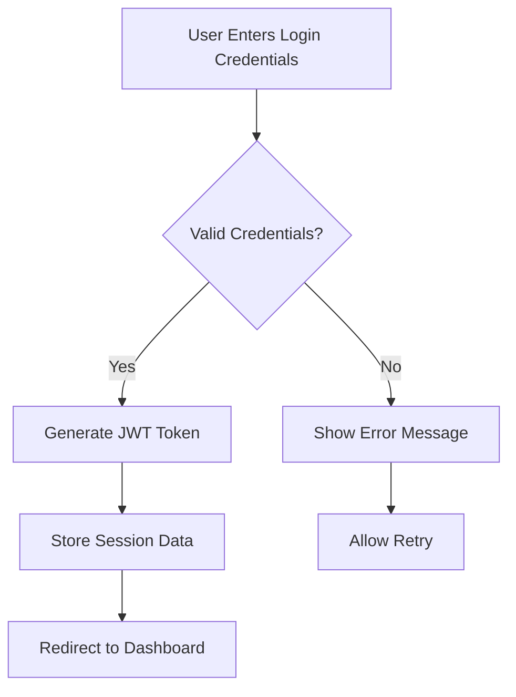

# Shopping Mall Platform Requirements Analysis

## Service Vision & Overview
The Shopping Mall Platform is a comprehensive e-commerce solution designed to provide seamless online shopping experiences for customers, robust product management for sellers, and efficient operational tools for administrators. The platform will support scalable transactions, personalized user experiences, and real-time inventory management to meet the demands of modern e-commerce.

### Business Context
This platform addresses market gaps by providing a unified solution for both buyers and sellers in a single ecosystem. The platform's vision is to become the preferred marketplace for regional consumers by focusing on trust, ease of use, and exceptional customer service.

## Problem Definition
Customers face significant challenges with current e-commerce platforms: fragmented experiences, limited product visibility, complex ordering processes, and unreliable inventory management. Sellers struggle with disjointed systems for product management and order processing, leading to decreased sales and customer satisfaction.

### Key Problems Addressed
- Fragmented customer experiences across different platforms
- Inconsistent product information and inventory availability
- Complicated ordering and payment processes
- Lack of unified management for sellers across multiple product offerings

## Core Value Proposition
The platform delivers unique value through a unified marketplace experience where customers can browse, purchase, and manage all their shopping needs in one place, while sellers can effectively manage their products, orders, and customer relationships without using multiple systems.

### Competitive Differentiation
Unlike other platforms, we offer:
1. **Integrated Seller-Customer Ecosystem**: Single platform for both buyers and sellers
2. **Real-time Inventory Visibility**: Accurate stock levels across all sales channels
3. **Personalized Shopping Experiences**: Tailored recommendations based on user behavior
4. **Seamless Order Management**: Single dashboard for order, shipping, and customer service

## User Actors & Permissions

| Actor | Permission Level | Key Capabilities |
|-------|------------------|------------------|
| Customer | Member | Browse products, purchase items, manage cart, view order history, leave reviews, manage addresses, wishlist items |
| Seller | Member | Manage product catalog, update inventory, process orders, view sales reports, manage product variants, configure shipping options |
| Admin | Admin | Manage all user accounts, oversee platform operations, generate system reports, manage integrations, handle security configurations |

### Authentication Requirements

**Authentication Workflow**

- WHEN a user provides valid username and password, THE system SHALL generate a JWT token with a 2-hour expiration period
- WHEN a user logs out, THE system SHALL invalidate the token and remove session data
- WHEN an authentication token expires, THE system SHALL redirect to login screen and prompt for new credentials

## Primary User Scenarios

### 1. Product Search and Discovery

**Scenario Description**: A customer browses the platform to find products based on categories, keywords, or filters.

- WHEN a customer enters keywords into the search bar, THE system SHALL display relevant products with matching names, descriptions, or categories
- WHEN a customer filters products by category, color, or size, THE system SHALL update the product listing in real-time while maintaining search results
- WHEN multiple filters are applied, THE system SHALL combine all filter conditions to show the most specific results

### 2. Shopping Cart Management

**Scenario Description**: A customer adds items to their shopping cart, adjusts quantities, and proceeds to checkout.

- WHEN a customer adds a product with variants (e.g., color or size) to the cart, THE system SHALL allow selection of specific variant before adding to cart
- WHEN cart quantities are updated, THE system SHALL immediately reflect the new totals and stock availability
- WHEN the cart contains out-of-stock items, THE system SHALL display a warning and allow continuation but prevent checkout until in-stock items are selected

### 3. Order Placement and Payment

**Scenario Description**: A customer completes an order purchase with payment processing.

- WHEN a customer proceeds to checkout, THE system SHALL validate shipping addresses and payment information
- WHEN payment is processed successfully, THE system SHALL display the order confirmation with tracking information
- WHEN payment fails, THE system SHALL provide clear error messages and allow retry within the same checkout flow

## Secondary User Scenarios

### 1. Seller Product Management

**Scenario Description**: A seller manages their product catalog and inventory.

- WHEN a seller creates a new product with variants, THE system SHALL prompt for all required variant details (color, size, SKU)
- WHEN a seller updates inventory levels, THE system SHALL immediately reflect changes across all sales channels
- WHEN a seller adds new product images, THE system SHALL enforce image size limits and format specifications

### 2. Order Cancellation and Refunds

**Scenario Description**: A customer requests a cancellation or refund.

- WHEN a customer requests an order cancellation within 2 hours of purchase, THE system SHALL process cancellation and refund the payment
- WHEN a customer requests a refund after 2 hours, THE system SHALL require additional justification and process within 3 business days
- WHEN a refund is processed, THE system SHALL update order status to 'Refunded' and notify the customer

## Exception Handling

### Payment Failure Resolution

- WHEN a payment gateway transaction fails, THE system SHALL prompt for alternative payment method options
- WHEN the failure is due to insufficient funds, THE system SHALL provide specific error messaging and instructions
- WHEN transaction processing fails repeatedly, THE system SHALL log the incident and notify support team

### Product Unavailability Handling

- WHEN a product goes out of stock after being added to cart, THE system SHALL display a notification and suggest similar alternatives
- WHEN inventory levels drop below threshold, THE system SHALL automatically update product availability status
- WHEN a sold item is restocked, THE system SHALL notify users who previously saved the item to wishlist

## Security & Compliance

### Data Protection Requirements

- WHEN user information is collected, THE system SHALL encrypt all personal data at rest and in transit
- WHEN payment information is processed, THE system SHALL comply with PCI DSS standards for data security
- WHEN user accounts are created, THE system SHALL enforce strong password policies including minimum length and character requirements

### Authentication Security

- WHEN a user logs in from a new device, THE system SHALL prompt for two-factor verification
- WHEN authentication attempts fail multiple times, THE system SHALL implement account lockout mechanisms after 5 attempts
- WHEN tokens are invalidated, THE system SHALL remove all access tokens immediately

## Business Rules

### Product Validation Rules

- WHEN a new product is created, THE system SHALL validate that all required fields (name, description, price) are present
- WHEN a product has variants, THE system SHALL require at least one variant configuration (color/size)
- WHEN a product price is set, THE system SHALL validate it is greater than $0.00

### Order Processing Rules

- WHEN an order is placed, THE system SHALL check inventory levels and reserve items
- WHEN inventory is low, THE system SHALL send alert to warehouse manager
- WHEN an order is fulfilled, THE system SHALL update inventory levels immediately

### Inventory Management Rules

- WHEN inventory is updated, THE system SHALL track changes with timestamp and user who made the update
- WHEN inventory falls below threshold, THE system SHALL automatically generate a restock request
- WHEN products are returned, THE system SHALL update inventory with 'renewable' status
