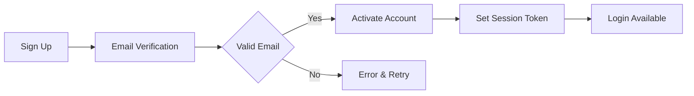
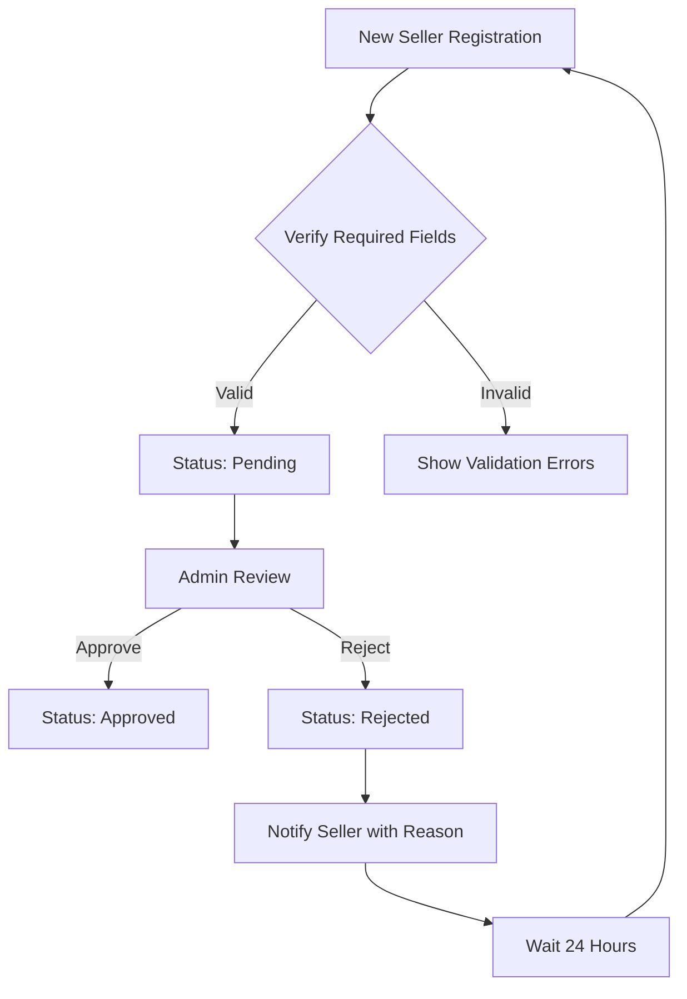

# E-Commerce Shopping Mall Platform

## 1. Customer Management

### Account Lifecycle

WHEN a customer registers using email and password, THE system SHALL create an account with required validation:
- Email must be valid format
- Password must meet complexity requirements (min 8 characters, mixed case)
- Email verification process before account activation

WHEN a customer attempts to log in with invalid credentials, THE system SHALL return HTTP 401 with error code `AUTH_INVALID_CREDENTIALS` within 2 seconds.

WHEN a customer requests password change, THE system SHALL require:
- Current password verification
- New password meeting complexity requirements
- Confirmation of new password
- Time-based security check to prevent brute force

WHEN a customer deletes their account, THE system SHALL:
- Permanently delete profile information
- Preserve order history and reviews (marked as 'deleted user')
- Prevent new order creation but retain purchase history for record keeping
- Remove all active sessions

*Integration with Authentication Flow:* 

### Profile Management

WHEN a customer edits their display name, THE system SHALL allow alphanumeric characters only (max 50 characters) and enforce:
- No special characters
- No whitespace as first/last character
- Real-time validation feedback

WHEN a customer updates their phone number, THE system SHALL:
- Validate against international format standards
- Apply country code detection
- Store in E.164 format
- Provide error message for invalid numbers

WHEN a customer requests phone number change, THE system SHALL:
- Require secondary verification (email/SMS)
- Log change attempt with timestamp
- Update only after successful verification

## 2. Seller Management

### Account Approval Process

WHEN a seller submits registration request, THE system SHALL:
- Store submission with timestamp and required fields
- Set account status to `pending`
- Notify administrators via email
- Prevent access to seller dashboard

WHEN an administrator rejects a seller registration, THE system SHALL:
- Record rejection reason as mandatory field
- Send notification to seller with rejection details
- Allow new registration request only after 24 hours
- Create audit trail of rejection

WHEN a seller is rejected, THE system SHALL:
- Preserved all previous application data
- Prevent immediate re-submission
- Generate confirmation email with actionable feedback
- Track rejection statistics for admin review

### Seller Profile Management

WHEN a seller updates their shop name, THE system SHALL:
- Create new profile snapshot
- Preserve previous shop name
- Update all references to current shop name
- Audit timestamp of change

WHEN a seller edits their profile logo, THE system SHALL:
- Generate new snapshot preserving previous image
- Store new logo with versioning
- Maintain image quality standards
- Provide confirmation of successful upload

WHEN a seller is suspended, THE system SHALL:
- Hide products from search and category listings
- Prevent new product creation
- Block product edits
- Allow processing of existing orders
- Store suspension reason in audit log

*Seller Approval Workflow*

## 3. Product Management

### Product Creation Requirements

WHEN a seller creates a product, THE system SHALL:
- Require product name (min 3 characters, max 255)
- Require description (min 10 characters)
- Require category selection (with subcategories)
- Require base price > $0.01
- Prevent product creation without category

WHEN a product has variants, THE system SHALL:
- Require at least one variant
- Validate SKU format uniqueness
- Enforce price constraints
- Prevent product creation without required variant information

### Product Variants Management

WHEN a seller adds a product variant, THE system SHALL:
- Require SKU code with format `SKU-XXXXX`
- Require option values (e.g., color, size)
- Allow price override of base price (optional)
- Mandate stock quantity > 0

WHEN a product variant is edited, THE system SHALL:
- Create product-snapshot-SKU record
- Preserve previous values
- Update only after successful validation
- Log edit attempt with timestamp

WHEN a product is deleted, THE system SHALL:
- Delete all variants
- Delete all inventory records
- Preserve all product and variant snapshots
- Mark product as archived in history

### Inventory Management

WHEN a customer purchases a product variant, THE system SHALL:
- Automatically decrease stock quantity
- Create negative inventory history record
- Log reason as 'order fulfillment'
- Prevent purchase if stock = 0

WHEN a seller performs restock, THE system SHALL:
- Create positive inventory history record
- Log quantity and reason
- Update current stock balance
- Send confirmation to seller

WHEN stock reaches 0, THE system SHALL:
- Mark variant as 'out of stock'
- Prevent addition to cart
- Update product listing display
- Send low-stock notification to seller

## 4. Order Management

### Order Creation and Status

WHEN a customer proceeds to checkout with valid cart, THE system SHALL:
- Verify stock availability per variant
- Check shipping address validity
- Calculate total price with tax
- Create order record with timestamp

WHEN an order is created, THE system SHALL:
- Create product snapshots for each item
- Create seller profile snapshots for each item
- Preserve product name, description, variant options, and price at time of purchase
- Set initial order item status to `paid`
- Store order in database with unique order ID

### Order Item Status Management

WHEN an order item is purchased, THE system SHALL set initial status to `paid`.

WHEN a seller ships items, THE system SHALL:
- Create shipment record with tracking number
- Update all items in shipment to `shipped`
- Store shipment timestamp
- Notify customer of shipping details

WHEN a customer confirms delivery, THE system SHALL:
- Update all items in shipment to `delivered`
- Calculate final status
- Complete order fulfillment
- Update seller's sales metrics

WHEN an order item is cancelled, THE system SHALL:
- Create cancellation request
- Preserve item state at cancellation time
- Restore stock quantity via inventory record
- Notify seller and customer

## 5. Address Management

WHEN a customer adds a shipping address, THE system SHALL:
- Require recipient name, phone, street, city, postal code
- Validate postal code format based on country
- Store address in standardized format
- Provide error messages for missing fields

WHEN an address is set as default, THE system SHALL:
- Mark as primary for new orders
- Update address preferences
- Maintain previous default address history
- Prevent duplicate default addresses

WHEN an address is deleted, THE system SHALL:
- Remove from active use
- Preserve historical records
- Update all references to previous default
- Allow access to deleted address for reference

## 6. Wishlist and Cart

### Wishlist Requirements

WHEN a customer adds a product to wishlist, THE system SHALL:
- Store product ID without variant specificity
- Allow multiple wishlist entries
- Update wishlist count in real-time
- Preserve product image and basic info

WHEN a seller deletes a product, THE system SHALL:
- Automatically remove it from all customer wishlists
- Update wishlist count display
- Log removal event
- Prevent wishlist access to deleted products

### Shopping Cart Requirements

WHEN a customer adds a variant to cart, THE system SHALL:
- Combine quantities if same variant exists
- Validate stock availability
- Show remaining stock quantity
- Provide warning if stock < cart quantity

WHEN a customer views cart, THE system SHALL:
- Display all items with variant options
- Show image, price, quantity, and subtotal
- Calculate total price with taxes
- Highlight out-of-stock items

## 7. Checkout and Payment

WHEN a customer proceeds to checkout, THE system SHALL:
- Require selected shipping address
- Verify order totals
- Show payment options
- Prevent checkouts with unavailable items

WHEN payment fails, THE system SHALL:
- Retain cart items
- Display reason for failure
- Allow retry without order creation
- Log payment attempt details

WHEN payment succeeds, THE system SHALL:
- Create order record
- Decrease inventory
- Remove items from cart
- Generate confirmation email
- Trigger order fulfillment process

## 8. Reviews and Ratings

WHEN a customer purchases a product, THE system SHALL:
- Enable review creation only after item status becomes `delivered`
- Enforce 1-5 star rating
- Require minimum 5 words for text content
- Prevent duplicate reviews for same product

WHEN a customer writes a review, THE system SHALL:
- Create new review snapshot
- Preserve original review content
- Update product average rating
- Store reviewer ID and timestamp

WHEN a customer deletes a review, THE system SHALL:
- Preserve review snapshot
- Mark review as deleted
- Update average rating calculation
- Prevent public display of deleted review

## 9. Snapshot Preservation Policy

WHEN any editable business data is modified, THE system SHALL:
- Automatically create snapshot record
- Record timestamp of change
- Store user ID of modifier
- Note modified fields
- Preserve previous values

SNAPSHOTS SHALL:
- Be immutable (cannot be deleted or modified)
- Be accessible to relevant parties (owners for personal data, administrators for disputes)
- Provide full context for historical data
- Maintain data integrity across platform

### Snapshot Types and Coverage

| Data Type | Creation Trigger | Preservation Period | Access Level |
|-----------|-----------------|---------------------|--------------|
| Product | Edit or delete | Permanent | Owner, Admin |
| Product Variant | Edit | Permanent | Owner, Admin |
| Seller Profile | Edit | Permanent | Owner, Admin |
| Order Item | Purchase | Permanent | Owner, Admin |
| Review | Edit or delete | Permanent | Owner, Admin |
| Cancellation Request | Creation | Permanent | Owner, Admin |
| Refund Request | Creation | Permanent | Owner, Admin |

This document provides business requirements only. All technical implementations (architecture, APIs, database design) are at the discretion of the development team.