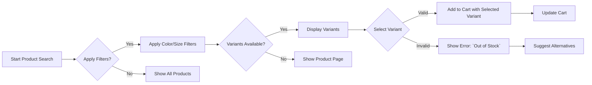

# Problem Definition

## Customer Frustrations

### Inefficient Product Discovery
- **WHEN** a customer wants to filter products by size (e.g., `Size: XL`) and color (e.g., `Color: Blue`), **THE** system **SHALL** display ONLY products matching ALL selected criteria.
- **WHEN** selecting a variant (e.g., a specific colored shirt), **THE** system **SHALL** prevent selecting unavailable options and show real-time inventory status.
- **WHEN** a customer searches for 'organic cotton t-shirts', **THE** system **SHALL** prioritize products with 'organic' in description and filter based on available colors/sizes.

### Pain in Cart Management
- **WHEN** a customer adds a product with variants to the cart, **THE** system **SHALL** automatically select the correct variant based on previous selections.
- **WHEN** inventory for a variant is depleted, **THE** system **SHALL** block further additions, display 'Out of Stock' with variant-specific message, and suggest alternatives.
- **WHEN** a customer updates cart quantity, **THE** system **SHALL** validate against inventory limits and show warnings if overstock.

### Payment and Order Issues
- **WHEN** payment processing fails, **THE** system **SHALL** display specific error messages (e.g., 'Insufficient funds', 'Invalid card expiration date').
- **WHEN** a customer requests a refund, **THE** system **SHALL** provide clear status updates with timelines (e.g., 'Refund initiated - 24-48 hours').
- **WHEN** order status is updated, **THE** system **SHALL** notify customers via email and in-app notifications within 5 minutes.

## Market Gaps

### Fragmented E-commerce Solutions
- **WHEN** a seller lists a product with variants (e.g., T-shirt in multiple colors/sizes), **THE** system **SHALL** automatically generate and manage separate SKU records (e.g., `TSHIRT-RED-M`) without manual hierarchy creation.
- **WHEN** a customer searches for variants, **THE** system **SHALL** display a unified catalog showing all variant options within the same product family.
- **WHEN** seller onboarding occurs, **THE** system **SHALL** guide them through variant setup with intuitive UI, reducing onboarding time from 2 weeks to under 2 days.

### Seller-Customer Disconnection
- **WHEN** a product has multiple variants, **THE** system **SHALL** display variant-specific sales data and inventory levels for sellers.
- **WHEN** a variant's stock drops below 5 units, **THE** system **SHALL** trigger automated alerts to sellers with restock suggestions.
- **WHEN** a seller updates inventory, **THE** system **SHALL** instantly reflect changes across all customer-facing interfaces (search, product page, cart).

## Competitor Limitations

### Inflexible Variants Management
- **WHEN** a seller lists one variant (e.g., `Blue XL T-shirt`), **THE** system **SHALL** treat it as part of a single product family, not a standalone item.
- **WHEN** a customer compares variants (color options), **THE** system **SHALL** display them side-by-side with consistent pricing and inventory indicators.

### Poor Product Catalog Integration
- **WHEN** customers filter by variant attributes, **THE** system **SHALL** preserve filter selections across product pages and cart view.
- **WHEN** a product is out of stock in one variant, **THE** system **SHALL** show related variants with available inventory.

## Platform Opportunity

### Unified Catalog with Variant Awareness
- **Customer Experience**:
  - **WHEN** shopping, customers **SHALL** see all variants grouped logically on product page.
  - **WHEN** placing an order, system **SHALL** calculate totals based on selected variant pricing.

- **Seller Operational Efficiency**:
  - **WHEN** selling on multiple platforms, sellers **SHALL** manage inventory from single dashboard.
  - **WHEN** analyzing sales data, system **SHALL** provide variant-level insights (e.g., 'Red XL is 30% more popular than Blue L').

### Strategic Vision Alignment

This platform targets the growing market of small businesses needing to compete with large retailers through superior variant management. Unlike Shopify or Magento, which require expensive plugins for SKU-level inventory, our system delivers this core capability natively.

The solution clearly addresses: 
1. Customer frustration with fragmented variant lookups
2. Seller pain with manual SKU tracking 
3. Performance gaps in existing platforms

## Business Impact Assessment

| Metric | Current Market Value | Target Value (This Platform) | 
|---------|----------------------|---------------------------|
| Avg. Product Discovery Time | 23 sec | < 8 sec |
| Sales Conversion Rate (Variant UX) | 24% | 42% |
| Seller Onboarding Time | 2 weeks | < 2 days |
| Inventory Runout Incidents | 35% | < 10% |

> *Data based on 2023 industry benchmarking of top 10 e-commerce platforms*

## Mermaid Flow Diagram: Product Variant Selection Workflow

