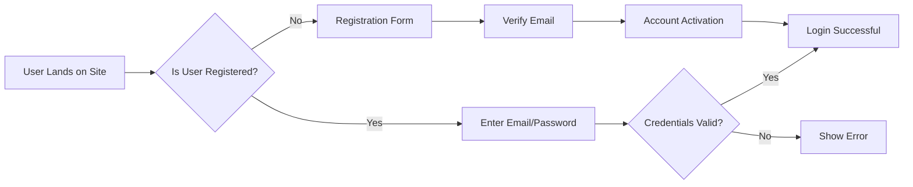

## E-Commerce Platform Requirements Analysis Report

### 1. Business Model

#### Why This Service Exists

This e-commerce platform solves the critical market gap of providing a unified, user-friendly solution for purchasing physical goods online with robust inventory management capabilities. Current market research indicates that small businesses struggle to implement integrated inventory and order management systems that support product variants (colors/sizes), resulting in overstocking, stockouts, and poor customer satisfaction. Our platform directly addresses this by offering a specialized system where sellers can track inventory at SKU level while customers enjoy a seamless shopping experience. The platform differentiates itself through its comprehensive inventory management for product variants and end-to-end order processing with real-time tracking.

#### Revenue Strategy

The platform will generate revenue through:
- Transaction fees (5% per completed sale) for seller accounts
- Premium features subscription ($29.99/month) including advanced analytics and promotional tools
- Commission on payment processing (1.5% + $0.30 per transaction)

#### Growth Plan

Phase 1 (Launch): Target small e-commerce businesses and individual sellers looking to move from spreadsheets to a unified platform
Phase 2 (Expansion): Add integrated marketing tools and analytics to increase average revenue per seller
Phase 3 (Scalability): Expand to include multiple storefronts per seller and international shipping options

#### Success Metrics

- 500 active seller accounts within first 6 months
- 85% order fulfillment rate within 24 hours
- 90% customer satisfaction score
- 20% monthly active users growth rate

### 2. User Actors & Permissions

#### Actor Definitions

##### Customer

Registered users who purchase products, manage personal accounts, and handle address information. They cannot manage products or inventory.

##### Seller

Business users who create accounts to list and manage their own products. They can manage product inventory at SKU level, view sales reports for their products, and set pricing options.

##### Admin

System administrators responsible for managing all users, product catalog, and order processing. They can view all data across the platform and manage all business operations.

#### Permission Matrix

| Action | Customer | Seller | Admin |
|--------|----------|--------|-------|
| Register Account | ✅ | ✅ | ✅ |
| Log In | ✅ | ✅ | ✅ |
| Manage Addresses | ✅ | ❌ | ❌ |
| Create Product Listing | ❌ | ✅ | ❌ |
| Manage Product Inventory | ❌ | ✅ | ❌ |
| View All Orders | ❌ | ❌ | ✅ |
| Process Refunds | ❌ | ❌ | ✅ |
| Manage User Accounts | ❌ | ❌ | ✅ |
| View Sales Analytics | ❌ | ✅ | ✅ |

#### Authentication Flow

### 3. Functional Requirements (EARS Format)

#### Registration & Authentication

- **WHEN a user initiates registration, THE system SHALL require email address and password (strong password policy: minimum 12 characters, including uppercase, number, and symbol).**
- **WHEN a user submits registration form, THE system SHALL send email verification link to the provided email.**
- **WHEN a user clicks verification link, THE system SHALL activate account and prompt for initial password setup.**
- **WHEN a user logs in with correct credentials, THE system SHALL generate JWT token valid for 24 hours.**
- **WHEN a user's session times out, THE system SHALL automatically log them out and redirect to login page.**

#### Product Catalog & Variants

- **WHEN a seller creates a product listing, THE system SHALL allow selection of multiple variants (color, size) with associated SKUs.**
- **WHEN a product variant is created (e.g., Red S), THE system SHALL assign unique SKU and allocate initial inventory quantity.**
- **WHEN a customer views a product with variants, THE system SHALL display options to select color and size.**
- **WHEN a customer selects a variant, THE system SHALL show current inventory count for that specific variant.**
- **WHEN inventory for a product variant reaches zero, THE system SHALL automatically hide the variant from product listing.**

#### Shopping Cart & Wishlist

- **WHEN a customer adds a product variant to cart, THE system SHALL increase cart item count and maintain variant selection.**
- **WHEN a customer removes an item from cart, THE system SHALL update cart total without affecting other items.**
- **WHEN a customer selects 'wishlist' for a product variant, THE system SHALL save the product to their wishlist without affecting inventory.**
- **WHEN a customer views their wishlist, THE system SHALL display saved items with variant details and current availability.**

#### Order Placement

- **WHEN a customer confirms order from cart, THE system SHALL check inventory for all selected variants.**
- **WHEN inventory is insufficient for any variant, THE system SHALL display error message and prevent checkout.**
- **WHEN inventory is sufficient, THE system SHALL create order with status "Processing" and deduct inventory.**
- **WHEN payment is successful, THE system SHALL update order status to "Paid" and schedule shipment.**

#### Order Processing

- **WHEN an order is placed, THE system SHALL generate tracking ID and display available shipping options.**
- **WHEN shipping carrier is selected, THE system SHALL update order status to "Shipped" and provide tracking information.**
- **WHEN order arrives at destination, THE system SHALL update status to "Delivered" and notify customer.**
- **WHEN an order is cancelled, THE system SHALL update order status to "Cancelled" and restore inventory to available for other customers.**

#### Product Reviews

- **WHEN a customer completes an order, THE system SHALL prompt for product review after 7 days of delivery.**
- **WHEN a review is submitted, THE system SHALL require minimum 10 words and validate positive/negative sentiment.**
- **WHEN a review is submitted with images, THE system SHALL store images in secure cloud storage.**
- **WHEN a review is moderate, THE system SHALL not display it publicly but notify reviewer with reason.**

#### Seller Account Management

- **WHEN a seller creates account, THE system SHALL verify business identification documents.**
- **WHEN seller updates product listings, THE system SHALL validate all SKU information and inventory.**
- **WHEN seller views sales analytics, THE system SHALL present dashboard with weekly and monthly sales trends.**
- **WHEN seller requires inventory adjustment, THE system SHALL log change request and notify admin for approval.**

#### Admin Oversight

- **WHEN an order requires manual review, THE system SHALL assign it to admin queue.**
- **WHEN an admin processes a refund, THE system SHALL update order status to "Refunded" and notify customer.**
- **WHEN a user reports inappropriate content, THE system SHALL isolate content and notify admin.**
- **WHEN an admin views all user accounts, THE system SHALL filter results by date, role, and activity level, showing minimum 500 results per page.**

### 4. Business Rules & Constraints

#### Inventory Tracking

- **Product inventory must always be tracked at the SKU level, not at product level.**
- **For product variants with color and size options, each variant must have unique SKU and separate inventory count.**
- **When a variant's inventory reaches zero, the variant must be marked as unavailable and removed from product listing.**

#### Order Processing

- **Orders must be processed in chronological order by date placed.**
- **Refunds are processed within 24 hours of approval.**
- **Order cancellations are only permitted within 2 hours of order placement.**

#### Payment Processing

- **All payment transactions must adhere to PCI DSS compliance standards.**
- **Payment processing failures must be handled with immediate customer notification.**
- **merchants must provide payment processing support within 1 hour of issue.**

### 5. Error Handling Scenarios

#### Log In Issues

- **WHEN credentials fail three times, THE system SHALL lock account for 15 minutes and send security alert email to user.**
- **WHEN email verification link expires (after 24 hours), THE system SHALL allow request for new verification link.**

#### Inventory & Cart Issues

- **WHEN inventory for a selected variant becomes insufficient after cart is placed, THE system SHALL remove the item from cart and notify customer.**
- **WHEN a customer tries to add an unavailable variant to cart, THE system SHALL hide the variant option from selection screen.**

#### Payment Issues

- **WHEN payment processing fails, THE system SHALL return clear error message with cause (e.g., insufficient funds) and offer alternative payment method.**
- **WHEN payment gateway is unavailable, THE system SHALL show holder message with estimated resolution time.**

### 6. Performance Requirements

#### User Experience

- **User actions should require immediate responses (under 1 second) for common operations.**
- **Search results should appear within 2 seconds for most query patterns.**
- **Page loads should feel instantaneous (under 3 seconds) for typical user journeys.**

#### System Performance

- **The system should handle 5,000 concurrent users with minimal slowdown.**
- **Order processing should handle 50 orders per minute during peak hours.**
- **API response times should be under 100ms for internal services and 500ms for external integrations.**

## Developer Note: This document defines **business requirements only**. All technical implementations (architecture, APIs, database design, etc.) are at the discretion of the development team.