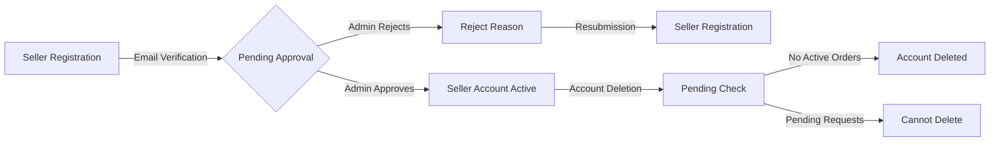

# E-Commerce Shopping Mall Platform

## Customer Account

WHEN a new user submits valid email and password, THE system SHALL create a customer account with email verification.
WHEN a customer provides valid email and password, THE system SHALL authenticate login requests within 2 seconds.
WHEN a customer requests password change, THE system SHALL require current password verification and update password using bcrypt with 12 rounds.
WHEN a customer requests account deletion, THE system SHALL delete their profile data while preserving order history and reviews (marked as 'deleted user').

### Authentication Requirements
- WHEN a customer registers, THE system SHALL verify email with confirmation link.
- WHEN a customer logs in, THE system SHALL enforce minimum password complexity (12+ characters, uppercase, number, special character).
- WHEN a customer's session is inactive for 30 minutes, THE system SHALL automatically log out.
- THE system SHALL limit login attempts to 5 per 15 minutes with 15-minute lockout after failures.

## Customer Profile

WHEN a customer updates their display name or phone number, THE system SHALL apply changes immediately and record a snapshot.
WHEN a customer requests profile update, THE system SHALL validate phone number format and name length (2-50 characters).
THE customer SHALL be able to view their profile on the account management page.

## Address Management

WHEN a customer adds a shipping address, THE system SHALL store all required address fields (recipient name, phone number, street address, city, state/province, postal code, country) and allow marking as default.
WHEN a customer edits an address, THE system SHALL record a snapshot of the previous address values.
WHEN a customer deletes an address, THE system SHALL update default status if applicable and preserve the address data.

## Seller Account

WHEN a business owner registers as seller, THE system SHALL create pending account for administrator approval.
WHEN an administrator approves a seller registration, THE system SHALL notify the user with approval confirmation.
WHEN a seller's registration is rejected, THE system SHALL include rejection reason and allow resubmission.
WHEN a seller requests password change, THE system SHALL require current password verification.
WHEN a seller attempts account deletion, THE system SHALL verify no pending orders, cancellation requests, or refund requests.

### Seller Approval Workflow

