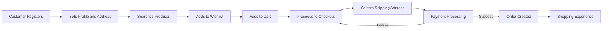

# 03-functional-requirements.md: Enhanced Functional Requirements for E-Commerce Platform

## Customer Account Management

### Registration and Authentication

WHEN a user accesses the registration page, THE system SHALL display a form with required email and password fields (email must be valid format, password must be at least 8 characters with 1 number and 1 symbol).

WHEN the registration form is submitted with valid email and password, THE system SHALL send a confirmation email to the provided address and create a pending account record.

WHEN the user clicks the confirmation link in the email, THE system SHALL verify the email, activate the account, and redirect to the homepage.

THE system SHALL prevent new registrations with existing email addresses and display specific error message: 'Email already registered' with input field highlighting.

### Login Process

WHEN a user enters their email and password on the login screen, THE system SHALL validate the credentials against stored records within 1 second.

IF the credentials are valid, THE system SHALL create a secure session token and redirect to the homepage with a welcome message.

IF the credentials are invalid, THE system SHALL display 'Invalid email or password' error message within 500ms and temporarily lock IP address after 3 failed attempts.

### Password Management

WHEN a customer requests a password change via email, THE system SHALL generate a time-limited reset link (valid for 24 hours) and send to registered email.

WHEN the reset link is used, THE system SHALL allow the user to enter and confirm a new password meeting complexity requirements (min 8 characters, 1 uppercase, 1 lowercase, 1 number, 1 symbol).

THE system SHALL require password history check (cannot reuse last 5 passwords) and display strength meter during entry.

### Account Deletion

WHEN a customer requests account deletion via privacy settings, THE system SHALL confirm the request with warning: 'All personal profile data will be deleted, but your order history and reviews will be preserved as "deleted user".'

IF the customer confirms deletion, THE system SHALL delete profile information from user tables, create 'deleted user' snapshot of order data, and set account status to 'deleted' with timestamp.

THE system SHALL ensure the customer cannot log in after deletion with HTTP 401 response containing: 'Account deleted. Contact support for data access requests'.

## Customer Profile Management

### Profile Details

WHEN a customer accesses profile settings, THE system SHALL display current name (2-50 characters), phone number (E.164 format), and profile image preview.

WHEN the customer updates their display name or phone number, THE system SHALL validate new information against business rules: name must match regex [a-zA-Z\s]{2,50}, phone must validate E.164 format with country code.

THE system SHALL require display names to avoid offensive language through real-time screening and reject any name containing profanity.

### Profile Modification

WHEN customer submits modified profile information, THE system SHALL create a snapshot of previous profile state before saving new values.

THE system SHALL display confirmation: 'Profile updated successfully' with timestamp and allow undo action within next 24 hours.

## Address Management

### Address Creation

WHEN a customer adds a new shipping address, THE system SHALL present a form with all required fields: recipient name, phone (E.164), street address, city, state/province (must match ISO 3166-2 codes), postal code, country (3-letter ISO 3166-1). The form shall require validation on field entry.

THE system SHALL automatically capitalize city/state names and suggest address completion when postal code entered.

### Address Modification and Selection

WHEN a customer edits an existing address, THE system SHALL display current address values with field-level validation errors if data is invalid.

WHEN an address is edited, THE system SHALL create a snapshot of previous state including full address history.

THE system SHALL allow customers to set one address as default for all orders, which becomes the first option in shipping address dropdown with a checkmark indicator.

## Seller Account Management

### Registration Process

WHEN a seller registers, THE system SHALL collect email, password (complexity required), and business name (10-50 characters). Registration automatically creates 'pending' status record.

THE system SHALL require seller registration to be reviewed by administrators within 72 hours before becoming active.

### Account Status

WHEN a seller accesses account settings, THE system SHALL display current approval status with visual indicator: green = approved, yellow = pending, red = rejected.

IF status is rejected, THE system SHALL display rejection reason from administrator (e.g., 'Business name already exists in system') and provide 'Resubmit' button for corrections.

### Account Deletion

WHEN a seller requests account deletion, THE system SHALL verify no pending orders exist for the seller (orders with status paid, shipped, or delivered).

IF seller has no pending orders or cancellation/refund requests, THE system SHALL allow deletion while preserving all historical data: product listings, order history, and reviews as 'deleted seller' with timestamp.

## Seller Profile Management

### Seller Profile Details

WHEN a seller views their profile, THE system SHALL display current shop name, description (max 500 characters), and logo image with preview.

WHEN a seller updates their shop name, description, or logo, THE system SHALL create a snapshot of previous profile state before saving new values.

THE system SHALL require shop names to be unique across platform and display a real-time availability indicator.

### Profile Visibility

THE system SHALL show seller profiles for customers on product detail pages (displaying shop name, description, and logo) with a 'Visit Shop' button.

WHEN a seller edits their shop, THE system SHALL immediately reflect changes on customer-facing views after 5 seconds with cache invalidation.

## Product and Category Management

### Category Structure

WHEN an administrator creates a new category, THE system SHALL allow it to have one level of subcategories (e.g., 'Electronics > Smartphones').

THE system SHALL prevent creating subcategories for categories that already have subcategories and display error: 'Category type already allows subcategories' for non-leaf categories.

### Product Creation

WHEN a seller creates a new product, THE system SHALL require product name (max 100 characters), description (min 20 characters), category (must select leaf category), and base price (positive number).

THE system SHALL make products visible in search results but require at least one variant to be purchasable; products without variants shall display 'Unavailable' status.

## Snapshot Principle Implementation

### Snapshot Creation

WHEN any editable data is modified (products, profile, orders), THE system SHALL create a immutable snapshot record with time, previous values, and changes made.

THE snapshot SHALL include: timestamp (ISO 8601 format), actor (user ID), operation type (update/change), and all previous values before change.

### Snapshot Preservation

THE snapshots SHALL be immutable and never deleted; only readable by owners and administrators.

WHEN a customer views deleted account history, THE system SHALL display preserved orders as 'deleted user' with full historical data including purchase date and order status.

## Product Listing and Search

### Search Functionality

WHEN a customer searches products by name, THE system SHALL return products from all sellers with a maximum of 20 items per page.

THE system SHALL display search results in paginated format with clear page navigation (1-20 of 452 products) and sort options.

### Search Filtering

WHEN a customer applies filters to search results (category, price range, in-stock only), THE system SHALL update results immediately without page reload.

THE system SHALL show "Filters applied: Category=Electronics, Price: $50-$100" with clear 'Clear Filters' button, and automatically adjust product count display.

## Wishlist Functionality

### Wishlist Management

WHEN a customer adds a product to their wishlist, THE system SHALL store the product ID along with timestamp and current price.

WHEN a customer views their wishlist, THE system SHALL display products in paginated lists (20 per page) with product images, names, current prices, and "Remove" buttons.

### Product Updates

IF a seller deletes a product from the platform, THE system SHALL automatically remove it from all customer wishlists within 5 minutes and display 'Product removed from wishlist' notification to affected users.

## Shopping Cart Requirements

### Cart Operations

WHEN a customer adds a product variant to their cart, THE system SHALL check if the variant is in stock (quantity > 0) within 300ms.

IF the variant is added to the cart and already exists in the cart, THE system SHALL combine quantities (e.g., 2 items + 3 items = 5 total) and update the subtotal.

## Checkout and Payment Flow

### Checkout Process

WHEN a customer proceeds to checkout, THE system SHALL display all cart items as a list showing product name, variant options, price per unit, quantity, and subtotal.

THE system SHALL require the customer to select a shipping address (default or new) with validation for required fields before proceeding.

### Payment Processing

WHEN the customer confirms payment details, THE system SHALL initiate payment processing via external gateway within 1 second.

IF payment fails, THE system SHALL display specific error (e.g., 'Card declined - insufficient funds') and allow retry with new card details.

IF payment succeeds, THE system SHALL create an order record, update stock quantities, and display 'Order placed successfully' with order number.

## Order Processing Requirements

### Order Creation

WHEN payment is successful, THE system SHALL create an order with all order items and their quantities.

THE system SHALL decrease stock quantities for purchased variants and create inventory records with type 'order-purchase', reason 'New order', and timestamp.

### Order Status Management

WHEN an order item is shipped, THE system SHALL update item status to 'shipped' and create shipment records with tracking info.

WHEN a customer confirms delivery via tracking information, THE system SHALL update all items in that shipment to 'delivered' within 5 minutes.

### Cancellation and Refunds

WHEN a customer requests cancellation for an item in 'paid' status, THE system SHALL create a cancellation request with status 'pending-seller' and require reason text (10-500 chars).

THE system SHALL require seller approval via email notification within 48 hours, which creates a snapshot of the request state.

## Customer Journey Flow

