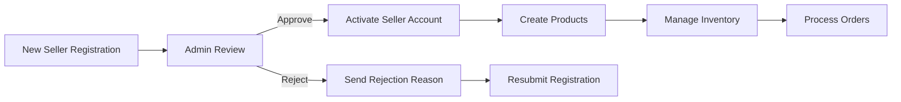

# E-Commerce Shopping Mall Platform Requirements Specification

## 1. Service Overview

### 1.1 Vision
The shoppingMall platform is a fully featured e-commerce solution where businesses can sell products, customers can purchase from multiple sellers, and administrators can manage the entire ecosystem. The platform prioritizes data integrity through a robust snapshot system while providing a seamless shopping experience.

### 1.2 Core Value Proposition
- **Businesses**: Sell products globally with complete control over inventory and customer engagement
- **Customers**: Experience a personalized shopping journey with comprehensive search, wishlist, and order management
- **Administrators**: Maintain platform health through role-based controls, content management, and dispute resolution

## 2. Business Model

### 2.1 Revenue Strategy
- **Seller Commission**: Platform takes 10% commission on successful transactions
- **Premium Seller Feature**: $5/month for featured product listings
- **Admin Revenue**: Managed through subscription model for platform features

### 2.2 Success Metrics
- Customer acquisition cost < $25
- Seller retention rate > 85% after 6 months
- Average order value > $75
- Order completion rate > 80%

## 3. User Actors

### 3.1 Customer Workflow

```mermaid
graph LR
  A[Start Shopping] --> B{Customer Account Required?}
  B -->|Yes| C[Login/Signup with Email/Password]
  B -->|No| D[Redirect to Registration]
  C --> E[Browser Product Catalog]
  E --> F{Search Products}
  F -->|With Filters| G[Display Filtered Results]
  F -->|Without Filters| H[Display All Products]
  G & H --> I[View Product Detail]
  I --> J{Add to Wishlist?}
  J -->|Yes| K[Add to Wishlist]
  J -->|No| L{Add to Cart?}
  L -->|Yes| M[Add Product Variant to Cart]
  L -->|No| N[Return to Product Detail]
  M --> O[View Cart]
  O --> P{Proceed to Checkout?}
  P -->|Yes| Q[Select Shipping Address]
  Q --> R[Review Order Summary]
  R --> S[Payment Processing]
  S -->|Failed| T[Retry Payment]
  S -->|Success| U[Create Order]
  U --> V[Order Confirmation]
```  

### 3.2 Customer Authentication Requirements
WHEN a customer registers with valid email and password, THEN the system SHALL create an account requiring email verification with confirmation link.
WHEN a customer logs in with valid credentials, THEN the system SHALL provide session cookies with 15-minute expiration period.
WHEN a customer requests password change, THEN the system SHALL require email verification within 10 minutes before allowing password reset.
WHEN a customer requests account deletion, THEN the system SHALL preserve all orders and reviews with 'deleted user' label while permanently removing profile information.

### 3.3 Seller Account Requirements
WHEN a business submits registration with email and password, THEN the system SHALL create a pending seller account requiring administrative approval.
WHEN an administrator reviews seller account, THEN the system SHALL update status to 'approved' or 'rejected' with rejection reason provided.
WHEN a seller requests account deletion, THEN the system SHALL prevent deletion if pending orders or active requests exist.

### 3.4 Seller Approval Workflow

### 3.5 Administrator Roles

| Role | Permissions | Special Rules |
|------|-------------|---------------|
| Regular Administrator | Manage users, products, categories, orders | Cannot modify super administrators |
| Super Administrator | Manage all features including admin roles | Cannot demote self to regular role |

## 4. Functional Requirements

### 4.1 Account Management

#### Customer Account Requirements
- **WHEN** a customer provides valid email and password during registration, **THE** system SHALL create a new account with email verification.
- **WHEN** a customer attempts to log in, **THE** system SHALL validate credentials and return session tokens with 15-minute expiration.
- **WHEN** a customer requests password change, **THE** system SHALL verify email before allowing reset.
- **WHEN** a customer deletes account, **THE** system SHALL preserve order history with 'deleted user' label.

#### Seller Account Requirements
- **WHEN** a seller requests account deletion, **THE** system SHALL verify no pending orders or requests exist.
- **WHEN** a seller's account is suspended, **THE** system SHALL hide products from search but allow order processing.
- **WHEN** a seller's account is approved, **THE** system SHALL allow product creation and management.

### 4.2 Product Management

#### Product Creation Requirements
- **WHEN** a seller creates a new product, **THE** system SHALL require product name, description, category, and base price.
- **WHEN** a product is created, **THE** system SHALL generate a snapshot of initial product state.
- **WHEN** a product is edited, **THE** system SHALL create a product snapshot preserving all fields including images.

#### Product Variant Management
- **WHEN** a product has multiple variants, **THE** system SHALL enforce at least one variant is required for purchase.
- **WHEN** a variant is added to a product, **THE** system SHALL generate inventory history record with initial stock quantity.
- **WHEN** a variant's stock reaches 0, **THE** system SHALL mark variant as 'out of stock' in all interfaces.

### 4.3 Order Management

#### Order Creation Requirements
- **WHEN** a customer completes checkout with sufficient inventory, **THE** system SHALL decrease stock quantities for purchased variants.
- **WHEN** an order is created, **THE** system SHALL save product snapshots and seller profile snapshots with each order item.
- **WHEN** an order is partially canceled, **THE** system SHALL update stock quantities for canceled items.

#### Order Status Management
- **WHEN** an order item is shipped, **THE** system SHALL change status to 'shipped' for all items in the shipment.
- **WHEN** a customer confirms delivery, **THE** system SHALL change status to 'delivered' for all items in the shipment.
- **WHEN** a cancellation is approved, **THE** system SHALL change status to 'cancelled' for the affected item.

### 4.4 Snapshot Requirements

#### Core Snapshot Policy
- **WHEN** any editable data is modified, **THE** system SHALL create an immutable snapshot preserving prior state.
- **WHEN** a product is deleted, **THE** system SHALL preserve all product snapshots including variants.
- **WHEN** a seller profile is edited, **THE** system SHALL save snapshot of shop name, description, and logo.

#### Snapshot Data Requirements
- Every snapshot SHALL include:
  - Timestamp of change
  - User who made the change
  - Fields changed
  - Previous values
  - Modified values

## 5. Business Rules

### 5.1 Account Management Rules
- **IF** a customer has pending orders or active requests, **THEN** account deletion SHALL be blocked.
- **IF** a seller has pending orders or active requests, **THEN** account deletion SHALL be blocked.
- **IF** a seller account status is 'pending', **THEN** product creation capability SHALL be disabled.

### 5.2 Product and Order Constraints
- **WHEN** a product has variants with stock > 0, **THEN** it SHALL appear in search results.
- **WHEN** a product has no variants or all variants have stock = 0, **THEN** it SHALL appear as 'unavailable' in search results.
- **IF** any order item has status 'delivered', **THEN** review creation SHALL be allowed.

### 5.3 Snapshot Preservation Requirements
- **WHEN** a product is deleted, **THE** system SHALL preserve all snapshots for historical reference.
- **WHEN** an order item is canceled, **THE** system SHALL maintain snapshot for refund processing.
- **WHEN** a seller profile is edited, **THE** system SHALL maintain version history for all edits.

## 6. Error Handling and Validation

### 6.1 Input Validation Rules
- **WHEN** a product price is entered, **THE** system SHALL validate it is >= 0.01.
- **WHEN** a customer enters phone number, **THE** system SHALL validate country code and length.
- **WHEN** a seller submits registration, **THE** system SHALL validate business email format.

### 6.2 Error Scenarios
- **IF** stock is insufficient for cart quantity, **THEN** system SHALL display warning when adding to cart.
- **IF** payment fails, **THEN** order SHALL not be created and customer SHALL see retry options.
- **IF** a buyer attempts to create review before item delivery, **THEN** system SHALL block review submission.

## 7. Business Process Summary

### 7.1 Customer Shopping Workflow
1. Register or login with email/password
2. Browse catalog by category or search
3. Add products to wishlist or cart
4. View cart and adjust quantities
5. Select shipping address and complete checkout
6. Track order status through shipping and delivery
7. Leave review after delivery completion

### 7.2 Seller Operations Workflow
1. Register with email/password and wait for admin approval
2. Create products with name, description, category, and base price
3. Add variants with SKU, option values, and stock
4. Manage inventory through restocking and adjustments
5. View order history and fulfill shipping requests
6. Maintain shop profile with description and logo

> *Note: All user actions generate immutable snapshots for audit and dispute resolution purposes.*