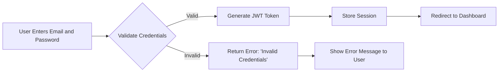

# Functional Requirements for E-Commerce Platform

## 1. User Registration and Authentication

### Requirements
- WHEN a user attempts to register, THE system SHALL prompt for email, password, and verification code.
- IF the email format is invalid, THEN THE system SHALL display "Please enter a valid business email address".
- WHEN a user successfully verifies their email, THE system SHALL grant access to account management features.
- WHEN a customer attempts to log in, THE system SHALL validate credentials within 2 seconds.
- WHILE a user is authenticated, THE system SHALL maintain session state for 30 minutes of inactivity.

### Authentication Flow
