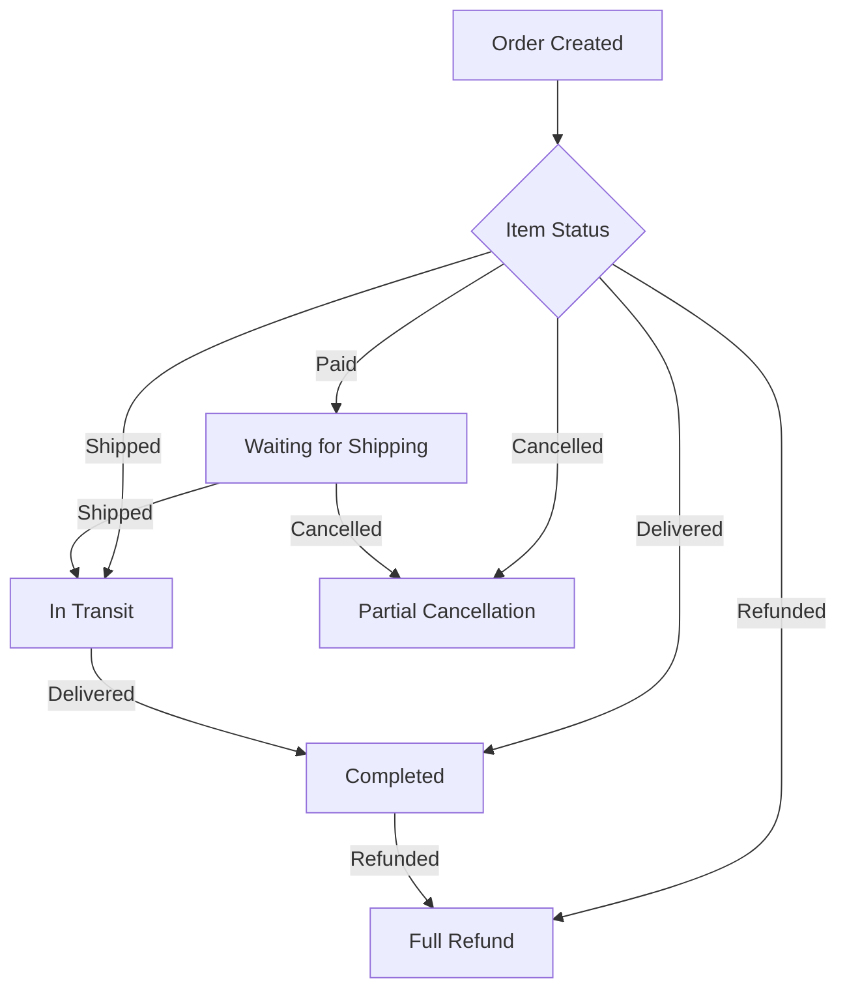

# E-Commerce Shopping Mall Platform Requirements Specification

## Service Overview
The E-Commerce Shopping Mall Platform is a comprehensive marketplace enabling customers to browse, purchase, and manage products from multiple sellers, while providing robust seller management tools and administrative oversight. The platform supports all core e-commerce functions with strict auditability through the Snapshot Principle.

## User Actors
- **Customer**: Registered users who browse, purchase, and manage their accounts
- **Seller**: Registered sellers who list products and manage orders
- **Administrator**: System managers with oversight of accounts, products, and platform operations
- **Super Administrator**: Privileged administrators who manage other administrators

## Functional Requirements

### Customer Account Management
- **Login/Registration**: Customers must register with valid email and password. Registration requires email verification.
- **Password Management**: Customers SHALL change passwords using a confirmation process. Passwords SHALL comply with security requirements.
- **Account Deletion**: Customers SHALL delete accounts. Upon deletion:
  - All personal data SHALL be removed
  - Orders and history SHALL remain intact
  - Reviews SHALL display as 'deleted user'

### Seller Account Management
- **Registration**: Sellers SHALL submit registration with email and password. Registration SHALL require admin approval.
- **Approval Status**: Sellers SHALL view status (pending/approved/rejected). If rejected, they SHALL receive the reason.
- **Account Deletion**: Sellers SHALL delete accounts ONLY if:
  - No pending orders
  - No pending cancellation/refund requests
- **Deletion Impact**: Upon deletion:
  - Product listings SHALL be removed
  - Order history SHALL remain
  - Shop names SHALL persist in past orders

### Product and Category Management
- **Product Creation**: Sellers SHALL create products with name, description, category, and base price. Products SHALL have at least one variant.
- **Category Management**: Categories SHALL have one level of subcategories. Admins SHALL create, edit, or delete categories.
- **Variant Management**: Products SHALL have variants with SKU codes, option values, price, and stock quantity. Variants SHALL require stock quantity ≥ 0.

## Business Rules Specification

### Snapshot Principle
- **Data Modifications**: WHILST a user modifies editable data, THE system SHALL create a snapshot recording:
  - Time of modification
  - Previous values
  - New values
- **Snapshot Preservation**: Snapshots SHALL be immutable and SHALL NOT be deletable.
- **Access Control**: WHILST a valid access request is made, THE system SHALL provide snapshots ONLY to:
  - Data owners
  - Platform administrators
  - Legal representatives (with authorization)

### Product Snapshot Structure
- **Product Snapshot**: Created WHEN a product is edited. Includes:
  - All product fields
  - Snapshots of all variants (product-snapshot → product-snapshot-SKU)
- **Snapshot Scope**: Applies to:
  - Products
  - Product variants
  - Seller profiles
  - Order items
  - Reviews
  - Cancellation/refund requests

### Inventory Management Rules
- **Stock Tracking**: Inventory SHALL track current stock through history records.
- **Stock Transitions**: WHILST an order is placed, THE system SHALL decrease stock via negative inventory record.
- **Stock Display**: Variants with stock = 0 SHALL show as 'out of stock' and SHALL NOT be purchasable.

## Order Management Rules

### Order Status Transitions
- **Order Item Status**:
  - `Paid`: Payment completed, awaiting shipment
  - `Shipped`: Seller has shipped the item
  - `Delivered`: Item received by customer
  - `Cancelled`: Cancellation approved
  - `Refunded`: Refund processed
- **Order Status**: Derived from item statuses:
  - IF ALL items are `paid` → Order status `paid`
  - IF ALL items are `delivered` → Order status `delivered`
  - IF ALL items are `cancelled` → Order status `cancelled`
  - Mixed statuses → Order status `partially completed`

### Shipping and Tracking
- **Shipment Creation**: Sellers SHALL group order items from the same seller into shipments.
- **Tracking Information**: Sellers SHALL enter carrier and tracking number. All items in shipment SHALL share tracking info.
- **Delivery Confirmation**: Customers SHALL confirm delivery per shipment. If not confirmed, items SHALL automatically become `delivered` after 14 days.

## Order Cancellation and Refund Rules

### Cancellation Requests
- **Request Timing**: Customers SHALL request cancellation for items with status `paid`.
- **Approval Process**: Sellers SHALL approve or reject request. Approval SHALL restore stock via inventory record.
- **Status Update**: Upon approval, item status SHALL become `cancelled`.

### Refund Requests
- **Eligibility**: Customers SHALL request refund ONLY for items with status `delivered` within 7 days of delivery.
- **Approval Process**: Sellers SHALL approve or reject. Approval SHALL restore stock.
- **Status Update**: Upon approval, item status SHALL become `refunded`.

## Mermaid Diagram: Order Status Transitions
