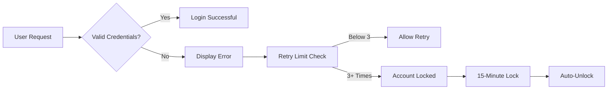

# E-commerce Shopping Mall Platform Requirements Analysis

## Functional Requirements

This document details all business requirements for the e-commerce shopping mall platform, written in natural language following the EARS format. All requirements specify user-driven functionality without technical implementation details.

### 1. User Registration and Login

The platform must support secure user registration and authentication for three user roles: customers, sellers, and administrators.

- WHEN a new user provides a valid email address and password, THE system SHALL create a new account with status 'Pending Verification'
- IF the email address is already registered, THEN THE system SHALL display the error message 'This email is already associated with an account'
- WHEN a user submits a valid email for password reset, THE system SHALL send a verification link to the email address with a 30-minute expiration timer
- WHILE a user's account is in 'Pending Verification' status, THE system SHALL prevent login access
- WHEN a user enters incorrect login credentials three times within 5 minutes, THE system SHALL temporarily lock the account for 15 minutes

### 2. Product Catalog Management

The product catalog must provide robust browsing and search capabilities for customers.

- WHEN a user visits the main product page, THE system SHALL display products organized by category with at least 24 products per page
- WHILE viewing a category, THE system SHALL allow sorting by price, popularity, and rating
- WHEN a user types into the search bar with 3 or more characters, THE system SHALL display relevant products in real-time
- IF no products match the search query, THEN THE system SHALL display 'No products found matching your search term'
- WHEN a user clicks on a product category, THE system SHALL show a page with category description, subcategories, and featured products
- WHEN a user applies multiple filters (e.g., price range + category), THE system SHALL update product display with matching results within 2 seconds
- IF a user saves a product to favorites, THE system SHALL display confirmation and update the favorites count immediately

### 3. Product Variant Handling

The system must manage product variants for different options like colors and sizes.

- WHEN a product has multiple variants, THE system SHALL display color/size options as selectable buttons with visual indicators
- IF a selected variant has no available stock, THEN THE system SHALL disable the option and display 'Out of Stock'
- WHEN a user selects a variant, THE system SHALL update the product image and price accordingly
- THE system SHALL track stock levels per specific variant (SKU) separately
- WHILE managing product variants, THE system SHALL allow sellers to add or remove variants with inventory quantities
- WHEN a variant reaches zero stock, THE system SHALL automatically hide it from customer view within 5 minutes

### 4. Shopping Cart Features

The shopping cart must allow users to manage items before checkout.

- WHEN a user adds a product to the cart, THE system SHALL update the cart total immediately and store the selection
- IF the user adds the same product with different variants, THE system SHALL create separate cart items
- WHEN the user changes a cart item quantity, THE system SHALL validate against available stock
- IF a user views the cart while logged in, THE system SHALL save the cart contents to the user's account for future access
- WHILE a cart is active, THE system SHALL show the most recent cart item additions for at least 24 hours
- WHEN a user adds items to a wishlist, THE system SHALL display the item count and allow categorization of wishlist items
- IF a user abandons a cart, THE system SHALL send a reminder email after 24 hours with saved items

### 5. Order Placement

Order placement must follow a clear user journey from cart to confirmation.

- WHEN a user proceeds to checkout, THE system SHALL require address selection or addition
- WHILE entering shipping address, THE system SHALL validate postal code format based on country
- IF the user has saved payment methods, THE system SHALL display them for selection
- WHEN the user confirms the order, THE system SHALL generate a unique order ID beginning with 'ORDER-'
- IF the order contains backordered items, THEN THE system SHALL inform the user at checkout
- WHILE selecting shipping options, THE system SHALL display estimated delivery dates for each option
- IF a user has multiple gift cards, THE system SHALL allow applying them sequentially

### 6. Payment Processing

The system must handle payments via multiple gateways securely.

- WHEN payment is processed, THE system SHALL communicate with the payment gateway in real-time
- IF payment is successful, THEN THE system SHALL display confirmation message with order details
- WHILE payment is processing, THE system SHALL show an 'In Progress' status with an estimated wait time of 30 seconds
- IF payment fails, THEN THE system SHALL provide specific error reason to the user (e.g., "Insufficient funds")
- THE system SHALL securely store payment information using PCI DSS compliant methods
- IF payment method is credit card, THE system SHALL mask the card number for display (ending in XXXX)
- WHEN payment is confirmed, THE system SHALL initiate inventory reservation for ordered items

### 7. Order Tracking

Order tracking must provide real-time status updates to buyers.

- WHEN a user views their order history, THE system SHALL display current status (New, Processing, Shipped, Delivered)
- WHILE an order is in Processing status, THE system SHALL update the status after warehouse confirmation
- IF an order is shipped, THEN THE system SHALL display tracking number and carrier information
- WHEN a package is out for delivery, THE system SHALL update status to "In Transit"
- IF an order is canceled, THEN THE system SHALL prevent further tracking updates
- WHILE an order is in transit, THE system SHALL send SMS notifications for each status change
- IF an order has a delay, THE system SHALL notify the user with reasons and updated delivery estimate

### 8. Product Reviews and Ratings

Product reviews must capture user experiences and feedback.

- WHEN a user completes an order, THE system SHALL prompt to leave a review for purchased products
- IF a user attempts to submit a review without purchasing, THEN THE system SHALL display 'You must purchase this product to leave a review'
- WHILE a user rates a product, THE system SHALL allow selecting 1-5 stars with a text field for comments
- IF a review is submitted with inappropriate content, THEN THE system SHALL place it in moderation queue for admin approval
- THE system SHALL display average rating and total review count on product detail pages
- WHEN a user leaves a review, THE system SHALL require confirmation to prevent accidental submissions
- IF a user edits an existing review, THE system SHALL show 'Edited' tag with timestamp

### 9. Seller Management

Sellers must have dedicated tools to manage their product listings.

- WHEN a seller registers, THE system SHALL create dashboard with product management tools
- IF a seller adds a new product with variants, THEN THE system SHALL prompt to specify variants and inventory
- WHILE managing products, THE system SHALL display sales analytics for the past 30 days
- IF a seller deletes a product, THEN THE system SHALL allow choosing to archive or permanently delete
- THE system SHALL send seller notifications for new orders and reviews on their products
- WHEN a seller updates product pricing, THE system SHALL validate price is at least 5% higher than cost
- IF a seller has multiple products, THE system SHALL allow bulk editing of variant inventory

### 10. Inventory Management

Inventory management must be SKU-level precise for sellers.

- WHEN a seller sets initial inventory for a product variant, THE system SHALL validate the quantity is a positive integer
- IF a product variant stock reaches zero, THEN THE system SHALL automatically hide the option from customers
- WHILE processing an order for a variant, THE system SHALL decrement stock immediately upon completion
- THE system SHALL send seller notifications when stock levels fall below threshold (e.g., 10 units)
- IF a seller updates inventory, THEN THE system SHALL reflect changes in product visibility within 5 minutes
- WHEN an order is canceled, THE system SHALL increment stock levels for affected variants
- IF a product has multiple SKUs, THE system SHALL allow tracking of inventory across all variants separately

### 11. Order History and Cancellation

Order history must provide comprehensive record of user transactions.

- WHEN a user views their account history, THE system SHALL list orders with date, status, and total price
- WHILE an order is in 'Processing' status, THE system SHALL allow cancellation with refund initiation
- IF an order has already been shipped, THEN THE system SHALL prevent cancellation but allow returns
- WHEN a user requests a refund, THE system SHALL display available options (full, partial, store credit)
- THE system SHALL maintain order history for at least 7 years for customer reference
- WHEN a user views an order summary, THE system SHALL display line items with variant details
- IF a user cancels multiple items in an order, THE system SHALL display the updated total amount immediately

### 12. Cancellation & Refunds

Cancellation and refund policies must be clear and consistent.

- IF a cancellation request is made within 1 hour of payment, THEN THE system SHALL process refund automatically
- WHILE a cancellation request is pending, THE system SHALL display 'Awaiting Refund Processing'
- IF a return is initiated after shipping, THEN THE system SHALL require shipping carrier return label
- THE system SHALL track all refunds with unique refund IDs following 'REFUND-YYYYMMDD-NNNN' format
- IF a refund cannot be processed due to payment method limitations, THEN THE system SHALL notify the user and offer store credit
- WHEN a full refund is processed, THE system SHALL automatically credit the account within 5 business days
- IF a partial refund is approved, THE system SHALL show itemized breakdown of refunded amount

> *Business Note: All requirements are designed to provide clear user experiences while allowing flexible implementation paths for developers. The system will be deployed with comprehensive analytics to measure business performance against these requirements.*