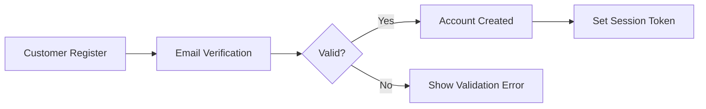
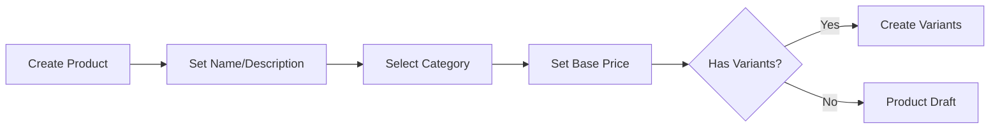

# Functional Requirements Specification

## Customer Management

### Account Lifecycle Requirements

WHEN a customer registers, THE system SHALL require email and password validation with minimum 8 characters and email format validation.

WHEN a customer attempts to log in with invalid credentials, THE system SHALL return HTTP 401 with error code `AUTH_INVALID_CREDENTIALS` and a maximum of 5 login attempts.

WHEN a customer requests password change, THE system SHALL require current password verification and new password meeting complexity requirements (minimum 8 characters, containing at least one uppercase, one lowercase, and one number).

WHEN a customer deletes their account, THE system SHALL preserve order history and reviews (marked as 'deleted user') while permanently deleting profile information and contact details.

### Profile Management Requirements

WHEN a customer edits their display name, THE system SHALL allow alphanumeric characters only (max 50 characters) and disallow consecutive spaces.

WHEN a customer updates their phone number, THE system SHALL validate against international phone number format standards (E.164) and store in normalized format.

When a customer updates their profile, THE system SHALL record the timestamp of the change as part of the profile history.

## Seller Management

### Account Approval Requirements

WHEN a seller submits registration, THE system SHALL set account status to `pending` and notify administrators via email with a unique verification link.

WHEN an administrator rejects a seller application, THE system SHALL record the rejection reason in the system and notify the seller via email within 24 hours.

WHEN a seller is rejected, THE system SHALL allow a new registration request after 24 hours and require a valid business registration document to be submitted.

### Seller Profile Requirements

WHEN a seller updates their shop name, THE system SHALL create a new profile snapshot with timestamp and previous name.

WHEN a seller edits their logo, THE system SHALL generate a new snapshot preserving previous logo data and store it in cloud storage with CDN-enabled URLs.

WHEN a seller is suspended, THE system SHALL preserve all current data but prevent new product listings while allowing existing order processing.

## Product Management

### Product Creation Requirements

WHEN a seller creates a product, THE system SHALL require name (min 3, max 100 characters), description (min 10, max 500 characters), category (required with subcategory support), and base price (min $0.01, max $10,000).

WHEN a product is created with variants, THE system SHALL require at least one variant with valid SKU format (ALPHA_NUMERIC-XXXX).

### Product Variants Requirements

WHEN a seller adds a product variant, THE system SHALL require SKU code (ALPHA_NUMERIC-XXXX format), option values (color:size format), and price (min $0.01, optional override).

WHEN a variant is edited, THE system SHALL create a new product-snapshot-SKU record preserving previous values including price, stock, and option values.

WHEN a product is deleted, THE system SHALL delete all variants and inventory records while preserving snapshot history in a dedicated archival table.

### Inventory Management Requirements

WHEN a customer purchases a product, THE system SHALL automatically decrease stock quantity via inventory history record with order ID and timestamp.

WHEN a seller performs a restock, THE system SHALL create a positive inventory history record with quantity, reason (e.g., 'warehouse replenishment'), and timestamp.

WHEN stock quantity reaches zero, THE system SHALL mark the variant as 'out of stock' and prevent cart additions with clear error message.

## Order Management

### Order Creation Process

WHEN a customer proceeds to checkout with valid cart items, THE system SHALL verify stock availability (showing actual stock levels) and create an order record with timestamp.

WHEN an order is created, THE system SHALL create snapshots of all products and seller profiles at time of purchase including variant prices and images.

### Order Item Status Requirements

WHEN an order item is purchased, THE system SHALL set its initial status to `paid` with payment method type.

WHEN a seller ships items, THE system SHALL change all items in the shipment to status `shipped` and record carrier and tracking number.

WHEN a customer confirms delivery, THE system SHALL change items in the shipment to status `delivered` and trigger review availability.

## Address Management

WHEN a customer adds a shipping address, THE system SHALL require recipient name, phone number, street address, city, state/province, postal code, and country with format validation.

WHEN a customer sets a default shipping address, THE system SHALL mark it as primary for new orders and display it prominently in checkout.

WHEN a customer deletes an address, THE system SHALL remove it from active use but preserve it in historical records with timestamps.

## Wishlist and Cart

### Wishlist Requirements

WHEN a customer adds a product to wishlist, THE system SHALL store the product ID without variant specificity and update timestamp.

WHEN a seller deletes a product, THE system SHALL automatically remove it from all customer wishlists within 60 seconds.

### Shopping Cart Requirements

WHEN a customer adds a variant to cart, THE system SHALL combine quantities if the same variant exists in cart and show current stock levels.

WHEN cart quantity exceeds stock, THE system SHALL show warning message with available quantity and allow addition with reduced quantity.

WHEN an out-of-stock variant is in cart, THE system SHALL mark it as unavailable and show stock status with expected restock date.

## Checkout and Payment

WHEN a customer proceeds to checkout, THE system SHALL require a valid shipping address and display summary with subtotal, discounts, taxes, and total.

WHEN payment fails, THE system SHALL retain cart items and allow retry without order creation, showing error reason within 30 seconds.

WHEN payment succeeds, THE system SHALL create order, decrease inventory, remove items from cart, and send confirmation email with order summary.

## Reviews and Ratings

WHEN a customer purchases a product, THE system SHALL enable review creation only after item status becomes `delivered` and time delay of 24 hours post-delivery.

WHEN a customer writes a review, THE system SHALL require 1-5 star rating with minimum 5 words for text and enforce character limit of 1000 words.

WHEN a customer deletes a review, THE system SHALL preserve the snapshot with deleted timestamp while removing from public display.

## Snapshot Preservation

WHEN any editable business data is modified, THE system SHALL automatically create a snapshot record including timestamp, user ID, modified fields, and previous values.

WHEN a snapshot is created, THE system SHALL store data in an immutable archival table with read-only access for relevant parties.

SNAPSHOTS SHALL be immutable - cannot be deleted or modified without super administrator approval.

SNAPSHOTS SHALL be accessible to owners for personal data, administrators for disputes, with audit trail of access attempts.