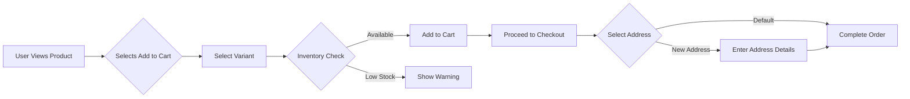

## Shopping Experience Requirements Analysis

### 1. Shopping Cart Implementation

The shopping cart must support all product variant selection flows while maintaining real-time inventory validation at the SKU level. All cart operations must be atomic and consistent.

#### Cart Persistence Requirements
- WHEN a customer browses products, THE system SHALL store cart contents in temporary storage for 30 minutes without requiring login
- AFTER 30 minutes of inactivity, THE system SHALL automatically clear the cart and notify the user via email
- THE system SHALL allow cart saving for registered users without requiring checkout

#### Product Variant Selection Logic
- WHEN a user selects a specific product variant (e.g., product with color=red and size=M), THE system SHALL immediately validate inventory against the SKU-specific quantity
- IF SKU inventory is below minimum threshold (5 units), THEN THE system SHALL display an inventory warning message indicating 'Low stock - only X available'
- THE system SHALL maintain the selected variant choice across cart view, even if inventory changes

#### Inventory Validation at Checkout
- WHEN a user proceeds to checkout, THE system SHALL perform a final inventory check on all cart items
- IF an item is out of stock, THEN THE system SHALL automatically remove the item from the cart and notify the user with specific item name and variant details
- THE system SHALL never allow checkout for items with zero inventory, maintaining a consistent state

### 2. Wishlist Management

Wishlist functionality must allow users to save products for later consideration with flexible organization and sharing options.

#### Wishlist Creation and Organization
- WHEN a user views a product, THE system SHALL display a 'Save to Wishlist' button
- THE system SHALL allow users to create multiple named wishlists (e.g., 'Gift Ideas', 'Summer Clothes')
- HOW users can reorganize items within a wishlist SHALL be defined as drag-and-drop interface

#### Integration with Product Catalog
- WHEN a user adds a product to wishlist, THE system SHALL display the product name, image, and current price
- THE system SHALL update wishlist items when price changes, maintaining price at time of addition
- IF a wishlist item goes out of stock, THEN THE system SHALL add a 'Out of Stock' indicator to the wishlist item

#### Wishlist Sharing Capabilities
- WHERE a user is logged-in, THE system SHALL allow sharing wishlist links publicly or via email
- WHEN a shared wishlist link is accessed, THE system SHALL display products without requiring login
- THE system SHALL track which items on the wishlist are purchased by the owner and display as 'Purchased'

### 3. Product Selection Workflows

Product selection flows must provide clear guidance for users selecting variants while maintaining business logic constraints.

#### Variants Selection Interface Requirements
- WHEN a user views a product with variants, THE system SHALL display all color and size options as interactive elements
- THE system SHALL highlight variants with sufficient inventory (available for purchase)
- IF a variant has low inventory (below threshold), THEN THE system SHALL display a subtle color code (e.g., orange) to indicate

#### State Transitions During Selection
- WHEN a user selects a color, THE system SHALL immediately update available sizes to reflect inventory
- WHEN a user selects a size, THE system SHALL display variant-specific price adjustments from product variants
- WHILE variant selection is in progress, THE system SHALL maintain selection state and prevent cart modification

#### Stock Availability Feedback
- IF a product variant is selected but inventory has dropped to zero, THEN THE system SHALL automatically switch to next available variant
- WHEN a user continues to the cart with out-of-stock variants, THE system SHALL remove those items and display message containing specific variant name
- THE system SHALL provide cumulative stock information (e.g., 'Total 30 units available across all sizes')

### 4. Address Management Flow

Address management must support multiple addresses per user while allowing seamless usage in the checkout process.

#### Multiple Address Storage Implementation
- WHEN a customer creates a new address, THE system SHALL require country, city, postal code, and street address, with mandatory fields marked
- THE system SHALL allow up to 10 addresses per user
- WHERE a user has multiple addresses, THE system SHALL display an option to select default address during checkout

#### Default Address Selection Logic
- WHEN a user completes checkout, THE system SHALL automatically use the default address unless otherwise specified
- IF no default address exists, THEN THE system SHALL require the user to select an address before proceeding
- THE system SHALL allow address modification at any point before order confirmation

#### Address Validation Requirements
- WHEN an address is entered, THE system SHALL validate postal code format against country-specific patterns
- IF the postal code is invalid, THEN THE system SHALL display 'Invalid postal code format' error message with specific example
- THE system SHALL never store addresses with incomplete required fields

### 5. Business Rules

All shopping experience flows must adhere to strict business rules.

#### Cart Item Expiration
- EVERY 15 minutes, THE system SHALL remove items from cart that haven't been interacted with
- IF an item has been in cart for 1 hour without user interaction, THEN THE system SHALL permanently remove it

#### Wishlist Visibility Restrictions
- WHEN a customer's wishlist is shared, THE system SHALL hide items that are out of stock from the public view
- IF the wishlist owner has purchased an item, THEN THE system SHALL display 'Purchased' label in the shared wishlist

#### Address Format Requirements
- THE system SHALL store and validate addresses using country-specific address formats
- FOR USA addresses, THE system SHALL require 5-digit ZIP code followed by optional 4-digit extension
- FOR international addresses, THE system SHALL require postal code in format consistent with country standards

#### Performance Requirements
- THE system SHALL perform all cart and wishlist operations within 200ms for 95% of user sessions
- PAGE LOAD times for shopping experience features SHALL not exceed 1.5 seconds
- SYSTEM availability for cart functionality SHALL be 99.99% during business hours

### 6. Error Handling

Every user interaction must have appropriate error handling that guides the user toward resolution.

- IF a user attempts to add an out-of-stock product to cart, THE system SHALL display 'Product unavailable at current stock level' with specific variant details
- WHEN a user tries to proceed with an empty cart, THE system SHALL redirect to product catalog with notification
- IF a user selects multiple variants without confirmation, THE system SHALL prevent immediate cart modification and require confirmation

> *Developer Note: This document defines **business requirements only**. All technical implementations (architecture, APIs, database design, etc.) are at the discretion of the development team.*