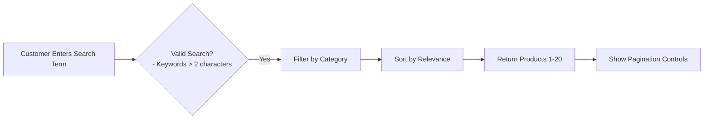
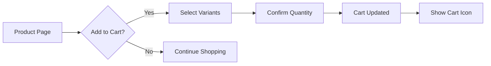
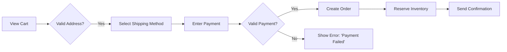

# E-commerce Shopping Mall Platform Requirements Analysis Report

## 1. Introduction
The E-commerce Shopping Mall platform provides a comprehensive solution for online retail operations, connecting customers, sellers, and administrators through a secure and intuitive interface. This document defines the business requirements for all core features based on stakeholder input and market analysis.

## 2. User Roles and Permissions

### 2.1 Customer Permissions
WHEN a customer registers with valid email and password, THE system SHALL create a new account with the provided email and password, ensuring the email is unique across the platform.

WHEN a customer attempts to log in with valid credentials, THE system SHALL authenticate the user and generate a JWT access token with 15-minute expiration.

WHEN a customer submits an incorrect password, THE system SHALL return HTTP 401 with error code AUTH_INVALID_CREDENTIALS, allowing up to 5 retry attempts before locking the account for 15 minutes.

### 2.2 Seller Capabilities
WHEN a seller adds a new product, THE system SHALL validate all required fields including product name, category, SKU variants, and initial inventory.

WHEN a seller updates product pricing, THE system SHALL implement price change with audit logging and notify affected customers if applicable.

WHEN a seller updates stock levels for a product variant, THE system SHALL prevent negative inventory and apply physical stock changes immediately.

### 2.3 Admin Privileges
WHEN an admin creates a new user account, THE system SHALL assign initial permissions based on role (customer, seller, admin) and require email verification.

WHEN an admin views platform metrics, THE system SHALL display real-time statistics on registrations, active orders, payment success rates, and system uptime.

## 3. Core Features Implementation

### 3.1 Product Catalog

#### 3.1.1 Search and Browsing
WHEN a customer searches for products using keywords or filters, THE system SHALL return relevant products within 1.5 seconds, filtering by active categories.

#### 3.1.2 Product Variants Management
WHEN a customer views a product with variants (colors, sizes), THE system SHALL display all available options with corresponding images and real-time availability status.

WHEN a customer selects a product variant, THE system SHALL immediately update price and stock availability indicators.

### 3.2 Shopping Cart and Wishlist

#### 3.2.1 Cart Management
WHEN a customer adds a product variant to their cart, THE system SHALL update the cart count and immediately reflect changes.

WHEN a customer modifies cart quantity, THE system SHALL prevent exceeds stock levels by dynamically limiting available quantity and showing inventory warnings.

#### 3.2.2 Wishlist Functionality
WHEN a customer adds a product to their wishlist, THE system SHALL store the product with selected variants and display the wishlist as part of the user account.

WHEN a customer views their wishlist, THE system SHALL show all items with visible product options, colors, and current price.

### 3.3 Order Placement and Processing

#### 3.3.1 Order Flow Requirements
WHEN a customer places an order with valid payment method, THE system SHALL create an order record with status "Processing" and initiate payment processing within 2 seconds.

WHEN payment fails during order processing, THE system SHALL automatically release reserved inventory and notify the customer with specific error details.

#### 3.3.2 Order History and Cancellation
WHEN a customer views their order history, THE system SHALL display all completed, active, and canceled orders with relevant details.

WHEN a customer requests order cancellation, THE system SHALL process cancellation if order is in 'Processing' status with refund initiated within 5 minutes.

## 4. Error Handling and Business Rules

### 4.1 Critical Error Scenarios
WHEN a product is out of stock during checkout, THE system SHALL display 'Currently unavailable' message with notification about expected restock date.

WHEN payment processing fails after inventory reservation, THE system SHALL release inventory within 30 seconds and notify seller.

### 4.2 Inventory Management
WHEN inventory levels for an SKU reach 0, THE system SHALL automatically hide the product variant from public catalogs and notify the seller with low-stock alert.

WHEN inventory adjustment is made by seller, THE system SHALL update the quantity with audit trail including timestamp and user ID.

## 5. Performance Requirements

- System SHALL handle 500 concurrent search requests without degradation (95% of queries < 1.5 seconds)
- Order processing SHALL complete within 3 seconds of payment confirmation (99.9% success rate)
- Cart updates SHALL occur in real-time without page refresh (avg. response time < 100ms)
- Confirmation emails SHALL arrive within 15 seconds of successful payment
- 95% of customers SHALL complete purchase within 5 minutes from product search start

## 6. Success Metrics

| Metric | Target | Measurement Method |
|--------|--------|-------------------|
| Customer task completion rate | 95% | From search to payment completion |
| Average checkout time | < 5 minutes | Session analytics |
| Cart abandonment rate | ≤ 5% | Session analytics |
| Order processing time | ≤ 3 seconds | Payment validation logs |
| Payment success rate | 99.9% | Transaction success metrics |

The requirements documented in this report will serve as the authoritative specification for backend development, ensuring all core features meet the stated business objectives and technical constraints.