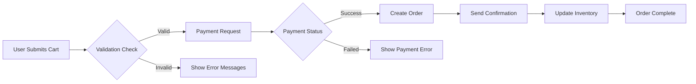

# 05-order-processing.md

## Business Model

### Why This Service Exists

The shoppingMall platform addresses the growing need for an accessible, scalable e-commerce solution for both individual sellers and end customers, filling the gap between complex enterprise platforms and basic marketplace solutions. By enabling sellers to manage inventory at the SKU level while providing customers with a seamless shopping experience including multiple payment options, this service creates a competitive advantage in the crowded e-commerce market.

### Revenue Strategy

The platform will generate revenue through a combination of transaction fees (3% per completed sale for seller accounts) and premium subscription plans for advanced analytics and marketing features. This model supports sustainable growth while maintaining accessibility for small sellers.

### Success Metrics

- Order completion rate: ≥92%
- Average order processing time: < 45 seconds
- Payment success rate: ≥98%
- Customer support tickets related to orders: < 1.5 per 100 orders

## Order Placement Workflow

The order processing workflow defines the complete business process from cart submission to order confirmation, including all possible paths and error scenarios.

### Primary Order Flow

### Key Requirements

WHEN a customer finalizes their order, THE system SHALL validate all product variants in the cart against current inventory levels and send an immediate notification if any item is unavailable.

WHEN a cart is submitted for order placement, THE system SHALL calculate shipping costs based on the customer's selected shipping address and product weight information.

WHEN payment processing is requested, THE system SHALL present the customer with the chosen payment method (credit card, PayPal) and ensure PCI compliance during processing.

WHILE the order is in 'processing' state, THE system SHALL display 'We're preparing your order' message to the customer.

IF inventory levels for any variant are insufficient when an order is placed, THEN THE system SHALL immediately remove the unavailable item from the cart and notify the customer with specific details about the missing item.

## Payment Processing Requirements

The payment system must integrate with industry-standard gateways while maintaining full compliance with financial regulations.

### Integration Specifications

WHEN a payment method is selected, THE system SHALL communicate with the Payment Service Provider (PSP) via API call conforming to PCI DSS 4.0 standards to authorize charges.

THE system SHALL support Stripe and PayPal as the primary integration points, with clear documentation for future gateway additions.

IF payment fails after three attempts, THEN THE system SHALL lock the payment session for 10 minutes to prevent abuse and display a clear error message to the customer.

WHEN payment is successfully authorized, THE system SHALL create a transaction record with all required details, including:
- Payment method type (credit card, PayPal)
- Amount in USD
- Auth code
- Processor response code

### Security Requirements

THE system SHALL never store raw credit card numbers or CVV values. All payment data must be tokenized using a PCI-compliant provider.

THE system SHALL automatically initiate a refund request within 15 minutes if the payment authorization is declined by the bank.

WHILE processing payment, THE system SHALL maintain an encrypted connection using TLS 1.3 or higher for all data transmitted.

## Order Validation Rules

### Address Validation

WHEN a shipping address is entered, THE system SHALL validate it using the country's postal service's address validation API when available.

THE system SHALL require a city, state/province, postal code, and street address for all orders.

IF the address validation fails for a key field, THEN THE system SHALL display the specific field and request correction before allowing order placement.

### Product Validation

WHEN product variants are selected in the cart, THE system SHALL validate that the selected option combinations exist (e.g., 'Red size M' must be a valid product variant).

IF a variant is discontinued after being added to the cart, THEN THE system SHALL automatically remove it and notify the customer with replacement suggestions.

### Order Value and Limits

THE system SHALL enforce a minimum order value of $10.00 for all orders.

THE system SHALL enforce a maximum order value of $10,000.00 for standard user accounts, with higher limits available for premium seller accounts.

## Transaction Security

### Data Protection

THE system SHALL encrypt all order metadata both in transit and at rest using AES-256 encryption.

WHEN order data is accessed by backend services, THE system SHALL validate the service's permissions against the user's actor role before granting access.

### Audit Logging

THE system SHALL create a detailed audit log for every order transaction, including:
- Timestamp of each major order status change
- User actor (customer/seller/admin) who initiated the change
- IP address from which the request originated
- All payment and validation details

### Fraud Prevention

WHEN a new account places an order exceeding $500.00, THE system SHALL trigger an additional verification step (e.g., email confirmation or phone verification).

IF multiple orders with the same payment method but differing billing/shipping information are placed rapidly, THEN THE system SHALL automatically flag these as potential fraud attempts and require manual review.

## Order Cancellation and Refund Rules

### Cancellation Policy

WHEN an order is placed, THE system SHALL provide customers 30 minutes to cancel without penalty.

IF an order is cancelled within the 30-minute window, THEN THE system SHALL immediately release inventory back to the inventory pool and reset the availability count.

IF an order has shipped, THEN THE system SHALL not allow cancellation, but will provide a return authorization.

### Refund Processing

WHEN a refund is requested, THE system SHALL verify the refund reason against our policy (not applicable for used items, partial refunds for damaged goods).

THE refund SHALL be processed within 7 business days of approval, with the refund amount returned to the original payment method.

IF the original payment method is no longer valid, THEN THE system SHALL process the refund as store credit with a 15% handling fee that can be used within 180 days.

> *Developer Note: This document defines **business requirements only**. All technical implementations (architecture, APIs, database design, etc.) are at the discretion of the development team.*