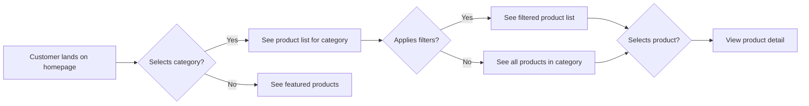
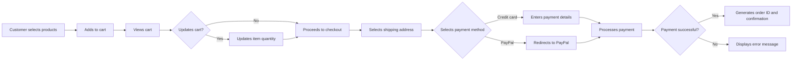
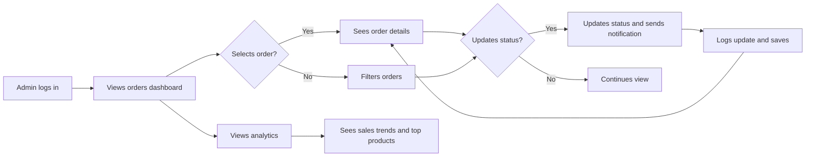

# E-commerce Platform Requirements Analysis Report: User Scenarios and Journeys

## 1. Introduction and Document Purpose
This comprehensive requirements document details the complete user journey scenarios for the e-commerce platform, providing backend developers with a clear business perspective of the system's actual usage patterns. The purpose of this document is to transform the raw user requirements into detailed, executable business requirements in natural language, following EARS format for all applicable requirements.

*This document contains business requirements only. All technical implementations (architecture, APIs, database design, etc.) are at the discretion of the development team.*

## 2. Customer Browsing Journey

### Reference Document: 02-business-model.md

#### User: Customer (Authenticated, ID: customer-123)

**Business Description**:
Customers browse product categories to find items they wish to purchase. The platform must provide intuitive category filtering, search capabilities, and detailed product views that support purchasing decisions.

#### EARS Requirements:

- WHEN a customer views the homepage, THE system SHALL display featured products by popularity in a carousel format.
- WHEN a customer selects a product category from the navigation menu, THE system SHALL display a list of products belonging to that category, with filtering options for price range, brand, and availability.
- WHEN a customer applies price range filters (e.g., $10-$50), THE system SHALL display only products matching the specified price bracket.
- WHEN a customer selects a product detail view, THE system SHALL display high-resolution images, detailed descriptions, available product variants (colors/sizes), and current stock status.
- WHILST the customer is browsing the product listing page, THE system SHALL show the number of items available in the current view (e.g., '15 of 50 items') and allow pagination for more items.

#### Visual Flow:


## 3. Product Purchase Flow

#### User: Customer (Authenticated, ID: customer-123)

**Business Description**:
Customers select products, add them to their cart, manage shopping items, and proceed to purchase, including payment and order confirmation.

#### EARS Requirements:

- WHEN a customer adds a product to their cart, THE system SHALL update the cart count instantly without refreshing the page.
- WHEN a customer views their shopping cart, THE system SHALL display item name, price, quantity, and subtotal with calculation rules (e.g., 10% discount applies to all items over $100).
- WHEN a customer is ready to check out, THE system SHALL collect shipping address options (from address book) and billing information.
- WHEN a customer selects payment method (e.g., credit card), THE system SHALL show payment form with security indicators and proceed to payment processing.
- WHEN payment fails, THE system SHALL display an error message reflecting the specific failure reason (e.g., 'Insufficient funds', 'Card expired').
- WHEN payment is successful, THE system SHALL generate a unique order ID (format: ORDER-YYYYMMDD-NNNN), save all details, and send order confirmation email.

#### Visual Flow:


## 4. Seller Product Listing Process

#### User: Seller (Authenticated, ID: seller-456)

**Business Description**:
Sellers register products with multiple variants (SKUs) in their catalog, managing inventory levels and product information for all their listings.

#### EARS Requirements:

- WHEN a seller wants to list a new product, THE system SHALL allow creation of product with title, description, base price, and category.
- WHEN a seller adds product variants (e.g., different colors/sizes), THE system SHALL allow concurrent registration of multiple SKU references for the specific product.
- WHEN a seller configures inventory for a product variant, THE system SHALL show available stock count, allow adjustment of quantity, and set low-stock alert thresholds.
- WHEN a seller saves product listings, THE system SHALL validate required fields (title, price, at least one variant) before saving.
- WHEN a seller views their product catalog, THE system SHALL display list of products with basic metrics (sales count, stock status) sorted by date added.

#### Visual Flow:
```mermaid
graph LR
    A[Seller logged in] --> B[Selects "Add New Product"]
    B --> C[Enters basic product info]
    C --> D{Adds variants?}
    D -->|Yes| E[Configures color/size variants]
    D -->|No| F[Sets single SKU]
    E --> G[Configures inventory for each variant]
    F --> G
    G --> H[Validates product and variants]
    H -->|Valid| I[Save product to catalog]
    H -->|Invalid| J[Shows validation errors]
```

## 5. Admin Order Management

#### User: Admin (Authenticated, ID: admin-789)

**Business Description**:
Administrators monitor the platform, managing all incoming orders, user issues, and platform settings for business continuity.

#### EARS Requirements:

- WHEN an admin views the orders dashboard, THE system SHALL display real-time list of orders with status filters (pending, processing, shipped, delivered).
- WHEN an admin selects an order for detail, THE system SHALL show all order items, customer information, shipping details, payment status, and order date.
- WHEN an admin updates order status (e.g., to 'shipped'), THE system SHALL timestamp the change, send notification email to customer, and update order status for all related views.
- WHEN an admin needs to adjust an order (e.g., cancel specific item), THE system SHALL maintain original order history while applying adjustments to current status.
- WHEN an admin views the product analytics, THE system SHALL show sales trends, top-selling products, and revenue by category.

#### Visual Flow:


## 6. Order Cancellation & Refund Scenario

#### User: Customer (Authenticated, ID: customer-123)

**Business Description**:
Customers may request cancellations or refunds, requiring structured process that satisfies both customer needs and business constraints.

#### EARS Requirements:

- WHEN a customer views their order history and selects 'Request Cancellation', THE system SHALL show cancellation policy notice and confirm the request.
- WHEN a customer requests a refund after shipment, THE system SHALL display refund eligibility criteria (e.g., 'Refunds accepted within 14 days of delivery').
- WHEN an order is canceled before shipping, THE system SHALL process full refund immediately to payment method used.
- WHEN an order has already been shipped, THE system SHALL require return of product prior to refund processing and show tracking progress.
- WHEN a refund is approved, THE system SHALL generate refund ID (format: REF-YYYYMMDD-NNNN), record it in the order history, and update payment method.

#### Visual Flow:
```mermaid
graph LR
    A[Customer views order history] --> B[Selects order]
    B --> C{Selects "Cancel/Refund"}
    C -->|Reroutes to policy| D[See policy details]
    D --> E{Request within time limit?}
    E -->|Yes| F[Requests cancellation]
    E -->|No| G[Error: Outside policy window]
    F --> H{Order status?}
    H -->|Shipped| I[Requires return shipment]
    H -->|Not shipped| J[Full refund issued]
    I --> K[Tracks return process]
    K --> L[Refund processed after receipt]
    L --> M[Refund ID generated]
    J --> M
    M --> N[Order updated with refund status]
```

## 7. Playing with the System - Key User Stories

### Business Value Focus:
All user interactions are optimized for convenience and speed, with explicit attention to the three core principles of user experience:

- **Speed**: Top goals are instant responses for common actions
- **Clarity**: Users see exactly what's needed without confusion
- **Trust**: Assured security and reliable workflows at every step

#### Sample User Stories:

- As an online shopper, I want to be able to quickly find products that match my price range so that I don't waste time browsing irrelevant items.
- As a returning customer, I want to have my shipping address saved in my profile so that I don't need to re-enter it for every order.
- As a new seller, I want to be able to list multiple product variants for a single product so that I can avoid creating duplicate products.
- As an admin, I want to see a real-time dashboard of recent orders so that I can quickly address any urgent customer issues.

## 8. Business Process Diagrams

### Importing the Big Picture:
Business processes across the platform are tightly integrated, each contributing to the overall success of the e-commerce platform:

- **Customer Engagement**: The information flow from browsing to purchasing must be seamless.
- **Product Management**: Sellers and admins require real-time visibility into product availability.
- **Order Fulfillment**: Accurate tracking from order placement through to delivery.
- **Customer Support**: Dedicated channels for handling issues and special requests.

These processes must form a cohesive business ecosystem where each component clearly supports the others.

## 9. Mermaid Flow Diagrams

### Essential System Flows:

All of the key flows require strategic visualization to fully understand the business logic behind them. The following diagrams illustrate the core flows:

- Customer Browsing Journey: [See Section 2]
- Product Purchase Flow: [See Section 3]
- Seller Product Listing: [See Section 4]
- Admin Order Management: [See Section 5]
- Cancellation & Refund Process: [See Section 6]

> *Developer Note: This document defines business requirements only. All technical implementations (architecture, APIs, database design, etc.) are at the discretion of the development team.*