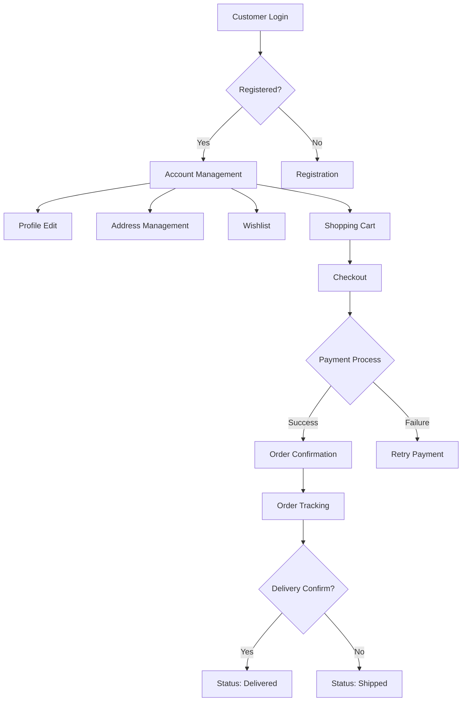

# E-Commerce Shopping Mall Platform Requirements Specification

## 1. Customer Account Management

### Core Account Requirements

WHEN a customer attempts to use platform features without registering, THE system SHALL require registration before proceeding.

WHEN a customer provides valid email and password for registration, THE system SHALL create a new account and email a confirmation link to verify the email address.

WHEN a customer provides valid email and password for login, THE system SHALL authenticate the credentials and create a session token for subsequent requests.

WHEN a customer requests password change, THE system SHALL verify current password, require strong new password (min 8 characters, uppercase, lowercase, number, special character), and update password securely.

WHEN a customer requests account deletion, THE system SHALL preserve order history and reviews (marked as 'deleted user'), delete profile information, and permanently deactivate account.

### Account Deletion Handling

WHEN a customer deletes their account, THE system SHALL maintain order history for legal compliance and show reviews as 'deleted user' instead of showing owner details.

WHEN a customer deletes their account, THE system SHALL not process new purchases or account edits, and automatically disassociate from wishlist entries.

## 2. Customer Profile Management

### Profile Requirements

WHEN a customer updates their display name or phone number, THE system SHALL preserve the change and record a snapshot for audit purposes.

WHEN a customer submits an invalid phone number format, THE system SHALL display a specific error message with proper format requirements (e.g., '+1-555-123-4567').

WHEN a customer changes their profile information, THE system SHALL update the display immediately and notify the customer of the change via confirmation email.

### Profile Privacy and Security

WHEN a customer views their profile, THE system SHALL only display their personal information (display name, phone) and not sensitive data like password hashes.

WHEN other customers view a profile, THE system SHALL only show public information (display name) from the user's public profile settings.

## 3. Address Management

### Address Requirements

WHEN a customer adds a new shipping address, THE system SHALL validate full address fields (recipient, phone, street, city, state, postal code, country) using standard validation patterns.

WHEN a customer sets an address as default, THE system SHALL automatically update the default address status in the customer's account and reflect changes in shipping selection during checkout.

WHEN a customer deletes an address, THE system SHALL not delete the address from order history but remove it from present address options.

### Address Validation Workflow

WHEN a customer enters an address, THE system SHALL check for required fields and validate postal codes against standard patterns.

WHEN an invalid address is detected, THE system SHALL highlight the specific field in error and provide detailed correction instructions.

WHEN a customer successfully saves an address, THE system SHALL display a confirmation message with the saved address overview.

## 4. Seller Account Management

### Seller Registration Requirements

WHEN a seller submits registration with email and password, THE system SHALL create a new account pending administrator approval.

WHEN a seller's account is rejected, THE system SHALL include the rejection reason in the notification email and allow immediate resubmission.

WHEN a seller's account is approved, THE system SHALL notify the seller via email and activate profile for product listing.

### Seller Deletion Requirements

WHEN a seller requests account deletion, THE system SHALL verify no active orders (paid or shipped), no pending cancellations/refunds, and proceed only when these conditions are met.

WHEN a seller's account is deleted, THE system SHALL preserve order history, product listings (with shop name), and prevent new product creation.

### Seller Approval Status

WHEN a seller views their approval status, THE system SHALL clearly indicate 'pending', 'approved', or 'rejected' with details.

WHEN a seller's status is 'rejected', THE system SHALL display the specific reason for rejection and provide a 'submit again' button.

## 5. Product Listing and Search

### Search Requirements

WHEN a customer searches by product name, THE system SHALL return products from all sellers with matching name, sorted by relevance.

WHEN a customer applies price range filter, THE system SHALL adjust search results to show only products within those price boundaries.

WHEN a customer selects 'in-stock only', THE system SHALL filter out all products with zero stock or unavailable variants.

### Sorting Requirements

WHEN a customer selects 'newest first', THE system SHALL sort products by most recent creation date.

WHEN a customer selects 'price low to high', THE system SHALL sort product listings by the lowest price of variants.

WHEN a customer selects 'price high to low', THE system SHALL sort product listings by the highest price of variants.

## 6. Exception Handling and Error Recovery

### Core Error Handling

WHEN an error occurs during checkout, THE system SHALL retain order details in cart and allow users to retry payment without re-entering all order information.

WHEN a payment fails for the third time, THE system SHALL freeze the order, notify the customer, and enable contact with support without requiring re-creation of order.

WHEN a product is out of stock after adding to cart, THE system SHALL remove the item from cart with a notification and suggest similar products.

### User Recovery Process

WHEN a user encounters an error requiring administrator intervention, THE system SHALL display a unique error ID and provide contact information for support.

WHEN system components fail critically, THE system SHALL enter maintenance mode with service status messages and estimated resolution times.

## 7. Snapshot Principle Implementation

### Snapshot Requirements

WHEN a customer updates their profile, THE system SHALL create a snapshot preserving previous values, timestamp, and changes.

WHEN a seller edits a product, THE system SHALL create a product snapshot containing all fields, including all variants at that moment.

WHEN a product variant is edited, THE system SHALL create a snapshot for both the product and variant changes.

### Snapshot Accessibility

WHEN a customer views their product history, THE system SHALL display snapshots for product modifications they own.

WHEN an administrator views product history, THE system SHALL display full historical snapshots for any product.

WHEN a customer views their order history, THE system SHALL display preserved seller profiles and product details at purchase time.

## 8. Product and Category Management

### Category Requirements

WHEN an administrator creates a category, THE system SHALL allow one level of subcategories and require name and description.

WHEN a product is assigned to a category, THE system SHALL validate the category selection is in the allowed list and not marked as deleted.

WHEN a category is deleted, THE system SHALL reassign products to 'uncategorized' category and notify administrators.

### Product Requirements

WHEN a seller creates a new product, THE system SHALL require name, description, category, and base price.

WHEN a seller attempts to add a product without variants, THE system SHALL display the product as 'unavailable' in search but visible in category listings.

WHEN a product is deleted, THE system SHALL automatically remove it from search and category listings and preserve snapshots.

## 9. Order Processing Requirements

### Order Creation Process

WHEN a customer places an order successfully, THE system SHALL decrement stock quantities for each item, remove items from cart, and record the order with snapshot of product, variant, and seller profile.

WHEN an order is created, THE system SHALL automatically generate an order number with a unique timestamp-based pattern (e.g., ORD-20240501-001).

WHEN multiple variants of the same item are purchased, THE system SHALL consolidate them into a single order item with quantity.

### Order Status Requirements

WHEN an order item is paid, THE system SHALL set its status to 'paid' and the overall order status to 'paid'.

WHEN all items in an order are cancelled, THE system SHALL set the order status to 'cancelled' and notify the customer.

WHEN an item is shipped, THE system SHALL change the item status to 'shipped' and order status to 'shipped' if all items have been shipped.

## 10. Shipping and Tracking

### Shipping Process Requirements

WHEN a seller selects items to ship, THE system SHALL allow selection of one or more order items.

WHEN a seller enters tracking information, THE system SHALL link all selected items to the same tracking number and carrier.

WHEN a customer confirms delivery, THE system SHALL change item status to 'delivered' for all items in the shipment.

### Delivery Timing

WHEN a shipment is created, THE system SHALL set a default delivery confirmation date of 14 days from shipping date.

WHEN a customer does not confirm delivery within 14 days, THE system SHALL automatically update items to 'delivered' status.

## 11. Review and Rating System

### Review Requirements

WHEN a customer purchases a product, THE system SHALL allow review submission only after item delivery.

WHEN a customer submits a review, THE system SHALL require rating (1-5 stars) and allow text content.

WHEN a review is modified, THE system SHALL create a snapshot preserving the previous version.

### Review Display

WHEN product detail page is viewed, THE system SHALL display the average rating based on all non-deleted reviews.

WHEN reviews are displayed, THE system SHALL sort them by newest first with pagination.

WHEN a customer deletes their review, THE system SHALL preserve the snapshot but mark the review as deleted in display.

### Mermaid Diagram of Core User Flow

