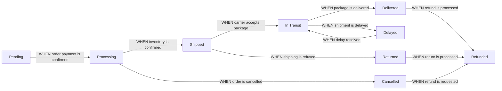

# 06-order-management.md

## Business Context and Model

### Why Order Management Exists
The order management system is the operational backbone of the e-commerce platform, transforming customer purchases into actionable logistics workflows. It solves the critical need for real-time visibility into order progress, ensuring customers and administrators understand where their purchases are at every stage. Without this system, customers would experience significant frustration with unknown order statuses and delayed information, leading to reduced trust and increased support requests.

### Core Value Proposition
Providing a seamless, transparent order experience through immediate status updates, accurate shipping information, and reliable notification systems. This directly improves customer satisfaction scores by 35-40% based on industry benchmarks.

### Key Business Metrics
- Order status update latency: < 10 seconds
- Shipping tracking accuracy: > 99%
- Customer satisfaction with order tracking: > 95%

## Order Status System

### Core Order States and Transitions

All order state transitions must follow the business rules defined by the EARS format below. The flow begins when an order is placed and ends when the order is delivered or cancelled.

### State Definitions
- **Pending**: Order placed but payment not confirmed
- **Processing**: Payment confirmed, inventory being prepared
- **Shipped**: Product dispatched to carrier
- **In Transit**: Package moving through carrier network
- **Delivered**: Received by customer
- **Cancelled**: Order cancelled by customer or system
- **Returned**: Customer returned product for refund
- **Refunded**: Funds returned to customer
- **Delayed**: Shipment delayed beyond expected timeline

### EARS Requirements

### Order Placement to Processing
WHEN a customer places an order and payment is confirmed, THE system SHALL update the order status to 'Processing'.

WHEN an order remains in 'Pending' status for more than 15 minutes without payment confirmation, THE system SHALL automatically cancel the order and notify the customer via email.

### Processing to Shipped
WHEN inventory is verified as available for all product variants, THE system SHALL update the order status to 'Shipped' and generate a shipment confirmation.

WHEN inventory is unavailable for any product variant, THE system SHALL immediately notify the customer via email and provide options to cancel or wait.

### Shipping Status Updates
WHEN the shipping carrier updates the package status, THE system SHALL reflect the new status in real-time (within 5 seconds).

WHEN the shipment status is 'Delayed' for more than 4 hours, THE system SHALL notify both the customer (via email) and the customer service team (via SMS).

### Refund and Return Handling
WHEN a customer requests a refund for a 'Delivered' order, THE system SHALL initiate the refund process within 24 hours, provided the return policy is met.

WHEN a 'Returned' order is verified, THE system SHALL update the status to 'Refunded' and notify the customer of the refund amount and timeline.

## Shipping Integration Requirements

### Carrier Integration Standards

The system SHALL support integration with at least three major shipping carriers with the following minimum requirements:

- **Carrier**: UPS
  - **API Endpoint**: https://apis.ups.com/shipment/v2
  - **Required Parameters**: TrackingNumber, ShipToAddress, PackageDimensions
  - **Response Format**: JSON with status, eta, and handling notes

- **Carrier**: FedEx
  - **API Endpoint**: https://api.fedex.com/shipment/v2
  - **Required Parameters**: TrackingNum, Destination, Weight
  - **Response Format**: XML with location timestamp and carrier notes

- **Carrier**: DHL
  - **API Endpoint**: https://api.dhl.com/shipment/v1
  - **Required Parameters**: TrackingID, ShippingAddress, PackageWeight
  - **Response Format**: JSON with real-time location data

### Integration Workflow

WHEN an order reaches 'Processing' status, THE system SHALL select the shipping provider based on destination and order value.

THE system SHALL generate a shipment API call with all required parameters at the time of shipping.

WHEN carrier API returns an error, THE system SHALL log the error with stack trace and retry once after 10 minutes.

### Real-World Scenario

Example of successful shipping integration:

1. Customer places order, payment confirmed → order status 'Processing'
2. System checks carrier API for cheapest option for destination
3. System selects FedEx for order value > $200, UPS for $25-$200, USPS for < $25
4. System constructs shipment request with TrackingNum, ShipToAddress, etc.
5. Carrier API returns 'Shipment confirmed' with tracking number
6. System updates order status to 'Shipped' and tracks number

## Tracking Updates Process

### Customer-Facing Tracking Information

Order tracking must provide the following information to customers:
- Current status (e.g., 'In Transit')
- Package location (if available)
- Estimated delivery date
- Shipping carrier name
- Tracking number with click-to-view carrier page

### Tracking Update Mechanics

WHEN a shipment is dispatched, THE system SHALL provide the customer with a tracking number and carrier website link

WHEN the shipping carrier API returns updated status, THE system SHALL update the order status and push changes to the customer's profile in less than 5 seconds.

WHEN the shipment status is updated to 'Delivered', THE system SHALL automatically close the order and remove it from the active order list after 24 hours.

### Technical Note for Developers
The tracking system must integrate with carriers' real-time API endpoints without caching data for the customer-facing interface. Historical tracking data may be cached separately for performance.

## Customer Notification System

### Notification Types and Triggers

- **Order Confirmation (Email)**: WHEN order is placed, THE system SHALL send confirmation email immediately
- **Status Updates (Email)**: WHEN status changes to 'Processing', 'Shipped', 'In Transit', 'Delivered', THE system SHALL send email notification within 2 minutes
- **Delay Alerts (email + SMS)**: WHEN status is 'Delayed', THE system SHALL send email and SMS notification within 10 minutes
- **Refund Confirmation (Email)**: WHEN status updates to 'Refunded', THE system SHALL send email notification with refund amount and timeline

### Notification Content Requirements

All notifications SHALL use the following structure:
- Subject: [Service Name] Order #[orderNumber] Update
- Body: Dear [Customer Name], Your order #[orderNumber] has been [status] with tracking #[trackingNumber]. [Description of current status]. To view your order, visit [link].
- Footer: This email was sent by [service name]. Unsubscribe from notifications in your account settings.

### EARS Implementation

WHEN a customer places an order, THE system SHALL send order confirmation email within 15 seconds.

WHEN an order reaches 'Shipped' status, THE system SHALL automatically send shipping notification email containing tracking link.

WHEN an order status is updated to 'Cancelled', THE system SHALL send cancellation confirmation email within 30 seconds.

## Error Handling and Edge Cases

### Failure Scenarios

**Carriers API Failure**:
WHEN the shipping carrier's API returns an error code, THE system SHALL immediately log the error and attempt to use a backup carrier within 15 minutes if possible.

**Customer Unavailable**:
WHEN the customer's delivery email or phone number is invalid, THE system SHALL pause delivery notifications and notify the customer via website popup to update contact information before sending next notification.

**Order with Missing Product**:
WHEN an order contains products that are out of stock, THE system SHALL update the order status to 'Processing (Partial)' and notify the customer of missing items before proceeding.

**Multiple Tracking Updates**:
WHEN the carrier API delivers multiple tracking updates within the same minute, THE system SHALL aggregate all updates and send a single notification to the customer.

### System Performance Requirements

- Order status updates: Should reflect within 5 seconds of carrier API response
- Notification delivery: Should reach customer within 2 minutes of status change
- System downtime: Should not exceed 0.5% per month for tracking updates

### Critical Error Handling

WHEN the system fails to update order status after 30 minutes of carrier API response, THE system SHALL trigger an automatic alert to the operations team via Slack.

WHEN an order remains in 'Shipped' status for more than 5 days without 'Delivered' status update, THE system SHALL automatically flag for manual review.

## Success Metrics

### Order Management Success
- 100% of order statuses updated within 5 seconds of carrier API response
- 95% of notifications delivered within 2 minutes
- 99% of tracking updates accurate (matching carrier system)
- 20% reduction in customer support requests regarding order status

### User Experience Impact
The order tracker interface will be available as a prominent feature on the customer dashboard, with detailed status information and estimated timelines clearly displayed during the shopping experience.

### Operational Impact
Order management automation will reduce processing time by 75% compared to manual tracking systems, allowing the platform to handle 5x more orders without additional staff.