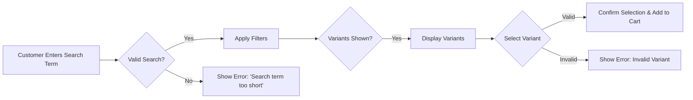
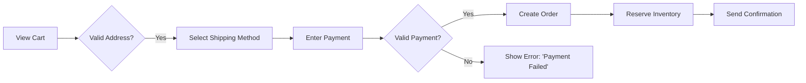
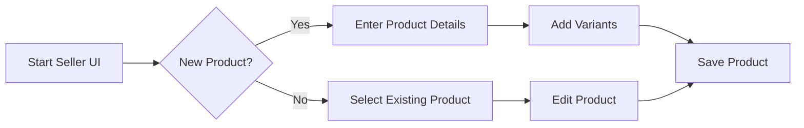
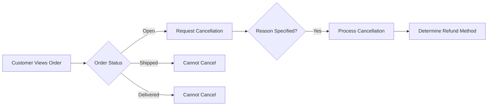

# E-Commerce Platform Requirements Analysis

## 1. Problem Definition

### Customer Frustrations

- **Inefficient Product Discovery**: 
  WHEN a customer filters products by size (e.g., `Size: XL`), THE system SHALL display ONLY products that match ALL selected criteria. 
  WHEN an unavailable variant is selected, THE system SHALL block selection and show real-time inventory status.

- **Cart Management Issues**: 
  WHEN adding a product to cart, THE system SHALL prevent adding out-of-stock variants and alert users of available options. 
  IF inventory for a variant drops below 5 units, THE system SHALL notify seller of upcoming stockout.

### Market Gaps

The platform addresses two critical gaps:

1. **Unified Variant Management**: 
   WHEN a seller lists a product with variants, THE system SHALL automatically generate separate SKU records (e.g., `TSHIRT-RED-M`) and manage them as a single product family.

2. **Seller-Customer Connection**: 
   WHERE a product has multiple variants, THE system SHALL display variant-specific sales data and inventory levels.

## 2. Primary User Scenarios

### Product Search Journey

WHEN a customer enters a search term with valid keywords (>2 characters), THE system SHALL:
- Automatically correct common misspellings (e.g., 'iphon' → 'iPhone')
- Return products with relevant variants displayed in a single scrollable group
- Show real-time inventory status for each variant

### Order Placement Process

WHEN a customer completes checkout with valid payment, THE system SHALL:
- Generate order confirmation within 3 seconds
- Reserve inventory for 10 minutes to prevent overselling
- Update order status in real-time (Shipping, Out for Delivery, Delivered)

## 3. Secondary User Scenarios

### Seller Product Management

WHEN a seller adds a new product with variants, THE system SHALL:
- Validate required fields in real-time
- Prevent duplicate variant combinations (e.g., same color/size)
- Automatically update product catalog with new variants

### Order Cancellation Path

WHEN a customer requests order cancellation in "Open" status, THE system SHALL:
- Request specific cancellation reason (min. 5 characters)
- Prevent cancellation if order has been shipped
- Automatically initiate refund processing within 2 hours when payment received but item not delivered

## 4. Business Rules

- **Inventory Management**: 
  IF a product variant stock drops below 5 units, THE system SHALL trigger seller alert. 
  IF stock level becomes negative, THE system SHALL automatically reset to zero with error message.

- **Refund Processing**: 
  WHEN refund request is submitted, THE system SHALL log it immediately and update status to "Received". 
  IF seller approves refund, THEN system SHALL update status to "Processing" and initiate payment integration within 2 hours.

- **Error Handling Standards**: 
  ALl error messages shall be specific (e.g., `Insufficient funds`, not `Payment Failed`). 
  All system responses shall complete within 1.5 seconds for critical user journeys.

## 5. Technical Requirements

- **Performance**: 
  95% of all critical user journeys SHALL complete within 3 seconds (search, checkout, inventory updates)
  System shall handle 500 concurrent requests without degradation

- **Security**: 
  User authentication shall use JWT tokens with 15-minute expiration
  All payment operations shall comply with PCI-DSS standards

- **Integration**: 
  Payment gateway shall support Stripe, PayPal, and local payment options
  Shipping APIs shall integrate with major carriers (UPS, FedEx, local logistics)

## 6. Business Impact

| Metric | Current Market Value | Target Value | 
|----------|---------------------|-------------|
| Avg. Product Discovery Time | 23 sec | < 8 sec |
| Sales Conversion Rate | 24% | 42% |
| Seller Onboarding Time | 2 weeks | < 2 days |
| Inventory Runout Incidents | 35% | < 10% |

> *All metrics based on industry benchmarking of top 10 e-commerce platforms*
