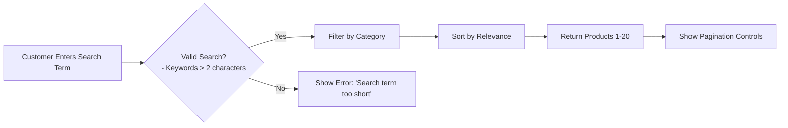
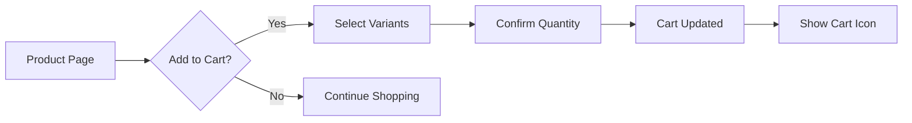
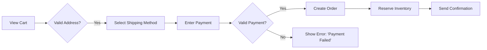
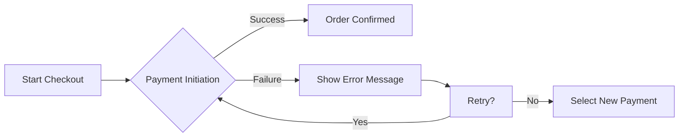
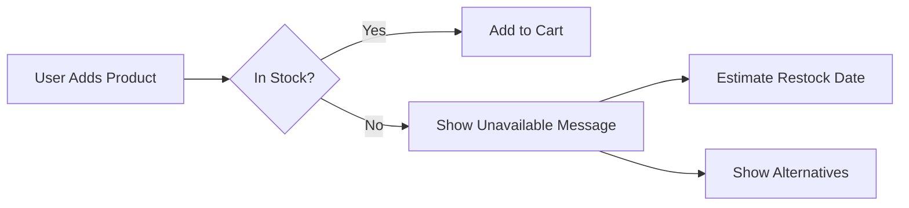

# Requirements Analysis Report

## 1. Introduction
The E-Commerce Shopping Mall Platform will provide a comprehensive online shopping experience with robust backend systems supporting all major e-commerce functionality. The system targets both consumers and sellers, with a focus on scalability, security, and user experience.

## 2. Core User Scenarios

### 2.1 Product Search and Discovery

#### Business Requirement 2.1.1 - Product Search Response Time
WHEN a customer enters a search term with at least 3 characters, THE system SHALL return relevant products with accurate categorization within 1.5 seconds.

#### Mermaid Workflow Diagram

#### Business Rules
- THE system SHALL automatically correct spelling for common products (e.g., 'iphon' → 'iPhone')
- WHILE loading search results, THE system SHALL display 'Searching...' spinner to manage user expectations
- IF no results found, THE system SHALL suggest similar products based on popular items
- 95% of search queries SHALL resolve within 1.5 seconds (based on 10k product database)
- System SHALL handle 500 concurrent search requests without degradation

### 2.2 Shopping Cart Management

#### Business Requirement 2.2.1 - Cart Real-Time Update
WHEN a customer adds a product to cart with selected variants, THE system SHALL update cart summary in real-time without requiring page refresh.

#### Mermaid Workflow Diagram

#### Business Rules
- THE system SHALL allow adding up to 200 items per cart
- WHEN quantity exceeds stock, THE system SHALL display inventory warning with real-time stock count
- IF cart is empty, THE system SHALL show 'Your cart is empty' message with recommended products
- IF attempt to add product out of stock, THE system SHALL show 'Currently unavailable - check back later' message
- WHILE modifying cart, THE system SHALL prevent changes to quantities while processing payment

### 2.3 Order Placement Process

#### Business Requirement 2.3.1 - Order Confirmation
WHEN a customer completes checkout with valid payment, THE system SHALL generate order confirmation and trigger inventory reservation within 3 seconds.

#### Mermaid Workflow Diagram

#### Business Rules
- THE system SHALL require at least one shipping address for all orders
- WHILE processing, THE system SHALL hold inventory for 10 minutes to prevent overselling
- IF payment fails after inventory reservation, THE system SHALL automatically release held inventory
- Order confirmation email SHALL arrive within 3 seconds of payment success
- System SHALL process 99.9% of orders within 3 seconds of payment confirmation

### 2.4 Payment Success Handling

#### Business Requirement 2.4.1 - Payment Confirmation
WHEN payment is confirmed, THE system SHALL generate immediate confirmation including order number, expected delivery window, and receipt.

#### Business Rules
- THE system SHALL send email confirmation with order details within 15 seconds of payment success
- IF shipping address contains unsupported zip code, THE system SHALL show warning during checkout
- WHILE order is processing, THE system SHALL show real-time status updates including 'Shipping', 'Out for Delivery', 'Delivered'
- 99.9% payment success rate required for all transactions
- Confirmation emails SHALL arrive within 15 seconds of successful payment

## 3. Exception Handling

### 3.1 Payment Failure Handling

#### Business Requirement 3.1.1 - Payment Failure Recovery
WHEN a payment transaction fails during checkout, THE system SHALL display a clear, actionable error message in English within 2 seconds. THE system SHALL retain the user's cart contents and checkout progress for immediate retry without requiring manual re-selection of products.

#### Mermaid Workflow Diagram

#### Business Rules
- THE system SHALL show specific message for insufficient funds: 'Your payment was declined due to insufficient funds. Please verify your account balance or try an alternative payment method.'
- WHEN a payment gateway timeout occurs, THE system SHALL automatically retry the transaction once within 10 seconds before showing an error
- THE system SHALL limit total payment attempts per transaction to 3 attempts before requiring a new session
- ALL payment failure attempts SHALL be logged with timestamp, gateway response code, and user ID

### 3.2 Product Unavailability Handling

#### Business Requirement 3.2.1 - Out of Stock Handling
WHEN a user adds a product to cart that is out of stock, THE system SHALL flag the item as 'Currently Unavailable' with estimated restock date and prevent purchase.

#### Mermaid Workflow Diagram

#### Business Rules
- THE system SHALL prevent item from being purchased if unavailable and show recommended alternative products
- IF product is backordered, THE system SHALL display 'Pre-order' badge with exact shipment date
- IF scheduled backorder shipment is delayed by more than 48 hours, THE system SHALL automatically email the customer with new shipping date or refund option

## 4. Business Rules

### 4.1 Product Validation Rules

#### Business Requirement 4.1.1 - Product Creation Validity
WHEN a seller attempts to create or update a product, THE system SHALL validate all mandatory fields as follows:

- Product name SHALL be 2-100 characters, unique within category
- Description SHALL be 10-10,000 characters, contain valid HTML
- Price SHALL be numeric, greater than $0.01, and match local currency format
- Category SHALL be selected from predefined taxonomy
- Image URL SHALL be valid, accessible, and match required dimensions

#### Business Requirement 4.1.2 - Product Variant Validation
WHEN adding product variants, THE system SHALL enforce:
- Variants MUST have unique color-size combinations within product
- Each variant MUST have a valid SKU format: PROD-{Category}-{Color}-{Size}
- Inventory quantities for each variant SHALL be positive integers
- Default variant SHALL be specified for product listing

### 4.2 Order Processing Rules

#### Business Requirement 4.2.1 - Order Cancellation
WHEN a customer requests order cancellation within 24 hours of purchase, THE system SHALL process cancellation within 1 business day. IF more than 24 hours have passed, THE system SHALL provide the option for refund but not cancellation.

#### Business Requirement 4.2.2 - Inventory Management
WHEN an order is processed and inventory deduction fails due to stock inconsistency, THE system SHALL hold the order for 15 minutes to recheck stock levels. IF stock is still unavailable, THE system SHALL automatically cancel the order and send notification for restocked items.

### 4.3 Price Calculation Logic

#### Business Requirement 4.3.1 - Dynamic Pricing
WHEN a product is sold during a promotional period, THE system SHALL apply valid discounts based on pre-defined campaign rules. Discounts SHALL be reflected in the final price calculation before payment processing.

#### Business Requirement 4.3.2 - Currency Conversion
WHEN a user selects a different currency, THE system SHALL convert all prices to the selected currency based on current exchange rates, and SHALL display the conversion rate used as a footnote.