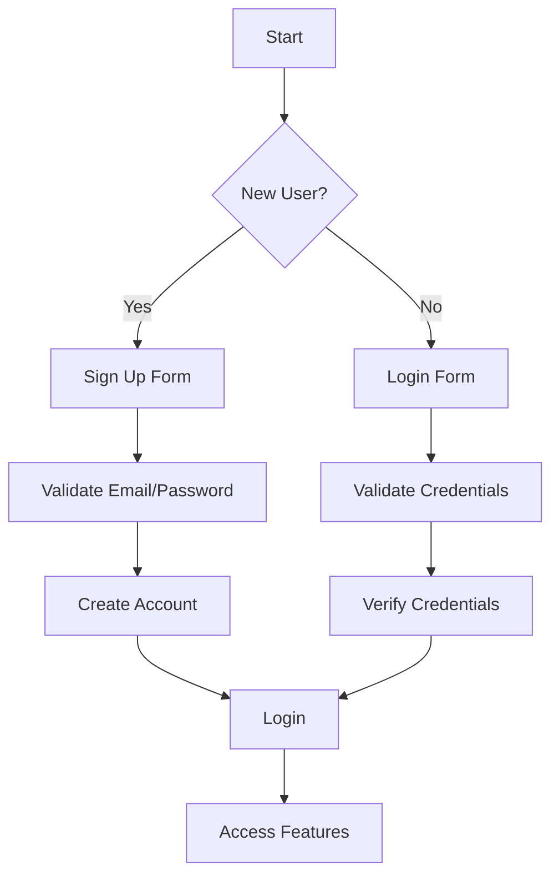

# E-commerce Shopping Mall Platform Requirements Specification

## Customer Account

### Account Management Requirements

WHEN a customer attempts to access any feature, THE system SHALL require registration without guest browsing.

WHEN a customer signs up, THE system SHALL securely store email and password after validation (email format, password strength ≥8 characters).

WHEN a customer changes their password, THE system SHALL require current password confirmation and enforce new password requirements.

WHEN a customer deletes their account, THE system SHALL:

- DELETE their profile information immediately
- PRESERVE their order history and review data for seller records and legal compliance
- MARK all their reviews as 'deleted user' with historical context preserved

### Authentication Workflow

