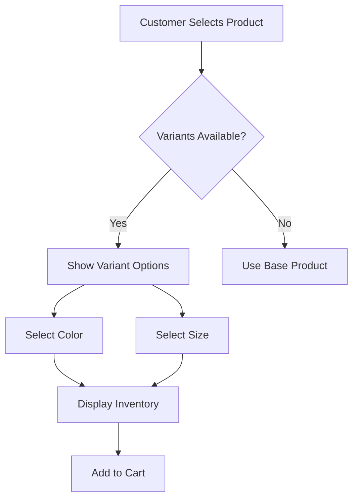

# E-commerce Platform Requirements Analysis

## Service Vision
The E-commerce Platform delivers a modern shopping experience for customers and sellers, enabling seamless product discovery, purchase, and management through a single integrated system. The platform prioritizes user experience, performance, and security while supporting scalable growth.

## User Actors and Permissions

| Actor | Permissions |
|-------|-------------|
| Customer | Browse products, create account, manage address, add to cart, place orders, view order history, write reviews, manage wishlist |
| Seller | Create product listings, manage variants, update inventory, view order details, manage returns |
| Admin | Manage all products and users, monitor system performance, handle disputes, configure system settings |

### Authentication Requirements

- **Customer Registration**: 
  WHEN a new user creates an account with valid email and password, THE system SHALL send verification email within 30 seconds and create account upon confirmation.

- **Login and Session Management**: 
  WHEN a customer logs in with valid credentials, THE system SHALL generate secure JWT tokens with 30-minute expiration and store session data for 10 minutes after logout.

- **Password Recovery**: 
  WHEN a user requests password reset via email, THE system SHALL send security code with 15-minute validity period for resetting password.

## Product Catalog Requirements

### Primary Product Features

- **Product Categories**: 
  WHEN a customer views main navigation, THE system SHALL display at least 5 top-level categories with 3 subcategories each, showing 20 products per category in grid view (max 10,000 products total).

- **Product Search**: 
  WHEN a customer uses search with multiple filters (category, price, color), THE system SHALL return relevant products within 2.0 seconds for 95% of queries.

- **Product Variants and SKUs**: 
  WHEN a customer selects a product, THE system SHALL display all available variants (colors, sizes) with real-time inventory status, and allow selection of single variant without loading additional page.

## Shopping and Order Management

### Shopping Cart Functionality

- **Cart Management**: 
  WHEN a customer adds product to cart, THE system SHALL store item with variant selection, quantity, and current price, and show live update without page refresh.

- **Wishlist**: 
  WHEN a customer adds item to wishlist, THE system SHALL save item with category and price, and display it consistently across all user devices.

### Order Placement Process

- **Checkout Initiation**: 
  WHEN a customer proceeds from cart to checkout, THE system SHALL initiate the payment process within 1.8 seconds for 95% of cases.

- **Payment Processing**: 
  WHEN payment is submitted, THE system SHALL complete authorization within 2.2 seconds for 95% of transactions, showing clear status indicators.

- **Order Confirmation**: 
  WHEN payment succeeds, THE system SHALL generate order confirmation with tracking number within 1.0 seconds, including estimated delivery date.

### Order Tracking and Status

- **Real-time Status**: 
  WHEN order status updates (e.g., processed, shipped), THE system SHALL notify customer via email or in-app message within 30 seconds and show accurate status in account dashboard.

- **Shipping Updates**: 
  WHEN carrier updates shipping status, THE system SHALL display full tracking details within the order details page and reflect status change in real-time.

## Seller and Inventory Management

### Seller Product Management

- **Product Listing**: 
  WHEN a seller creates new product listing, THE system SHALL validate required fields (name, price, category) and display clear error messages for incomplete or invalid data.

- **Inventory Management**: 
  WHEN a seller updates stock levels for a SKU, THE system SHALL adjust available quantity instantly, prevent overbooking, and notify inventory management dashboard.

### Order Handling for Sellers

- **Order Fulfillment**: 
  WHEN a seller accepts an order, THE system SHALL update order status to 'processing' and notify customer of expected shipping date.

- **Return Requests**: 
  WHEN a customer submits return request, THE system SHALL allow tracking of return status through portal and notify seller when accepted or denied.

## Review and Rating System

- **Product Reviews**: 
  WHEN a customer makes a purchase, THE system SHALL prompt for product review after 3 days and allow uploading images with 5-star rating system.

- **Review Validation**: 
  IF review content contains vulgar language, THE system SHALL hold review for moderation before public display.

## Admin Dashboard

- **Order Management**: 
  WHEN an admin views order list, THE system SHALL filter by status (processing, shipped, delivered), allow sorting by date, and show total revenue statistics.

- **Product Monitoring**: 
  WHEN admin accesses product management, THE system SHALL show stock levels, sales trends, and identify low-stock items requiring restocking.

## Performance Requirements

The platform must meet all performance criteria outlined in 08-performance.md:

- Search responses within 1.2 seconds (95% of cases)
- Checkout initiation within 1.8 seconds (95% of cases)
- Mobile experience with 1.7 seconds load time on 4G networks
- 5,000 concurrent users handled with response times under 2.5 seconds

## Exception Handling

- **Payment Failure**: 
  IF payment fails, THE system SHALL display clear error messages within 0.5 seconds and provide immediate retry options.

- **Inventory Shortage**: 
  WHEN item is out of stock, THE system SHALL inform customer immediately and suggest alternatives.

## Summary of Key Requirements

| Feature Group | Requirements Covered |
|---------------|----------------------|
| User Management | Registration, login, address management |
| Product System | Catalog, search, variants, SKUs |
| Shopping Tools | Cart, wishlist, checkout process |
| Order Processing | Placing orders, tracking, shipping updates |
| Customer Interaction | Reviews, ratings, order history |
| Seller Management | Product listings, inventory, order fulfillment |
| Admin Functionality | Order and product oversight, reporting |

This document serves as the authoritative requirements specification for the backend development team, ensuring comprehensive business context and specific, measurable requirements for all features.