# Requirements Analysis: Security and Compliance

## Purpose and Scope
This document specifies the security and compliance requirements for the e-commerce platform, focusing on business-level security expectations rather than technical implementation details. The security requirements are designed to protect customer trust, comply with legal obligations, and ensure a safe platform for all users (customers, sellers, and administrators). These requirements apply to all user interactions and data processing within the platform.

## Data Privacy and Protection

### Personal Data Handling
WHEN a customer enters their personal information during registration, THE system SHALL store all personally identifiable information (PII) with strong encryption at rest and in transit.

WHEN a user provides payment information (even if processed through a third-party gateway), THE system SHALL NOT store or process any payment details except for the tokenized reference.

THE platform SHALL provide users with a clear privacy policy that explains how their data is collected, used, and protected, and SHALL provide users with the option to access, modify, or delete their personal information.

### Data Minimization and Purpose Limitation
THE system SHALL collect only the personal data necessary for the specific purpose (e.g., email address for account creation, address information for shipping calculations).

WHEN user data is collected for a specific purpose, THE system SHALL NOT repurpose that data for unrelated business purposes without explicit user consent.

THE system SHALL document all business processes that involve personal data, with detailed descriptions of what data is collected, how it is used, and for how long it is retained.

## Authentication Security

### Secure Authentication Process
WHEN a customer attempts to log in with incorrect credentials three times, THE system SHALL lock the account for 30 minutes and notify the user via email or SMS.

THE system SHALL require strong passwords with a minimum of 12 characters, including at least one uppercase letter, one lowercase letter, one number, and one special character.

WHEN a user changes their password, THE system SHALL invalidate all existing session tokens and require re-authentication for all devices.

### Session Management
THE platform SHALL maintain user sessions with expiration timeouts of 15 minutes for inactive sessions to minimize the risk of session theft.

THE system SHALL provide users with the ability to view all active sessions and terminate them remotely from the account security settings.

WHEN a user logs in from a new device or location, THE system SHALL trigger multi-factor authentication (MFA) and send a notification to the user's preferred method of contact.

## Payment Security

### Third-Party Payment Integration
THE platform SHALL integrate only with payment gateways that are PCI DSS compliant and maintain the highest industry security standards.

THE system SHALL never handle, store, or process full credit card numbers within the platform's database.

WHEN processing payments, THE system SHALL use tokenization to replace sensitive card data with unique security tokens that cannot be reverse-engineered.

### Fraud Prevention
THE system SHALL implement real-time fraud detection during payment processing by monitoring for unusual transaction patterns and user behavior.

WHEN a payment transaction is flagged as high-risk by fraud detection systems, THE system SHALL immediately pause the transaction and notify the customer and seller for verification before proceeding.

## User Data Protection

### Data Handling by User Role
THE system SHALL ensure that customer data is visible only to the customer who owns the account by default, unless explicitly shared through platform features.

WHEN a user requests a data export, THE system SHALL provide all personal data in a structured machine-readable format within 72 hours.

THE system SHALL delete all personal data from the platform when a user initiates account deletion, except for information that must be retained for legal or business record-keeping purposes.

### Data Anonymization
THE system SHALL provide mechanisms for anonymizing user data when it is used for analytics or business intelligence purposes that do not require personal identification.

WHEN user data is required for legal compliance, THE system SHALL retain the minimum necessary personal data for the minimum necessary duration, with clear documentation of the legal basis for retention.

## Compliance Requirements

### Regulatory Compliance
THE platform SHALL comply with all applicable data protection regulations including GDPR (General Data Protection Regulation), CCPA (California Consumer Privacy Act), and other relevant regional privacy laws.

WHEN new privacy regulations become effective, THE system SHALL undergo documentation review and necessary updates within 90 days of the regulation's effective date.

THE platform SHALL conduct annual security audits and compliance reviews with certified security professionals.

### User Consent Management
THE system SHALL provide users with clear and concise consent options for data processing and allow users to withdraw consent easily at any time.

WHEN the platform uses data for marketing purposes, THE system SHALL provide users the option to opt-out from marketing communications at the registration and in all subsequent communications.

## User Data Retention Policies

### Data Retention by User Action
WHEN a customer deletes their account, THE system SHALL retain customer personal information for 365 days for legal compliance purposes before permanently deleting it, except for the account deletion history.

THE platform SHALL retain order and transaction history for the customer for a period of 7 years from the date of the transaction to comply with tax and legal requirements.

WHEN a seller account is deleted, THE system SHALL retain product and listing history, order information, and payment verification records for 7 years as required by financial regulations.

### Data Storage and Security
THE system SHALL store all personal data in geographically isolated data centers within the region of user consent or the region where the transaction occurred.

THE platform SHALL maintain detailed audit logs of all data access and modifications, with logs retained for at least 2 years for security auditing and compliance verification.

## Security Incident Response

WHEN a security breach is detected, THE system SHALL notify affected users within 24 hours of confirming the breach through a secure channel.

THE platform SHALL maintain a documented incident response plan that includes procedures for containment, investigation, and recovery.

THE system SHALL report all security breaches to relevant regulatory bodies within the timeframes mandated by applicable data protection laws (typically within 72 hours for GDPR).

## Security Training and Awareness

THE platform SHALL require all employees with system access to complete annual security awareness training, including topics on phishing, data handling, and breach prevention.

WHEN new security features are implemented, THE system SHALL update employee training materials within 30 days of implementation.

THE system SHALL conduct simulated phishing and security awareness tests at least twice annually to monitor employee security awareness levels.

## Mermaid Diagram: Security Layers

```mermaid
graph LR
    A["User Authentication"] -->|"Strong Password Policy"| B["Session Management"]
    B -->|"Session Timeouts"| C["Payment Security"]
    C -->|"PCI-DSS Compliant Gateways"| D["Data Protection"]
    D -->|"Encryption at Rest"| E["Compliance Framework"]
    E -->|"GDPR/CCPA Compliance"| F["Data Retention"]
    F -->|"Legal Retention Periods"| G["Secure Audit Trails"]
    G -->|"2-year Retention"| H["Incident Response"]
    H -->|"24-hour User Notification"| A
```

## Developer Note:
> *Developer Note: This document defines **business requirements only**. All technical implementations (architecture, APIs, database design, etc.) are at the discretion of the development team.*